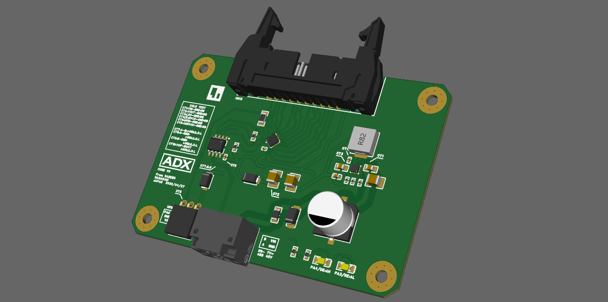

# ADX
ADX: Advanced Devices eXtended's project documents.
- ADX: Advanced Devices eXtended
- It's a form factor for Industrial ATX and Next Gen Arduino.
- 1st Goal is to start Crowd Supply.
## 1. 現状
### Product Data
#### ADX Core V0
- [overview](dev/ADX_Core_v0/Manufacture/20260429_1302/overview.md)

#### ADX IDCtoPinheader Adapter
- [overview](dev/ADX_IDCtoPinheader_adapter/20260429_1705/overview.md)

## 2. 進捗ログ
- [Project_Snapshot.md](Project_Snapshot.md)
	- [History](https://github.dev/Masafuro/ADX/blob/main/Project_Snapshot.md)
- [Main Site: ADX platform](https://adxplatform.com/)
	- [Blog](https://dev-blog.adxplatform.com/)
