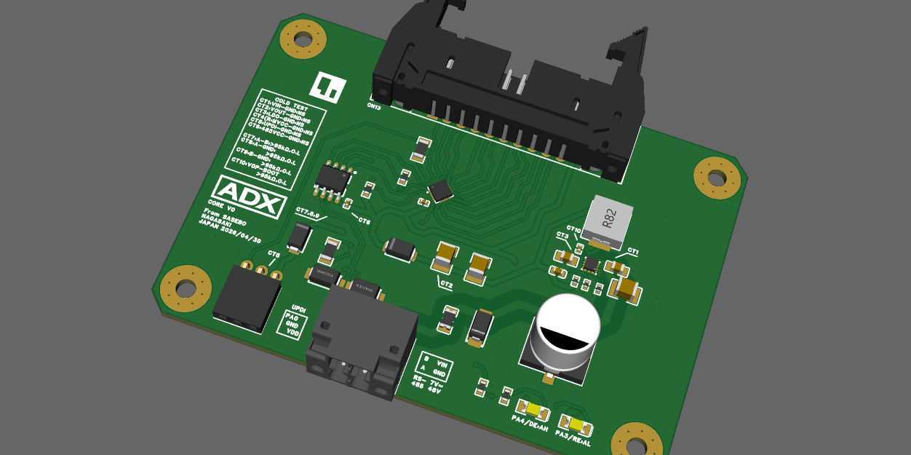
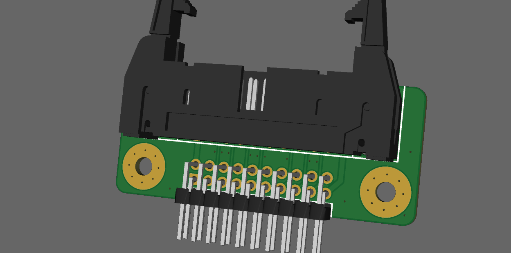

# ADX
ADX: Advanced Devices eXtended's project documents.
- ADX: Advanced Devices eXtended
- It's a form factor for Industrial ATX and Next Gen Arduino.
- 1st Goal is to start Crowd Supply.
## 1. 現状
### Product Data
#### ADX Core V0
- [Project Data](dev/ADX_Core_v0/Manufacture/20260430_1154)

## ハードウェア仕様書：ADX Core V0 (Arduino like Industrial Control Board)
### 1. 性能諸元 (Performance Specifications)
| 項目 | 仕様 | 備考 |
|---|---|---|
| **搭載MCU** | Microchip ATtiny1616-MNR | 8-bit AVR® megaAVR 0-series |
| **動作周波数** | **16 MHz** | (内部クロック / 設計推奨値) |
| **ロジック電圧** | **5.0 V** |  |
| **メモリ容量** | Flash 16 KB / SRAM 2 KB / EEPROM 256 B |  |
| **動作周囲温度** | -40 ℃ ～ +105 ℃ | (工業用グレード部品採用) |
### 2. 電源・保護仕様 (Power & Protection Specifications)
| 項目 | 仕様 | 備考 |
|---|---|---|
| **定格入力電圧** | DC 12 V / 24 V / 48 V 系統 |  |
| **入力電圧範囲** | **DC 7.0 V ～ 48.0 V** |  |
| **電源保護** | **表面実装型チップヒューズ** / 逆接保護回路 |  |
| **サージ対策** | **TVSダイオード搭載** (電源入力部) |  |
| **接続方式** | 2ピン プッシュイン式ターミナル | ロックレバー付プラガブル |
### 3. 通信仕様 (Communication Specifications)
| 項目 | 仕様 | 備考 |
|---|---|---|
| **通信規格** | **RS-485** × 1 系統 |  |
| **通信保護** | **TVSダイオード搭載** (A / B ライン) |  |
| **接続方式** | 2ピン プッシュイン式ターミナル |  |
| **書込インターフェース** | UPDI | 3ピンソケット (UPDI, VDD, GND) |
### 4. 拡張I/O端子配列 (GPIO Pin Assignment)
**コネクタ形式：2×10ピン ロック付IDCボックスヘッダ（ライトアングル）**
配線の安定性を高める多点GND・VDD配置を採用。
| Pin | 信号名 | 備考 | Pin | 信号名 | 備考 |
|---|---|---|---|---|---|
| **1** | **VDD** | 5V出力 | **2** | **GND_5V** | グランド |
| **3** | **PC3** | GPIO | **4** | **PC2** | GPIO |
| **5** | **PC1** | GPIO | **6** | **PC0** | GPIO |
| **7** | **GND_5V** | グランド | **8** | **PB0** | GPIO |
| **9** | **PB1** | GPIO | **10** | **PB2** | GPIO |
| **11** | **PB3** | GPIO | **12** | **GND_5V** | グランド |
| **13** | **PB4** | GPIO | **14** | **PB5** | GPIO |
| **15** | **GND_5V** | グランド | **16** | **PA7** | GPIO |
| **17** | **PA6** | GPIO | **18** | **PA5** | GPIO |
| **19** | **GND_5V** | グランド | **20** | **VDD** | 5V出力 |
### 5. 物理仕様 (Mechanical Specifications)
| 項目 | 内容 | 備考 |
|---|---|---|
| **外形寸法** | 85.0 mm × 60.0 mm |  |
| **取付穴** | M3 ネジ対応 × 4 箇所 | 四隅配置 |
| **穴部処理** | φ8.0 mm クリアランスパッド | ワッシャー用ランド |
| **エッジ加工** | 四隅 C3 面取り済み |  |

#### ADX IDCtoPinheader Adapter
- [overview](dev/ADX_IDCtoPinheader_adapter/20260429_1705/overview.md)

## 2. 進捗ログ
- [Project_Snapshot.md](Project_Snapshot.md)
	- [History](https://github.dev/Masafuro/ADX/blob/main/Project_Snapshot.md)
- [Main Site: ADX platform](https://adxplatform.com/)
	- [Blog](https://dev-blog.adxplatform.com/)
