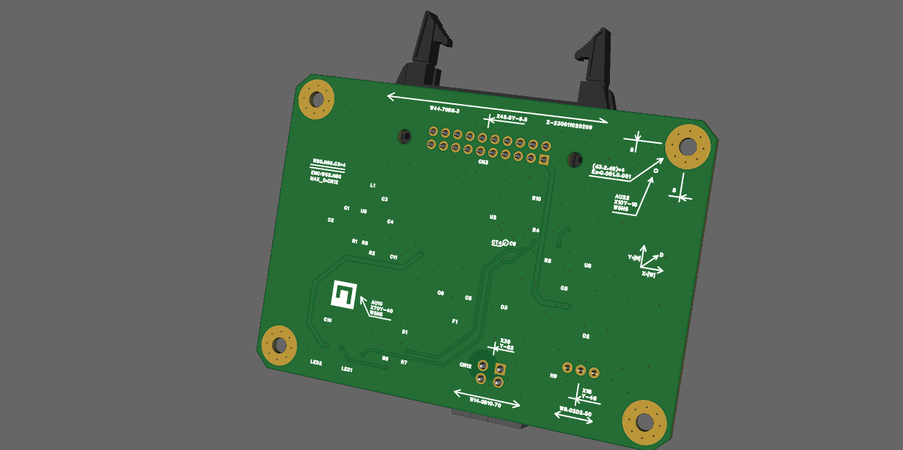
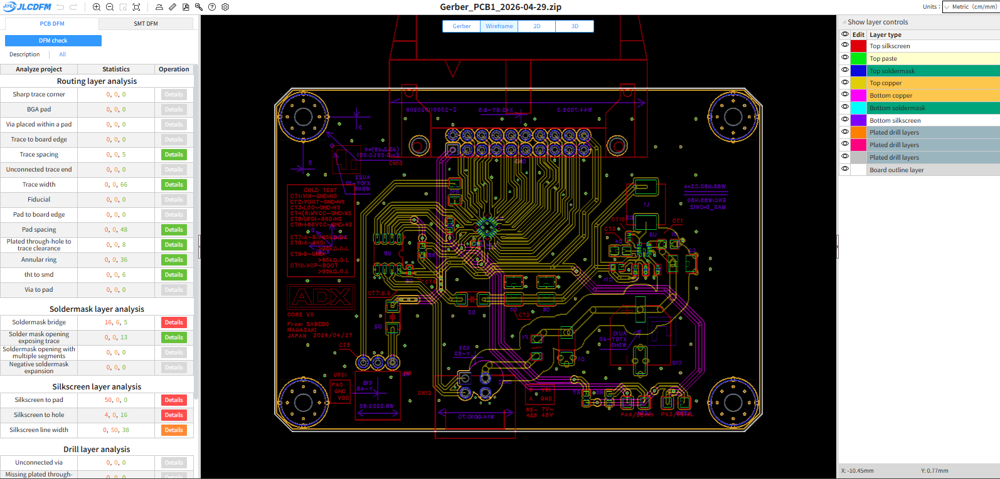
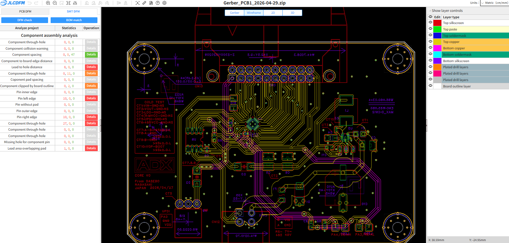
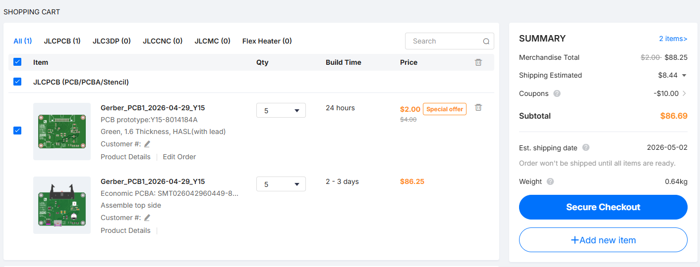
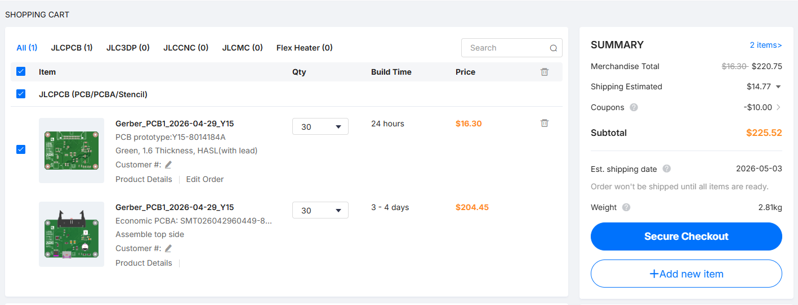

- ADX Core V0
- 2026/04.29 17:22

## 3D View

## 回路図

## 製造データ
- [BOM](dev/ADX_Core_v0/Manufacture/20260429_1302/BOM_Board1_PCB1_2026-04-29.csv)
- [Gerber](dev/ADX_Core_v0/Manufacture/20260429_1302/Gerber_PCB1_2026-04-29.zip)
- [PickAndPlace](dev/ADX_Core_v0/Manufacture/20260429_1302/PickAndPlace_PCB1_2026-04-29.csv)
## その他データ
- [Netlist(easyeda)](dev/ADX_Core_v0/Manufacture/20260429_1302/Netlist_PCB1_2026-04-29.enet)
## DFM Check
- PCB DFM
	- フットプリント以外でGood以下のもの無し
- SMT DFM
	- ATtinyのチップ裏のviaが大丈夫なのか不明
		- とりあえずデータシートの推奨値ではあるものの製造できるのか不明
		- また、EasyEDAでtentedを明示的に指定できないため、Solder Maskの-1000milなどで指定しているがこれもどうなるかはっきりしない。3Dビューでもいまいちはっきりしたことは分からない。
		- その他、ATtinyのピン部分やチップ部分はSMT DFMの推奨外が多い。

### RESULT

#### PCB DFM

#### SMT DFM

## RESULTS
### Price
- QTY 5
	- ＄86.69
- QTY 30
	- ＄225.32

### SPEC
- GPIO IDC 20pin with VDD
- INPUT DC 7V ~ 48V
- TEMPLATURE -40℃ ~ 105℃
- Main Chip ATtiny1616-MNR
- DESULT 
	- RS-485
	- No USB
- M3 × 4 with PAD 8mm
- Board Edge C3 × 3