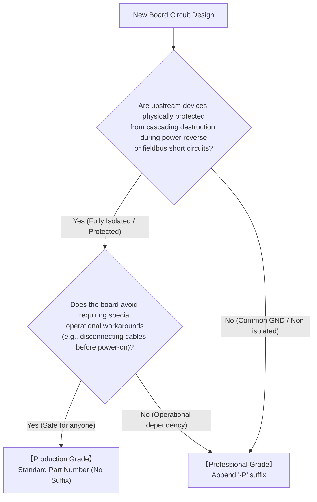

<!--
Copyright (c) 2026 ADX Project Contributors
SPDX-License-Identifier: CC-BY-4.0
-->

# ADX Hardware Naming Conventions & Grade Classification

[ **English** | [日本語 (../ja/hardware_naming_rules.md)](../ja/hardware_naming_rules.md) ]

This document defines the official product naming syntax and safety classification standards for hardware products (boards, modules, daughtercards) in the ADX ecosystem. It establishes the strict distinction between **"Production Grade (Commercial/Standard)"** and **"Professional / DIY Grade (`-P`)"**.

---

## 1. Background & Philosophy

ADX aims to bridge the gap between "the accessible UX of Arduino" and "the rugged reliability required for industrial field environments."

When dealing with fieldbuses (RS-485) and diverse power domains, there is a fundamental physical tradeoff between **"extreme miniaturization/cost reduction"** and **"absolute safety against all forms of wiring errors"**:

- **Non-isolated / Common GND:**
  Allows reducing component count and producing ultra-low-cost, compact boards. However, during power reverse-polarity or ground-loop voltage differentials, the ground plane can float, risking **cascading destruction** back into connected upstream equipment (laptops, PLCs, precision test instruments) through communication lines.
- **Fully Isolated:**
  Electrical domains are strictly separated, completely preventing cascading destruction even under severe wiring mistakes or ground faults. However, digital isolators and isolated DC-DC converters add BOM cost and board surface area.

Rather than locking away low-cost, non-isolated designs as "too dangerous," ADX adopts a dual-tier portfolio: providing open design files as **"Professional / DIY Grade (`-P`)"** for experienced engineers who manage risks, while providing foolproof **"Production Grade"** hardware for general users.

This clear naming convention conveys this distinction immediately.

---

## 2. Naming Structure

Official ADX hardware model numbers follow this syntax:

```text
ADX [FAMILY]-[TYPE][-SUFFIX]
```

### Syntax Elements

| Element | Meaning | Definitions & Examples |
| :--- | :--- | :--- |
| **`ADX`** | Brand / Platform Prefix | Fixed prefix for all official ADX hardware. |
| **`[FAMILY]`** | Board Category / Form Factor | • `CORE`: Main MCU processor board (8748 Form Factor)<br/>• `CARD`: Expansion add-on card (8748 Form Factor)<br/>• `PWR`: Power supply / distribution module<br/>• `BASE`: Backplane / baseboard carrier |
| **`[TYPE]`** | Function & Architecture | • `A`: Absolute (Universal industrial-grade isolated model)<br/>• `I`: Isolated (Dual-isolated architecture)<br/>• `S`: Standard (General baseline pinout)<br/>• `D`: Development / Debug (Internal R&D testbed)<br/>• `RELAY`: Relay output card<br/>• `DIO`: Digital I/O card |
| **`[-SUFFIX]`** | **Safety & Delivery Grade** | • **(None)**: **Production Grade (Commercial / Foolproof)**<br/>• **`-P`**: **Professional / DIY Grade (Expert DIY, User Risk)** |

---

## 3. Grade Classification Decision Tree

When a designer develops a new board, its grade is assigned according to the following objective criteria:



### 3.1 Production Grade (Standard / No Suffix)

- **Definition:** The standard model designed for anyone from beginners to professional system integrators to connect freely and safely.
- **Safety Requirements:**
  1. **Cascading Destruction Prevention:** Even if power is reversed, fieldbus wires are shorted, or ground-loop voltage differentials occur, connected PCs or upstream devices are never damaged (signal and power isolation, or equivalent hardware protection).
  2. **Operational Independence:** No awkward operating constraints (such as "disconnect ribbon cables before switching on mains power").
- **Distribution:**
  - Assembled, tested, and commercially sold with official warranty/support.
  - Complete schematics and BOM published open-source.

### 3.2 Professional / DIY Grade (`-P` Version)

- **Definition:** High-density, cost-optimized designs intended exclusively for experienced engineers with circuit comprehension and wiring control.
- **Tradeoffs:**
  1. **Common Ground / Non-isolated:** Due to cost or board area constraints, wiring mistakes may cause dangerous loop currents or back-feed.
  2. **Extreme Cost Efficiency:** Omitting isolators allows high-volume production for a fraction of the cost via JLCPCB PCBA.
- **Distribution & Policy:**
  - **Not commercially sold as pre-assembled finished goods.**
  - 100% open design files (Gerber, BOM, CPL, EasyEDA/KiCad projects) released for users to order and fabricate at their own responsibility.
  - Must include explicit cascading destruction warnings and liability disclaimers.

---

## 4. Part Number Examples

| Part Number | Grade | Isolation | Primary Applications & Target Audience |
| :--- | :--- | :--- | :--- |
| **`ADX CORE-A`** | Production | **Fully Isolated** | **ADX Absolute Standard.** 2500V isolated RS-485, dedicated clean 5V, PC back-feed protection. Safe for anyone from desktop development to summer vehicle cabins and factory control panels. |
| **`ADX CORE-I`** | Production | **Dual Isolated** | General deployment with external PLCs, PCs, and different power domains. |
| **`ADX CORE-S-P`** | Professional | **Non-isolated** | Enclosed equipment, internal test fixtures, robot wiring, cost-critical prototypes. DIY fabrication at own risk. |
| **`ADX Core-D`** | Development | Non-isolated | Internal verification testbed for LN-485 bootloader and firmware. |
| **`ADX CARD-RELAY`** | Production | **Isolated** | Universal optocoupler-isolated relay output card. |
| **`ADX CARD-RELAY-P`**| Professional | **Non-isolated** | High-density relay card with shared ground for space/cost-limited setups. |

---

## 5. Disclaimer & Open-Source Policy

Users fabricating or operating Professional Grade (`-P`) hardware designs are subject to the following disclaimer:

> ### [Professional Grade Disclaimer]
> 1. Design files (schematics, artwork, BOM, manufacturing files) are provided "AS-IS" under the CERN-OHL-P-v2 license without warranties of any kind, either express or implied.
> 2. The ADX Project and its contributors accept no liability for any direct, indirect, incidental, or consequential damages (including hardware failure, destruction of connected PCs/PLCs, electrical fire, or data loss) resulting from manufacturing, assembly, powering, or operating these boards.
> 3. Users assume all responsibility for verifying electrical specifications and safety precautions before fabrication and deployment.

---

## 6. License

This specification is licensed under the [Creative Commons Attribution 4.0 International License (CC-BY-4.0)](../../LICENSES/CC-BY-4.0.txt).
