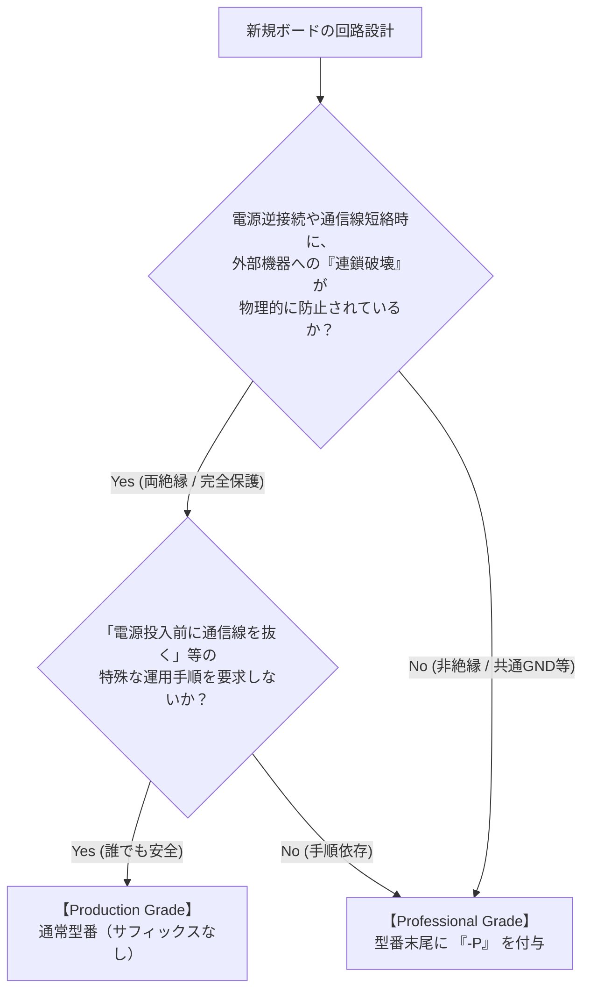

<!--
Copyright (c) 2026 ADX Project Contributors
SPDX-License-Identifier: CC-BY-4.0
-->

# ADX ハードウェア命名規則・グレード分類基準 (Hardware Naming Conventions & Grade Classification)

本ドキュメントは、ADXエコシステムにおけるハードウェア製品（基板・モジュール等）の命名規則、および「一般・製品グレード」と「プロ専用・自己責任DIYグレード（`-P`）」の分類基準を定義する公式仕様書です。

---

## 1. 背景と目的

ADXは「Arduinoのような開発の自由度」と「産業用途に耐えうる現場適合性」の両立を目指しています。

しかし、フィールドネットワーク（RS-485等）や電源系統を扱うハードウェアでは、**「コスト・基板面積の極限追求」と「あらゆる誤配線に対する完全な安全性」の間に物理的なトレードオフ**が存在します。

- **非絶縁・共通GNDの場合**:
  部品点数を削減し、極めて安価（1枚数百円〜）かつ小型に製造できる一方、電源逆接続時などにGNDプレーンが浮上し、通信線を経由して**接続先の上流機器（PC、PLC、計測器等）を巻き込んで連鎖破壊（Cascading Destruction）するリスク**を内包します。
- **絶縁型（両絶縁等）の場合**:
  電気的境界が保たれ、誤配線や電位差による連鎖破壊を確実に防ぐことができますが、アイソレータや絶縁DC-DC等の追加によりBOMコストと基板実装面積が増加します。

ADXでは、低コストな非絶縁設計を「危険だからとお蔵入り」にするのではなく、**「リスクを自己管理できるプロフェッショナル向けのオープンデータ」**として活用し、一方で一般向けには**「安全性を担保した製品グレード」**を提供する、という2層のポートフォリオを採用します。

この区別をユーザーに直感的かつ明確に伝えるため、本命名規則を定めます。

---

## 2. 命名フォーマット (Naming Structure)

ADXのハードウェア型番は、以下のフォーマットで統一されます：

```text
ADX [FAMILY]-[TYPE][-SUFFIX]
```

### 構文要素の定義

| 要素 | 意味 | 規定内容・代表例 |
| :--- | :--- | :--- |
| **`ADX`** | ブランド・規格名 | すべての公式ハードウェアの接頭辞 |
| **`[FAMILY]`** | ボードカテゴリ / フォームファクタ | ・`CORE`: メインプロセッサ基板（8748フォームファクタ）<br/>・`CARD`: 拡張アドオン基板（8748フォームファクタ）<br/>・`PWR`: 電源供給・配電ユニット<br/>・`BASE`: バックプレーン / ベースボード |
| **`[TYPE]`** | 機能・アーキテクチャ | ・`I`: Isolated（両絶縁型）<br/>・`S`: Standard（標準機能・標準ピン配置）<br/>・`D`: Development / Debug（開発・評価用）<br/>・`RELAY`: リレー出力カード<br/>・`DIO`: デジタル入出力カード |
| **`[-SUFFIX]`** | **提供グレード・安全区分** | ・**（無印）**: **Production Grade（製品・一般向け）**<br/>・**`-P`**: **Professional / DIY Grade（プロ専用・自己責任）** |

---

## 3. グレード分類基準 (Grade Classification)

設計者が新しい基板を開発した際、どちらのグレードに属するかは以下の客観的基準に基づいて判定されます。



### 3.1 Production Grade（通常版・サフィックスなし）

- **定義**: 初学者から一般開発者まで、安全かつ自由に外部機器と接続できる標準モデル。
- **安全要件**:
  1. **連鎖破壊の防止**: 電源の逆接続、通信線の短絡、グラウンドループ電位差が発生しても、接続先のPCや外部機器に破壊が及ばないこと（信号・電源の両絶縁、または同等の保護）。
  2. **運用独立性**: 「電源を入れる前に拡張ケーブルを外す」などの特殊なシーケンスを強要しないこと。
- **提供形態**:
  - 完成品（組み立て・検査済み）としての販売・公式サポート。
  - 設計データ（回路図・BOM）の公開。

### 3.2 Professional / DIY Grade（`-P` 版）

- **定義**: コストやサイズを極限まで突き詰め、電気的理解と配線管理能力を持つエンジニアにのみ提供されるプロ専用モデル。
- **特徴・トレードオフ**:
  1. **共通GND・非絶縁構造**: コスト削減や実装面積の都合上、誤配線時に外部機器へ高電圧・短絡電流が還流する物理的リスクを持つ。
  2. **圧倒的なコストメリット / 高密度**: アイソレータ等を省くことで、JLCPCB等の小ロット製造（PCBA）で1台あたり数ドル〜での量産が可能。
- **提供形態・運用原則**:
  - **原則として完成品の無条件販売は行わない**。
  - 設計データ（Gerber、BOM、CPL、EasyEDA/KiCadプロジェクト）を100%公開し、ユーザーが**自己責任で製造・利用（DIY / PCBA委託）**する。
  - ドキュメントには「連鎖破壊リスクの警告」および「免責事項」の明記を必須とする。

---

## 4. 命名・適用実例

| 型番 | グレード | 絶縁 | 主な用途・ターゲット |
| :--- | :--- | :--- | :--- |
| **`ADX CORE-I`** | Production | **両絶縁** | 一般開発、外部機器（PLC・PC・異電源システム）との自由接続。ADXの本命完成品。 |
| **`ADX CORE-S-P`** | Professional | **非絶縁** | 同一電源内の機器組込、自社検査治具、ロボット内部配線、コスト最優先のプロトタイピング。自己責任DIY製造。 |
| **`ADX Core-D`** | Development | 非絶縁 | LN-485ブートローダおよびファームウェア開発専用ボード（内部評価用）。 |
| **`ADX CARD-RELAY`** | Production | **絶縁** | フォトカプラ等で完全分離された汎用リレー出力拡張カード。 |
| **`ADX CARD-RELAY-P`**| Professional | **非絶縁** | コスト極限・超小型化のためGND共通化された特定用途向けリレーカード。 |

---

## 5. 免責条項とオープンハードウェア運用

Professional Grade（`-P`）のハードウェアデータを利用・製造するユーザーに対しては、以下の免責ポリシーが適用されます：

> ### 【Professional Grade 免責規定】
> 1. 本設計データ（回路図、アートワーク、部品表、製造データ等）は、CERN-OHL-P-v2 ライセンスに基づき「現状有姿（AS-IS）」で提供され、明示・黙示を問わずいかなる保証も伴いません。
> 2. 本設計データに基づいて製造・組み立て・通電・接続された基板に起因する、直接的・間接的・付随的・派生的なすべての損害（接続先PC・PLC・センサー等の故障、焼損、火災、データ消失等を含む）について、ADXプロジェクトおよび設計者は一切の責任を負いません。
> 3. 利用者は、電気回路およびフィールドネットワークの仕様・危険性を十分に理解した上で、自己の責任において製造および運用を行うものとします。
