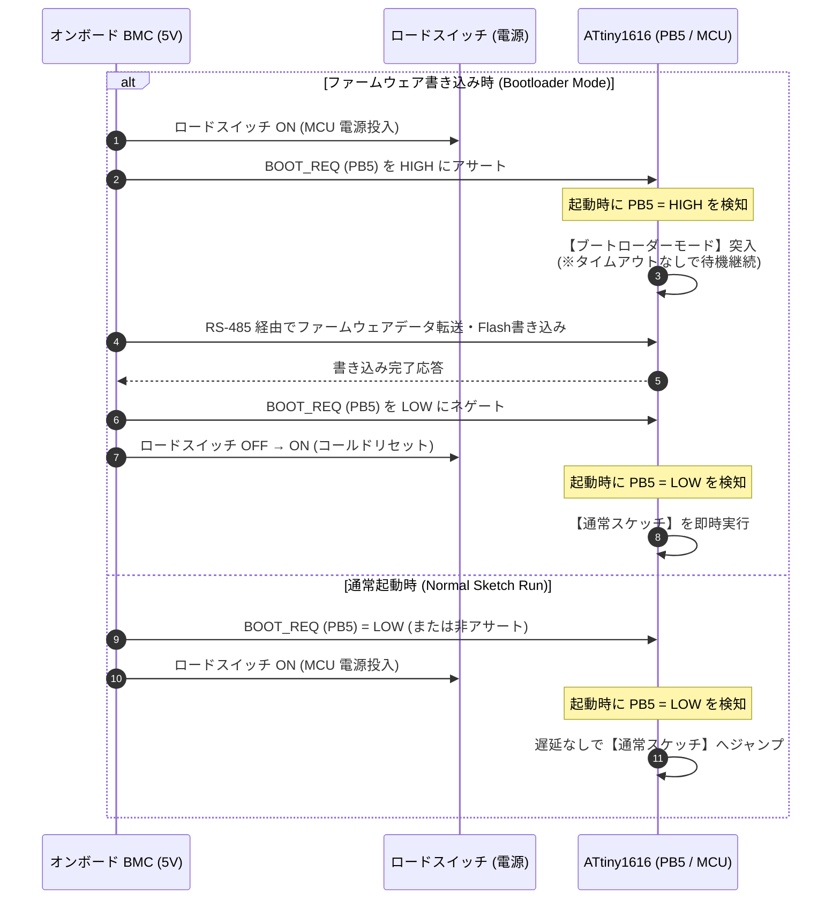

<!--
Copyright (c) 2026 ADX Project Contributors
SPDX-License-Identifier: CC-BY-4.0
-->

# ADX ブートローダー 現時点要求仕様書 (Draft Memo)

## 1. 概要 (Overview)
本ドキュメントは、Microchip ATtiny1616 を搭載したマイコンボード「ADX」において、今後開発・実装される**専用ブートローダー（Bootloader）**の現時点における要求仕様およびハードウェア前提条件を整理・定義したメモです。

本規格では、オンボードに搭載された **BMC (Baseboard Management Controller)** と連携し、産業用途に求められる「確実なモード制御」と「高速・決定論的な通常起動」を両立することを主目的とします。

---

## 2. ハードウェア前提条件 (Hardware Prerequisites)

| 項目 | 仕様・接続 | 備考 |
| :--- | :--- | :--- |
| **対象 MCU** | Microchip ATtiny1616-MNR (QFN-20) | Flash 16KB, SRAM 2KB, EEPROM 128B |
| **BMC (オンボード)** | 5V ロジック駆動 | MCUと同電位。MCUの電源（ロードスイッチ）および `BOOT_REQ` を直接駆動 |
| **BOOT_REQ ピン** | **PB5** (MCU 入力) | BMC からのブートリクエスト入力信号。 ・**外部プルダウン抵抗** 実装済み ・**直列保護抵抗** 実装済み |
| **オンボード LED** | **PB4** (赤色 LED) | **Active HIGH**（HIGH 出力で点灯、LOW で消灯） |
| **通信インターフェース** | **オンボード RS-485** (SP485EEN) | `PA1`: USART0 TxD `PA2`: USART0 RxD `PA4`: USART0 XDIR (ハードウェア自動方向制御) `PA7`: GPIO (RE_ 受信イネーブル) |
| **UPDI デバッグ端子** | **PA0** (UPDI) | オンボードの THT（スルーホール）ピンヘッダとして引き出し（初期書き込み・デバッグ専用） |
| **IDC 2×10 コネクタ** | IDC Pin 1〜20 | ブートローダー専用の外部信号引き出しは行わない（ピン配置変更なし） |

---

## 3. 起動シーケンス & ブート動作要求 (Boot Sequence Requirements)

### ① 起動判定タイミングとロジック
MCU は、電源投入（Power-on）またはリセット解除直後のスタートアップルーチン（リセットハンドラ最初期）において、`PB5 (BOOT_REQ)` の論理レベルをサンプリングします。

* **`BOOT_REQ == HIGH` の場合:**
  - **ブートローダーモード (Bootloader Mode)** に突入します。
* **`BOOT_REQ == LOW` の場合:**
  - ブートローダーの待機遅延を挟まず、即座に **通常スケッチ (User Application)** の実行を開始します。

### ② タイムアウトの撤廃 (No Arduino-like Timeout)
* 一般的なホビー向け Arduino ブートローダー（Optiboot 等）に存在する「起動後数秒間通信を待機し、応答がなければスケッチを実行する」という **タイムアウト機構は一切設けません**。
* `BOOT_REQ == HIGH` で起動した場合、外部から明示的な解除操作（電源再投入やリセット等）が行われるか、ファームウェア転送が完了するまで、**無期限でブートローダー待機状態を維持** します。
* これにより、通信遅延やバス混雑時でも不意にユーザーアプリケーションへフォールバックすることのない、堅牢なファームウェア更新手順を担保します。

### ③ BMC 連携シーケンス (シーケンス図)

---

## 4. 通信およびペリフェラル制御要件 (Communication & Peripherals)

### ① RS-485 半二重通信とハードウェア自動方向制御 (XDIR)
* ファームウェアデータの受信および応答送信は、オンボード RS-485 トランシーバーを経由して行います。
* ATtiny1616 の `USART0` に備わっている **ハードウェア自動方向制御機能 (`XDIR` / `PA4`)** を活用します。
  - 送信開始時のドライバイネーブル（DE HIGH）および送信完了時のレシーバイネーブル復帰（DE LOW）をハードウェアに委ねることで、ブートローダー内のGPIO制御コードを完全に削減し、フットプリントを最小化します。

### ② オンボード LED (PB4: 赤色) の役割・仕様
* **規格上の要求:**
  - 規格（Specification）としては、PB4 LED の利用方法・点灯規則は **強制・規定しません**（ユーザーおよびアプリケーションの自由度を確保）。
* **リファレンス実装としての推奨動作 (Guidelines):**
  - ブートローダーモード滞在中（待機中）: 1Hz 程度の緩やかな点滅、または常時点灯（現場作業者・デバッグ時の視認性向上）。
  - ファームウェア受信・Flash書き込み中: 高速点滅。
  - 通常スケッチ実行時: スケッチ側の制御に委ねる。

---

## 5. 今後の検討・策定事項 (To Be Determined)

ブートローダーの実装・詳細設計に向けて、今後以下の項目を順次策定します。

1. **ブートローダー占有サイズとヒューズ設定 (BOOTEND):**
   - ATtiny1616 の Flash 16KB に対し、ブートローダー領域のサイズ上限（例: 512B / 1KB / 2KB）。
   - `BOOTEND` ヒューズの設定値。
2. **転送プロトコル & フレームフォーマット:**
   - LN-485 通信スタックに準拠したコマンド体系、パケットフォーマット、ブロックサイズ（Flash ページサイズ: 64 Byte に合わせた分割転送）。
   - CRC16 またはチェックサムによるデータ整合性検証。
3. **書き込み完了後の脱出・リセット方式:**
   - BMC による電源パワーサイクル（上記シーケンス図の手順）を標準とするか、ソフトウェアリセットコマンド（`RSTCTRL.SWRR`）を併用するか。
