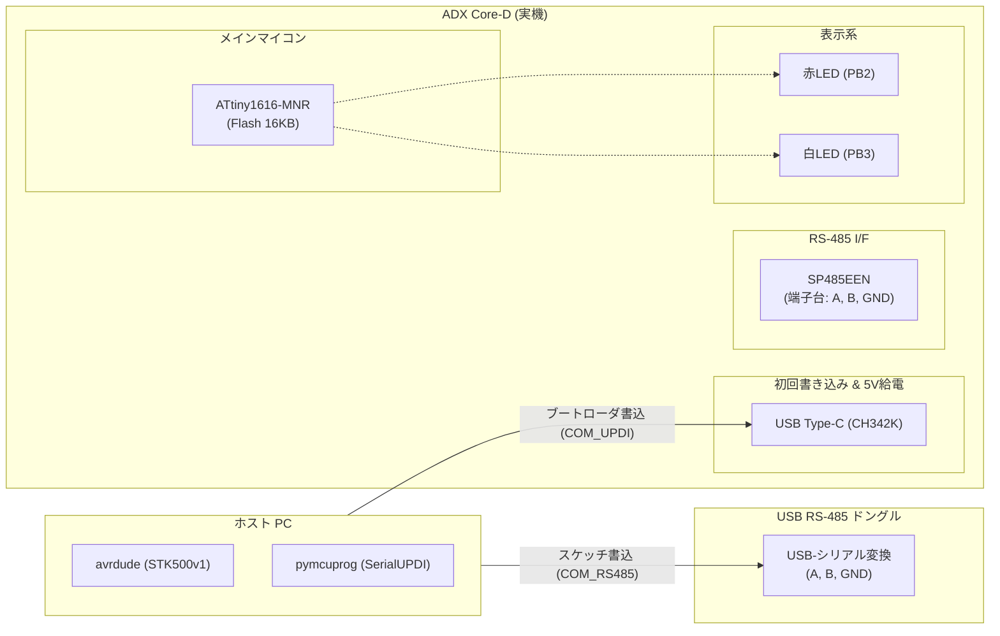
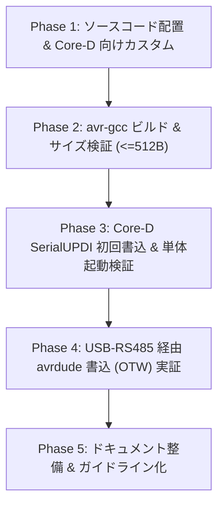

<!--
Copyright (c) 2026 ADX Project Contributors
SPDX-License-Identifier: MIT
-->

# ADX Core-D 用 1-to-1 RS-485 ブートローダー開発計画書

## 1. 開発目的と位置づけ

### 1.1 目的
ADX のプロトタイピング・実証ボード **ADX Core-D**（MCU: ATtiny1616-MNR）を対象に、半二重 RS-485 通信（1対1 / Point-to-Point）を介してファームウェアの書き換えを可能にする極小ブートローダーを開発・実証する。

### 1.2 本開発の位置づけ
1. **Core-D 実機を活用した早期実証**:
   現在製造中の CORE-S に先駆け、すでに手元に実機がある Core-D を用いて RS-485 ブートローダーのコア技術（NVMCTRL Flash書き換え、XDIR 自動半二重制御、avrdude / STK500v1 連携）を確立する。
2. **単体製品（CORE-B等）向け標準ブートローダーの確立**:
   マルチドロップを行わない単体コントローラー製品において、そのまま公式ブートローダーとして即座に活用できる。
3. **将来のマルチドロップ OTW（Over-The-Wire）への礎**:
   1対1 の物理層・プロトコル層を確実に PASS させることで、将来 CORE-S 実機で BMC（ATtiny412）電源分離やアドレス判定によるマルチドロップ OTW を開発する際の強固なベースとする。

---

## 2. システム構成 & ハードウェア仕様

### 2.1 ハードウェア諸元 (ADX Core-D)

| 項目 | 採用仕様 / 部品 | 備考・接続ピン |
| :--- | :--- | :--- |
| **MCU** | Microchip **ATtiny1616-MNR** (QFN-20) | Flash 16KB, SRAM 2KB, 5V動作 |
| **RS-485 トランシーバ** | MaxLinear **SP485EEN-L/TR** (SOIC-8) | 半二重トランシーバ (最大 10Mbps) |
| **TXD (送信データ)** | **PA1** (Pin 20) | USART0 Alternate TXD (`PORTMUX` 切替) |
| **RXD (受信データ)** | **PA2** (Pin 1) | USART0 Alternate RXD |
| **DE (送信イネーブル)** | **PA4** (Pin 5) | USART0 Alternate **XDIR (ハードウェア自動制御)** |
| **RE (受信イネーブル)** | **PA7** (Pin 8) | GPIO制御（ブートローダー起動時に LOW 出力固定） |
| **ステータス LED** | 赤色 LED: **PB2**<br>白色 LED: **PB3** | ブートローダー起動中・通信中のインジケータ |
| **外部オシレータ** | 12MHz 水晶発振器 (PA3 / EXC) | ジャンパ H3 で選択可能（通常は内蔵 16/20MHz 使用） |
| **RS-485 コネクタ** | KF142R-5.08-3P (A, B, GND) | 差動通信バス端子台 |
| **UPDI 書込 / 給電** | WCH **CH342K** (USB Type-C) | 初回ブートローダー書込・ヒューズ設定・5V給電 |

### 2.2 接続トポロジ (実機検証環境)



---

### 2.3 通信速度とホスト側 RS-485 ドングルの適合性評価

ホスト PC 側に接続する USB RS-485 シリアル変換ドングル（2Mbps 対応品）と、ターゲット（Core-D）の速度適合性を以下のように評価・確定します。

| 項目 | スペック / 運用値 | 適合性・マージン評価 |
| :--- | :--- | :--- |
| **ホスト側ドングル最大速度** | **最大 2.0 Mbps** | 115.2 kbps に対し **約 17 倍の速度マージン**。バッファ枯渇や波形なまりのリスクは皆無。 |
| **オンボード SP485EEN** | **最大 10.0 Mbps** | 高速スルーレート対応。115.2 kbps はドライバ能力に対して極めて低負荷で安定。 |
| **ブートローダー運用ボーレート** | **115,200 bps** | STK500v1 / avrdude の業界標準速度。Flash 16KB の全領域書き込みも **約 1〜2 秒** で完了。 |
| **半二重切替 (ターンアラウンド)** | ハードウェア自動追従 | Core-D 側は MCU 内蔵 XDIR が自動制御。ドングル側（自動方向制御チップまたは高速FTDI/CH34x）も 115.2 kbps で完全にパケット往復に追従可能。 |
| **将来の拡張性** | 230.4k / 500k / 1Mbps | ドングルが 2Mbps まで耐えられるため、将来の超高速書き込み実験も同一機材で実施可能。 |

---

## 3. ソフトウェア・アーキテクチャ

### 3.1 ベースソフトウェア
- **コードベース**: SpenceKonde `megaTinyCore` に同梱される **`optiboot_x`**
- **通信プロトコル**: **STK500v1 互換**（`avrdude -c stk500v1` または `-c arduino` で書き込み可能）
- **ボーレート**: **115,200 bps** (内蔵 16MHz/20MHz または 外部 12MHz オシレーター)

### 3.2 メモリマップとヒューズ設定

tinyAVR 1-series（ATtiny1616）はリセットベクターが `0x0000` にあるため、ブートローダーが Flash 先頭に配置されます。

```text
+-----------------------+ 0x0000
|   optiboot_x          |
|   (Bootloader Area)   |  512 Bytes (BOOTEND = 0x02)
+-----------------------+ 0x0200
|                       |
|   User Application    |  残余 Flash 領域 (~15.5 KB)
|                       |
+-----------------------+ 0x3FFF
```

- **ヒューズ設定 (`BOOTEND`)**: `0x02` (2 × 256 Bytes = 512 Bytes)
  - `BOOTEND` により `0x0000`〜`0x01FF` が書き込み保護され、ブートローダー自身の自己破壊をハードウェアレベルで防止。
- **アプリケーション開始アドレス**: `0x0200`
  - アプリケーション側のリンカスクリプトで `.text` 開始オフセットを `0x0200` に設定。

> [!CAUTION]
> #### 【最重要】UPDI ピン絶対保護方針（文鎮化・Brick防止基準）
> 現在の開発環境には **高電圧（HV: 12V）パルスを印加してチップを救出する専用プログラマ（HV-UPDI）がありません**。
> したがって、ヒューズ設定にあたっては以下のルールを **絶対遵守** します：
> 1. **`FUSE.SYSCFG0`（`RSTPINCFG[1:0]`）の変更を厳禁とする**:
>    - PA0 を「外部RESETピン」や「GPIO」へ変更する操作は一切行わず、必ずデフォルトの **`UPDI` モードのまま維持** します。
> 2. **ヒューズの一括書き換えを禁止し、`BOOTEND` のみピンポイント指定する**:
>    - チップ全体のヒューズバイト列を一括書き換えするコマンドは使用せず、ツール（`pymcuprog` 等）の個別指定オプションを用いて `BOOTEND` のみを書き換えます。
>    ```bash
>    # 安全なヒューズ書き込み例 (BOOTEND のみ書き換え、他ヒューズには一切触れない)
>    pymcuprog write -d attiny1616 -t uart -u <COM_PORT> -m fuses -o 8 -l 0x02
>    ```
> 3. **書き込み前後のベリファイ徹底**:
>    - ヒューズ変更前後に必ず全ヒューズレジスタ値を読み出しログに残し、`SYSCFG0` が変化していないことを検証します。

### 3.3 ハードウェア制御と独自追加要素
1. **XDIR ハードウェア自動半二重制御**:
   - コンパイルオプション `RS485=1` により、`USART0.CTRLA` の RS485 ビットを有効化。
   - ATtiny1616 のハードウェアが PA4（XDIR）を送信時 HIGH、送信完了後 LOW へ完全自動駆動。
2. **/RE ピン（PA7）の初期化**:
   - `optiboot_x.c` の初期化ブロックに `VPORTA.DIR |= (1<<PORT7); VPORTA.OUT &= ~(1<<PORT7);` を追加し、SP485EEN を常時受信可能状態にする。
3. **ステータス LED 表示**:
   - ブートローダー待機中に **赤色 LED（PB2）を点滅（ハートビート）** させ、ブートローダー待機中であることを視覚的に通知。
4. **エントリーとロングタイムアウト（約 10 秒）**:
   - RS-485 には DTR 自動リセット線がないため、人間が電源 ON 後に落ち着いて PC 側の書き込みコマンドを実行できるよう、**約 10 秒間のロング待機時間** を確保。
   - 通信を受信すれば即座に書き込みモードへ移行し、10 秒間無通信の場合は自動的に `0x0200` のユーザーアプリケーションへジャンプ。

### 3.4 データ整合性担保方式（Read-back Verify 方式の採用）

本 1-to-1 ブートローダーでは、**512 バイト（`BOOTEND=0x02`）の極小フットプリントを最優先**するため、通信パケット単位の多項式 CRC（CRC-16 等）計算ルーチンは搭載しません。

その代わり、以下の **Read-back Verify（全バイト読み戻し検証）方式** により、書き込みデータの完全性を 100% 担保します：

1. **プロトコル上の扱い**:
   - STK500v1 の `CRC_EOP`（`0x20`）は単なるフレーミング同期文字（パケット終端確認）として機能します。
2. **ホスト側（avrdude）による全数照合**:
   - `avrdude` は Flash への各ページ書き込み完了後、標準で Flash 全領域を順次読み戻し（`STK_READ_PAGE`）、PC 側のバイナリデータと 1 バイトずつ完全一致を検証します。
   - 通信途中でノイズ等による 1 ビットの化けが生じた場合でも、ベリファイフェーズで即座に不一致（Verification Error）が検出され、不正なファームウェアの誤実行が確実に防止されます。
3. **机上 1-to-1 環境における妥当性**:
   - Core-D 実機と PC ドングル間の接続（数十cm〜1m 程度）においては、Read-back Verify で十分実用的な信頼性と安全性を確保できます。
   - （※将来の現場長距離マルチドロップ環境では、ATtiny1616 内蔵のハードウェア `CRCSCAN` やパケット CRC を備えた 1KB ブートローダーへの発展を検討します）。

> [!TIP]
> - 2系統の物理ポート（Type-C / UPDI vs RS-485 ドングル）の具体的なコマンドライン操作や Arduino CLI によるオフセットビルド環境の詳細は、**[開発・検証ワークフロー & CLIツールチェーン設計書](./workflow_and_tools.md)** を参照してください。
> - Windows 11 PC と Ubuntu 間の役割分担、およびトラブルを防ぐ厳格な Gate 判定基準は、**[段階的開発マイルストーン計画書](./milestones.md)** を参照してください。

---

## 4. 開発フェーズとマイルストーン



### Phase 1: ソースコード配置 & Core-D 向けカスタム
- [ ] `firmware/bootloader/OneToOne_RS485/` に必要なソースファイルを配備。
  - `optiboot_x.c`
  - `pin_defs_x.h`
  - `stk500.h`
  - `Makefile`
- [ ] Core-D 固有のピン初期化を追加：
  - PA7 (/RE) 受信イネーブルの GPIO 出力 LOW 設定
  - PB2/PB3 LED インジケータ制御
  - `UARTTX=A1` (PA1: TX, PA2: RX, PA4: DE) のマクロ最適化

### Phase 2: avr-gcc ビルド & バイナリサイズ検証
- [ ] `Makefile` を整備し、ATtiny1616 向けコンパイル環境を構築。
- [ ] **厳格なサイズ検証**:
  - 生成バイナリが **512バイト境界（<= 512 bytes）** に完全に収まっていることを確認。
  - 必要に応じてデバッグコードや未使用マクロを削ぎ落とし、極小化を徹底。
- [ ] `optiboot_core_d_rs485.hex` の出力。

### Phase 3: Core-D 実機への初回書き込み & 単体起動検証
- [ ] ホスト PC と Core-D を Type-C で接続（CH342K 経由）。
- [ ] `pymcuprog` / `avrdude` を使用し、SerialUPDI 経由で以下を実行：
  - ヒューズ設定（`BOOTEND = 0x02`）
  - ブートローダー `.hex` の書き込み
- [ ] 単体動作確認：
  - リセット時、LED が指定通り点滅・点灯するか。
  - 1秒のタイムアウト後、正しくユーザー領域へジャンプするか。

### Phase 4: RS-485 経由書き込み（OTW）実証
- [ ] USB RS-485 ドングルと Core-D 端子台（A, B, GND）を結線。
- [ ] 終端抵抗ジャンパ（H4）および DE/RE ジャンパ（H2）の確認。
- [ ] ホスト PC から `avrdude` コマンドを実行：
  - デバイスシグネチャ（`0x1E 0x94 0x21`）の正常応答確認。
  - テストスケッチ（Lチカ・シリアル出力等）の Flash 書き込み検証。
- [ ] 書き込み完了後のスケッチ自動起動確認。

### Phase 5: ドキュメント化 & 開発ガイドライン整備
- [ ] 書き込みコマンド一覧、avrdude 設定例、ヒューズ設定手順をまとめたマニュアル作成。
- [ ] 得られた知見（タイミング、波形、サイズ）をまとめ、次期 CORE-S マルチドロップ開発への引き継ぎ事項を整理。

---

## 5. 技術的リスクと対策

| リスク要因 | 影響 | 対策 |
| :--- | :--- | :--- |
| **【最重要】UPDI ピン誤設定による文鎮化** | HV（12V）回復器がない環境でチップアクセスが恒久遮断 | **`SYSCFG0`（`RSTPINCFG`）の変更を厳禁**。ヒューズ操作は `BOOTEND` のみピンポイントで指定し、一括書き換えコマンドはスクリプト・手順から完全排除する。 |
| **コードサイズ超過 (>512B)** | `BOOTEND=0x02` に収まらずビルドエラー | 不要な機能を削減。万が一の場合は `BIGBOOT`（1024B, `BOOTEND=0x04`）への拡張を検討（16KB中1KB消費のため十分許容可能）。 |
| **半二重のターンアラウンド遅延** | ホスト側の送信完了前に返信が始まり衝突 | 2Mbps 対応ドングルの高速自動方向制御と、ATtiny1616 内蔵 XDIR（ハードウェア完全同期）により、115,200 bps において十分なターンアラウンドマージンを確保。 |
| **クロック精度とボーレート誤差** | UART フレームエラーによる通信失敗 | 内蔵オシレーターで誤差が大きい場合は、Core-D オンボードの 12MHz 水晶発振器（PA3）駆動に切り替える。 |
| **パケット CRC 非搭載によるデータ化け** | 不正データの書き込みリスク | **avrdude の Read-back Verify（全バイト読み戻し照合）を標準必須** とし、1バイトの化けも即時検知・安全中断する。 |
| **DTR 自動リセットの欠如** | 書き込み開始タイミングの手動同期が必要 | 書き込み開始直前に電源リセット、または将来的な Break 信号 / ソフトウェアコマンドによるブートローダー突入シーケンスを検討。 |
