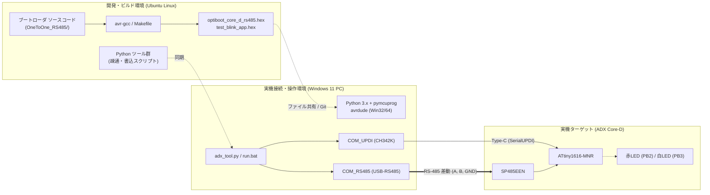
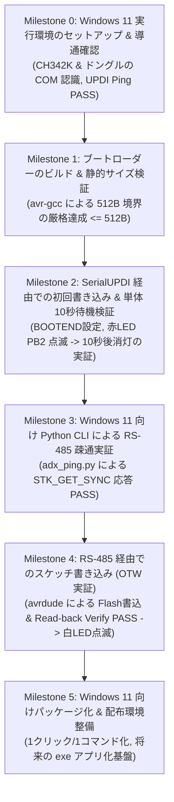

<!--
Copyright (c) 2026 ADX Project Contributors
SPDX-License-Identifier: MIT
-->

# ADX Core-D 1-to-1 RS-485 ブートローダー 段階的開発マイルストーン計画書

## 1. 開発環境の前提条件と基本方針

### 1.1 開発環境と実行環境の分離
本プロジェクトでは、ビルドを行う環境と、実機（Core-D）を接続して操作する環境が物理的に分離しています。



- **Ubuntu 環境（本環境）**:
  - ソースコード編集、コンパイル、静的バイナリサイズ検証（`<= 512B`）の達成。
  - Windows 11 向けに配布・同期するスクリプトや `.hex` バイナリの生成。
- **Windows 11 環境（実機操作環境）**:
  - Core-D（Type-C）および USB RS-485 ドングルが物理接続される操作 PC。
  - Python CLI や `avrdude` を用いた書き込み、疎通確認、および動作検証の実行。

### 1.2 「迷路に迷い込まない」ための Gate 方式
ハードウェアやファームウェア開発では、一度に複数の要素（通信、配線、バイナリ、ヒューズ、ツール）を動かそうとすると、動かなかった際に「ハードが壊れたのか？」「ヒューズが狂ったのか？」「ドライバか？」「コードのバグか？」の原因切り分けが不能になります。

本計画では、**「1つのマイルストーンで検証する変数を必ず1つだけに絞り、合格基準（Exit Criteria）を満たさない限り次へ進まない」Gate 方式** を厳格に適用します。

---

## 2. 開発マイルストーン（全 6 ステージ）



---

### Milestone 0: Windows 11 実行環境のセットアップ & 導通確認
- **目的**: 実機を操作する Windows 11 PC のツールチェーンを整え、Core-D と正常に電気的・論理的に通信できるベースラインを確立する。
- **作業内容**:
  1. Windows 11 に Python 3.x を導入（または確認）し、`pymcuprog` および `pyserial` をインストール：
     ```powershell
     pip install pymcuprog pyserial
     ```
  2. Windows 用 `avrdude`（スタンドアロン版または Arduino IDE 同梱版）のパスを確認。
  3. Core-D を Type-C で接続し、デバイスマネージャーで WCH CH342K の仮想 COM ポート認識を確認。
  4. USB RS-485 ドングルを接続し、その仮想 COM ポート認識を確認。
  5. `pymcuprog` で Core-D のデバイス ID を読み出し、SerialUPDI が通ることを確認：
     ```powershell
     pymcuprog ping -d attiny1616 -t uart -u COMx
     ```
- **合格判定基準（Exit Criteria）**:
  - [x] Core-D の COM ポート（UPDI 用）およびドングルの COM ポート（RS-485 用）が特定できていること。
  - [x] `pymcuprog ping` で ATtiny1616 の Device ID（`0x1E 0x94 0x21`）が正常応答すること。

---

### Milestone 1: ブートローダーのビルド & 静的サイズ検証（<= 512B）
- **目的**: Ubuntu 側で Core-D 向けカスタムコード（PA7 /RE 初期化、PB2 LED ハートビート、10秒待機）を組み込み、512 バイト境界を厳格にクリアするバイナリをビルドする。
- **作業内容**:
  1. `firmware/bootloader/OneToOne_RS485/` にソースファイルを配備。
  2. Core-D 向けピン・待機時間カスタムを実装：
     - `PA1` (TX), `PA2` (RX), `PA4` (XDIR / DE 自動制御)
     - `PA7` (/RE): 初期化時に OUTPUT LOW（常時受信モード）
     - `PB2` (赤LED): 10 秒間のハートビート点滅
  3. `avr-gcc` によるビルドとバイナリサイズ解析：
     ```bash
     avr-size -A optiboot_core_d_rs485.elf
     ```
- **合格判定基準（Exit Criteria）**:
  - [x] コンパイルエラー・警告がゼロであること。
  - [x] `.text` + `.version` の合計サイズが **512 バイト以下（<= 512 Bytes）** であること。
  - [x] `optiboot_core_d_rs485.hex` が正常出力されること。

---

### Milestone 2: SerialUPDI 経由での初回書き込み & 単体 10秒待機検証
- **目的**: Windows 11 PC から SerialUPDI 経由で Core-D にヒューズ設定とブートローダーを書き込み、**RS-485 通信を繋ぐ前に「マイコン単体でブートローダーが起動しているか」** を目視検証する。
- **作業内容**:
  1. 生成された `.hex` を Windows 11 側へ配置。
  2. ヒューズ安全確認（`SYSCFG0` の値を記録し、UPDI ピンが保護されていることを確認）。
  3. `BOOTEND = 0x02` のピンポイント書き込み。
  4. `optiboot_core_d_rs485.hex` の書き込み。
  5. Core-D の電源再投入。
- **合格判定基準（Exit Criteria）**:
  - [x] `SYSCFG0` が変化せず、UPDI ピンが安全に維持されていること。
  - [x] 電源投入直後、**赤色 LED（PB2）が約 5〜8 秒間リズミカルに点滅（ハートビート）** すること。
  - [x] タイムアウト経過後、**赤色 LED が消灯してアプリ領域へ遷移** すること。

> [!NOTE]
> この時点で「ハードウェア」「電源」「クロック」「LED制御」「WDTタイムアウト」「Flash書き込み」のすべてが正常であることが実証されます。

---

### Milestone 3: Windows 11 向け Python CLI による RS-485 疎通実証
- **目的**: RS-485 の差動配線（A, B, GND）を接続し、Windows 側の軽量 Python スクリプトから「ブートローダーが RS-485 パケットを受信・返信できるか」を 100% 確実に実証する。
- **作業内容**:
  1. USB RS-485 ドングル（A, B, GND）と Core-D 端子台（A, B, GND）を結線。
  2. Windows 11 上で常時ポーリングスクリプト `adx_rs485_ping.py` を実行：
     - `COM_RS485` に対して 50ms 周期で `0x30 0x20`（`STK_GET_SYNC`）を送信待機。
  3. Core-D の電源を投入（赤 LED が点滅開始）。
- **合格判定基準（Exit Criteria）**:
  - [x] Core-D の赤 LED 点滅中に、Windows 側のスクリプトが即座に `0x14 0x10`（`STK_INSYNC` + `STK_OK`）を受信すること。
  - [x] コンソールに `[PASS] ADX Bootloader is ALIVE on RS-485!` と表示されること。

> [!NOTE]
> この時点で、SP485EEN の送受信（PA1, PA2）、XDIR の自動半二重制御（PA4）、/RE の常時受信（PA7）、ドングルのボーレート整合性（115,200 bps）が 100% 動作していることが証明されます。

---

### Milestone 4: RS-485 経由でのスケッチ書き込み（OTW 実証）
- **目的**: 本プロジェクトの主目的である「RS-485 経由での Flash ページ書き換えとスケッチ自動起動」を完遂する。
- **作業内容**:
  1. テストスケッチ（白色 LED: PB3 を 500ms 周期で点滅させるスケッチ）を `0x0200` オフセットでビルド。
  2. Core-D の電源を入れ、赤 LED が点滅している間（10 秒以内）に Windows 側から `avrdude` コマンドを実行：
     ```powershell
     avrdude -c stk500v1 -p t1616 -P COM_RS485 -b 115200 -U flash:w:test_blink_app.hex:i
     ```
  3. Flash 書き込み進捗と、Read-back Verify の完了を待機。
- **合格判定基準（Exit Criteria）**:
  - [x] 書き込み進捗および全バイト照合一致（`100% verified`）が達成されること。
  - [x] 書き込み完了直後、Core-D 上で **白色 LED（PB3）が点滅を開始** すること！
  - [x] 電源再投入時、赤点滅（約5秒）待機後に自動で白点滅へ移行すること！

---

### Milestone 5: Windows 11 向けパッケージ化 & 配布環境整備 (進行中)
- **目的**: 開発者自身が今後ワンステップでファームウェア更新を行えるようにし、将来的な一般ユーザー向け GUI / exe 配布への道筋をつける。
- **作業内容**:
  1. Windows 11 向けの一括実行スクリプト（`adx_tool.py` またはバッチファイル）の整備：
     - COM ポート自動検出
     - 疎通確認（Ping）
     - スケッチ書き込み（Flash）
  2. 手順書の作成（Windows 11 操作マニュアル）。
  3. （将来展望）PyInstaller 等による単一実行ファイル（`adx_flasher.exe`）化の設計。
- **合格判定基準（Exit Criteria）**:
  - [ ] Windows 11 のコマンドプロンプトや PowerShell から、コマンド 1 つで書き込みが再現できること。
