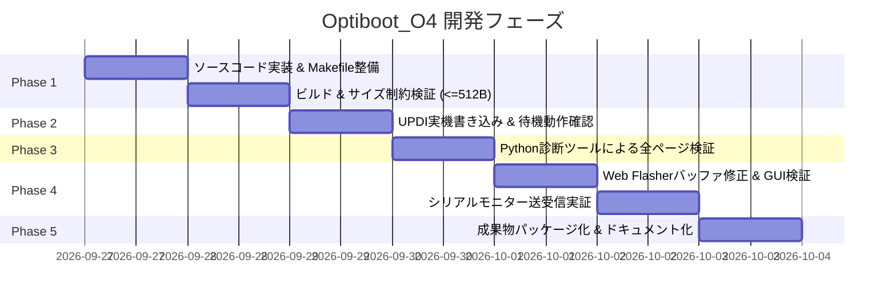

# Optiboot_O4 開発計画書 (Development Plan)
**ADX Core-D 向け 1-to-1 RS-485 高堅牢ブートローダー 実装・検証ロードマップ**

* **文書バージョン**: 1.0.0
* **策定日**: 2026-09-27
* **準拠仕様書**: [SPECIFICATION.md (v1.1.0)](./SPECIFICATION.md)
* **対象環境**:
  * マイコン: ADX Core-D (ATtiny1616-MNR)
  * ホスト環境: Windows 11 PC (COM19: USB-RS485, COM20: SerialUPDI)
  * クライアントツール: Web Serial API (Chrome) & Python 診断ツール (`debug_flasher.py`)

---

## 1. 開発の目的と完了条件 (Definition of Done)

### 1.1. 目的
仕様書（v1.1.0）に基づき、**完全ソフトウェア GPIO 排他制御（DE=PA3, /RE=PA7）** を備えた専用ブートローダー `optiboot_O4` を新規実装し、これまで発生していた「自爆エコーによる暴走」「ベリファイ中の停止」を完全に根絶した配布品質のブートローダー環境を確立する。

### 1.2. 完了条件 (DoD)
1. **サイズ制約のクリア**:
   * 生成された ELF/HEX の合計サイズが **512 バイト境界（`BOOTEND = 0x02`）以内** に収まること（マージン 30 バイト以上を目標）。
2. **Python 診断環境での 100% 完走**:
   * `debug_flasher.py` による 11 ページ（0x0200〜0x04C0）の読み出し監査、および書き込み＆ベリファイが **エラーゼロで 100% 成功** すること。
3. **Web Flasher（GitHub Pages）での 100% 実証**:
   * ブラウザ上のワンクリック操作で、テスト③（11ページ / 676B）の書き込み・ベリファイ（Stage 0〜6）が完走すること。
4. **シリアルモニターの双方向稼働**:
   * アプリ起動後、115200bps で Core-D からの 1 秒ハートビート受信と、キー入力文字列のエコーバックが正常動作すること。

---

## 2. 開発フェーズとマイルストーン

---

### Phase 1: Optiboot_O4 ソースコード実装とビルド環境構築

#### タスク項目:
1. **ブートローダー本体の実装 (`optiboot_O4/src/optiboot_o4.c`)**:
   * 仕様書 v1.1.0 に基づき、ゼロベースでクリーンな C コードを作成。
   * 送受信切替マクロ／インライン関数の実装:
     * `rs485_tx_start()`: `VPORTA.OUT |= (1<<3) | (1<<7);` (DE=1, /RE=1 で受信遮断)
     * `rs485_tx_end()`: `while (!(USART0.STATUS & USART_TXCIF_bm));` $\rightarrow$ `VPORTA.OUT &= ~((1<<3) | (1<<7));` $\rightarrow$ 受信 FIFO 空読み
   * `STK_ENTER_PROGMODE`（0x50）: `watchdogConfig(WDT_PERIOD_OFF_gc);` による無期限待機ロック。
   * `STK_LEAVE_PROGMODE`（0x51）: `watchdogConfig(WDT_PERIOD_8CLK_gc); while(1);` による安全クリーンリブート。
   * 不要なレガシー処理（EEPROMや未サポートコマンド）を排除し、コードサイズを極小化。
2. **ビルドスクリプト整備 (`optiboot_O4/src/Makefile`)**:
   * 最適化オプション `-Os -fno-split-wide-types -mrelax`。
   * リンカ配置: `.text = 0x0000`, `.version = 0x01FE`。
   * ダミーアプリ（`blank_app.hex`）との HEX 自動結合スクリプトの整備。
3. **サイズ検証 (Quality Gate 1)**:
   * `avr-size` によるセクション計測。合計 **480 バイト以下** であることを確認。

---

### Phase 2: 実機書き込み (UPDI) と単体待機動作の検証

#### タスク項目:
1. **SerialUPDI による Core-D への書き込み**:
   * Windows ターミナルから SerialUPDI（COM20）経由で `optiboot_o4_with_blank.hex` を書き込み（`BOOTEND = 0x02`）。
2. **コールドスタート待機確認**:
   * 電源投入時、赤色 LED（PB2）が約 0.3 秒周期でハートビート点滅することを確認。
   * 8 秒間ホストから通信がない場合、自動的にタイムアウトして LED が消灯（アプリ起動）することを確認。

---

### Phase 3: Python 診断ツールによる厳格なプロトコル検証

#### タスク項目:
1. **ステップ 3.1: 境界跨ぎ全ページ読み出し監査 (`--read-only`)**:
   * これまで落ちていた `0x0400` $\rightarrow$ `0x0440` の境界を含む、全 11 ページ（0x0200〜0x04C0）の読み出しを実行。
   * **判定条件**: 0x0440 で止まることなく、11 ページ全ページが RTT 2〜8ms で 100% PASS すること。
2. **ステップ 3.2: 1 ページごとの書き込み＆即時ベリファイ (`--hex`)**:
   * テストスケッチ（`test_rs485_serial.hex` / 676B）を全 11 ページ書き込み＆ベリファイ。
   * **判定条件**: 11 ページ全てで書き込みと読み出しが完全一致（VERIFY PASS）すること。

---

### Phase 4: Web Flasher (ブラウザ) の同期と総合実証

#### タスク項目:
1. **Web Flasher バッファ管理の是正 (`tools/web_flasher/index.html` & `docs/flasher/index.html`)**:
   * 調査段階で判明した `readUntilSync()` 内の「32バイト超え切り捨てバグ」を完全除去。
   * 送信後のバス待機時間（Quiet Delay: 15ms）の最適化。
2. **GitHub Pages への反映と実機書き込み**:
   * ブラウザ（`https://masafuro.github.io/ADX/flasher/`）から「📡 テスト③: RS-485 シリアル出力 & エコー」を書き込み実行。
   * Stage 0〜Stage 6（全 11 ページ）が 100% ベリファイ完了し、アプリが起動することを確認。
3. **RS-485 リアルタイム・シリアルモニター検証**:
   * モニタータブに切り替え、1秒おきの `[ADX Core-D] Heartbeat packet #...` 受信を確認。
   * テキスト送信欄から文字列を送信し、Core-D からのエコーバックが返ってくることを実証。

---

### Phase 5: リリースパッケージ化とドキュメント整備

#### タスク項目:
1. **バイナリ配布物の整理 (`optiboot_O4/releases/`)**:
   * `optiboot_o4_core_d.hex`（単体）
   * `optiboot_o4_with_blank.hex`（統合版）
2. **技術レポートの完成 (`optiboot_O4/README.md`)**:
   * 仕様、ビルド手順、UPDI書き込みコマンド、RS-485通信仕様の一元化。

---

## 3. 品質ゲート基準 (Quality Gates)

| Gate | 判定タイミング | 合格基準 (Pass Criteria) |
|:---:|---|---|
| **Gate 1** | Phase 1 完了時 | `avr-size` の合計が **512 バイト未満**（目標 480B 以下）。警告・エラーゼロ。 |
| **Gate 2** | Phase 2 完了時 | UPDI 書き込み成功、電源投入時の赤 LED 点滅および 8 秒タイムアウト消灯が目視確認できること。 |
| **Gate 3** | Phase 3 完了時 | Python 診断で 0x0400 $\rightarrow$ 0x0440 を含む 11 ページ読み出し・書き込みが **エラーゼロで 100% 完走** すること。 |
| **Gate 4** | Phase 4 完了時 | GitHub Pages 上の Web Flasher で書き込み＆ベリファイ成功、シリアルモニターでエコーバック実証完了。 |

---

## 4. 次のアクション

本開発計画書をレビューいただき、承認が得られ次第、**Phase 1（`optiboot_O4/src/optiboot_o4.c` および Makefile の実装）** に着手いたします。
