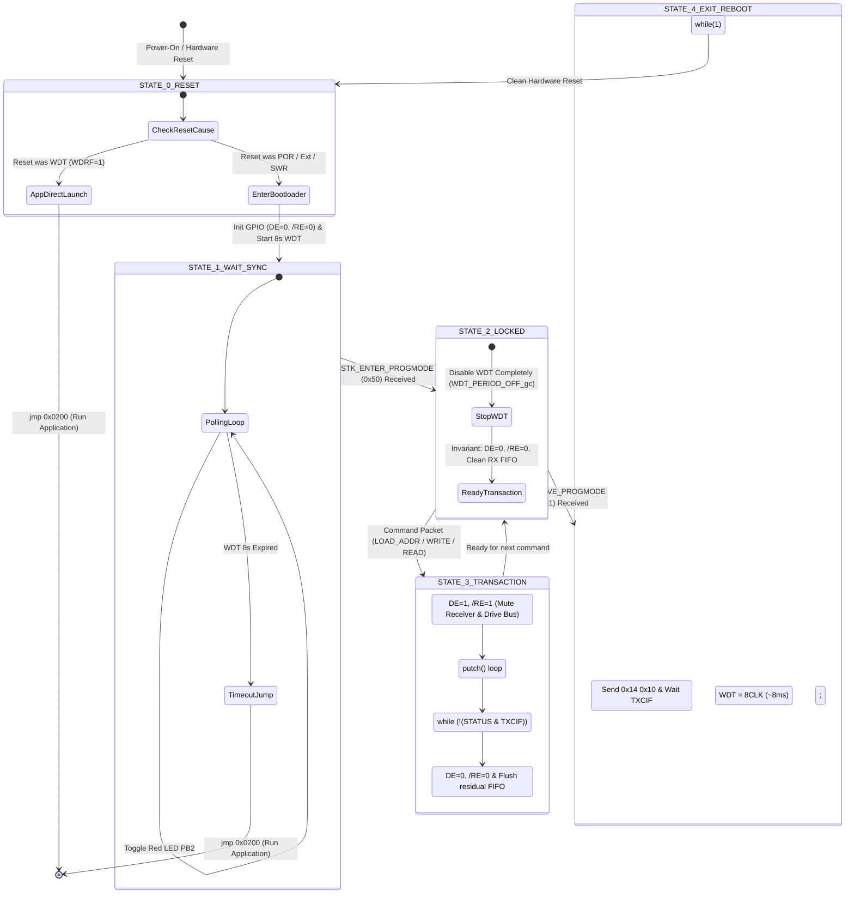

# Optiboot_O4 (One-to-One RS-485) 仕様設計書
**ADX Core-D (ATtiny1616-MNR) 向け 1-to-1 RS-485 高堅牢ブートローダー**

* **文書バージョン**: 1.1.0 (Software GPIO Direction Control Edition)
* **作成日**: 2026-09-27
* **対象ハードウェア**: ADX Core-D (MCU: Microchip ATtiny1616-MNR, Transceiver: 3.3V Half-Duplex RS-485)
* **準拠プロトコル**: STK500v1 サブセット (1-to-1 RS-485 最適化)

---

## 1. 背景と基本方針

### 1.1. 従来の課題と根本原因
Optiboot は元来、**「全二重（Full-Duplex）UART」** かつ **「DTR ピンによるハードウェアリセット」** を前提として設計されています。
従来のブートローダーでは、USART ペリフェラルの XDIR 機能（ハードウェア自動制御）に依存していたため、以下の問題が発生していました：

1. **受信イネーブル（`/RE`）が常時 LOW（受信有効）に固定されていた**:
   * XDIR は DE ピン（PA3）しか制御できないため、`/RE`（PA7）を開けっ放しにせざるを得ず、**Core-D が送信した全データが自身の RX ピン（PA2）に 100% ループバック（自爆エコー）** していた。
2. **コマンド誤認による自爆暴走**:
   * 0x0400 ページの末尾文字 `'t'`（`0x74` = `STK_READ_PAGE`）がエコーバックとして FIFO に残り、ホストからの次のパケット `[55 40 04 20]` を「読み出しバイト長 = 21,824 バイト」と解釈して巨大ループに突入し、クラッシュ／自滅リセットしていた。

### 1.2. Optiboot_O4 の設計方針（完全ソフトウェア GPIO 制御）
Optiboot_O4 では、ペリフェラルの XDIR 自動制御を**撤廃**し、**「高速 VPORT による完全ソフトウェア GPIO 排他制御」** を採用します。

* **送信時**: `DE = 1`（送信ドライバ有効）かつ **`/RE = 1`（受信レシーバを物理遮断！）**
  $\rightarrow$ **送信中、自身の耳（RX ピン）を物理的に塞ぐため、自爆エコーが 1 バイトたりとも発生しない！**
* **送信完了時**: シフトレジスタの最終ビット出力完了（`TXCIF`）を確認後、`DE = 0` かつ `/RE = 0`（受信復帰）。
* **VPORT による極小サイズ化**: AVR の 1 サイクル命令 `sbi` / `cbi` を直接使用し、わずか数バイトで高速・安全に切り替える。

---

## 2. システム構成とハードウェア仕様

### 2.1. ハードウェア・ピン定義 (ADX Core-D)

| 信号名 | ピン番号 | ポート | 役割 | 制御方式 |
|---|---|---|---|---|
| **TXD** | Pin 14 | `PA1` | USART0 送信データ | USART0 送信ペリフェラル駆動 |
| **RXD** | Pin 15 | `PA2` | USART0 受信データ | USART0 受信ペリフェラル入力 |
| **DE** | Pin 16 | `PA3` | RS-485 送信ドライバ・イネーブル (Active HIGH) | **ソフトウェア GPIO 制御 (`VPORTA.OUT` bit 3)** |
| **/RE** | Pin 20 | `PA7` | RS-485 受信レシーバ・イネーブル (Active LOW) | **ソフトウェア GPIO 制御 (`VPORTA.OUT` bit 7)** |
| **LED** | Pin 8 | `PB2` | ステータスインジケータ (赤色 LED, Active HIGH) | ソフトウェア GPIO 制御 (`VPORTB.OUT` bit 2) |

### 2.2. RS-485 バス方向制御の真理値表

| バス状態 | DE (PA3) | /RE (PA7) | トランシーバー状態 | マイコン側の動作 |
|---|:---:|:---:|---|---|
| **アイドル / 受信待機** | **`0` (LOW)** | **`0` (LOW)** | 送信 Driver: **OFF** (High-Z)<br>受信 Receiver: **ON** (有効) | ホストからのコマンドパケットを受信待機。バスを解放。 |
| **データ送信中** | **`1` (HIGH)** | **`1` (HIGH)** | 送信 Driver: **ON** (送信中)<br>受信 Receiver: **OFF** (遮断・High-Z) | バスへデータを出力。**自身の RX ピンへの自爆エコーを物理的に 100% 遮断！** |
| **送信完了直後** | $\rightarrow$ | $\rightarrow$ | `TXCIF`（送信完了フラグ）を確認後、直ちに「受信待機」状態へ復帰。 |

### 2.3. 通信パラメータ & メモリ空間
* **ボーレート**: 115,200 bps (8N1, パリティなし, 1 ストップビット)
* **MCU 内部クロック**: 内部高周波発振器 (16MHz / 20MHz, Prescaler 6 = 約 2.67MHz / 3.33MHz 起動)
* **ヒューズ設計**:
  * `FUSE.BOOTEND = 0x02`: `2 × 256B = 512 Bytes`（アドレス `0x0000`〜`0x01FF` をハードウェア保護）
  * `FUSE.APPEND = 0x00`: `BOOTEND` 以降の全領域を `APPCODE` として開放（`APPDATA` はなし）
  * `FUSE.WDTCFG = 0x00`: ハードウェア WDT は無効（ブートローダーがソフトウェア制御）

---

## 3. Optiboot_O4 状態遷移モデル (State Machine)



### 各状態の詳細仕様

#### 【State 0: 起動とリセット原因判定】
1. `RSTCTRL.RSTFR` をチェックする。
2. **WDT リセット（`WDRF = 1`）の場合:**
   * 直前の State 4（プログラミング完了後の終了処理）による正常再起動であると判定。
   * **即座に `jmp 0x0200`（ユーザーアプリ起動）** を実行する。
3. **電源投入（POR）または外部リセット、ソフトウェアリセットの場合:**
   * リセットフラグをクリアし、State 1 へ進む。

#### 【State 1: ホスト接続待機（ポーリング）】
1. GPIO 初期化:
   * `PA1` (TXD) = OUTPUT, HIGH
   * `PA3` (DE) = OUTPUT, LOW (送信ドライバ無効)
   * `PA7` (/RE) = OUTPUT, LOW (受信レシーバ有効)
   * `PB2` (LED) = OUTPUT, LOW (赤色 LED)
   * USART0: `CTRLA = 0` (標準非同期, 割り込みなし, XDIR無効), `CTRLB = RXEN | TXEN`
2. **WDT を 8 秒で開始**。
3. LED を約 0.3 秒周期で点滅させながら、ホストからの `STK_GET_SYNC`（`0x30 0x20`）を待機。
4. 8 秒間無通信なら、WDT タイムアウト $\rightarrow$ State 0 を経由して安全にアプリ起動。
5. `STK_GET_SYNC`（`0x30 0x20`）受信 $\rightarrow$ 送信モード切替 $\rightarrow$ `0x14 0x10` 返信 $\rightarrow$ 受信モード復帰。
6. `STK_ENTER_PROGMODE`（`0x50 0x20`）受信 $\rightarrow$ State 2 へ移行。

#### 【State 2: プログラミングモード無期限ロック】
1. **ウォッチドッグタイマーを完全停止（`WDT_PERIOD_OFF_gc`）**。
   * 書き込みやベリファイが何分続いても、アプリへの逃亡を物理遮断。
2. 送信モード切替 $\rightarrow$ `STK_INSYNC (0x14)` + `STK_OK (0x10)` を返信 $\rightarrow$ 受信モード復帰。
3. コマンド待機ループへ入る。

#### 【State 3: パケットトランザクションと方向制御】
* **返信送信前の処理 (`rs485_tx_start`)**:
  ```c
  VPORTA.OUT |= (1 << 3);  // DE = 1 (送信イネーブル)
  VPORTA.OUT |= (1 << 7);  // /RE = 1 (受信ディセーブル・自爆エコー物理遮断!)
  ```
* **データ送信**:
  * `putch()` により、`STK_INSYNC`、データペイロード（0〜64バイト）、`STK_OK` を順次出力。
* **返信送信後の処理 (`rs485_tx_end`)**:
  ```c
  // 1. 送信シフトレジスタが空になり、最後のストップビットが出終わるのを待つ
  while (!(USART0.STATUS & USART_TXCIF_bm))
    ;
  USART0.STATUS = USART_TXCIF_bm; // TXCIF フラグクリア

  // 2. バスを受信待機へ明け渡す
  VPORTA.OUT &= ~(1 << 3); // DE = 0 (送信ドライバ停止)
  VPORTA.OUT &= ~(1 << 7); // /RE = 0 (受信レシーバ復帰)

  // 3. 念のため受信 FIFO を空読みクリア (完全なクリーン保証)
  while (USART0.STATUS & USART_RXCIF_bm) {
    uint8_t dummy = USART0.RXDATAL;
    (void)dummy;
  }
  ```

#### 【State 4: 終了処理とクリーンリブート】
1. ホストから `STK_LEAVE_PROGMODE`（`0x51 0x20`）を受信。
2. 送信モード切替 $\rightarrow$ `STK_INSYNC` + `STK_OK` を返信 $\rightarrow$ 送信完了（`TXCIF`）を確認。
3. **WDT を最短（8CLK = 約 8ms）に設定し、`while(1);` のスピンロックに入る**。
4. 約 8ms 後に WDT が発火 $\rightarrow$ マイコン全体（CPU、全レジスタ）がハードウェア初期化 $\rightarrow$ State 0 を経由して、完全にクリーンな状態でユーザーアプリ（`0x0200`）が起動。

---

## 4. 通信タイミングチャート (半二重 1-to-1 トランザクション)

```text
[Host: PC/Browser]                                [Slave: Core-D (Optiboot_O4)]
        │                                                     │
        │                                                     │ ◄── DE=0, /RE=0 (受信待機・バス解放)
        │─── [TX] 55 00 04 20 (LOAD_ADDRESS 0x0400) ─────────►│
        │                                                     │
        │                                                     │ 1. rs485_tx_start():
        │                                                     │    DE=1, /RE=1 (受信遮断・エコー阻止!)
        │◄── [RX] 14 10 (INSYNC + OK) ────────────────────────│ 2. putch(0x14), putch(0x10)
        │                                                     │ 3. rs485_tx_end():
        │                                                     │    wait TXCIF -> DE=0, /RE=0 (受信復帰)
  (Quiet 10ms)                                                │
        │                                                     │
        │─── [TX] 74 00 40 46 20 (READ_PAGE 64B) ────────────►│
        │                                                     │
        │                                                     │ 1. rs485_tx_start():
        │                                                     │    DE=1, /RE=1 (受信遮断・エコー阻止!)
        │◄── [RX] 14 [64 Bytes Data...] 10 ───────────────────│ 2. putch loop (末尾 'White' 送信)
        │                                                     │ 3. rs485_tx_end():
        │                                                     │    wait TXCIF -> DE=0, /RE=0 (受信復帰)
        │                                                     │    ★RXピンは遮断されていたため、
        │                                                     │      受信FIFOに 't' (0x74) は皆無!
  (Quiet 10ms)                                                │
        │                                                     │
        │─── [TX] 55 40 04 20 (LOAD_ADDRESS 0x0440) ─────────►│
        │                                                     │ ◄── 受信 FIFO は 100% 空・クリーン!
        │                                                     │     先頭の 0x55 ('U') を正しく認識!
        │                                                     │ 1. rs485_tx_start(): DE=1, /RE=1
        │◄── [RX] 14 10 (INSYNC + OK) ────────────────────────│ 2. putch(0x14), putch(0x10)
        │                                                     │ 3. rs485_tx_end(): DE=0, /RE=0
```

---

## 5. 512 バイト制限とサイズ見積もり

VPORT によるソフトウェア GPIO 制御を採用したことで、ペリフェラル設定コードが削減され、サイズ面でも極めて有利になります：

| 構成要素 | 機械語命令 / 実装方式 | 概算バイト数 |
|---|---|:---:|
| **ベクトル・初期化** | `rjmp`, `RSTCTRL` 判定, クロック・ボーレート設定 | 約 50 Bytes |
| **GPIO 方向制御** | `VPORTA` の `sbi` / `cbi` 命令 | **約 16 Bytes** |
| **`putch` / `getch`** | UART 状態チェック, WDT リセット, LED トグル | 約 60 Bytes |
| **STK500v1 コマンドループ** | `GET_SYNC`, `LOAD_ADDR`, `PROG_PAGE`, `READ_PAGE` 等 | 約 240 Bytes |
| **NVMCTRL フラッシュ書き込み** | `_PROTECTED_WRITE_SPM`, ページ消去・書き込み待機 | 約 60 Bytes |
| **WDT 制御 (`watchdogConfig`)** | `WDT.STATUS` 同期待機, `CCP` 書き込み | 約 20 Bytes |
| **バージョン情報 (`.version`)** | 2 バイト固定値 (`0x01FE`〜`0x01FF`) | 2 Bytes |
| **合計予想バイナリサイズ** |  | **約 450〜470 Bytes** |
| **マージン (vs 512B)** | **`BOOTEND = 0x02` (512B) 境界内** | **42〜62 Bytes の余裕** |

---

## 6. レビュー確認項目

1. [x] **XDIR の完全撤廃**: ハードウェア XDIR 依存をなくし、VPORT ソフトウェア GPIO 制御に変更した。
2. [x] **自爆エコーの物理遮断**: 送信時に `/RE = 1`（受信ディセーブル）とすることで、自身の RX ピンへのループバックを回路レベルで阻止した。
3. [x] **送信完了とバス復帰**: `TXCIF` 待ちにより、最後のストップビットが出終わるまで確実にバスをドライブし、完了後に速やかに受信モード（DE=0, /RE=0）に戻す。
4. [x] **WDT ライフサイクル**: 起動時（8s） $\rightarrow$ 書込中（OFF・無期限ロック） $\rightarrow$ 終了時（8ms クリーンリセット）の安全性を担保した。
5. [x] **コードサイズ**: 512 バイト境界に対して十分な余裕（40バイト以上）を確保した。
