# Optiboot_O4 (One-to-One RS-485) 仕様設計書
**ADX Core-D (ATtiny1616-MNR) 向け 1-to-1 RS-485 高堅牢ブートローダー**

* **文書バージョン**: 1.0.0 (Draft for Review)
* **作成日**: 2026-09-27
* **対象ハードウェア**: ADX Core-D (MCU: Microchip ATtiny1616-MNR, Transceiver: 3.3V Half-Duplex RS-485)
* **準拠プロトコル**: STK500v1 サブセット (1-to-1 RS-485 最適化)

---

## 1. 背景と課題認識

### 1.1. 従来の Optiboot / Optiboot_x が抱える構造的限界
Optiboot は元来、**「全二重（Full-Duplex）UART」** かつ **「DTR ピンによるハードウェアリセット」** を前提として設計されています。
これまでの改修では、標準の Optiboot_x に部分的なパッチ（WDT停止やディレイ挿入など）を施してきましたが、以下の **半二重 RS-485 特有の物理的・論理的破壊要因** をシステムとして排除できていませんでした：

```text
[従来の破綻メカニズム]
Core-D がデータ送信 (例: 0x0400 ページの読み出し)
  │
  ├─► [RS-485 バス] ──► ホスト (PC/ブラウザ) へ 66 バイト送信
  │
  └─► [自爆エコー]  ──► Core-D 自身の RX ピン (PA2) に 66 バイトがそのままループバック
                        │
                        ▼
Core-D の 2バイト受信 FIFO が即座にオーバーフロー (BUFOVF)
送信末尾付近にあった文字 't' (0x74) が受信 FIFO に残存
                        │
                        ▼
Core-D はホストのコマンド待機に戻るが、FIFO に残っていた 't' (0x74) を
ホストからの「STK_READ_PAGE (0x74)」コマンドとして誤認！
                        │
                        ▼
ホストが送った次のパケット [55 40 04 20] (STK_LOAD_ADDRESS) の 0x5540 を
「読み出しバイト長 = 21,824 バイト」と解釈して巨大暴走ループに突入 ──► クラッシュ/自滅リセット
```

### 1.2. Optiboot_O4 の設計目標
Optiboot_O4（One-to-One RS-485）は、上記のパッチワークを廃止し、**「半二重 1-to-1 RS-485 環境において 100% 破綻しない不変条件（Invariants）」** を備えた専用ブートローダーとして再定義します：

1. **自爆エコーの完全無害化**: Core-D がバスに送信したデータが自身の受信バッファを汚染することを 100% 防ぐ。
2. **状態遷移の厳密化**: 電源投入ポーリング $\rightarrow$ プログラミングモード無期限ロック $\rightarrow$ トランザクション $\rightarrow$ クリーンなリセット起動 の完全制御。
3. **512 バイト（`BOOTEND = 0x02`）境界の死守**: 高度な堅牢性を維持しながら、512 バイト制限内に収める。

---

## 2. システム構成とハードウェア仕様

### 2.1. ハードウェア・ピン定義 (ADX Core-D)

| 信号名 | ピン番号 | ポート | 役割 | ハードウェア制御 |
|---|---|---|---|---|
| **TXD** | Pin 14 | `PA1` | USART0 送信データ | USART0 内部ペリフェラル駆動 |
| **RXD** | Pin 15 | `PA2` | USART0 受信データ | USART0 内部ペリフェラル入力 |
| **XDIR (DE)** | Pin 16 | `PA3` | RS-485 送信イネーブル | **USART0 CTRLA.RS485 = 1 による完全ハードウェア自動制御** (送信中 HIGH / 完了後 LOW) |
| **/RE** | Pin 20 | `PA7` | RS-485 受信イネーブル (Active LOW) | 常時 LOW 固定（受信有効）または PA7 制御 |
| **LED** | Pin 8 | `PB2` | ステータスインジケータ (赤色 LED) | ポート出力 (ブートローダー起動時ハートビート点滅) |

### 2.2. 通信パラメータ
* **ボーレート**: 115,200 bps
* **データ形式**: 8 ビットデータ, パリティなし, 1 ストップビット (8N1)
* **MCU 内部クロック**:
  * 起動時: 内部高周波発振器 (16MHz または 20MHz), 分周比 6 (F_CPU = 約 2.67MHz / 3.33MHz)
  * ボーレートレジスタ (`USART0.BAUD`): fractional 演算により誤差 0.5% 未満を達成

### 2.3. メモリ空間とヒューズ設定

```text
+-------------------------------------------+ 0x0000
| BOOT Section (512 Bytes)                  |
| - Optiboot_O4 ファームウェア本体          |
| - ハードウェア書き込み保護 (BOOTEND = 2)   |
+-------------------------------------------+ 0x01FE
| Version Word (2 Bytes)                    |
+-------------------------------------------+ 0x0200
| APPCODE Section (15.5 KB)                 |
| - ユーザーアプリケーション領域             |
| - ページサイズ: 64 Bytes                  |
| - 書き込み/消去: NVMCTRL Page Erase/Write |
+-------------------------------------------+ 0x3FFF
```

* **`FUSE.BOOTEND = 0x02`**: `2 × 256B = 512 Bytes`。アドレス `0x0000`〜`0x01FF` はハードウェア的に保護され、誤作動による自己破壊を防止。
* **`FUSE.APPEND = 0x00`**: `BOOTEND` 以降の全領域を `APPCODE` として開放（`APPDATA` 領域は設けない）。
* **`FUSE.WDTCFG = 0x00`**: ヒューズによるハードウェア WDT は無効化（ブートローダーがソフトウェア制御）。

---

## 3. Optiboot_O4 状態遷移モデル (State Machine)

Optiboot_O4 は、厳格に定義された以下の 5 つの状態（States）を遷移します。

```mermaid
stateDiagram-v2
    [*] --> STATE_0_RESET : Power-On / Hardware Reset

    state STATE_0_RESET {
        [*] --> CheckResetCause
        CheckResetCause --> AppDirectLaunch : Reset was WDT (WDRF=1)
        CheckResetCause --> EnterBootloader : Reset was POR / Ext / SWR
    }

    AppDirectLaunch --> [*] : jmp 0x0200 (Run Application)

    EnterBootloader --> STATE_1_WAIT_SYNC : Init UART & Start 8s WDT

    state STATE_1_WAIT_SYNC {
        [*] --> PollingLoop
        PollingLoop --> PollingLoop : Toggle Red LED PB2
        PollingLoop --> TimeoutJump : WDT 8s Expired
    }

    TimeoutJump --> [*] : jmp 0x0200 (Run Application)

    STATE_1_WAIT_SYNC --> STATE_2_LOCKED : STK_ENTER_PROGMODE (0x50) Received
    
    state STATE_2_LOCKED {
        [*] --> StopWDT : Disable WDT Completely
        StopWDT --> ReadyTransaction : Invariant Clean Buffer
    }

    STATE_2_LOCKED --> STATE_3_TRANSACTION : STK_LOAD_ADDRESS / STK_PROG_PAGE / STK_READ_PAGE

    state STATE_3_TRANSACTION {
        ExecuteCommand --> FlushAndClean : Wait TXCIF & Flush RX FIFO
        FlushAndClean --> ReadyNextCommand : Buffer 100% Clean
    }

    STATE_3_TRANSACTION --> STATE_2_LOCKED : Ready for next command

    STATE_2_LOCKED --> STATE_4_EXIT_REBOOT : STK_LEAVE_PROGMODE (0x51) Received

    state STATE_4_EXIT_REBOOT {
        SendOK --> Arm8msWDT : WDT = 8CLK (~8ms)
        Arm8msWDT --> SpinLock : while(1);
    }

    SpinLock --> STATE_0_RESET : Clean Hardware Reset
```



### 各状態の詳細定義

#### 【State 0: 起動とリセット原因判定】
1. `RSTCTRL.RSTFR` をチェックする。
2. **もし WDT リセット（`WDRF = 1`）だった場合:**
   * 直前の State 4（プログラミング完了後の終了処理）によって引き起こされた意図的な再起動であると判定。
   * ブートローダーの待機処理は一切行わず、**即座に `jmp 0x0200`（ユーザーアプリ起動）** を実行する。
3. **もし 電源投入（POR）または外部リセット、ソフトウェアリセットだった場合:**
   * リセットフラグをクリアし、State 1 へ進む。

#### 【State 1: ホスト接続待機（ポーリング）】
1. USART0 を RS-485 モード（XDIR=PA3 自動制御）で初期化。赤色 LED（PB2）を出力に設定。
2. **ウォッチドッグタイマー（WDT）を 8 秒で開始**。
3. LED を約 0.3 秒周期で点滅させながら、ホストからの `STK_GET_SYNC`（`0x30 0x20`）を待機。
4. 8 秒以内にホストから何も来なければ、WDT により自滅リセット $\rightarrow$ State 0 を経由して安全にユーザーアプリを起動。
5. ホストから `STK_GET_SYNC`（`0x30 0x20`）を受信したら、`STK_INSYNC`（`0x14`）+ `STK_OK`（`0x10`）を返信。
6. ホストから `STK_ENTER_PROGMODE`（`0x50 0x20`）を受信したら、State 2 へ移行。

#### 【State 2: プログラミングモード無期限ロック】
1. **ウォッチドッグタイマーを完全に停止（`WDT_PERIOD_OFF_gc`）**。
   * これにより、書き込み（Stage 4）やベリファイ読み出し（Stage 5）が何秒・何分続いても、Core-D が勝手にタイムアウトしてアプリへ逃亡することを物理的に遮断する。
2. ホストへ `STK_INSYNC`（`0x14`）+ `STK_OK`（`0x10`）を返信。
3. コマンドディスパッチループに入り、ホストからのコマンドを待つ。

#### 【State 3: パケットトランザクションと不変条件保証】
1. `STK_LOAD_ADDRESS`（`0x55`）、`STK_PROG_PAGE`（`0x64`）、`STK_READ_PAGE`（`0x74`）等の各コマンドを処理。
2. **★ 核心となる不変条件（The Golden Invariant）**:
   * Core-D がレスポンス（`STK_OK` や 64 バイトの読み出しデータ）を送信した後、**次のコマンドの受信待ちに入る前に、必ず `rs485_flush_rx()` を実行する**。
   * `rs485_flush_rx()` の動作:
     ```c
     // 1. 送信シフトレジスタが空になり、物理ピンから最後のビットが出力され、
     //    XDIR ピンが LOW に戻るまで待機する
     while (!(USART0.STATUS & USART_TXCIF_bm));
     USART0.STATUS = USART_TXCIF_bm; // TXCIF フラグをクリア

     // 2. 自爆エコーバックによって受信 FIFO に入った残骸データを全て空読みして破棄する
     while (USART0.STATUS & USART_RXCIF_bm) {
       uint8_t dummy = USART0.RXDATAL;
       (void)dummy;
     }
     ```
   * これにより、0x0400 ページの末尾文字 `'t'`（`0x74`）やその他の文字が、次のコマンドとして誤認される可能性を **100% 物理的に根絶** する。

#### 【State 4: 終了処理とクリーンリブート】
1. ホストから `STK_LEAVE_PROGMODE`（`0x51 0x20`）を受信。
2. ホストへ `STK_INSYNC`（`0x14`）+ `STK_OK`（`0x10`）を返信。
3. 送信完了（`TXCIF`）を確認。
4. **WDT を最短周期（8CLK = 約 8ms）に設定し、`while(1);` のスピンロックに入る**。
5. 約 8ms 後に WDT が発火し、**マイコン全体（CPU、全ペリフェラル、全レジスタ）がハードウェア初期化（Clean Reset）される**。
6. State 0 に入り、`WDRF = 1` を検知して、クリーンな状態でユーザーアプリケーション（`0x0200`）がスタートする。

---

## 4. サポートする STK500v1 コマンド一覧

Optiboot_O4 は、1-to-1 RS-485 書き込みに必要なコマンドのみをサポートし、不要なレガシーコマンドを徹底的に削減してコードサイズを最小化します。

| コマンド | HEX | 意味 | Optiboot_O4 の振る舞い |
|---|---|---|---|
| **STK_GET_SYNC** | `0x30` | 同期確認 | `verifySpace()` $\rightarrow$ `STK_INSYNC (0x14)` + `STK_OK (0x10)` を返信。 |
| **STK_GET_PARAMETER** | `0x41` | パラメータ取得 | `0x81`(Major), `0x82`(Minor) のみバージョン返信。他は `0x03`。 |
| **STK_ENTER_PROGMODE** | `0x50` | プログラミング開始 | **WDT 完全停止** $\rightarrow$ `STK_INSYNC` + `STK_OK` を返信。 |
| **STK_LEAVE_PROGMODE** | `0x51` | プログラミング終了 | `STK_INSYNC` + `STK_OK` 返信 $\rightarrow$ **8ms WDT で安全リブート**。 |
| **STK_LOAD_ADDRESS** | `0x55` | ターゲットアドレス設定 | 2バイトのアドレスを受信し保持 $\rightarrow$ `STK_INSYNC` + `STK_OK` を返信。 |
| **STK_PROG_PAGE** | `0x64` | ページ書き込み (64B) | データを Flash バッファに転送し、NVMCTRL Page Erase/Write 実行。 |
| **STK_READ_PAGE** | `0x74` | ページ読み出し (64B) | Flash メモリマップド領域（0x8000+addr）から 64B 送信。 |
| **STK_READ_SIGN** | `0x75` | デバイスシグネチャ取得 | ATtiny1616 の Device ID (`0x1E 0x94 0x21`) を返信。 |
| *(その他)* | - | 非サポートコマンド | `CRC_EOP` まで読み捨てて `STK_INSYNC` + `STK_OK` を返信（Avrdude 互換性維持）。 |

---

## 5. 通信タイミングチャート (半二重 1-to-1 シーケンス)

```text
[Host: PC/Browser]                                [Slave: Core-D (Optiboot_O4)]
        │                                                     │
        │─── [TX] 55 00 04 20 (LOAD_ADDRESS 0x0400) ─────────►│
        │                                                     │ ◄─ RE=LOW, XDIR=LOW (受信中)
        │                                                     │
        │                                                     │ 1. アドレス 0x0400 を保持
        │                                                     │ 2. XDIR=HIGH (送信開始)
        │◄── [RX] 14 10 (INSYNC + OK) ────────────────────────│
        │                                                     │ 3. XDIR=LOW (送信完了 TXCIF)
        │                                                     │ 4. ★自爆エコー (14 10) を RX FIFO からフラッシュ!
        │                                                     │
  (Quiet 10ms)                                                │
        │                                                     │
        │─── [TX] 74 00 40 46 20 (READ_PAGE 64B) ────────────►│
        │                                                     │ ◄─ RE=LOW, XDIR=LOW (受信中)
        │                                                     │
        │                                                     │ 1. 0x8400 から 64 バイト準備
        │                                                     │ 2. XDIR=HIGH (送信開始)
        │◄── [RX] 14 [64 Bytes Data...] 10 ───────────────────│
        │                                                     │ 3. XDIR=LOW (送信完了 TXCIF)
        │                                                     │ 4. ★自爆エコー (66 Bytes) を RX FIFO から完全フラッシュ!
        │                                                     │    (末尾の 't' 0x74 もここで消滅!)
        │                                                     │
  (Quiet 10ms)                                                │
        │                                                     │
        │─── [TX] 55 40 04 20 (LOAD_ADDRESS 0x0440) ─────────►│
        │                                                     │ ◄─ 受信 FIFO は 100% クリーン!
        │                                                     │    先頭の 0x55 ('U') を正しく認識!
        │◄── [RX] 14 10 (INSYNC + OK) ────────────────────────│
        │                                                     │
```

---

## 6. コードサイズ見積もり (512 バイト境界の管理)

Optiboot_O4 では、以下の最適化により **490 バイト以下** に収めることを目標とします：

| セクション | 現行 Optiboot_x | Optiboot_O4 目標 | 最適化内容 |
|---|---|---|---|
| **.text (コード本体)** | 488 Bytes | **470〜484 Bytes** | 不要な EEPROM 処理・レガシー引数の簡略化で約 20B 削減、<br>`rs485_flush_rx()` の追加（約 12B）を吸収。 |
| **.version (バージョン)** | 2 Bytes | **2 Bytes** | アドレス `0x01FE`〜`0x01FF` に配置。 |
| **合計バイナリサイズ** | **490 Bytes** | **472〜486 Bytes** | **512 バイト制限に対して 26〜40 バイトの安全マージンを確保** |

---

## 7. レビューにおける確認項目 (Checklist for Review)

1. [ ] **自爆エコー対策の網羅性**: 送信完了後に `TXCIF` 待ちと `RXCIF` 空読みを行うことで、エコーが完全に消去されるか？
2. [ ] **WDT 制御の安全性**:
   * 起動時: 8 秒タイムアウトでアプリ起動
   * プログラミング中: 完全停止（WDT OFF）で無期限ロック
   * 終了時: 8ms WDT で安全なハードウェアリブート
3. [ ] **回路ピン配置の整合性**:
   * TX=PA1, RX=PA2, DE(XDIR)=PA3, /RE=PA7, LED=PB2 で Core-D 実機回路と完全一致しているか？
4. [ ] **ホストツールとの親和性**:
   * Web Serial Flasher（`docs/flasher/index.html`）および Python 診断ツール（`debug_flasher.py`）から、標準 STK500v1 パケットとしてそのまま通信できるか？
