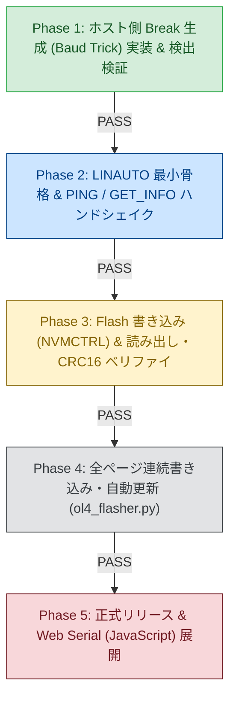

<!--
Copyright (c) 2026 ADX Project Contributors
SPDX-License-Identifier: CC-BY-4.0
-->

# Optiboot_OL4 段階的開発計画書 (Development Plan)

本計画書は、**Optiboot_OL4**（1-to-1 LN-485 高信頼半二重ブートローダー）を確実かつ段階的に構築・実証するためのマイルストーンおよび実施ロードマップを定義します。

---

## 1. 開発マイルストーン一覧

---

## 2. フェーズ別詳細計画

### Phase 1: ホスト側 Break 生成検証 & USB-RS485 ドングル適合性確認
* **目的**:
  * Windows PC（COM19）の USB-RS485 ドングルから、**Baud-Rate Trick（57600bps 0x00 送出）** を用いて確実にハードウェア Break が出力されることを実証する。
* **成果物**:
  * `tools/test_break_generator.py`（Break 送信およびループバック／エコー検証スクリプト）
* **判定基準**:
  * シリアルポートの開閉やボーレート切り替えがエラーなく 5ms 以内に完了すること。
  * オシロスコープまたは受信スレーブ側で 14 Tbit 以上の LOW が観測されること。

### Phase 2: Core-D ブートローダー最小骨格 & 双方向ハンドシェイク
* **目的**:
  * ATtiny1616 側で `USART_RXMODE_LINAUTO_gc` と `WFB=1` を用いた最小限の LIN スレーブエンジンを構築。
  * `CMD_PING`（`0x80`）および `CMD_GET_INFO`（`0xC1`）に対する応答を確認。
* **成果物**:
  * `src/optiboot_ol4.c`
  * `src/Makefile`（`BOOTEND=0x04`、1024 バイト上限）
* **判定基準**:
  * バイナリサイズが 1024 バイト（1KB）以内であること（目標: 600 バイト以下）。
  * ホストからの PING に対して、レスポンススペース（50〜100µs）後に正常なステータスと CRC16 が返信されること。

### Phase 3: Flash ページ書き込み（NVMCTRL）& 読み出し・CRC16 検証
* **目的**:
  * `CMD_SET_ADDR`（`0x42`）、`CMD_WRITE_PAGE`（`0x03`）、`CMD_READ_PAGE`（`0xC4`）を実装。
  * Flash への 64 バイト消去・書き込み（NVMCTRL）と CRC16 一致検証を実証。
* **判定基準**:
  * 1 ページの書き込み・読み出し・CRC16 ベリファイが 100% PASS すること。
  * Flash 書き込み中（約 20ms）に RS-485 バスが安全に解放（DE=0）されていること。

### Phase 4: 全ページ連続書き込み & 専用フラッシャー完成
* **目的**:
  * テストスケッチ（`test_rs485_serial.hex`、11ページ / 676バイト）の全ページ連続書き込み・自動ベリファイを実施。
  * 長大データ送出後もパケット解釈が一切破綻せず、全ページが一括完了することを実証（**Optiboot_O4 で直面した課題の完全克服**）。
* **成果物**:
  * `tools/ol4_flasher.py`（コマンドライン専用フラッシャー）
* **判定基準**:
  * 11 ページすべての書き込みとベリファイが、タイムアウトやリトライなしに一撃で PASS すること。

### Phase 5: リリースパッケージング & ドキュメント整備
* **目的**:
  * 配布用バイナリ（`optiboot_ol4_with_blank.hex`）の生成。
  * 操作マニュアルおよび Web Serial (JavaScript) フラッシャーへの移植ガイド作成。

---

## 3. ガバナンス & 品質ルール

1. **メモリ上限（Gate 1）**:
   * 合計コードサイズは **1024 バイト（`BOOTEND=0x04`）** を厳格に遵守する。
2. **ハードウェア安全性（Gate 2）**:
   * `FUSE.SYSCFG0`（UPDI ピン設定）には一切触れない（マイコン文鎮化の防止）。
3. **ターンアラウンド品質（Gate 3）**:
   * スレーブ応答開始前のレスポンススペース（$50\sim 100\,\mu\text{s}$）を厳守する。
   * 送信終了時は必ず `TXCIF` 完了を待ってから `DE=0, /RE=0` に復帰する。
