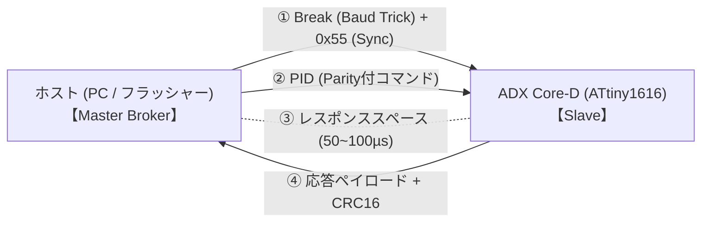

<!--
Copyright (c) 2026 ADX Project Contributors
SPDX-License-Identifier: CC-BY-4.0
-->

# Optiboot_OL4: 1-to-1 LN-485 高信頼半二重ブートローダー

**Optiboot_OL4** (One-to-one LIN-based RS-485 Bootloader) は、**ADX Core-D**（Microchip ATtiny1616-MNR, RS-485: SP485EEN）向けに新設計された、次世代の決定論的高信頼半二重ブートローダーです。

---

## 1. プロジェクトの背景と目的

### 1.1 Optiboot_O4 からの発展的移行
先行開発された `Optiboot_O4`（STK500v1 準拠）では、自爆エコーの完全遮断、512 バイト制限のクリア、Flash ページの書き込み・読み出し・単体ベリファイ（100% 一致）に成功しました。  
しかし、STK500v1 プロトコルは元々「全二重（Full-Duplex）UART」を前提として設計されており、**フレーム同期機構（Preamble/Break）やターンアラウンド（半二重切り替えマージン）の合意がプロトコル層に存在しない**という構造的限界を抱えていました。その結果、わずか 10cm の理想的ベンチ環境においても、66 バイト送出直後の過渡切り替え時にパケット解釈の同期ズレが生じる課題が浮き彫りとなりました。

### 1.2 LN-485（LIN-based RS-485）技術資産の統合
ADX プロジェクトでは、すでに [`firmware/tests/ADX_Core-D/LIN_test/`](../../tests/ADX_Core-D/LIN_test/) において、ATtiny1616 のハードウェア機能（`LINAUTO`、`WFB`）と SP485EEN を組み合わせた **LN-485 通信** を開発し、Phase 1 〜 Phase 4（実機双方向対話 MVP）まで通信トラブル皆無の完全動作を実証しています。

**Optiboot_OL4** は、この実証済みの LN-485 アーキテクチャをブートローダーのネイティブプロトコルとして採用し、**「10cm から長距離配線まで、ノイズや過渡現象に一切動じない決定論的ブートローダー」** を確立します。

---

## 2. コア設計思想と主要スペック



1. **メモリ空間の最適化（1024 バイト上限）**:
   * ヒューズ設定 `BOOTEND = 0x04`（1024 バイト / 1KB）を採用。
   * アプリケーション領域として **15.0 KB（全体の 93.75%）** を確保。
   * 512B 制限の無理なアセンブラ圧縮から解放され、堅牢なステートマシン、LINAUTO ハードウェア同期、CRC-16 をクリーンな C 言語で実装。
2. **Master Broker 方式による完全なバス調停**:
   * ホスト（PC側フラッシャー）が主導権を握り、確定したポーリングサイクルで通信を進行。
   * バス衝突（コリジョン）および半二重のターンアラウンド衝突を原理的に排除。
3. **ハードウェア `LINAUTO` ＋ `WFB` による完全フレーム同期**:
   * アイドル待機中は `WFB=1`（Wait For Break）で待機。
   * バス上の過渡ノイズ、グリッチ、未定義データはハードウェアが完全に無視。
   * 14 Tbit 以上の Break と `0x55`（Sync）を受信した時のみ同期し、ボーレートを自動補正。
4. **Baud-Rate Trick による Break 生成**:
   * ホスト側の標準 USB-RS485 ドングルから、一時的な低速（57600 bps 等）`0x00` 送出により、ハードウェア Break を 100% 確実に送出。
5. **CRC-16-CCITT による完全なデータ完全性検証**:
   * Flash への書き込みデータは CRC-16 で完全保証。化けたパケットでの誤書き込みを防止。
6. **将来のマルチノード（1対N）書き込みへの拡張性**:
   * スケジュール・トピック駆動の設計により、将来同一 RS-485 バス上の複数ノードの個別識別ファームウェア更新へ発展可能。

---

## 3. ディレクトリ構成

```text
optiboot_OL4/
├── README.md                 # 本書
├── SPECIFICATION.md          # プロトコル詳細仕様書（フレーム・PID・シーケンス）
├── DEVELOPMENT_PLAN.md       # 段階的開発計画（Phase 1 〜 Phase 4）
├── src/                      # ブートローダーファームウェア C ソース & Makefile
├── releases/                 # コンパイル済み HEX バイナリ
└── tools/                    # 専用 Python フラッシャー & 診断ツール
```

---

## 4. ハードウェア接続仕様（ADX Core-D）

| 信号名 | ピン番号 | 役割 | 制御仕様 |
| :--- | :--- | :--- | :--- |
| **TXD** | `PA1` | USART0 送信 | 代替ピン設定 (`PORTMUX_USART0_ALTERNATE_gc`) |
| **RXD** | `PA2` | USART0 受信 | 代替ピン設定 (`PORTMUX_USART0_ALTERNATE_gc`) |
| **DE** | `PA3` | RS-485 送信イネーブル | Active HIGH (ソフトウェア GPIO / `VPORTA`) |
| **/RE** | `PA7` | RS-485 受信イネーブル | Active LOW (ソフトウェア GPIO / `VPORTA`) |
| **LED** | `PB2` | オンボード赤色 LED | Active HIGH（待機点滅 / 通信インジケータ） |
