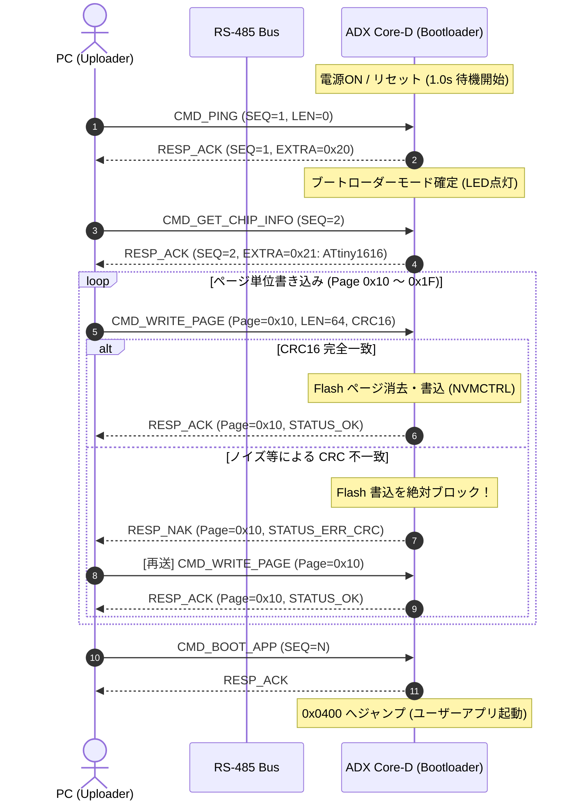

<!--
Copyright (c) 2026 ADX Project Contributors
SPDX-License-Identifier: CC-BY-4.0
-->

# Optiboot_OL4 RS-485 高信頼ブートローダー仕様書 (Specification v2.0)

本ドキュメントは、**ADX Core-D**（Microchip ATtiny1616-MNR）向け 1-to-1 RS-485 高信頼ブートローダー **Optiboot_OL4 (v2.0)** の通信仕様、フレームフォーマット、シーケンス、およびメモリマップを定義します。

---

## 1. 設計思想と基本方針

本ブートローダーは、現場・産業用 RS-485 配線における過酷な電気的ノイズ環境に耐えうる**「完全な決定論的信頼性と文鎮化（Brick）防止」**を最優先に設計されています。

1. **9,600 bps の絶対的物理マージン**:
   - 1 ビット幅 104.2 µs。内蔵オシレータの温度ドリフトや USB シリアルのジッターを完全に許容。
   - 4 KB のファームウェア書き込みは **約 5 秒** で完了。
2. **Flash ページ単位（64 バイト）の CRC-16 検証**:
   - 全ての書き込みパケットに CRC-16 を付与。
   - マイコン側で 1 ビットでも誤りを検知した場合、**Flash 書き込みを物理的にブロックして NAK を返信**。
3. **Stop-and-Wait ARQ（自動再送制御）**:
   - ホスト側は ACK が返るまで自動再送。100% 健全なデータ以外は Flash に 1 バイトたりとも書き込まれない。
4. **ハードウェア自己防衛（BOOTEND 保護）**:
   - ブートローダー自身（0x0000〜0x03FF）への上書き要求は、マイコン側ハードウェア判定で物理的に拒絶。

---

## 2. メモリマップ & ハードウェア設定

### 2.1 メモリマップ (`BOOTEND = 0x04`)

```text
+-----------------------+ 0x0000
|   Optiboot_OL4        | 1024 Bytes (1 KB / 16 ページ)
|   (BOOT セクション)   | FUSE.BOOTEND = 0x04 (書込保護)
+-----------------------+ 0x0400
|                       |
|   ユーザーアプリ      | 15,360 Bytes (15 KB / 240 ページ)
|   (APP セクション)    | ページ番号: 0x10 〜 0xFF
|                       |
+-----------------------+ 0x3FFF
```

* リセット直後は MCU ハードウェアにより `0x0000`（Optiboot_OL4）から起動します。
* 起動後 **1.0 秒間** RS-485 から接続要求（`CMD_PING`）がない場合、直ちに `0x0400`（ユーザーアプリ先頭）へジャンプします。

### 2.2 ハードウェアピンアサイン (Core-D)

| ピン | 機能 | レジスタ設定 | 動作モード |
| :--- | :--- | :--- | :--- |
| **PA1** | USART0 TXD | `PORTMUX.CTRLB = PORTMUX_USART0_ALTERNATE_gc;`<br>`VPORTA.DIR \|= (1 << 1);` | 送信時 Active |
| **PA2** | USART0 RXD | `VPORTA.DIR &= ~(1 << 2);` | 受信待機 |
| **PA4** | RS-485 DE | `VPORTA.DIR \|= (1 << 4);` | Driver Enable (Active HIGH) |
| **PA7** | RS-485 /RE | `VPORTA.DIR \|= (1 << 7);` | Receiver Enable (Active LOW, 送信時1で自爆遮断) |
| **PB2** | 赤色 LED | `VPORTB.DIR \|= (1 << 2);` | 待機時 2Hz 点滅, 通信時点灯 |

### 2.3 トランシーバ切替タイミング（黄金比）
* **送信前**: DE=1, /RE=1 設定後、**1 ms** 待機（トランシーバ立上り安定化）。
* **送信後**: `USART0.STATUS & USART_TXCIF_bm`（最後のストップビット送出完了）を待機し、**1 ms** バス解放ディレイを設けてから DE=0, /RE=0（受信モード復帰）。

---

## 3. 通信プロトコル仕様 (Stop-and-Wait ARQ)

### 3.1 リクエストパケット (Host -> Core-D)

```text
+------+------+------+---------+------+------------------+---------+------+
| STX  | SEQ  | CMD  | PAGE_NO | LEN  | PAYLOAD (0..64B) | CRC-16  | ETX  |
| 0x02 | 1B   | 1B   | 1B      | 1B   | LEN Bytes        | 2B(H/L) | 0x03 |
+------+------+------+---------+------+------------------+---------+------+
```
* **STX**: `0x02`
* **SEQ**: シーケンス番号 (`0x00`〜`0xFF`)
* **CMD**: コマンドコード
* **PAGE_NO**: 対象 Flash ページ番号 (`0x10`〜`0xFF`, 1ページ = 64バイト)
* **LEN**: ペイロード長 (`0` または `64`)
* **PAYLOAD**: 生データバイト列
* **CRC-16**: `STX` から `PAYLOAD` 末尾までの CRC-16-CCITT (Poly: 0x1021, Init: 0xFFFF)
* **ETX**: `0x03`

### 3.2 レスポンスパケット (Core-D -> Host) : 8 バイト固定

```text
+------+------+------+---------+---------+---------+----------+------+
| STX  | SEQ  | RESP | PAGE_NO | STATUS  | EXTRA   | CHECKSUM | ETX  |
| 0x02 | 1B   | 1B   | 1B      | 1B      | 1B      | 1B       | 0x03 |
+------+------+------+---------+---------+---------+----------+------+
```
* **RESP**: `0x06` (`RESP_ACK`) または `0x15` (`RESP_NAK`)
* **STATUS**:
  * `0x00`: `STATUS_OK`
  * `0x01`: `STATUS_ERR_CRC` (CRC不一致、再送要求)
  * `0x02`: `STATUS_ERR_PROTECTED` (0x00〜0x0F のブートローダー領域への書き込み拒絶)
  * `0x03`: `STATUS_ERR_UNKNOWN_CMD`
* **EXTRA**: コマンド固有データ（バージョン、シグネチャ、エラー詳細等）
* **CHECKSUM**: `(STX + SEQ + RESP + PAGE_NO + STATUS + EXTRA) & 0xFF`
* **ETX**: `0x03`

---

## 4. コマンドセット定義

| CMD | コマンド名 | LEN | 説明 | 応答 STATUS / EXTRA |
| :---: | :--- | :---: | :--- | :--- |
| **`0x01`** | `CMD_PING` | 0 | 生存確認 ＆ ブートモード維持 | `ACK`, EXTRA=`OL4_VERSION` (0x20 = v2.0) |
| **`0x02`** | `CMD_GET_CHIP_INFO` | 0 | チップ識別 | `ACK`, EXTRA=`0x21` (ATtiny1616 Sig2) |
| **`0x10`** | `CMD_WRITE_PAGE` | 64 | Flash 1 ページ (64B) 書き込み | CRC正常: `ACK`<br>CRC異常: `NAK` (`STATUS_ERR_CRC`)<br>保護違反: `NAK` (`STATUS_ERR_PROTECTED`) |
| **`0x11`** | `CMD_VERIFY_PAGE` | 0 | 指定ページの CRC16 取得 | `ACK`, PAGE_NOの Flash 内容の CRC16 上位/下位 |
| **`0x20`** | `CMD_BOOT_APP` | 0 | アプリケーション起動ジャンプ | `ACK` 返信後、ユーザーアプリ (`0x0400`) へジャンプ |

---

## 5. シーケンス図 (書き込みフロー)


