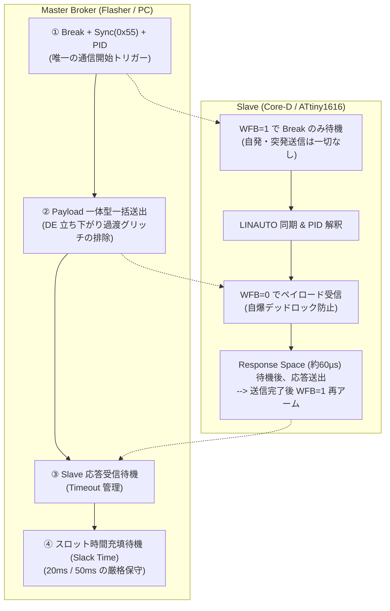

<!--
Copyright (c) 2026 ADX Project Contributors
SPDX-License-Identifier: CC-BY-4.0
-->

# LN-485 Master-Slave 原則に基づく Optiboot_OL4 開発戦略書

**策定日**: 2026-09-27  
**対象**: ADX Core-D (Microchip ATtiny1616-MNR, RS-485: SP485EEN)  
**通信プロトコル**: 1-to-1 LN-485 (LIN-based RS-485, 115200 bps, 8N1)  

---

## 1. 開発戦略の基本理念（The Core Paradigm）

本プロジェクトにおける最も重要な設計戦略は以下の通りです：

> **「通信シーケンスが LN-485 の Master-Slave 原則に厳格に従っていれば、  
> 通信の安定性は、マスター側のポーリングサイクル（Schedule Slot）を広げるだけで  
> 完全にコントロール・保証できる。」**

過去の STK500v1（全二重 UART 前提）のように、「スレーブが反射的に応答し、ホストが任意のタイミングで突発送信する」構造を完全に排除し、**ホスト（Flasher）を「唯一の交通整理役（Master Broker）」、Core-D を「受動的応答者（Slave）」** として厳密に定義・実装します。

これにより、物理層（ケーブル長、ノイズ環境、トランシーバーの過渡特性）のばらつきに対して、マイコン側を小手先で弄る必要がなくなり、**「マスターのスケジュール周期を調整する」という単一のレバーで 100% 決定論的（Deterministic）な安定稼働** を達成します。

---

## 2. 遵守すべき 4 大 LN-485 Master-Slave 原則

### 原則 1: バス支配権（Bus Ownership）の一元管理
* **すべての通信の開始は Master が送出する LIN ヘッダ（Break + 0x55 + PID）によってのみ起動される**。
* スレーブ（Core-D）は、Master から自分宛ての正規ヘッダを受信しない限り、**バス上に 1 ビットたりとも自発的に喋ってはならない（完全沈黙）**。
* リセット直後、エラー発生時、タイムアウト時も、スレーブが勝手にエラー文字列を吐くことは一切禁止する。

### 原則 2: 一体型フレーム送出（Atomic Frame Transmission）
* Master-Publish（`SET_ADDR`, `WRITE_PAGE` 等）において、Master は **「ヘッダ（0x55, PID）」と「ペイロード（Len, Addr, Data, CRC）」を単一の byte 配列として 1 回の `write()` / `flush()` で一括送出** する。
* ヘッダとペイロードの間で分割送信を行わない。これにより、USB-RS485 ドングルの Auto-DE 回路が途中で受信モード（DE=0）へ落ちる過渡グリッチを原理的に排除する。

### 原則 3: スレーブステートの純化（WFB アームタイミングの厳格化）
* スレーブが `USART0.STATUS` の `WFB=1`（Wait For Break）をアームするのは、**「ヘッダ待ち（アイドル待機時）」のみ** とする。
* PID 受信後のペイロード（Len, Addr, Data）受信中は、純粋な UART 受信モード（`WFB=0`）でバイト列を受け取る。
* ペイロード受信中に `ISFIF` 等による `WFB=1` の誤アームを禁止し、データ途中のデッドロック（自爆）を完全に排除する。

### 原則 4: スケジュールスロットとスラックタイム（Slack Time）の保守
* Master は、スレーブの応答を受信完了した直後に次のヘッダを送ってはならない。
* トランザクションの種類ごとに定義された **「フレームスロット時間（$T_{\text{slot}}$）」が経過するまで、Master は次のフレーム開始を必ず待機（Slack Time を保守）** する。
* これにより、スレーブが NVM 書き込み完了、DE=0 解放、および `WFB=1` 再アームを終えて完全に静止する物理的時間を 100% 保証する。

---

## 3. ポーリング周期（フレームスロット）の設計仕様

Master Flasher は、すべての通信を以下の 2 種類のスロットスケジューラ経由で実行します。

| スロット種別 | スロット周期 ($T_{\text{slot}}$) | 対象コマンド | 伝送時間 | スラックタイム (バス静止時間) | 備考 |
| :--- | :---: | :--- | :---: | :---: | :--- |
| **通常スロット** (Control / Read) | **20 ms** (50 Hz) | `PID_PING` `PID_GET_INFO` `PID_SET_ADDR` `PID_READ_PAGE` | 最大 8.5 ms | **約 11.5 ms** | 通常コマンドおよび 64B 読み出し用の高効率・高信頼スロット。 |
| **Flash 書込スロット** (Flash Write) | **50 ms** (20 Hz) | `PID_WRITE_PAGE` | 約 36.7 ms (NVM 書込 25ms 含) | **約 13.3 ms** | ATtiny1616 の Flash 消去・書き込み完了を安全に待つスロット。 |

### ★ スケーラビリティの保証
もし将来、長距離配線や重ノイズ環境で過渡現象が長引いた場合でも、マイコン側のファームウェアを変更する必要はありません。  
**Master（Flasher）側のスロット周期を広げる（例: 20ms $\rightarrow$ 30ms、50ms $\rightarrow$ 70ms）だけで、いかなる遅延・過渡現象も即座に吸収・安定化** できます。

---

## 4. 具体的な実装改修ロードマップ

### ステップ 1: スレーブ側ファームウェア (`optiboot_ol4.c`) の純化
1. **受信関数の分離**:
   * `getch_header()`: `WFB=1` 待機、ISFIF 監視、LED 点滅を行うヘッダ（Break+55+PID）専用受信。
   * `getch_payload()`: ペイロード（Addr/Data）専用の純粋 UART 受信。WFB を触らない。
2. **送信終了処理の確定**:
   * `rs485_tx_end()` で `TXCIF` 待機 $\rightarrow$ `DE=0, /RE=0` $\rightarrow$ `WFB=1` 再アームを厳格化。

### ステップ 2: マスター側ツール (`ol4_flasher.py`) の再構築
1. **`LN485MasterBroker` スケジューラの導入**:
   * `execute_slot(pid, payload, slot_duration)` を新設。
   * Break 送出後、`Sync + PID + Payload` を一括送信（一体型）。
   * トランザクション完了後、`slot_duration`（20ms または 50ms）を満たすまでスラックタイムを自動待機。
2. **接続確立シーケンスの整流**:
   * `poll_power_on` 成功後、スロット時間（20ms〜50ms）を待機してから `get_info` を実行。

### ステップ 3: 実機検証
1. 単体ページ書き込み・ベリファイ（Phase 3-2）の確認。
2. 全 11 ページ一括書き込み・自動ベリファイ（Phase 4）の完全 PASS 確認。
