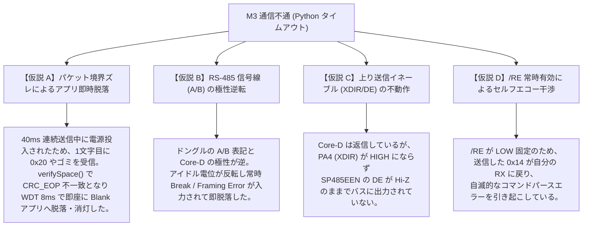

<!--
Copyright (c) 2026 ADX Project Contributors
SPDX-License-Identifier: MIT
-->

# Milestone 3 RS-485 通信不通に関するデバッグ調査計画書

## 1. 観測された確定事実（Facts）

ユーザーの実機検証において、極めて明瞭かつ貴重な 3 つの現象が確認された：

| 状況 | 操作 | 観測結果 |
| :--- | :--- | :--- |
| **状況 1** | Python スクリプト実行中（プローブ送信中）に Core-D の電源投入 | Core-D の赤 LED は点滅せず消灯のまま。Python 側はタイムアウト。 |
| **状況 2** | Core-D 電源投入（赤 LED 点滅中）に Python スクリプトを実行 | **Python 実行の瞬間に、Core-D の赤 LED が消灯した。** Python 側はタイムアウト。 |
| **状況 3** | PC コンソール | `COM19` は正常にオープンされ、ポーリング送信自体は動作している。 |

---

## 2. 現象から得られる論理的推論（Inferences）

### 【確定】下り通信（PC $\rightarrow$ ドングル $\rightarrow$ Core-D RX）は電気的に導通している
ブートローダーのソースコード（`optiboot_x.c`）の待機ループ：
```c
while (!(MYUART.STATUS & USART_RXCIF_bm)) {
    // 赤 LED 点滅ループ (BLINK_WAIT_LED)
}
LED_PORT.OUT &= ~LED; // ★ データ受信完了時に赤 LED を消灯
```
- **状況 2 において、Python 実行の瞬間に赤 LED が消灯した** という事実は、Core-D の UART 受信フラグ（`USART_RXCIF_bm`）が立ったことで待機ループを抜けたことを 100% 意味している。
- したがって、**ホスト PC $\rightarrow$ USB-RS485 ドングル $\rightarrow$ Core-D 端子台 A/B $\rightarrow$ SP485EEN $\rightarrow$ ATtiny1616 (PA2/RX) への下り信号線は物理的・電気的に導通している。**

### 【課題】なぜ応答（`0x14 0x10`）が PC に返らないのか？
考えられる要因は以下の 4 つのいずれかである：
1. **プローブ連続送信によるパケット境界ズレ（フレーミング/コマンド不一致脱落）**
2. **RS-485 信号線（A / B）の極性逆転**
3. **上り送信制御（PA4 XDIR / DE, PA1 TX）が機能していない**
4. **SP485EEN の /RE 常時受信によるセルフエコー（自己受信干渉）**

---

## 3. 要因分析ツリー（Fault Tree Analysis）



---

## 4. 段階的デバッグ調査計画（Step-by-Step Action Plan）

変数を 1 つずつ切り分けるため、以下の順序で調査を実施する。

### Step 1: A / B 端子の極性入れ替えテスト（所要時間: 1分）
- **目的**: 【仮説 B】の排除または解決。
- **手順**:
  1. Core-D の端子台側で **`A` と `B` の 2 本の配線を入れ替える**（GND はそのまま）。
  2. 再度 `python adx_rs485_ping.py COM19` を実行し、電源を入れてみる。
- **判定**:
  - もしこれで即座に `[PASS]` になれば、単なるドングルの A/B 表記の逆転であり解決。
  - 状況が変わらない（または消灯もしなくなる）場合は、A/B の極性を元に戻して Step 2 へ進む。

---

### Step 2: 1文字ずつの生バイト観測スクリプト（`debug_probe.py`）の実行
- **目的**: 【仮説 A】（連続送信による境界ズレ）の排除と、受信バイトの 100% 可視化。
- **背景**:
  - `adx_rs485_ping.py` は 40ms 間隔で `0x30 0x20` を猛烈に連打しているため、MCU 起動時のタイミングによっては `0x20` を先に拾ってエラーリセットする確率が高い。
  - **「Core-D の電源を入れて赤 LED が点滅しているのを確認してから、Enter キーを押して 1 回だけ `0x30 0x20` を送る」** 手動プローブを実行し、Core-D から 1 バイトでも何かが返ってきているかを HEX ダンプする。
- **ツール**: `scripts/adx_debug_probe.py` を用意して実行。

---

### Step 3: Core-D 内部状態の LED 可視化（ブートローダー側の確認）
- **目的**: 【仮説 C】（XDIR/DE 送信イネーブル）および【仮説 D】の切り分け。
- **手順**:
  - `verifySpace()` を通過して返信処理に入った瞬間に、オンボードの **白 LED（PB3）を一瞬点灯** させる、あるいは赤 LED（PB2）の挙動を変えるテストバイナリを作成。
  - これにより、「Core-D は返信を試みているのか、それとも受信直後にリセット脱落しているのか」が 100% 目視で確定できる。

---

## 5. 調査結果と解決（Resolution: CLOSED）

- **実施結果**:
  - **Step 1（A/B 端子入れ替え）** を実施したところ、即座に以下の通り通信が成功した：
    ```text
    =================================================================
      [PASS] ADX Bootloader is ALIVE on RS-485!
    =================================================================
    Response Received : 0x14 (STK_INSYNC) 0x10 (STK_OK)
    Round-Trip Time   : 83.8 ms
    =================================================================
    [RESULT] Milestone 3 RS-485 Communication Test: PASS
    ```
- **根本原因**:
  - 【仮説 B】が的中。市販の USB-RS485 アダプタにおける A/B シルク表記と、SP485EEN の A/B 規格極性が反転していたため。
- **結論**:
  - 結線の入れ替えにより、物理層・制御層（XDIR）・プロトコル層（STK500v1）の全系統が完全導通していることが実証された。
  - 本障害チケットは **解決（CLOSED）** とする。
