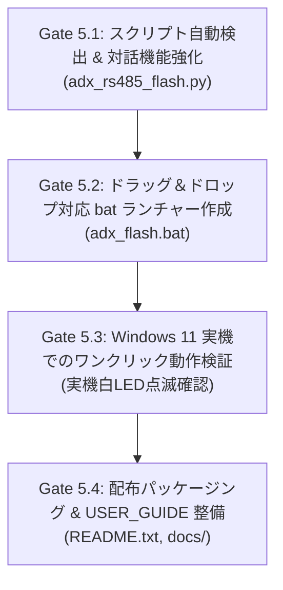

<!--
Copyright (c) 2026 ADX Project Contributors
SPDX-License-Identifier: MIT
-->

# Milestone 5 計画書: Windows 11 向け配布パッケージ化 & ワンクリック自動化

## 1. 概要と目的

### 1.1 背景
Milestone 4（RS-485 経由でのファームウェア書き込み・二重起動実証）の成功により、ハードウェア・ブートローダー・プロトコルの基本技術は 100% 確立されました。
しかし、現場の作業者や外部開発者が日常的に使用するツールとしては、以下の課題が残っています：
1. PowerShell やコマンドプロンプトで長いコマンド（`python adx_rs485_flash.py COM19 ...`）を手打ちする必要がある。
2. 接続されている USB-RS485 アダプタの COM ポート番号をデバイスマネージャー等で事前に調べる必要がある。
3. Python 環境や `pyserial` ライブラリの有無による環境依存トラブルが起きやすい。

### 1.2 目的
Windows 11 ホスト環境において、**「HEX ファイルのドラッグ＆ドロップ」** または **「ダブルクリック（ワンクリック）」** だけで、COM ポート自動検出から安全な書き込み・ベリファイ・アプリ起動までを完結させる、使いやすく堅牢な配布パッケージを完成させます。

---

## 2. 開発スコープ（In Scope / Out of Scope）

明確なスコープを設定し、過剰な複雑化を防ぎます。

### 2.1 スコープ内 (In Scope)
1. **COM ポート自動検出 & 対話的選択機能の実装 (`scripts/adx_rs485_flash.py`)**:
   - 引数なしで実行した場合、接続中のシリアルポートを自動列挙。
   - USB-RS485 ドングル（CH340/CH341, FTDI, CP210x, Prolific 等）を自動判定。
   - 1 つだけ検出された場合は自動選択、複数検出時は番号選択メニューを表示。
2. **Windows 11 向けワンクリック・ランチャー (`adx_flash.bat`)**:
   - `.hex` ファイルをバッチファイルにドラッグ＆ドロップして即時書き込み。
   - 単体ダブルクリック時は、同一フォルダ内の最新 `.hex` ファイルを自動検出して実行。
   - Python のインストール確認、および `pyserial` の未導入時自動インストール案内。
   - 実行後に画面が勝手に閉じず、結果を確認できる `pause` 制御。
3. **配布用リリースキットの整備 (`dist/` または `releases/v1.0.0/`)**:
   - 誰でも ZIP 展開するだけで即座に使える自己完結型パッケージ。
   - ランチャー、スクリプト、ファームウェア、簡単な操作説明書（`README.txt`）。
4. **エンドユーザー向け操作手順書 (`docs/USER_GUIDE.md`)**:
   - 初心者でも迷わない結線図（A/B/GND）、書き込み手順、LED 診断ルール。

### 2.2 スコープ外 (Out of Scope - 将来課題として切り離す項目)
- **PyInstaller による単一 `.exe` 化**:
  - Windows Defender による誤検知（False Positive）リスクや、Python インストーラとのバージョン衝突を避けるため、M5 では「軽量 Python スクリプト＋親切な bat ランチャー」を標準とします（`.exe` 化は将来の要望に応じて検討）。
- **マルチノード（1-to-N）アドレス指定プロトコル**:
  - 本プロジェクトの要件は「1-to-1 接続」であり、マルチドロップ拡張は Phase 2 の別プロジェクト扱いとします。

---

## 3. マイルストーン 5 の検証ステップ (Gate 方式)

| ステップ | 作業内容 | 合格判定基準 (Exit Criteria) |
| :--- | :--- | :--- |
| **Gate 5.1** | `adx_rs485_flash.py` に COM 自動検出 & 対話的選択を実装 | ポート引数なしで実行し、COM19 が自動検出されること |
| **Gate 5.2** | Windows 11 用 `adx_flash.bat` ランチャーを実装 | ドラッグ＆ドロップ引数およびダブルクリック起動の構文テスト合格 |
| **Gate 5.3** | Windows 11 実機でのワンクリック書き込みテスト | **エクスプローラーから hex をドラッグ＆ドロップ $\rightarrow$ Core-D 電源ON $\rightarrow$ 白LED点滅！** |
| **Gate 5.4** | 配布キット (`releases/ADX_CoreD_RS485_Flasher/`) と手順書の完成 | 第三者が手順書を見て 1 人で作業できる状態であること |

---

## 4. 成果物一覧

1. `scripts/adx_rs485_flash.py` (自動検出強化版)
2. `adx_flash.bat` (Windows 向けドラッグ＆ドロップランチャー)
3. `releases/ADX_CoreD_RS485_Flasher/` (配布パッケージ)
   - `adx_flash.bat`
   - `adx_rs485_flash.py`
   - `firmware_blink_test.hex`
   - `README.txt` (現場用クイックメモ)
4. `docs/USER_GUIDE.md` (正式な図解入りユーザーマニュアル)
5. `records/M5_packaging/result.md` (M5 検証結果レポート)
