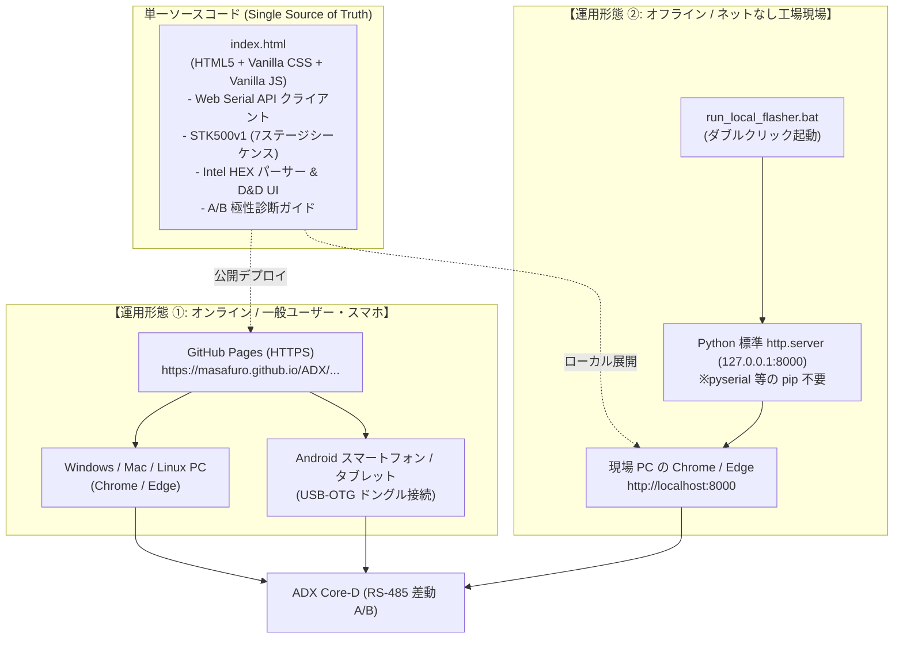
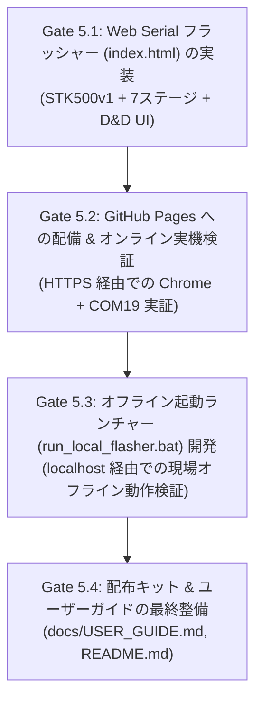

<!--
Copyright (c) 2026 ADX Project Contributors
SPDX-License-Identifier: MIT
-->

# Milestone 5 計画書: Web Serial API による単一 HTML 型ファームウェア配布システムの構築

## 1. 概要と目的

### 1.1 背景と課題
Milestone 4（RS-485 経由でのファームウェア書き込み・二重起動実証）の成功により、Core-D（ATtiny1616）と PC 間の Over-The-Wire（OTW）技術は 100% 確立されました。

しかし、現場の作業員、外部開発者、あるいはエンドユーザーが日常的にファームウェア更新を行う環境を想定すると、従来の CLI（Python / bat）方式には以下の **「現場特有の壁」** が立ちはだかります：
1. **OS ごとの差異と環境依存**:
   - Python のインストール、PATH 設定、`pip install pyserial` などの依存関係でつまずきやすい。
   - 会社支給 PC 等では管理者権限がなく、外部ツールのインストールが禁止されている場合が多い。
2. **現場のオフライン環境**:
   - RS-485 が使われるプラント、工場、FA 設備、屋外機器は、**インターネット接続がない（あるいは PC のネット接続がセキュリティ上禁止されている）** ケースが標準である。
3. **二重管理の無駄**:
   - CLI ツール（Python）と GUI / Web ツールで別々に書き込みロジックを実装・保守すると、仕様変更やバグ修正のたびに二重の検証コストが発生する。

### 1.2 目的と革新的アプローチ
本マイルストーンでは、**Web Serial API を活用した「単一の HTML/JS アプリケーション（`index.html`）」に書き込みロジックを完全集約** します。

本 ADX リポジトリが **公開 GitHub リポジトリ（Public Repository）** である特性を最大限に活かし、**「オンライン（GitHub Pages）」と「完全オフライン（現場 localhost）」の 2 つの運用形態を、たった 1 つの HTML ファイルで両立** させます。

---

## 2. システムアーキテクチャ

すべてのプロトコルロジック（STK500v1、7 ステージシーケンス、Intel HEX パース、UI 制御）を **単一の HTML ファイル（外部ライブラリ依存ゼロ）** に凝縮します。

### 2.1 2 つの運用形態の詳細

| 項目 | ① オンライン形態 (GitHub Pages) | ② オフライン現場形態 (Localhost Web サーバー) |
| :--- | :--- | :--- |
| **主な用途** | 開発室、一般ユーザー、Android スマホでの現場保守 | インターネット接続が禁止・遮断された工場・現場 PC |
| **アクセス方法** | ブラウザで GitHub Pages の URL を開くだけ | `run_local_flasher.bat` をダブルクリック |
| **インストール作業** | **完全ゼロ**（ダウンロードすら不要） | **完全ゼロ**（ZIP を解凍して bat を叩くだけ） |
| **Python 依存** | **完全不要** | **標準モジュールのみ**（`pyserial` 等の pip 不要） |
| **セキュリティ基準** | HTTPS による Secure Context 適合 | `http://localhost` による Secure Context 適合 |
| **対応デバイス** | Windows, Mac, Linux, **Android (USB-OTG)** | Windows PC（現場端末） |

---

## 3. 開発スコープ（In Scope / Out of Scope）

### 3.1 スコープ内 (In Scope)
1. **単一 HTML Web Serial フラッシャー (`index.html`) の開発**:
   - Web Serial API（`navigator.serial`）によるシリアルポートオープン（115,200 bps, 8N1）。
   - M4 で実証した **7 ステージ通信シーケンス（Stage 0〜6）** の完全移植。
   - ブラウザ内での Intel HEX パーサー実装（ドラッグ＆ドロップ対応、およびビルトインのテストバイナリ選択機能）。
   - 高級感のあるモダン UI（レスポンシブ、プログレスバー、送受信 HEX ログコンソール、A/B 結線診断ガイド）。
2. **オフライン現場用ワンクリック・ランチャー (`run_local_flasher.bat`) の作成**:
   - Python 標準の `http.server` を `127.0.0.1:8000` でバックグラウンド起動。
   - デフォルトブラウザ（Chrome / Edge）で自動的に `http://localhost:8000` を開く。
   - ブラウザ終了時またはバッチ終了時にローカルサーバーを自動停止。
3. **GitHub Pages 公開用ディレクトリの整備**:
   - リポジトリの `docs/` 配下に配置し、GitHub Pages から即座に配信できる構成を構築。
4. **マニュアル & 配布キットの整備**:
   - 現場用クイックメモ（`README.txt`）およびオンライン用ユーザーガイド（`docs/USER_GUIDE.md`）。

### 3.2 スコープ外 (Out of Scope)
- **iOS (iPhone/iPad) 対応**:
  - Apple の WebKit セキュリティポリシーにより Web Serial API が禁止されているため対象外（Android のみをスマホ対応とする）。
- **スタンドアロン `.exe` 化 (PyInstaller 等)**:
  - セキュリティソフトによる誤検知リスクがあるため、本 Web Serial アプローチで代替しスコープ外とする。

---

## 4. マイルストーン 5 の検証ステップ (Gate 方式)

| ステップ | 作業内容 | 合格判定基準 (Exit Criteria) |
| :--- | :--- | :--- |
| **Gate 5.1** | `index.html`（HTML/CSS/JS 単一ファイル）を実装 | シンタックスエラーなく UI、HEX パース、Web Serial 制御ロジックが完成すること |
| **Gate 5.2** | GitHub Pages（HTTPS）へ配備し、オンライン実機検証 | **GitHub Pages の URL を Chrome で開いて Core-D へ書き込み成功 $\rightarrow$ 白LED点滅！** |
| **Gate 5.3** | `run_local_flasher.bat` を開発し、オフライン実機検証 | バッチ実行により `http://localhost` でブラウザが開き、オフラインでも書き込み成功すること |
| **Gate 5.4** | 操作マニュアル (`docs/USER_GUIDE.md`) & ドキュメント最終整備 | 第三者が手順書を見て 1 人で作業できる状態であること |

---

## 5. 成果物一覧

1. **`firmware/bootloader/OneToOne_RS485/tools/web_flasher/index.html`** (Web Serial フラッシャー本体)
2. **`firmware/bootloader/OneToOne_RS485/tools/web_flasher/run_local_flasher.bat`** (オフライン現場用ランチャー)
3. **`docs/flasher/index.html`** (GitHub Pages 公開用デプロイ)
4. **`docs/USER_GUIDE.md`** (図解入りユーザーマニュアル)
5. **`records/M5_packaging/result.md`** (M5 検証結果レポート)
