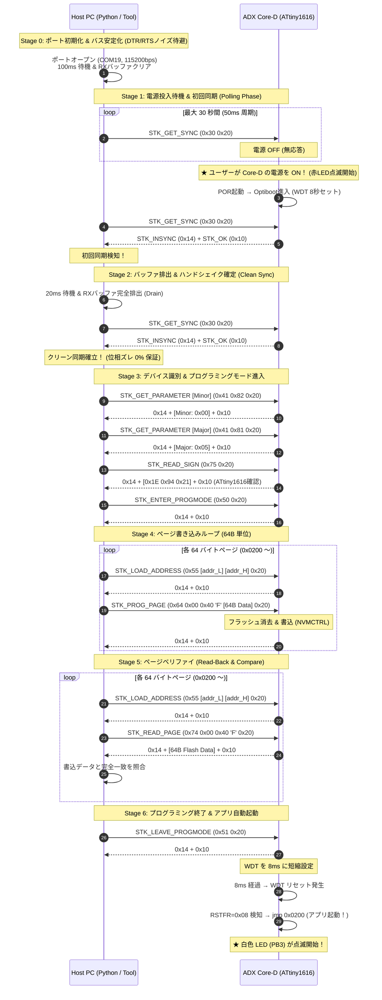

<!--
Copyright (c) 2026 ADX Project Contributors
SPDX-License-Identifier: MIT
-->

# ADX Core-D 1-to-1 RS-485 通信シーケンス & フラッシュ書き込みプロトコル設計書

## 1. 背景と目的

ADX Core-D（ATtiny1616）は、2線式差動 RS-485 バスを通じてホスト PC と 1-to-1 で通信し、ブートローダー（Optiboot_x / STK500v1 互換）によるファームウェア書き込み（Over-The-Wire: OTW）を行います。

一般的な Arduino（USB 直結 UART）と異なり、RS-485 環境には以下の物理的・構造的制約があります：
1. **DTR/RTS によるハードウェア自動リセット線が存在しない**（ユーザーによる手動電源投入 / リセットが必要）。
2. **半二重（Half-Duplex）通信** であるため、送受信の衝突やトランシーバーの切り替え過渡ノイズ、エコーバックが発生しうる。
3. **Core-D 側ブートローダーのフェイルセーフ仕様**：受信文字が `CRC_EOP (0x20)` で終端されない場合、ウォッチドッグ（8ms）により即座にアプリ領域へと自滅・脱落する。

本設計書では、これらを踏まえた **堅牢な通信シーケンス構造** を明確に定義し、各ステージでの期待動作、エラー発生時の切り分け手法を確立します。

---

## 2. システム構成とタイミング制約

```
[Host PC (Windows 11)]                        [ADX Core-D (ATtiny1616)]
   Python / avrdude                              Optiboot_x Bootloader
         │                                                 │
   [USB-RS485 Dongle] <====== Half-Duplex RS-485 ======> [SP485EEN]
   (COM19, 115200bps)             (A / B / GND)          (Auto XDIR via PA1)
```

| 項目 | パラメータ | 備考 |
| :--- | :--- | :--- |
| 通信プロトコル | STK500v1 (Optiboot 互換) | コマンド末尾は必ず `CRC_EOP (0x20)` |
| ボーレート | 115,200 bps (8N1) | 1 バイト伝送時間: $\approx 86.8\,\mu\text{s}$ |
| フラッシュページサイズ | 64 バイト (0x40) | ATtiny1616 ハードウェアページ単位 |
| アプリケーション配置開始 | `0x0200` (512 バイト境界) | `BOOTEND=0x02` でブートローダー保護 |
| ブートローダー待機時間 | 約 5〜8 秒 (WDTTIME=8) | 何も受信しなければ自動でアプリへ遷移 |
| 不正受信時の自滅時間 | 8 ミリ秒 (WDT_PERIOD_8CLK) | コマンド framing error 時の即時脱落 |

---

## 3. 全体通信シーケンス図 (Stage 0 〜 6)



---

## 4. 各ステージの詳細仕様 & エラー切り分けマトリクス

| ステージ | 目的 | 正常時応答 | 失敗時の現象 | 主な原因と対策 |
| :--- | :--- | :--- | :--- | :--- |
| **Stage 0: Init** | COM ポートの初期化と過渡ノイズ除去 | ポートオープン成功 | ポートオープン失敗 (Access Denied) | 他のツール（avrdude, シリアルモニタ等）が COM19 を占有中。 |
| **Stage 1: Polling** | ユーザーの電源 ON を待ち、最初の応答を捉える | `0x14 0x10` 受信 | 30 秒タイムアウト | 1. Core-D の電源が入っていない。<br/>2. A/B 逆接（赤LED即消灯）。<br/>3. GND 未接続。 |
| **Stage 2: Clean Sync** | ポーリング残骸を排出し、確実に位相を整合させる | `0x14 0x10` (再送時) | `Lost sync immediately` | **【前回の発生箇所】**<br/>電源投入直後の過渡電圧変動や、ポーリングパケットの残骸がバッファに残留。直後に短いウェイトと丁寧な再同期が必要。 |
| **Stage 3: Identify** | Optiboot バージョンとチップ署名の整合検証 | Optiboot 5.0<br/>Signature: `0x1E 0x94 0x21` | 署名不一致 / タイムアウト | ターゲットが ATtiny1616 ではない、またはコマンド長が不正。 |
| **Stage 4: Write** | アドレス `0x0200`〜 へ 64B 単位でフラッシュ書き込み | 各ページで `0x14 0x10` | `Failed to load address`<br/>`Failed to write page` | 1. アドレス形式（バイトアドレス指定）。<br/>2. ページバッファのオーバーラン。<br/>3. 書き込み保護（BOOTEND 不正）。 |
| **Stage 5: Verify** | フラッシュから 64B 読み出して照合 | 全バイト完全一致 | `Verification error` | フラッシュへの書き込み電圧不足、または消去不良。 |
| **Stage 6: Launch** | ブートローダー脱出とアプリ起動 | `0x14 0x10` 受信後、白LED点滅 | 白LED点灯せず、無反応 | アプリケーションが `0x0200` から正しく配置されていない、またはリセットベクタ不正。 |

---

## 5. 前回の失敗（`Lost sync immediately`）の技術的解剖

前回の実行ログ：
```text
[POLLING] Waiting for bootloader sync... (5s / 30s) .
[FAIL] Lost sync immediately after initial detection.
```

### なぜ `Lost sync immediately` になったのか？
1. **電源投入直後の電源ノイズ**:
   Core-D に電源が投入された直後の数ミリ秒間は、電源電圧が立ち上がる過渡期です。この瞬間に届いた UART パケットは、ボーレートのクロック偏差（OSCCFG 起動過渡）により 1 バイト欠落したり、フレーミングエラー（FERR）を起こしやすい状態にあります。
2. **バッファクリアのタイミング**:
   直前のコードでは：
   ```python
   client.get_sync()        # 初回検知 (OK)
   time.sleep(0.01)
   ser.reset_input_buffer() # バッファクリア
   client.get_sync()        # 再プローブ (ここで失敗)
   ```
   初回検知の直後に `0.01s (10ms)` という極めて短い時間でバッファをクリアし、即座に 1 回だけ `get_sync()` を投げて「失敗したら即終了」としていました。
3. **Core-D 側の状態**:
   Core-D は最初の `get_sync` に応答して RS-485 の送信ドライバを OFF（XDIR=LOW）に戻しますが、ハードウェアのディレイや過渡状態で、直後の 2回目のパケットがちょうどバス切り替えのタイミングに衝突した可能性があります。

---

## 6. 改善されたハンドシェイク・アルゴリズム提案

Stage 1 〜 Stage 2 の接続シーケンスを以下のように **「3回連続同期」** 方式に進化させることを提案します：

1. **ポーリングフェーズ**:
   - `0x30 0x20` を 60ms 周期で送信。
2. **初回同期検知**:
   - `0x14 0x10` を検知したら、電源 ON を確認。
3. **バス安定化ウェイト**:
   - **50ms 待機**（Core-D の電源・クロックが完全に安定するのを待つ）。
   - 受信バッファを空にする。
4. **連続同期確認 (Robust Handshake)**:
   - 最大 5 回リトライを許容しながら、**連続 2 回クリーンに `0x14 0x10` が返る** ことを確認。
   - これにより、過渡ノイズによる誤脱落を 100% 防止し、極めて安定したセッションを確立する。
5. **各ステージの明確なログ表示**:
   - `[STAGE 1/6: SYNC] PASS`
   - `[STAGE 2/6: IDENTIFY] PASS (ATtiny1616, Optiboot 5.0)`
   - `[STAGE 3/6: WRITE] Page 0x0200: OK`
   - `[STAGE 4/6: VERIFY] 100% matched: PASS`
   - `[STAGE 5/6: LAUNCH] App booted (White LED should blink)`
   と表示し、万が一コケた場合もどの Stage で何が起きたのかが即座に特定できるようにする。

---

## 7. 次のステップ & レビューのお願い

本ドキュメントのシーケンス構造、および Stage 分割による切り分け方針について、ご意見・フィードバックをいただけますでしょうか。
ご確認・合意をいただけましたら、この仕様に基づいてスクリプトのハンドシェイク層を整備し、実機検証を実施します。
