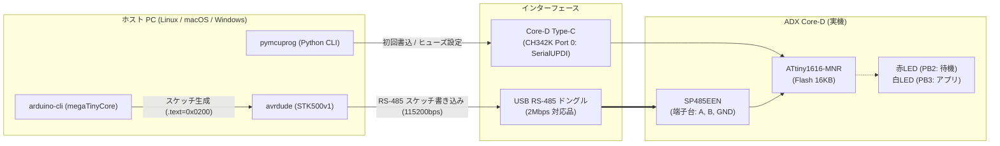
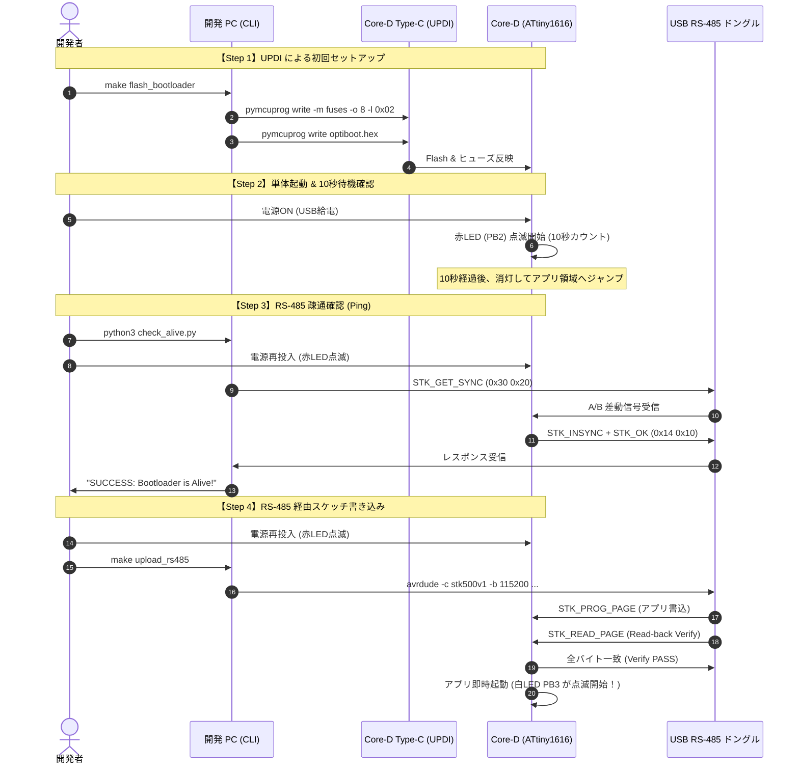

<!--
Copyright (c) 2026 ADX Project Contributors
SPDX-License-Identifier: MIT
-->

# ADX Core-D 1-to-1 RS-485 ブートローダー 開発・検証ワークフロー & CLIツールチェーン設計書

## 1. 概要と開発コンセプト

本ドキュメントは、**ADX Core-D**（ATtiny1616 搭載）における 1-to-1 RS-485 ブートローダーの開発、初回セットアップ、および実機検証を、迷いなく安全・確実に実施するための **CLI（コマンドライン）統合ワークフロー設計書** です。

### 1.1 開発上の重要コンセプト：「10秒待機 & LED可視化」
RS-485 通信には DTR 等の自動リセット制御線が存在しないため、ホスト PC 側の書き込み開始タイミングを手動同期する必要があります。
本開発では、開発時のストレスとタイミングシビア問題を根本解決するため、以下の仕様を採用します：

1. **約 10 秒間のロングブート待機**:
   - 電源投入（POR）後、即座にアプリへ抜けず、**約 10 秒間の書き込み待ち受けモード** を維持します。
   - 開発者は Core-D の電源を入れてから、落ち着いて PC 側の書き込みコマンドを実行できます。
   - 通信が開始されれば直ちに書き込みシーケンスへ移行し、10 秒間何も来なければ自動的にユーザーアプリへジャンプします。
2. **LED インジケータによる状態の完全可視化**:
   - 待機中は **赤色 LED（PB2）を点滅（ハートビート）** させ、「今ブートローダーが待機中であること」を目視確認可能にします。
   - タイムアウトでアプリへ移行した瞬間に消灯します。

---

## 2. 2系統物理ポートとツールチェーン構成

Core-D に接続する 2 つの物理ポートの役割と使用ツールを明確に分離します。



### 2.1 ポート ①: Type-C (SerialUPDI 経路)
- **物理ポート**: Core-D オンボード Type-C（CH342K）
- **使用ツール**: **`pymcuprog`**（Microchip 公式 Python CLI）
- **役割**:
  1. 初回ブートローダーバイナリ（`.hex`）の Flash 書き込み
  2. **`BOOTEND = 0x02`**（512バイト保護）ヒューズの設定
  3. 万が一の際のファームウェア・ヒューズ復旧

> [!CAUTION]
> **UPDI 保護基準**:
> `SYSCFG0`（`RSTPINCFG`）には絶対に触れず、ヒューズ書き換えは `-m fuses -o 8 -l 0x02` のみピンポイントで指定します。

### 2.2 ポート ②: USB RS-485 ドングル (RS-485 経路)
- **物理ポート**: PC 接続 USB RS-485 ドングル $\rightarrow$ Core-D 端子台（A, B, GND）
- **使用ツール**: **`avrdude`**
- **通信仕様**:
  - プロトコル: `stk500v1`
  - ボーレート: `115200` bps
- **役割**:
  1. 通常運用時のスケッチ（ユーザーアプリ）書き込み
  2. Flash の全バイト Read-back Verify（データ整合性検証）

---

## 3. アプリケーション（スケッチ）のオフセットコンパイル環境

ブートローダー（0x0000〜0x01FF / 512B）と共存するため、ユーザーアプリケーションは **開始アドレス `0x0200`（512バイト目）** でリンクされている必要があります。

### 3.1 Arduino CLI によるオフセットビルドの自動化
`arduino-cli` を使用し、`megaTinyCore` の Optiboot オプションを付与することで、リンカ引数 `--section-start=.text=0x0200` を自動適用したバイナリを生成します。

```bash
# megaTinyCore の ATtiny1616 向けコンパイルコマンド例
arduino-cli compile \
  --fqbn megaTinyCore:megaavr:atx16:bootloader=optiboot,clock=16internal \
  --output-dir ./build_app \
  ./test_sketches/Blink_WhiteLED
```

---

## 4. 段階的な動作検証手順（Step-by-Step）



### Step 1: UPDI による初回書き込み
1. Core-D と PC を Type-C ケーブルで接続。
2. ヒューズ現在の状態を確認（`SYSCFG0` の値を記録）。
3. `BOOTEND = 0x02` を書き込み。
4. ビルドした `optiboot_core_d_rs485.hex` を書き込み。

### Step 2: 単体動作 & 10秒待機検証
1. Core-D のリセットまたは電源再投入。
2. **赤色 LED（PB2）が約 10 秒間点滅** することを目視確認。
3. 10 秒後に消灯し、ハングアップせずユーザーアプリ側へ移行することを確認。

### Step 3: RS-485 疎通確認（Check Alive）
1. USB RS-485 ドングル（A, B, GND）を Core-D の端子台に接続。
2. 疎通テストスクリプト `adx_rs485_ping.py` を実行（常時 `STK_GET_SYNC` をポーリング待機）。
3. Core-D の電源を入れると、即座に応答（`0x14 0x10`）が返り、画面に成功ログが表示されることを確認。

> [!WARNING]
> #### 【重要仕様: RS-485 信号線（A/B）の逆接時の挙動】
> 市販の USB-RS485 アダプタは、メーカーによって `A` と `B` の極性定義（反転/非反転）の表記が逆になっている場合があります。
> - **逆接時の仕様的挙動**:
>   - A と B が逆接されている場合、RS-485 バスのアイドル電位が反転し、MCU の RX ピンには常時「Space（Break 信号）」が入力されます。
>   - これによりブートローダーの受信検知（RXCIF）が電源投入直後にトリガーされ、`LED_PORT.OUT &= ~LED;` により **「赤色 LED（PB2）が点滅せず即座に消灯したまま待機する」** 挙動を示します（Break 信号は FERR を伴うため WDT はクリアされず、約 8 秒後に自動でアプリへ遷移します）。
> - **対策**:
>   - **「電源を入れた瞬間に赤 LED が点滅せず即座に消灯する」場合は、100% の確率で A と B の配線が逆です。**
>   - 端子台側で `A` と `B` の配線を入れ替えてください。
>   - *(※ブートローダー側でこの物理誤結線をソフトウェア救済しようとするとコードサイズが肥大化し 512B 制限を超過するため、本挙動を「明確なハードウェア診断シグネチャ」として定義します)*

### Step 4: RS-485 経由でのスケッチ書き込み（OTW 実証）
1. テストスケッチ（白色 LED: PB3 を L チカさせるスケッチ）を `0x0200` オフセットでビルド。
2. Windows 11 から書き込みツール `adx_rs485_flash.py` を実行（ポーリング待機状態）。
3. Core-D の電源を投入（赤 LED が点滅開始）。
4. 7 ステージ通信シーケンスにより、自動で同期 $\rightarrow$ 64B ページ書き込み $\rightarrow$ **Read-back Verify（全バイト照合）** が「PASS」することを確認。
5. 書き込み完了後、Core-D 上で **白色 LED（PB3）が正常に点滅を開始** すれば実証完了！
6. 電源再投入時も、約 5 秒間の赤点滅待機を経て自動で白点滅（アプリ）へ移行することを確認。

---

## 5. 統合 Makefile ワークフロー設計

手動コマンドの打ち間違いを防ぐため、以下のコマンド群を `Makefile` として整備します。

| Make ターゲット | 実行内容 | 使用ポート |
| :--- | :--- | :--- |
| `make build` | `optiboot_x` ソースから 512B 以内の `.hex` を avr-gcc でコンパイル | なし (ローカル) |
| `make flash_bootloader` | `BOOTEND=0x02` 設定 ＆ ブートローダーの初回書き込み | Type-C (UPDI) |
| `make verify_fuses` | 現在の全ヒューズレジスタを読み出して画面表示 | Type-C (UPDI) |
| `make check_alive` | `check_alive.py` を起動し、RS-485 疎通確認を実施 | USB RS-485 ドングル |
| `make build_test_app` | `arduino-cli` でテストスケッチを 0x0200 オフセットコンパイル | なし (ローカル) |
| `make upload_rs485` | `avrdude` で RS-485 ドングル経由でスケッチ書き込み ＆ Verify | USB RS-485 ドングル |
