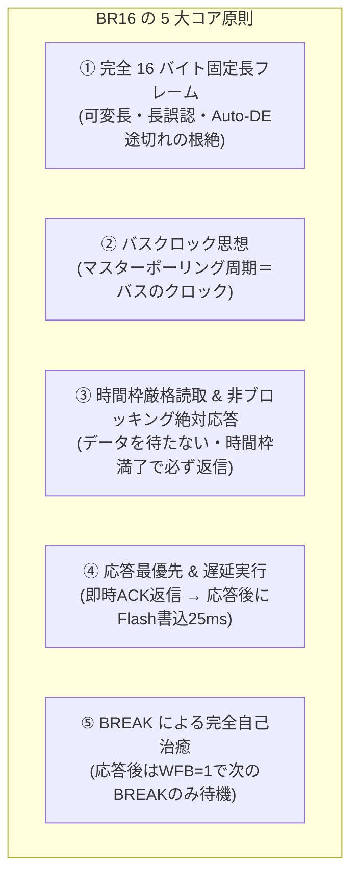

<!--
Copyright (c) 2026 ADX Project Contributors
SPDX-License-Identifier: CC-BY-4.0
-->

# BR16 プロトコル開発仕様書 (Specification v1.0)
## 1-to-1 RS-485 高信頼ブートローダー & フィールドバス通信仕様

**策定日**: 2026-09-28  
**対象ターゲット**: ADX Core-D (Microchip ATtiny1616-MNR, RS-485: SP485EEN)  
**上位コンセプト文書**: [`concept.md`](./concept.md)  
**ハードウェアナレッジベース**: [`../../RS485_BOOTLOADER_KNOWLEDGE_BASE.md`](../../RS485_BOOTLOADER_KNOWLEDGE_BASE.md)

---

## 1. 概要と開発哲学

**BR16**（LIN **B**reak, **R**S-485, **16**-Byte Fixed Frame）は、過酷な電気的ノイズ環境および半二重 RS-485 バスにおける決定論的（Deterministic）な信頼性と完全な不可視性排除を実現するために策定された、次世代の超堅牢通信プロトコルです。

### 1.1 BR16 の 5 大コア原則



1. **完全 16 バイト固定長（Fixed 16-Byte Frame）**:
   - マスター送信・スレーブ返信ともに、すべてのパケットを「16 バイト」に完全固定します。
   - 可変長ヘッダやペイロード長解釈を完全に排除し、USB-RS485 ドングルの Auto-DE 誤動作やバッファ溢れを原理的に防ぎます。
2. **バスクロック思想（Bus Clock Paradigm）**:
   - マスターのポーリング周期（$T_{\text{poll}}$）をネットワーク全体の「CPU クロック」と位置づけます。
   - 最初は 500ms〜1s などの超低速クロックで「通信とハードウェアの健全性」を 100% 担保し、段階的にクロックを上げて本番運用に移行します。
3. **時間枠厳格読取 ＆ 非ブロッキング絶対応答（Time-Windowed Receiver & Unconditional Reply）**:
   - **スレーブは「正しいデータが来るまで待つ」ことは絶対にしません。**
   - LINAUTO で校正されたボーレート基準で「16 バイト分の伝送時間枠」だけ読み取り、時間が経過したら直ちに読み取りを打ち切ります。
   - 16 バイト揃っていようが、途中で欠損していようが、CRC が合わなかろうが、**時間枠満了時に必ず結果を載せて 16 バイト返信** します。
4. **応答最優先 ＆ 遅延実行（Instant ACK $\rightarrow$ Delayed Write）**:
   - スレーブはデータを受信したら、重い処理（Flash 消去書き込み等）を行う前に、**CRC 照合のみを行って即座に応答（ACK）を返信** します。
   - 重い書き込み作業は返信完了後に開始し、完了時に「作業準備完了フラグ（Ready ビット）」を立て、次回のポーリングでマスターに伝達します。
5. **BREAK による完全自己治癒（Full Self-Healing on BREAK）**:
   - スレーブは返信を終えたら、直ちに `WFB=1`（Wait For Break）をアームし、次の BREAK 以外をすべて無視します。
   - 万一前のフレームでノイズ混入やビット化けがあっても、次の BREAK によってステートが完全に初期化されます。

---

## 2. 物理層 & ハードウェア設定仕様 (ADX Core-D)

### 2.1 ピンアサイン一覧

| 信号名 | MCU ピン | ポート | 接続先デバイス / 機能 | 初期化レジスタ設定 |
| :--- | :---: | :---: | :--- | :--- |
| **TXD** | 20 | `PA1` | SP485EEN Pin 4 (DI) | `PORTMUX.CTRLB = PORTMUX_USART0_ALTERNATE_gc;`<br>`VPORTA.DIR \|= PIN1_bm;` |
| **RXD** | 1 | `PA2` | SP485EEN Pin 1 (RO) | `VPORTA.DIR &= ~PIN2_bm;` |
| **DE** | 5 | `PA4` | SP485EEN Pin 3 (DE) | `VPORTA.DIR \|= PIN4_bm;`<br>`VPORTA.OUT &= ~PIN4_bm;` (通常 LOW) |
| **/RE** | 8 | `PA7` | SP485EEN Pin 2 (/RE) | `VPORTA.DIR \|= PIN7_bm;`<br>`VPORTA.OUT &= ~PIN7_bm;` (通常 LOW / 送信時 HIGH) |
| **RED LED** | 7 | `PB2` | オンボード赤色 LED | `VPORTB.DIR \|= PIN2_bm;` (待機時 2Hz 点滅) |
| **WHITE LED**| 6 | `PB3` | オンボード白色 LED | `VPORTB.DIR \|= PIN3_bm;` (アプリ稼働表示) |
| **DEBUG TX** | 10 | `PB4` | CH342K Port B RX (SoftwareSerial) | PC デバッグシリアル送信 (9600 bps) |
| **DEBUG RX** | 11 | `PB5` | CH342K Port B TX (SoftwareSerial) | PC デバッグシリアル受信 (9600 bps) |

### 2.2 トランシーバー制御シーケンス（自爆エコー完全遮断）

半二重 RS-485 通信における自爆エコー（自分の送信したデータが受信 FIFO に吸い込まれる現象）を遮断するため、以下の手順を厳守します：

1. **送信開始**:
   `VPORTA.OUT |= (PIN4_bm | PIN7_bm);` (DE=1, /RE=1) を設定後、約 50µs 待機（ドライバ安定化）。
2. **送信送出**:
   16 バイトを UART TX から連続送出。
3. **送信完了待機**:
   `while (!(USART0.STATUS & USART_TXCIF_bm));` により最後のストップビット送出完了を厳格に待機。フラグをクリア。
4. **受信モード復帰**:
   約 50µs 待機後、`VPORTA.OUT &= ~(PIN4_bm | PIN7_bm);` (DE=0, /RE=0) に戻す。
5. **FIFO 空読み**:
   受信バッファに残った過渡ノイズを空読みしてフラッシュ。

---

## 3. フレームフォーマット仕様

すべてのトランザクションは、マスターが送出する **LIN ヘッダ（Break + Delimiter + 0x55）** に続いて **16 バイト固定フレーム** が送出され、スレーブも **16 バイト固定フレーム** で応答します。

```text
[Master 送信]
+-------------+---------------+------------+------------------------------+
| BREAK (LOW) | DELIMITER(HI) | SYNC(0x55) | MASTER PAYLOAD (16 Bytes)   |
| >= 13 bits  | >= 1 bit      | 1 Byte     | Byte 0 ................... 15|
+-------------+---------------+------------+------------------------------+

[Slave 応答]
+------------------------------+
| SLAVE RESPONSE (16 Bytes)    |
| Byte 0 ................... 15|
+------------------------------+
```

### 3.1 マスター送信フレーム (Master-to-Slave: 16 Bytes)

| Offset | フィールド名 | 型 | 説明 |
| :---: | :--- | :---: | :--- |
| `0` | **`CMD`** | `uint8_t` | コマンド識別子（下記 3.3 節参照） |
| `1` | **`SEQ`** | `uint8_t` | トランザクション・シーケンス番号（`0x00`〜`0xFF`） |
| `2` | **`PAGE_IDX`**| `uint8_t` | 対象 Flash ページ番号（`0x08`〜`0xFF`, 1ページ=64B） |
| `3` | **`CHUNK_IDX`**|`uint8_t` | ページ内チャンク番号（`0`〜`7`, 1チャンク=8B） |
| `4` | **`FLAGS`** | `uint8_t` | 制御フラグ（Bit 0: `COMMIT_WRITE`, Bit 1: `FORCE_REBOOT`） |
| `5..12`| **`DATA[8]`** | `uint8_t[8]`| データペイロード（8 バイト） |
| `13` | **`RESERVED`**| `uint8_t` | 予約領域（将来拡張用、`0x00` 固定） |
| `14` | **`CRC16_H`** | `uint8_t` | CRC-16-CCITT 上位バイト (`Byte 0..13` を計算) |
| `15` | **`CRC16_L`** | `uint8_t` | CRC-16-CCITT 下位バイト |

### 3.2 スレーブ返信フレーム (Slave-to-Master: 16 Bytes)

| Offset | フィールド名 | 型 | 説明 |
| :---: | :--- | :---: | :--- |
| `0` | **`STATUS`** | `uint8_t` | 実行結果ステータス（下記 3.4 節参照） |
| `1` | **`ECHO_SEQ`** | `uint8_t` | 受信した `SEQ` のエコーバック |
| `2` | **`RX_COUNT`** | `uint8_t` | 時間枠内に受信できた実バイト数（正常なら `16`） |
| `3` | **`DEV_STATE`**| `uint8_t` | スレーブ状態フラグ（下記 3.5 節参照） |
| `4` | **`CUR_PAGE`** | `uint8_t` | スレーブが現在認識している Flash ページ番号 |
| `5` | **`CUR_CHUNK`**| `uint8_t` | スレーブが現在認識しているチャンク番号 |
| `6..13`| **`EXTRA[8]`** | `uint8_t[8]`| コマンド固有の返答データ（シグネチャ、バージョン、読出データ等） |
| `14` | **`CRC16_H`** | `uint8_t` | CRC-16-CCITT 上位バイト (`Byte 0..13` を計算) |
| `15` | **`CRC16_L`** | `uint8_t` | CRC-16-CCITT 下位バイト |

### 3.3 コマンドコード (`CMD`) 一覧

| コマンド名 | 値 | 説明 |
| :--- | :---: | :--- |
| `CMD_PING` | `0x01` | 疎通確認・バージョン取得。データ書き込みは行わない。 |
| `CMD_GET_INFO` | `0x02` | マイコン署名（Device Signature）および BOOTEND 等の取得。 |
| `CMD_WRITE_CHUNK`| `0x10` | 8 バイトデータを SRAM ページバッファに書き込む。 |
| `CMD_READ_CHUNK` | `0x20` | 指定ページ・チャンクの Flash データを 8 バイト読み出す。 |
| `CMD_BOOT_APP` | `0x30` | ブートローダーを終了し、ユーザーアプリへジャンプする。 |

### 3.4 ステータスコード (`STATUS`) 一覧

| ステータス名 | 値 | 説明 |
| :--- | :---: | :--- |
| **`STATUS_OK`** | `0x00` | 16 バイト完全受信 ＆ CRC 一致。処理受託。 |
| **`STATUS_ERR_CRC`** | `0x01` | 16 バイト受信したが、CRC が不一致。 |
| **`STATUS_ERR_TIMEOUT`**| `0x02` | **時間枠満了時点で 16 バイト未満（`RX_COUNT < 16`）の欠損検知**。 |
| **`STATUS_ERR_PROTECT`**| `0x03` | ブート領域（BOOTEND 未満）への書き込み要求拒絶。 |
| **`STATUS_ERR_BUSY`** | `0x04` | 前回の Flash 書き込みが完了していない（過密ポーリング検知）。 |

### 3.5 デバイス状態フラグ (`DEV_STATE`)

| ビット | フラグ名 | 説明 |
| :---: | :--- | :--- |
| **Bit 0** | **`READY`** | `1`: 次の処理受託可能（Ready） / `0`: 内部処理中（Busy） |
| **Bit 1** | **`BOOT_MODE`** | `1`: ブートローダー稼働中 / `0`: アプリ稼働中 |
| **Bit 2** | **`WRITE_FAIL`** | 直前の Flash 書き込み（Page Erase & Write）が失敗した場合に 1 |
| **Bit 3..7**| **`RESERVED`** | 予約領域（`0`） |

---

## 4. タイミング仕様 & 時間枠（Time Window）設計

```mermaid
gantt
    title BR16 スロットタイミング構成 (例: 100ms ポーリング周期)
    dateFormat X
    axisFormat %s ms
    section マスター
    Break + 0x55 送出       :a1, 0, 3
    16B ペイロード一括送出  :a2, 3, 20
    スレーブ応答受信待機    :a3, 20, 42
    スラックタイム (休止)   :a4, 42, 100
    section スレーブ
    Break検知 & LINAUTO校正 :b1, 0, 3
    時間枠受信 (160ビット)  :b2, 3, 20
    16B 応答送出 (即時ACK)  :b3, 21, 38
    Flash ページ消去書込    :b4, 38, 63
    READY 待機状態          :b5, 63, 100
```



### 4.1 時間枠（$T_{\text{window}}$）の厳密算出

スレーブは LINAUTO で校正されたボーレートレジスタ `USART0.BAUD` から、1 ビット時間 $T_{\text{bit}}$ を認識しています。

* **16 バイトの伝送ビット数**:
  $$N_{\text{bits}} = 16 \text{ bytes} \times 10 \text{ bits/byte (8N1)} = 160 \text{ bits}$$
* **伝送時間**:
  - @ 9,600 bps: $160 \times 104.17\,\mu\text{s} \approx 16.67\,\text{ms}$
  - @ 19,200 bps: $160 \times 52.08\,\mu\text{s} \approx 8.33\,\text{ms}$
  - @ 115,200 bps: $160 \times 8.68\,\mu\text{s} \approx 1.39\,\text{ms}$
* **タイムウィンドウ時間 $T_{\text{window}}$**:
  マスター送信のジッターおよびバイト間微小ギャップを許容するため、**18 バイト分（180 ビット時間）** を時間枠とします。
  $$T_{\text{window}} = 180 \times T_{\text{bit}}$$

### 4.2 スレーブ受信ループの非ブロッキング仕様

```c
// LINAUTO 完了直後に実行
uint8_t rx_buf[16];
uint8_t rx_count = 0;

// 180ビット時間のタイマー/ループカウンタを開始
start_window_timer(WINDOW_TICKS_180BITS);

while (!window_timer_expired()) {
    if (USART0.STATUS & USART_RXCIF_bm) {
        uint8_t b = USART0.RXDATAL;
        if (rx_count < 16) {
            rx_buf[rx_count++] = b;
        }
        // 16バイト超えた余計なノイズは読み捨て
    }
}
// ★時間が満了したら、何があってもループを脱出！
```

### 4.3 スラックタイム（Slack Time）の保守

* ATtiny1616 の Flash 消去・書き込み（Page Erase & Write）には **最大 28 ms** 要します。
* スレーブが書き込み指示（8 チャンク目）を受信して即時 ACK を返した後、実際に書き込みを終えるまでに約 28ms かかります。
* したがって、マスターのポーリング周期 $T_{\text{poll}}$ は、**最低でも 50ms（推奨 Bring-up 時: 100ms〜500ms）** を保守しなければなりません。

---

## 5. Flash ページ書き込みシーケンス（64B 蓄積アーキテクチャ）

ATtiny1616 の Flash は 64 バイト（1 ページ）単位でしか消去・書き込みができません。BR16 は 1 フレームあたり 8 バイトのデータを運ぶため、**「8 チャンク蓄積 ＆ コミット方式」** を採用します。

```text
Chunk 0 ( 8B): [SRAM Buffer 0x00..0x07 に格納] -> 即時 ACK (READY)
Chunk 1 ( 8B): [SRAM Buffer 0x08..0x0F に格納] -> 即時 ACK (READY)
Chunk 2 ( 8B): [SRAM Buffer 0x10..0x17 に格納] -> 即時 ACK (READY)
Chunk 3 ( 8B): [SRAM Buffer 0x18..0x1F に格納] -> 即時 ACK (READY)
Chunk 4 ( 8B): [SRAM Buffer 0x20..0x27 に格納] -> 即時 ACK (READY)
Chunk 5 ( 8B): [SRAM Buffer 0x28..0x2F に格納] -> 即時 ACK (READY)
Chunk 6 ( 8B): [SRAM Buffer 0x30..0x37 に格納] -> 即時 ACK (READY)
Chunk 7 ( 8B): [SRAM Buffer 0x38..0x3F に格納]
               FLAGS = COMMIT_WRITE
               -> 即座に 16B 応答送出 (STATUS_OK, READY=0 [BUSY予告])
               -> 【応答完了直後に Flash Page Erase & Write 実行 (約25ms)】
               -> 完了後、READY=1 に復帰
```

---

## 6. バス健全性評価（BREAK ハートビート統計）

マスター側（Python ツール）は、各ポーリングスロットにおいて以下のテレメトリをリアルタイム記録し、バスの電気的・論理的健全性を判定します。

| 健全性メトリクス | 測定方法 | 正常基準 | 異常時の推定要因 |
| :--- | :--- | :---: | :--- |
| **応答遅延 $\Delta T$** | Master Break 終了から Slave Break 検出までの時間 | $T_{\text{window}}$ と一致 | スレーブのハングアップ、クロックずれ |
| **時間ジッター $\sigma_{\Delta T}$** | $\Delta T$ の標準偏差 | **$\le 1.0\,\text{ms}$** | USB シリアルドライバジッター、ノイズ混入 |
| **フレーム完全率** | `RX_COUNT == 16` の確率 | **100%** | ボーレート不一致、Auto-DE チャタリング |
| **CRC 合格率** | `STATUS_OK` の確率 | **100%** | 配線ノイズ、終端抵抗不良、GND 不良 |
| **スレーブ Ready 率** | `DEV_STATE.READY == 1` の確率 | **100%** | ポーリング周期が短すぎる（過密障害） |

---

## 7. 段階的開発・検証ロードマップ

本仕様に基づき、以下の 4 ステップでリスクを極小化しながら実装を進めます：

```text
[Step 1: 16B Ping-Pong & ジッター統計検証]
  - スレーブ: Flash 書込を行わず、受信した 16B の CRC 判定と固定時間枠応答のみを実装。
  - マスター: 1秒周期ポーリングでジッター σ < 1ms およびフレーム完全率 100% を実証。

[Step 2: SRAM ページバッファ蓄積 & 読出検証]
  - 8 チャンク (64B) を SRAM に蓄積し、`CMD_READ_CHUNK` で完全一致読み出しを実証。

[Step 3: 単一 Flash ページ書き込み検証]
  - アドレス 0x0400 へ 64 バイトの消去・書き込みを実行し、Ready/Busy 遷移を完全検証。

[Step 4: フルアプリケーション書き込み & 自動起動]
  - 複数ページ（1KB〜15KB）の一括書き込み、ベリファイ、およびアプリ自動起動を実証。
```
