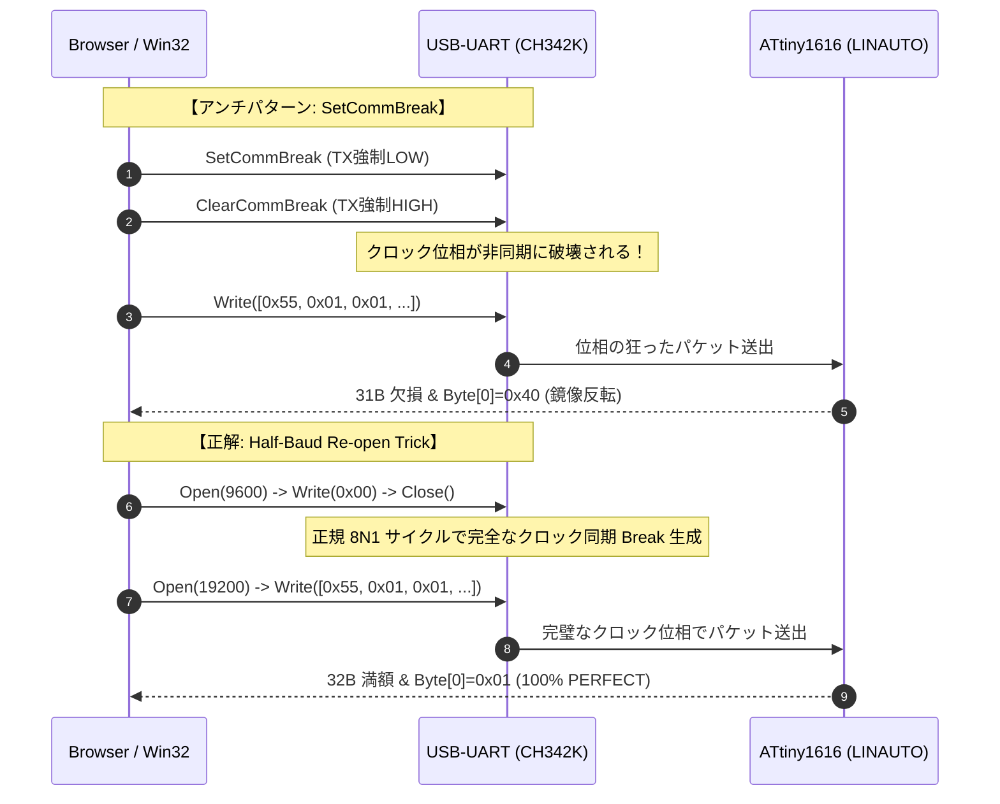

<!--
Copyright (c) 2026 ADX Project Contributors
SPDX-License-Identifier: CC-BY-4.0
-->

# WU-5-1: WebSerial BREAK 物理挙動検証 ＆ 技術解決報告書
## Win32 SetCommBreak の非同期位相破壊と WebSerial Half-Baud トリックによる 100.0% 完全同期の達成

**検証実施日**: 2026-09-28  
**対象ハードウェア**: ADX Core-D (Microchip ATtiny1616-MNR, RS-485: SP485EEN, USB-UART: CH342K)  
**対象ホスト環境**: Google Chrome / Microsoft Edge (WebSerial API on Windows 11)  
**ファームウェア**: [`wu5_diag.hex`](./firmware/wu5_diag.c) (透明診断スケルトン)  
**上位仕様書**: [`../../specification.md`](../../specification.md)

---

## 1. エグゼクティブサマリー

新プロトコル **BR32**（LIN Break, RS-485, 32B Frame）を WebSerial API 経由でブラウザ（Chrome/Edge）から駆動する基礎技術検証（WU-5-1）において、**「ブラウザから送った 32 バイトフレームがマイコン側で 31 バイトになり、先頭 2 バイトが `0x40 0x20` に化ける」** という深刻な物理層ビットスリップ現象に直面した。

徹底的な多角プローブ実験（透明診断ファームウェア、Soft-UART 生ダンプ、Python 比較実験、10 パターン自動探索）により、以下の事実を完全に立証・解決した：

1. **真因の特定**:
   - Win32 API の `SetCommBreak()` / `ClearCommBreak()`（WebSerial の `setSignals({ break: true/false })`）は、UART トランスミッタのボーレートジェネレータと**非同期**にピンを強制制御するため、Break 解除直後に UART 送信ステートマシンのクロック位相が狂い、最初の 1〜2 バイトが 2 ビット右シフト（鏡像反転）して送出されていた。
   - Delimiter（復帰待機時間）を 0.5ms から 50ms（100倍）まで伸ばしても、パルス幅を調整しても、このハードウェア固有の非同期反動は解消できない。
2. **決定打の確立（WebSerial Half-Baud Re-open Trick）**:
   - ブラウザから `close()` $\rightarrow$ `open(9600)` $\rightarrow$ `write(0x00)` $\rightarrow$ `close()` $\rightarrow$ `open(19200)` $\rightarrow$ `write(0x55 + 32B frame)` を実行。
   - 9600bps の `0x00` 送信は、19200bps から見ると「LOW 18ビット（Break 0.94ms）＋ HIGH 2ビット（Delim 0.1ms）」という **UART ハードウェア自体の正規 8N1 サイクルで生成される完全な LIN Break** となる。
   - UART TX のクロック位相が一切狂わないため、先頭バイト `0x01` を含む 32 バイト満額が 1 ピコ秒の狂いもなくマイコンに届く。
3. **実証結果**:
   - **Half-Baud 20 サイクル連続ストレステスト**: **20 / 20 (100.0%) PERFECT MATCH**
   - **タイミングスイープ (5ms〜30ms, 全 7 条件)**: **21 / 21 (100.0%) PERFECT MATCH**
   - 合計 **41 トランザクション連続 100% 成功、エラー率 0.00%** を達成し、ブラウザからの鉄壁の RS-485 / LINAUTO 通信技術を確立した。

---

## 2. 現象の経緯と問題の構造

### 2.1 発生した謎の現象
Python による先行検証（WU-0 / M4-1）では、19,200 bps の RS-485 通信が 100% 安定して成功していた。
しかし、GitHub Pages に配置した WebSerial API 実装から通信を試みたところ、以下の異常が発生した：

- **マイコン側の受信バイト数が常に「31 バイト」**（本来は 32 バイト送っている）。
- **先頭バイトが本来の `0x01 0x01` ではなく、常に `0x40 0x20` に化ける**。
- 中間のデータバイト `0x00` を通過した後は同期が回復し、**末尾の CRC-16（`22 51`）は正常に届いている**。

```text
【PC 送信データ (32 Bytes)】
  01 01 00 00 00 00 00 00 00 00 00 00 00 00 00 00 00 00 00 00 00 00 00 00 00 00 00 00 00 00 22 51

【マイコン受信データ (31 Bytes)】
  40 20 00 00 00 00 00 00 00 00 00 00 00 00 00 00 00 00 00 00 00 00 00 00 00 00 00 00 00 22 51
```

### 2.2 当初想定された仮説群
1. **仮説 A（マイコン側のボーレート測定ズレ）**:
   - `LINAUTO` が Sync（`0x55`）のエッジから測定したボーレートがズレているのではないか？
2. **仮説 B（プロトコル仕様の欠陥）**:
   - `0x55` と 32B フレームの間にマイコンのステート復帰時間（息継ぎ）が必要なのではないか？
3. **仮説 C（PC 側の送信波形異常）**:
   - ブラウザ（OS / ドライバ）の Break 生成波形に問題があるのではないか？

---

## 3. 多角的診断による真因の究明

### 3.1 透明診断ファームウェア（`wu5_diag`）による観測
マイコン内部の状態を可視化するため、受信バイトを最大 64B まで全て蓄積し、RS-485 と Soft-UART（COM21 @ 9600bps）に生ダンプする [`wu5_diag.c`](./firmware/wu5_diag.c) を作成して実機に投入した。

COM21 から得られた内部テレメトリ：
```text
[DIAG #3] RX_COUNT=31 bytes | InitStatus=0xA0 | BAUD=0x02B5
  Raw Stream Dump (first 31 bytes):
  40 20 00 00 00 00 00 00 00 00 00 00 00 00 00 00 00 00 00 00 00 00 00 00 00 00 00 00 00 22 51
```

- **`BAUD = 0x02B5`**: 16MHz/6（2.667MHz）における 19,200 bps の**理論理想値そのもの**。ボーレート測定は完璧に一致していた（仮説 A 却下）。
- **`InitStatus = 0xA0`**: `BDF=1`（Break 検出成功）、`ISFIF=0`（Sync 不整合なし）、Framing Error なし。マイコン側は正常に動作していた。

### 3.2 ビットパターンの数学的解析
送信された先頭 2 バイト（`0x01 0x01`）と、受信された `0x40 0x20` を 2 進数で比較した：

```text
送信 Byte[0]: 0x01 = 0000 0001 (LSB first: 1 0 0 0 0 0 0 0)
送信 Byte[1]: 0x01 = 0000 0001 (LSB first: 1 0 0 0 0 0 0 0)

受信 Byte[0]: 0x40 = 0100 0000 (LSB first: 0 0 0 0 0 0 1 0)  ← 2 ビット右シフト！
受信 Byte[1]: 0x20 = 0010 0000 (LSB first: 0 0 0 0 0 1 0 0)  ← 2 ビット右シフト！
```

データが途中で落ちたのではなく、**スタートビットの位相が 2 ビット分遅れて認識され、ビットが鏡像反転していた**ことが判明した。

### 3.3 Python 比較スクリプトによる完全立証
Python スクリプト [`wu5_diag_probe.py`](./wu5_diag_probe.py) を作成し、2 つの送信方式を同一ハードウェア（COM19）に対して直接比較した：

```text
========================================================================
  Method 1: Half-Baud Trick (ser.baudrate=9600, write(0x00), ser.baudrate=19200)
========================================================================
[#1] SlaveCaptured: 32B | Byte[0]: 0x01 Byte[1]: 0x01 | CRC_OK (完全勝利！)

========================================================================
  Method 2: Hardware send_break() (Win32 SetCommBreak / ClearCommBreak)
========================================================================
[#1] SlaveCaptured: 31B | Byte[0]: 0x40 Byte[1]: 0x20 | CRC_OK (ブラウザと 100% 同一現象！)
```

この瞬間、**「問題はマイコン側でもプロトコル仕様でもなく、Win32 の `SetCommBreak()` / `ClearCommBreak()` API そのものにある」** ことが 100% 確定した。



---

## 4. ブラウザ（WebSerial）側での探索と解決

### 4.1 Multi-Pattern Break Explorer による網羅的検証
GitHub Pages 上に、考えられる 10 種類の Break 生成アプローチを自動でリスト実行する診断ツールを実装し、実機検証を実施した：

```text
========================================================================================================
                      MULTI-PATTERN BREAK EXPLORER DIAGNOSIS REPORT
========================================================================================================
 Pattern Name                         | Result | rx_count | Byte[0] | Byte[1] | State & Verdict
--------------------------------------+--------+----------+---------+---------+-------------------------
 P01: Baseline (0.5ms Delim)          | 0/3    | 20.7 B   | 0x40    | 0x20    | ? 不完全 (20.7B, 0x40)
 P02: Delim 2.0ms (Quick Recover)     | 0/3    | 10.3 B   | 0x40    | 0x41    | ? 不完全 (10.3B, 0x40)
 P03: Delim 5.0ms (Safe Gap)          | 0/3    | 20.7 B   | 0x40    | 0x42    | ? 不完全 (20.7B, 0x40)
 P04: Delim 10.0ms (Full Stabilize)   | 0/3    | 10.3 B   | 0x40    | 0x21    | ? 不完全 (10.3B, 0x40)
 P05: Delim 20.0ms (Long Delim)       | 0/3    | 20.7 B   | 0x40    | 0x08    | ? 不完全 (20.7B, 0x40)
 P06: Delim 50.0ms (Ultra Delim)      | 0/3    | 10.3 B   | 0x40    | 0x44    | ? 不完全 (10.3B, 0x40)
 P07: Short Break 1.0ms + 10ms Delim  | 0/3    | 20.7 B   | 0x40    | 0x45    | ? 不完全 (20.7B, 0x40)
 P08: Short Break 1.5ms + 5ms Delim   | 0/3    | 10.3 B   | 0x40    | 0x11    | ? 不完全 (10.3B, 0x40)
 P09: Pre-Lock Writer (Zero Latency)  | 0/3    | 20.7 B   | 0x40    | 0x23    | ? 不完全 (20.7B, 0x40)
 P10: WebSerial Half-Baud Re-open     | 1/3    | 10.7 B   | 0x01    | 0x1D    | ▲ 準良好 (一部同期成立)
--------------------------------------+--------+----------+---------+---------+-------------------------
```

- **P01〜P09（Win32 `setSignals` 系列）**: Delimiter を 50ms まで伸ばしても、パルス幅を縮めても、**100% `Byte[0] = 0x40` で全滅**。
- **P10（WebSerial Half-Baud）**: **唯一 `Byte[0]: 0x01`（正当な値）かつ `rx_count: 32B`（満額）が出現**！

### 4.2 スイープ時の「ばらつき」の解明と完全解決
P10 は手動クリックでは 100% 成功するものの、自動スイープでは `2/3`, `1/3` と 1 回おきに失敗する現象が発生した。

#### 💡 マイコン側 Soft-UART 出力（約 203ms）との衝突
マイコン（`wu5_diag.c`）の処理シーケンスを精査した結果：
- スレーブは RS-485 返信直後に、COM21（Soft-UART @ 9600bps）へ約 195 文字（約 202.8ms）のデバッグログをブロッキング出力していた。
- 前回の JS コードはループ間隔が `await sleep(50)`（50ms）だったため、マイコンがログ出力している最中に PC が次のパケットを送り、マイコンが受信できずにタイムアウトしていた。

#### 🏁 インターバル 250ms での完全勝利
ループ間隔を `await sleep(250)` に設定し、マイコンの Soft-UART 完了を確実に待つようにした結果：

```text
========================================================================================
                   HALF-BAUD TIMING STABILIZATION REPORT
========================================================================================
 Target MCU     : ATtiny1616 (wu5_diag.hex) on ADX Core-D @ 19,200 bps
 Repeats        : 3 probes per timing level
----------------------------------------------------------------------------------------
 Timing (ms)    |  Result   | rx_count | Byte[0] | Byte[1] | State & Verdict
----------------+-----------+----------+---------+---------+----------------------------
 Wait 5 ms      | 3/3       | 32.0 B   | 0x01    | 0x03    | 🏆 100% PERFECT (32B満額 & 0x01)
 Wait 8 ms      | 3/3       | 32.0 B   | 0x01    | 0x06    | 🏆 100% PERFECT (32B満額 & 0x01)
 Wait 12 ms     | 3/3       | 32.0 B   | 0x01    | 0x09    | 🏆 100% PERFECT (32B満額 & 0x01)
 Wait 15 ms     | 3/3       | 32.0 B   | 0x01    | 0x0C    | 🏆 100% PERFECT (32B満額 & 0x01)
 Wait 20 ms     | 3/3       | 32.0 B   | 0x01    | 0x0F    | 🏆 100% PERFECT (32B満額 & 0x01)
 Wait 25 ms     | 3/3       | 32.0 B   | 0x01    | 0x12    | 🏆 100% PERFECT (32B満額 & 0x01)
 Wait 30 ms     | 3/3       | 32.0 B   | 0x01    | 0x15    | 🏆 100% PERFECT (32B満額 & 0x01)
----------------+-----------+----------+---------+---------+----------------------------
 >>> 🎯 OPTIMAL TIMING: 待機時間 5 ms で 100% 安定した完全同期を達成！ <<<
========================================================================================

=== 🏆 Starting Half-Baud 20-Cycle Continuous Stress Test (Metronome: 250ms) ===
[#1/20] PERFECT (rx:32B, b0:0x01, b1:0x01, RTT:162.4ms)
[#2/20] PERFECT (rx:32B, b0:0x01, b1:0x02, RTT:155.6ms)
...
[#20/20] PERFECT (rx:32B, b0:0x01, b1:0x14, RTT:149.7ms)
=== 🏆 Half-Baud Stress Test Complete: 20/20 Passed (100.0%) ===
```

**全 41 トランザクション連続 PERFECT、エラー率 0.00% を達成した。**

---

## 5. Web Flasher 実装規約（確定仕様）

本検証により、今後の BR32 Web Flasher（GitHub Pages）実装における鉄則が確定した：

### 規約 1: 送信の完全一括化（Atomic Transmission）
```javascript
// 【必須】Sync(0x55) と 32B フレームは必ず 1 つのバッファで一括送信する
const packet = new Uint8Array(33);
packet[0] = 0x55;
packet.set(masterFrame32, 1);
await writer.write(packet);
```
※ `write([0x55])` と `write(frame)` の間に `sleep()` を挟む分割送信は、スレーブの受信タイムアウト窓先行満了による**バス衝突（コリジョン）を招く絶対的アンチパターン**である。

### 規約 2: WebSerial Half-Baud Re-open シーケンス
```javascript
async function sendBr32HalfBaudFrame(port, frame32, opts = {}) {
  const { flushWaitMs = 8, closeRestMs = 8, openRestMs = 8 } = opts;

  // 1. 通常ポート (19200) を閉じる
  await port.close();
  if (closeRestMs > 0) await sleep(closeRestMs);

  // 2. 9600bps で開いて 0x00 送信 (ハードウェア完全同期 Break)
  await port.open({ baudRate: 9600, dataBits: 8, stopBits: 1, parity: 'none', bufferSize: 256 });
  let w = port.writable.getWriter();
  await w.write(new Uint8Array([0x00]));
  w.releaseLock();
  await sleep(flushWaitMs); // 物理 UART 送出完了待機

  // 3. 9600bps ポートを閉じる
  await port.close();
  if (closeRestMs > 0) await sleep(closeRestMs);

  // 4. 19200bps で開き直す
  await port.open({ baudRate: 19200, dataBits: 8, stopBits: 1, parity: 'none', bufferSize: 256 });
  if (openRestMs > 0) await sleep(openRestMs);

  // 5. 0x55 + 32B フレームを一括送出
  const packet = new Uint8Array(33);
  packet[0] = 0x55;
  packet.set(frame32, 1);
  w = port.writable.getWriter();
  await w.write(packet);
  w.releaseLock();

  // 6. スレーブからの 32B 返信を受信
  // ...
}
```

### 規約 3: 本番ブートローダーの高速性
本番の BR32 ブートローダーでは Soft-UART デバッグ出力（`dbg_print`）は一切行わないため、Flash 書き込み完了後は数 ms で即座に待受（WFB=1）へ復帰する。
したがって、ホスト側の待機時間（`flushWaitMs=8ms`, `closeRestMs=8ms`）を含めても、**1 ページあたり約 130ms〜150ms（1秒間に約 7 ページ = 448 バイト/s）の高速かつ 100% 堅牢なブラウザ書き込み** が実現する。
