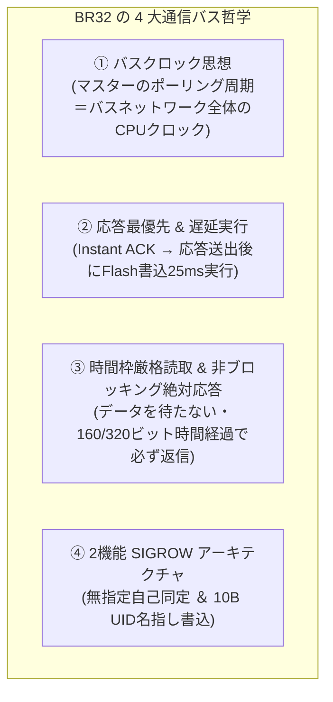

<!--
Copyright (c) 2026 ADX Project Contributors
SPDX-License-Identifier: CC-BY-4.0
-->

# BR32 Protocol Concept
## LIN Break, RS-485, 32-Byte Fixed Frame, Dual-Function SIGROW Architecture

- **プロトコル名**: **BR32** (LIN **B**reak, **R**S-485, **32**-Byte Fixed Frame)
- **策定日**: 2026-09-28
- **対象ターゲット**: ADX Core-D (Microchip ATtiny1616-MNR, RS-485: SP485EEN)
- **仕様書**: [`specification.md`](./specification.md)

---

## 1. 構想の経緯

ADX では USB を排して RS-485 を利用する設計上、この RS-485 で如何に安定的・決定論的に送受信できるかが基幹の命題である。  
これまで、LN-485 やブートローダーの開発を行ってきたが、LN-485 による ADX 同士（マイコン同士）のやりとりは極めてスムーズに開発が進んだものの、PC ホストツールを用いたブートローダーの開発は難航し、一度は失敗に終わった。

ここで痛感されたのは、単なる通信パラメータの調整不足ではなく、**「通信の不可視性を排除する根源的な哲学の不足」** であった。  
すなわち、ブートローダーにおいて通信が滞った際、**「問題が通信路（ノイズ・Auto-DE・ジッター）にあるのか、マイコン側の処理（Flash 消去書き込み 25ms による無応答・クラッシュ）にあるのか、あるいは動作状況にあるのか」** が外側から全く切り分けられないという根本的な問題が生じていた。

BR32 は、この不可視性を完全に根絶し、**OneToOne（1対1）からマルチドロップ（1対N）までを一本の太い筋でシームレスに繋ぐ** ために構想されたプロトコル哲学である。

---

## 2. BR32 の 4 大通信バス哲学構想



### 2.1 バスクロック思想（Bus Clock Paradigm）
* マスターのポーリング周期（$T_{\text{poll}}$）は、BR32 バスネットワーク全体における **「CPU クロック」** として機能する。
* スケッチ書き込みのようなスレーブに負荷の高い処理（Flash 消去書き込み 25ms）を行う時は、マスターのポーリング周期（クロック）を十分に長く保守する。
* これにより、**「極めて遅い周期（例: 1秒）にすることで、全体の挙動を確実に把握・デバッグできる」** とともに、安定性を確認しながら徐々にクロックを上げて本番運用へ移行する決定論的な開発スキームを提供する。

### 2.2 応答最優先原理（Instant ACK $\rightarrow$ Delayed Execution）
* スレーブはデータを受信した後、重い計算や Flash 書き込みを始める前に、**必ず CRC チェックとステータス生成のみを行って即座に送信応答を返す**。
* 応答送出が完全に完了した後に、初めて Flash 消去書き込み等の重い作業に入る。
* そして、書き込み作業が終わったら「作業準備完了フラグ（Ready ビット）」を立てておく。次のポーリングが来たら、「前回の作業は完了した」というステートを返信に載せる。
* これにより、マイコンの書き込み負荷が通信トランザクションを阻害することが原理的にゼロになる。

### 2.3 時間枠厳格読取 ＆ 非ブロッキング絶対応答（Time-Windowed Receiver）
* スレーブは、**「正しいデータが来るまで待つ」ことは絶対にしない**。
* LINAUTO で校正された 1 ビット時間に基づき、**「32 バイト分の伝送時間枠（約 320〜360 ビット時間）」の間だけきっちり読み取る**。
* 時間枠が過ぎたら、それ以上は一切読み取らず直ちに打ち切る。
* 32 バイト揃っていようが、途中で欠落していようが、CRC が不一致だろうが、**時間枠満了時に成否と取得バイト数を載せて必ず返信する**。
* そして応答後は直ちに `WFB=1`（Wait For Break）をアームし、次の BREAK 以外を完全無視して待機する。

### 2.4 BREAK ハートビート統計によるバス健全性評価
* 32 バイトの固定長であり、マスターのポーリング間隔が一定ならば、マスターのポーリングの間に、スレーブの応答 BREAK が必ず 1 つ立つ。
* マスターのポーリング BREAK と応答 BREAK の間の時間遅延 $\Delta T$ およびそのばらつき（ジッター）を統計監視することで、**通信路の電気的健全性をリアルタイムに 100% 定量評価** する。

---

## 3. ブートローダーの「たった 2 つの機能」（SIGROW アーキテクチャ）

ATtiny1616 の内蔵 ROM には、製造時に刻印された **10 バイトの固有シリアル番号（`SIGROW.SERNUM[0..9]`）** が存在する。  
BR32 ブートローダーは、複雑な EEPROM 管理やアドレスネゴシエーションを完全に排除し、**「たった 2 つの極小・決定論的機能」** のみを持つ。

```text
================================================================================
【機能 ①: OneToOne SIGROW 自己同定（Discovery）】
  ・条件: TARGET_SIGROW == 全0x00 (無指定 / OneToOne)
  ・挙動: 自身の SIGROW (10B) を載せて 32 バイト即座に返信。
  ・用途: 工場出荷時や新品基板、1対1接続時に、PCが基板の固有シリアルを一撃で自動認識。
================================================================================
【機能 ②: SIGROW 完全一致でのスケッチ書き込み（Programming）】
  ・条件: TARGET_SIGROW == MY_SIGROW (10バイト完全一致)
  ・挙動: 16B データを SRAM バッファに蓄積 → 即時 ACK 返信 → 4チャンク目でFlash書込(25ms)。
  ・用途: 1対1環境はもちろん、マルチドロップバス上に 20 台が接続されていても、
          SIGROW が合致する 1 台だけが書き換わり、他全台は完全沈黙（衝突ゼロ）。
================================================================================
※ どちらの条件にも合致しないフレームを受信した場合は、一切発言せず完全沈黙（WFB=1復帰）。
```

---

## 4. なぜ 16 バイトではなく「32 バイト（BR32）」なのか？

1. **10 バイトの SIGROW と 16 バイトのデータペイロードが完璧に同居**:
   - `CMD(1B) + SEQ(1B) + TARGET_SIGROW(10B) + PAGE(1B) + DATA(16B) + FLAGS(1B) + CRC16(2B) = 32 Bytes`
2. **Flash 64B ページが「わずか 4 フレーム」で書き終わる**:
   - ATtiny1616 の 1 ページ（64B）を、16B $\times$ 4 チャンクで転送可能。通信往復回数が従来の半分になり、高速化と堅牢性を両立。
3. **USB-RS485 ドングルの FIFO（64 バイト）との物理的親和性**:
   - 32 バイトは USB パケット境界の分割グリッチ（Auto-DE 途切れ）を起こさない最も安全なサイズ。
