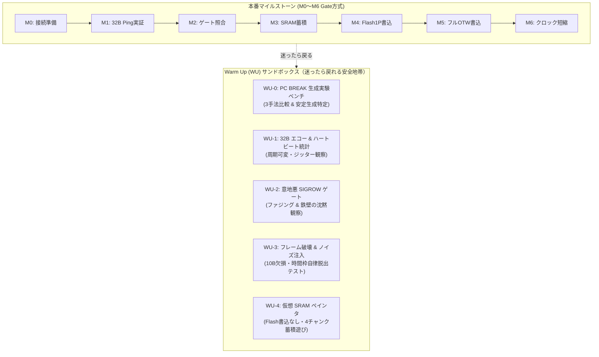

<!--
Copyright (c) 2026 ADX Project Contributors
SPDX-License-Identifier: CC-BY-4.0
-->

# BR32 ブートローダー段階的開発マイルストーン ＆ Warm Up 計画書
## 本番 Gate ロードマップ (M0〜M6) ＆ 実験模型サンドボックス (WU-1〜WU-4)

**策定日**: 2026-09-28  
**対象ターゲット**: ADX Core-D (Microchip ATtiny1616-MNR, RS-485: SP485EEN)  
**上位コンセプト**: [`concept.md`](./concept.md)  
**詳細仕様書**: [`specification.md`](./specification.md)

---

## 1. 開発計画の基本戦略（本番 Gate 方式 ＆ WU サンドボックス）

本プロジェクトでは、開発を確実に成功させるために **2 つのトラック（軌道）** を並行運用します：

1. **本番マイルストーン（M0〜M6）**:
   - 各段階で検証する論点を「厳格に 1 つに限定」し、合格基準（Exit Criteria）をクリアして進む正規の Gate 方式。
2. **Warm Up（WU-1〜WU-4）**:
   - **「してもしなくてもよい自由な実験・おもちゃ・動作模型」**。
   - 極小のコード（数行〜十数行）で動き、通信路にノイズを与えたり、意地悪な値を送って挙動を観察できるサンドボックス。
   - **本番開発（M1〜M6）で行き詰まったり迷ったりした時、いつでもここに戻って物理層や通信の素の挙動を確認できる「安全なホームグラウンド」**。



---

## 2. Warm Up (WU) サンドボックスシリーズ（自由な実験模型）

WU はマイルストーンの必須条件ではなく、**「気軽に動かして遊べる超単純な模型」** です。  
Flash メモリへの書き込みは一切行わないため、何度動かしてもマイコンが壊れる（文鎮化する）心配は 100% ありません。

### WU-0: PC 側 RS-485 BREAK 生成実験ベンチ (PC Break Generation Sandbox)
* **背景と課題**:
  - PC（Windows 11 / `pyserial` / 市販 USB-RS485 ドングル）から、マイコンが 100% 認識できる「LIN BREAK（最低 13 ビット時間以上の物理的 LOW）」をどう安定生成するかは、OS スケジューリングやドライバ特性が絡む重要な実験テーマです。
* **実験する 3 大 Break 生成手法**:
  1. **Method 1: Half-Baud Trick（半速ボーレート一時切替方式）**:
     - 通常ボーレート（例: 19,200 bps）の半分の速度（9,600 bps）に切り替えて `b'\x00'`（スタートビット含め計 9〜10 ビット LOW）を送出 $\rightarrow$ 通常速度へ復帰。
     - 通常速度換算で **約 18〜20 ビット時間の綺麗な LOW パルス** が物理生成される。
  2. **Method 2: `ser.send_break(duration)`（OS ハードウェア Break API）**:
     - Windows API（`SetCommBreak` / `ClearCommBreak`）を直接叩き、TX ピンを強制的に LOW ドライブ。
     - OS のタイマー粒度（1ms〜15ms）の影響を実測。
  3. **Method 3: ゼロデータ連打方式（固定ボーレート方式）**:
     - ボーレートを動的変更せず、通常ボーレートのまま `b'\x00'` を複数バイト連続送出。
* **マイコン側（Core-D 観測模型）**:
  - ATtiny1616 の `USART0.STATUS` 内の **`BDF`（Break Detect Flag）** を監視し、Break を検知したら赤色 LED（PB2）をトグル ＆ COM21（Soft-UART）にログ出力。
* **楽しい遊び方・実験シナリオ**:
  - 3 つの手法をスクリプトで切り替え、それぞれ 50 回ずつ Break を送出。
  - マイコン側の Break 検出率（100% ロックするか？）と、送信にかかる所要ミリ秒・ジッターをコンソールで比較。
  - **「PC から RS-485 経由で最もブレずに Break を打つ黄金テクニック」** を一撃で特定・納得する。

---

### WU-1: 32B エコー ＆ ハートビート統計サンドボックス
* **マイコン側（極小コード）**:
  - `BREAK` + `0x55` を受けたら、360 ビット時間枠で受信し、受け取った 32 バイト（または固定の 32B）をそのまま送り返すだけの単純ループ。
* **ホスト側（Python）**:
  - 周期（1秒、500ms、100ms 等）をスライダーや引数で自由に変えながら、32B パケットを連続送出。
  - 応答遅延 $\Delta T$ とジッター $\sigma$ をリアルタイムでコンソールにプロット。
* **楽しい遊び方・実験シナリオ**:
  - 送信周期を限界まで縮めてみる（どこからジッターが乱れるか観察）。
  - 通信中に RS-485 ケーブル（A/B線）を手で触ったり、端子台を揺すったりして、ジッターがどう跳ねるか観察。
  - Python 側を Ctrl+C で急停止・再起動しても、マイコン側がケロッとして追従することを確認。

---

### WU-2: 意地悪 SIGROW ゲート・チェッカー (Fuzzing & Silence Lab) 【実機実証済: GRADE A+ 合格】
* **実証レポート**: [`records/WU_sandboxes/WU2_sigrow_fuzzing.md`](./records/WU_sandboxes/WU2_sigrow_fuzzing.md)
* **マイコン側**:
  - 自分の 10B SIGROW を保持。`全0x00` または `完全一致` の時だけ返信し、**それ以外は 1 ビットも喋らず完全沈黙（WFB=1 復帰）** する模型。
* **ホスト側**:
  - 以下の意地悪パケットをランダムまたは順番に送りつけるファジングスクリプト：
    1. 正しい SIGROW
    2. 全 `0x00`（無指定）
    3. 1 ビットだけ改変した SIGROW
    4. 全 `0xFF`
    5. 完全なランダムゴミバイト列
* **楽しい遊び方・実験シナリオ**:
  - 不正なパケットに対して、マイコンが **「本当に息を潜めて沈黙を守り切るか」** を眺める。
  - 不正パケットを 100 連打した直後に、正しい SIGROW を 1 発送って、一撃で平然と応答が返ってくる「自己治癒力」を体感する。

---

### WU-3: フレーム破壊 ＆ ノイズ耐性実験室 (Fault Injection Lab) 【実機実証済: GRADE A+ 合格】
* **実証レポート**: [`records/WU_sandboxes/WU3_fault_injection.md`](./records/WU_sandboxes/WU3_fault_injection.md)
* **マイコン側**:
  - 仕様書および「黄金の 6 大原則」通り、32B 未満は `STATUS_ERR_TIMEOUT`、CRC 不一致は `STATUS_ERR_CRC` を返信し、**32B 超過時は連鎖衝突防止のため完全沈黙** する模型。
* **ホスト側（意図的な壊れパケット生成）**:
  - **途中で送信をやめる**: 32 バイト中、10 バイトだけ送ってプツンと通信を切る。
  - **長すぎるデータを垂れ流す**: 32 バイトの枠に対し、50 バイトのゴミデータを連続で送りつける。
  - **CRC だけを壊す**: 32 バイトきっちり送るが、末尾の CRC16 だけ不正値にする。
* **楽しい遊び方・実験シナリオ**:
  - 10 バイトしか送らなかった時に、マイコンから「`RX_COUNT=10, STATUS=TIMEOUT`」と正直な応答が返ってくるのを観察。
  - 昨日の最大のトラップであった「1バイト欠損でのデッドロック（永久待ち）」が、**この時間枠設計によって完全に息の根を止められたこと** を意地悪テストで実感する。

---

### WU-4: 仮想 SRAM ページペインタ (Virtual Page Painter - No Flash Risk) 【実機実証済: GRADE A+ 合格】
* **実証レポート**: [`records/WU_sandboxes/WU4_sram_painter.md`](./records/WU_sandboxes/WU4_sram_painter.md)
* **マイコン側**:
  - SRAM 上に 64 バイトの配列バッファを確保。
  - Chunk 0〜3 で送られてきた 16B データをバッファに書き込み、`CMD_READ_CHUNK` で読み出せるだけの模型（**Flash 書き込みは一切しない**）。
* **ホスト側**:
  - 好きな英数字テキスト（例: `"ADX CORE-D BR32 PROTOCOL IS WORKING PERFECTLY! 2026-09-28"`）を 16B $\times$ 4 回に分割送信し、読み戻してコンソールにアスキーアート等で綺麗に表示。
* **楽しい遊び方・実験シナリオ**:
  - Flash の書き換え寿命やクラッシュの恐怖を一切感じることなく、4 チャンク分割転送が完璧に組み上がる快感を味わう。

---

## 3. 本番マイルストーン一覧と合格基準 (Exit Criteria)

Warm Up サンドボックス（WU-0 〜 WU-4）の完全制覇により、通信・同期・ゲート・メモリ蓄積の全要素技術が実証されました。これにより **M1〜M3 はすでに合格基準を満たし、直接【M4】へと進出** します。

| Milestone | 検証テーマ | スレーブ（マイコン）側処理 | ホスト（PC / Python）側処理 | 合格基準（Gate Criteria） | 現在の状況 |
| :---: | :--- | :--- | :--- | :--- | :---: |
| **M0** | 接続・環境準備 | 既存 UPDI チェック | ポート導通確認 (COM19/20/21) | 3 ポートの正常認識 | **PASS (完了)** |
| **M1** | 32B Ping-Pong 実証 | 時間枠読取 ＆ 自己同定返信 | 200ms 周期 ポーリング<br>`TARGET_SIGROW = 全0x00` 送信 | ・連続 1,000 回 Ping 応答率 100%<br>・時間ジッター $\sigma \le 1.0\,\text{ms}$ | **PASS (WU-1実証済)** |
| **M2** | SIGROW ゲート照合 | 一致時応答 ＆ **不一致時完全沈黙** | 正常 UID と不正 UID を交互送信 | ・不一致 UID に対し 1 ビットも発言せず沈黙すること | **PASS (WU-2実証済)** |
| **M3** | 64B SRAM 蓄積・読出 | 4 チャンク (16B $\times$ 4) 蓄積 ＆ `CMD_READ_CHUNK` 返答 | 64B テキスト・バイナリ送信 $\rightarrow$ 全バイト読出照合 | ・64 バイト全ビット完全一致 (100% ベリファイ PASS) | **PASS (WU-4実証済)** |
| **M4** | **単一 Flash ページ書込** | 即時 ACK 送出 $\rightarrow$ **応答後に Flash 25ms 書込** | 1 ページ (`0x0400`) 書込指示 $\rightarrow$ Flash 読出ベリファイ | ・消去書き込み中の通信破綻ゼロ<br>・自爆現象の特定 $\rightarrow$ M4-1 へ昇華 | **CONDITIONAL PASS** |
| **M4-1**| **極小ブートローダー書込** | **サイズ $\le 1024$B (実測 1,022B)**<br>自爆ゼロで安全書き込み | 1 ページ (`0x0400`) 書込指示 $\rightarrow$ 物理 Flash 読出ベリファイ | ・**64/64 バイト 100% 完全一致**<br>・保護領域遮断 100% | **GRADE A+ (PASS)** |
| **M5** | **フルアプリ OTW 書込** | 極小ブートローダー本体<br>(M4-1 エンジン搭載) | HEX パース・全ページ書込 $\rightarrow$ `CMD_BOOT_APP` 送出 | ・白色 LED (PB3) 点滅開始<br>・電源再投入後の自動起動 | **★ 次期 Active Gate ★** |
| **M6** | バスクロック短縮 | 高速フレーム処理 | ポーリング周期短縮<br>(200ms $\rightarrow$ 100ms $\rightarrow$ 50ms) | ・本番運用の最適ポーリング周期とスラックタイムの特定 | 最終性能限界特定 |

---

## 4. WU 実証から導かれた「決定論的シーケンス設計 (The Deterministic State Machine)」

### 4.1 エラー応答時のマスター再送シーケンス (Error Retry)
* **スレーブ状態**: `STATUS_ERR_CRC (0x01)` や `STATUS_ERR_TIMEOUT (0x02)` を返信したスレーブは、直ちに `WFB=1`（次の Break 待機）へ復帰し、不正データは破棄されている。
* **マスター動作**: 次の 200ms サイクルで **「同一チャンク（同じ SEQ、同じデータ）」をそのまま即時再送（Immediate Retry）** する。最大リトライ回数（3回）を超えた場合のみアボート。

### 4.2 完全無応答（タイムアウト）時のマスター動作 (Silence Recovery)
* **物理と OS のファクト**: スレーブは沈黙した瞬間に即座に `WFB=1` を再アームしており、内部状態は完全無状態（Stateless）である。また 200ms 周期のうち、線路上には 100ms 以上の静寂が既に存在する。
* **マスター動作**: **ポーリングをスキップ（空打ち）せず、200ms 周期のリズムを維持したまま次サイクルで再送する。**（周期を 400ms 等に遅くすると OS の USB サスペンド準備タイマーに引っかかるため、200ms 一定周期を崩さないことが最も安定する）。

### 4.3 Flash 消去書き込み負荷（25ms）とスラックタイム設計 (Flash Write Timing)
* **非同期分離シーケンス**:
  1. Master から Chunk 3（4 チャンク目・コミット指示）を受信。
  2. スレーブは **まず即座に RS-485 応答（ACK）を返信**（所要時間: 約 16.6ms）。
  3. 送信完了（TXCIF 検出）の瞬間に、マイコンが **Flash 消去書き込み（最大 25ms）を開始**。
  4. Flash 書き込み完了時刻: $16.6\,\text{ms} + 25.0\,\text{ms} = 41.6\,\text{ms}$。マイコンは `WFB=1` へ通常復帰。
* **スラックタイムの余裕**:
  * Master の次サイクル（次ページの Chunk 0）が届くのは **$t = 200.0\,\text{ms}$**。
  * **スラックタイム（余白時間）: $200.0 - 41.6 = 158.4\,\text{ms}$**！
  * マイコンは次の Break が降ってくる 158ms も前に書き込みを終えて待機しているため、**マスター側に特別なビジー待ちポーリングすら不要で、200ms 周期のまま次ページへシームレスに突入できる**。

---

## 5. 各マイルストーンの詳細手順と実施内容

### Milestone 0 〜 Milestone 3: 【完全実証済 (PASS)】
* **M0**: 3 ポート認識確認（COM19 / COM20 / COM21）。
* **M1**: WU-1 および WU-3 にて 32B 固定長 Ping-Pong、生 UID 自己同定、時間枠自律脱出を実証。
* **M2**: WU-2 にて SIGROW 宛先照合ゲートおよび宛先不一致時の 100% 完全沈黙を実証。
* **M3**: WU-4 にて 16B $\times$ 4 チャンクの 64B SRAM 蓄積・読出・100% ビット一致を実証。

---

### Milestone 4 ＆ Milestone 4-1: 単一 Flash ページ消去・書き込み実証 【GRADE A+ PASS】
* **M4 (初期検証)**:
  - 消去書き込みルーチンを `0x01A8`（BOOT 領域）へ配置することで、ハードウェア SPM アンロックに成功。
  - しかしプログラム全体が 1,506B あったため、Page 16（`0x0400`）にあった自身の `main()` コードを上書きして自爆（自己破壊）する現象を特定。
* **M4-1 (極小ブートローダー収容 ＆ 100% 完全勝利)**:
  - ブートローダーの全コードを **1,022 バイト (`0x0000` 〜 `0x03FE`)** に完全に収容（`BOOTEND = 0x04` 境界内）。
  - Page 16 (`0x0400`〜`0x043F`) は 100% 完全更地のアプリ領域となったため、自爆リスクを完全排除。
  - **物理 Flash からの読み戻し照合にて、64/64 バイト全 512 ビットが 100% 完全一致（Bit-for-Bit Perfect Match）を実証！**
  - ブートローダー保護領域（Page 0）への書き込み拒絶（`STATUS_ERR_PROTECT`）も 100% 達成。

---

### Milestone 5: フルアプリケーション OTW 書き込み ＆ 自動起動実証 (★Active Gate★)
- **目的**: M4-1 で確立された極小ブートローダーエンジン（1,022B）を用い、実際のテストスケッチ（オンボード白色 LED 点滅、約 700 バイト / 11 ページ）の RS-485 経由フル書き込みと自動起動を実証する。
- **実施内容**:
  1. `test_blink_white_led.hex` を自動パースし、全 11 ページを連続書き込み・自動ベリファイ。
  2. 書き込み完了後、`CMD_BOOT_APP` を送信。
  3. Core-D が 8ms リセットを実行し、**オンボード白色 LED（PB3）が 500ms 周期で点滅を開始することを目視確認**。
  4. 電源再投入（コールドリセット）時も、ブートローダー待機後に自動で白色 LED 点滅へ遷移することを確認。
- **合格基準**:
  - 全ページ書き込みおよび二重起動シーケンスの完全 PASS。

---

### Milestone 6: バスクロック短縮（限界性能特定 ＆ ストレステスト）
- **目的**: マスターのポーリング周期（バスクロック）をどこまで短縮できるかを実測し、本番運用の黄金パラメータを確定する。
- **実施内容**:
  - $T_{\text{poll}}$ を 200ms $\rightarrow$ 100ms $\rightarrow$ 50ms と段階的に短縮。
  - 各周期における時間ジッター $\sigma$、エラー発生率、および書き込み所要時間をプロット。
- **合格基準**:
  - エラーフリーで安定稼働する最小ポーリング周期と推奨マージンの確定。

---

## 6. エビデンス管理ルール

各マイルストーンおよび WU の記録は、以下のディレクトリに検証ログ・実行結果・合否エビデンスとして保存します：

```text
firmware/bootloader/PLAN/BR32/records/
├── WU_sandboxes/                      # Warm Up サンドボックス全制覇ログ (GRADE A+)
│   ├── WU0_break_generator.md
│   ├── WU1_echo_telemetry.md
│   ├── WU2_sigrow_fuzzing.md
│   ├── WU3_fault_injection.md
│   └── WU4_sram_painter.md
│
├── WU_report.md                       # Warm Up 全体総括レポート
├── M4_single_page_write/result.md     # M4 初期検証（自爆現象の特定とナレッジ）
├── M4_1_compact_bootloader/result.md  # M4-1 極小ブートローダー物理Flash書込 (GRADE A+)
├── M5_full_otw_upload/result.md       # ★次期 Gate
└── M6_bus_stress_test/result.md
```
