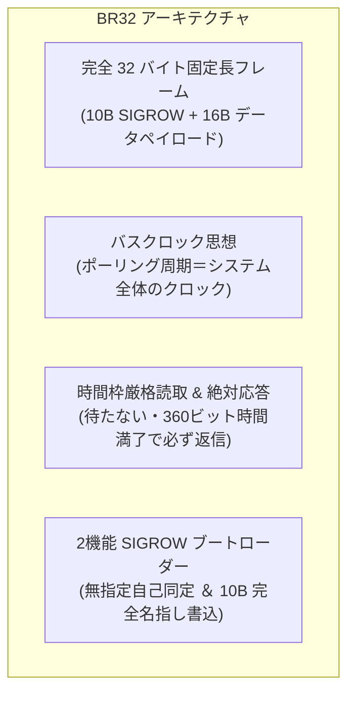

<!--
Copyright (c) 2026 ADX Project Contributors
SPDX-License-Identifier: CC-BY-4.0
-->

# BR32 プロトコル開発仕様書 (Specification v1.0)
## 32-Byte 固定長フレーム ＆ 2機能 SIGROW アーキテクチャ

**策定日**: 2026-09-28  
**対象ターゲット**: ADX Core-D (Microchip ATtiny1616-MNR, RS-485: SP485EEN)  
**上位コンセプト文書**: [`concept.md`](./concept.md)  
**ハードウェアナレッジベース**: [`../../RS485_BOOTLOADER_KNOWLEDGE_BASE.md`](../../RS485_BOOTLOADER_KNOWLEDGE_BASE.md)

---

## 1. 概要とアーキテクチャ

**BR32**（LIN **B**reak, **R**S-485, **32**-Byte Fixed Frame）は、過酷な半二重 RS-485 バスにおいて「通信の不可視性を排除」し、**OneToOne（1対1 単体 Bring-up）からマルチドロップ（1対N フィールド運用）までを同一バイナリ・同一プロトコルでシームレスに実現する** ための超堅牢ブートローダー仕様です。



---

## 2. ハードウェア仕様 (ADX Core-D 確定値)

| 信号名 | MCU ピン | ポート | 接続先デバイス / 機能 | 初期化レジスタ設定 |
| :--- | :---: | :---: | :--- | :--- |
| **TXD** | 20 | `PA1` | SP485EEN Pin 4 (DI) | `PORTMUX.CTRLB = PORTMUX_USART0_ALTERNATE_gc;`<br>`VPORTA.DIR \|= PIN1_bm;` |
| **RXD** | 1 | `PA2` | SP485EEN Pin 1 (RO) | `VPORTA.DIR &= ~PIN2_bm;` |
| **DE** | 5 | `PA4` | SP485EEN Pin 3 (DE) | `VPORTA.DIR \|= PIN4_bm;`<br>`VPORTA.OUT &= ~PIN4_bm;` (通常 LOW) |
| **/RE** | 8 | `PA7` | SP485EEN Pin 2 (/RE) | `VPORTA.DIR \|= PIN7_bm;`<br>`VPORTA.OUT &= ~PIN7_bm;` (通常 LOW / 送信時 HIGH) |
| **RED LED** | 7 | `PB2` | オンボード赤色 LED | `VPORTB.DIR \|= PIN2_bm;` (待機時 2Hz 点滅) |
| **WHITE LED**| 6 | `PB3` | オンボード白色 LED | `VPORTB.DIR \|= PIN3_bm;` (アプリ稼働表示) |
| **DEBUG TX** | 10 | `PB4` | CH342K Port B RX (SoftwareSerial) | PC デバッグシリアル送信 (9600 bps) |
| **DEBUG RX** | 11 | `PB5` | CH342K Port B TX (SoftwareSerial) | PC デバッグシリアル受信 (9600 bps) |

### トランシーバー制御（自爆エコー完全遮断）
* **送信前**: `DE=1`, `/RE=1`（受信物理遮断）設定 $\rightarrow$ 安定化ディレイ（約 50µs）。
* **送信後**: `USART0.STATUS & USART_TXCIF_bm`（最後のストップビット完了）待機 $\rightarrow$ `DE=0`, `/RE=0` 復帰 $\rightarrow$ 受信 FIFO フラッシュ。

---

## 3. フレームフォーマット仕様 (完全 32 バイト固定長)

マスター送信・スレーブ返信ともに、すべてのトランザクションは **32 バイト固定長** で統一されます。

```text
[Master 送信: LIN ヘッダ + 32 バイトフレーム]
+-------------+---------------+------------+--------------------------------+
| BREAK (LOW) | DELIMITER(HI) | SYNC(0x55) | MASTER FRAME (32 Bytes 固定)   |
| >= 13 bits  | >= 1 bit      | 1 Byte     | Byte 0 ..................... 31|
+-------------+---------------+------------+--------------------------------+

[Slave 応答: 32 バイトフレーム (ID合致ノードのみが時間枠満了で送出)]
+--------------------------------+
| SLAVE FRAME (32 Bytes 固定)    |
| Byte 0 ..................... 31|
+--------------------------------+
```

### 3.1 マスター送信フレーム (Master-to-Slave: 32 Bytes)

| Offset | フィールド名 | 型 | 説明 |
| :---: | :--- | :---: | :--- |
| `0` | **`CMD`** | `uint8_t` | コマンド識別子（下記 3.3 節参照） |
| `1` | **`SEQ`** | `uint8_t` | シーケンス番号（`0x00`〜`0xFF`） |
| `2..11`| **`TARGET_SIGROW[10]`** | `uint8_t[10]` | **宛先 UID（10B シリアル）**。<br>・`全0x00`: **無指定（OneToOne 自己同定）**<br>・`特定UID`: **完全名指し（マルチドロップでも衝突ゼロ）** |
| `12` | **`PAGE_IDX`** | `uint8_t` | 対象 Flash ページ番号（`0x08`〜`0xFF`, 1ページ=64B） |
| `13` | **`CHUNK_FLAGS`** | `uint8_t` | **チャンク番号 ＆ 制御フラグ**<br>・Bit 0..1: `CHUNK_IDX` (`0`〜`3`, 1チャンク=16B)<br>・Bit 2: `COMMIT_PAGE` (1: 4チャンク蓄積完了・Flash書込指示)<br>・Bit 3: `LAUNCH_APP` (1: アプリ自動起動指示) |
| `14..29`| **`DATA[16]`** | `uint8_t[16]` | **データペイロード（16 バイト）** |
| `30` | **`CRC16_H`** | `uint8_t` | CRC-16-CCITT 上位バイト (`Byte 0..29` を計算) |
| `31` | **`CRC16_L`** | `uint8_t` | CRC-16-CCITT 下位バイト |

### 3.2 スレーブ返信フレーム (Slave-to-Master: 32 Bytes)

スレーブは返信フレームに **常に自身の 10 バイト SIGROW を載せて返信** します。

| Offset | フィールド名 | 型 | 説明 |
| :---: | :--- | :---: | :--- |
| `0` | **`STATUS`** | `uint8_t` | 実行結果ステータス（下記 3.4 節参照） |
| `1` | **`ECHO_SEQ`** | `uint8_t` | 受信した `SEQ` のエコーバック |
| `2` | **`RX_COUNT`** | `uint8_t` | **時間枠内に受信できた実バイト数（正常なら `32`）** |
| `3` | **`DEV_STATE`** | `uint8_t` | **スレーブ状態フラグ**（Bit 0: `READY/BUSY`, Bit 1: `BOOT_MODE`） |
| `4..13`| **`MY_SIGROW[10]`** | `uint8_t[10]` | **スレーブ自身の内蔵 10B 固有シリアル（`SIGROW.SERNUM`）** |
| `14` | **`CUR_PAGE`** | `uint8_t` | 現在バッファリング／書き込み中のページ番号 |
| `15` | **`CUR_CHUNK_FLAGS`**| `uint8_t` | 現在のチャンクインデックスおよび状態 |
| `16..29`| **`EXTRA[14]`** | `uint8_t[14]` | 読み出しデータ（14B）または詳細テレメトリ |
| `30` | **`CRC16_H`** | `uint8_t` | CRC-16-CCITT 上位バイト (`Byte 0..29` を計算) |
| `31` | **`CRC16_L`** | `uint8_t` | CRC-16-CCITT 下位バイト |

### 3.3 コマンドコード (`CMD`) 一覧

| コマンド名 | 値 | 説明 |
| :--- | :---: | :--- |
| **`CMD_IDENTIFY`** | `0x01` | **【機能①】SIGROW 自己同定**。`TARGET_SIGROW` が全0の場合に応答し、自身の UID を開示。 |
| **`CMD_WRITE_CHUNK`**| `0x10` | **【機能②】16B データ書き込み**。`TARGET_SIGROW` 完全一致時のみ SRAM に蓄積。 |
| **`CMD_READ_CHUNK`** | `0x20` | 指定ページ・チャンクの Flash データを読み出す（ベリファイ用）。 |
| **`CMD_BOOT_APP`** | `0x30` | ブートローダーを終了し、ユーザーアプリ（0x0400〜）へ遷移。 |

### 3.4 ステータスコード (`STATUS`) 一覧

| ステータス名 | 値 | 説明 |
| :--- | :---: | :--- |
| **`STATUS_OK`** | `0x00` | 32 バイト完全受信 ＆ CRC 一致。処理受託。 |
| **`STATUS_ERR_CRC`** | `0x01` | 32 バイト受信したが、CRC が不一致。 |
| **`STATUS_ERR_TIMEOUT`**| `0x02` | **時間枠満了時点で 32 バイト未満（`RX_COUNT < 32`）の欠損検知**。 |
| **`STATUS_ERR_PROTECT`**| `0x03` | ブートローダー保護領域（`0x0000`〜`0x03FF`）への書き込み拒絶。 |
| **`STATUS_ERR_BUSY`** | `0x04` | 前回の Flash 消去書き込みが完了していない（過密ポーリング検知）。 |

---

## 4. ブートローダーの 2 大機能ロジック (C言語実装イメージ)

ブートローダーのフレーム評価処理は、極めてシンプルかつ決定論的です：

```c
// 32バイト時間枠満了後に実行される判定関数
void br32_process_frame(const uint8_t *rx_buf, uint8_t rx_count) {
    master_frame_t *m = (master_frame_t *)rx_buf;
    slave_frame_t resp;
    memset(&resp, 0, sizeof(resp));

    // 1. スレーブ自身の SIGROW (10B) を応答フレームにセット
    memcpy(resp.my_sigrow, (const void *)&SIGROW.SERNUM0, 10);
    resp.echo_seq = m->seq;
    resp.rx_count = rx_count;

    // 2. 宛先照合 (Gate Check)
    bool is_broadcast = is_all_zero(m->target_sigrow);
    bool is_for_me    = (memcmp(m->target_sigrow, resp.my_sigrow, 10) == 0);

    // ★どちらでもない場合は、完全沈黙で直ちに WFB=1 へ復帰！
    if (!is_broadcast && !is_for_me) {
        return; 
    }

    // 3. 整合性チェック
    if (rx_count < 32) {
        resp.status = STATUS_ERR_TIMEOUT;
        rs485_send_32b(&resp); // 欠落をマスターへ通知
        return;
    }
    if (!check_crc16(rx_buf, 32)) {
        resp.status = STATUS_ERR_CRC;
        rs485_send_32b(&resp); // CRC異常を通知
        return;
    }

    // 4. コマンド処理
    switch (m->cmd) {
        case CMD_IDENTIFY:
            // 【機能①】自己同定: SIGROW を載せて即時 OK 返信
            resp.status = STATUS_OK;
            resp.dev_state = DEV_STATE_READY | DEV_STATE_BOOT_MODE;
            rs485_send_32b(&resp);
            break;

        case CMD_WRITE_CHUNK:
            // 【機能②】書き込み: 自分宛て完全一致時のみ
            if (!is_for_me) return; // 無指定では書き込みを拒絶

            // 16B データを SRAM ページバッファ (0..63) に格納
            uint8_t chunk_idx = m->chunk_flags & 0x03;
            memcpy(&page_buffer[chunk_idx * 16], m->data, 16);

            resp.status = STATUS_OK;
            resp.dev_state = DEV_STATE_READY | DEV_STATE_BOOT_MODE;

            // コミットフラグがある場合は BUSY 予告
            if (m->chunk_flags & FLAG_COMMIT_PAGE) {
                resp.dev_state &= ~DEV_STATE_READY; // BUSY 予告
            }

            // ★応答最優先: 返信を先に送出！
            rs485_send_32b(&resp);

            // ★返信完了直後に、Flash 消去書き込み (25ms) を実行！
            if (m->chunk_flags & FLAG_COMMIT_PAGE) {
                nvm_erase_write_page(m->page_idx);
            }
            break;

        case CMD_BOOT_APP:
            resp.status = STATUS_OK;
            rs485_send_32b(&resp);
            _delay_ms(5);
            wdt_reboot_to_app();
            break;
    }
}
```

---

## 5. タイミング仕様 ＆ 時間枠（Time Window）設計

### 5.1 時間枠（$T_{\text{window}}$）の算出

* **32 バイトの伝送ビット数**:
  $$N_{\text{bits}} = 32 \text{ bytes} \times 10 \text{ bits/byte (8N1)} = 320 \text{ bits}$$
* **タイムウィンドウ時間 $T_{\text{window}}$**:
  マスター送信のジッターおよび微小ギャップを許容するため、**360 ビット時間** を時間枠とします。
  $$T_{\text{window}} = 360 \times T_{\text{bit}}$$

| ボーレート | 1ビット時間 $T_{\text{bit}}$ | 32B 伝送時間 | 時間枠 $T_{\text{window}}$ (360 bits) |
| :---: | :---: | :---: | :---: |
| **115,200 bps** | $8.68\,\mu\text{s}$ | $2.78\,\text{ms}$ | **約 $3.12\,\text{ms}$** |
| **38,400 bps** | $26.04\,\mu\text{s}$ | $8.33\,\text{ms}$ | **約 $9.38\,\text{ms}$** |
| **19,200 bps** | $52.08\,\mu\text{s}$ | $16.67\,\text{ms}$ | **約 $18.75\,\text{ms}$** |
| **9,600 bps** | $104.17\,\mu\text{s}$ | $33.33\,\text{ms}$ | **約 $37.50\,\text{ms}$** |

### 5.2 Flash ページ書き込み（4 チャンク蓄積フロー）

```text
[Master]                          [Slave (Core-D)]
   |                                     |
   |-- Break+55 + Chunk 0 (16B) -------->| -> SRAM Buffer 0..15 に蓄積
   |<- 32B Reply (STATUS_OK, READY=1) ---| (即時返信)
   |                                     |
   |-- Break+55 + Chunk 1 (16B) -------->| -> SRAM Buffer 16..31 に蓄積
   |<- 32B Reply (STATUS_OK, READY=1) ---| (即時返信)
   |                                     |
   |-- Break+55 + Chunk 2 (16B) -------->| -> SRAM Buffer 32..47 に蓄積
   |<- 32B Reply (STATUS_OK, READY=1) ---| (即時返信)
   |                                     |
   |-- Break+55 + Chunk 3 (16B+COMMIT) ->| -> SRAM Buffer 48..63 に蓄積 (64B完了)
   |<- 32B Reply (STATUS_OK, READY=0) ---| ★先に返信を送出！
   |                                     | 
   |    [マスターは Slack Time 待機]     | ===【Flash Page Erase & Write (25ms)】===
   |                                     | 完了後、READY=1 に自律復帰
   |                                     |
   |-- Break+55 + 次の Chunk 0 --------->| (次のページへ安全に遷移)
```

---

## 6. バス健全性（BREAK ハートビート統計）

マスター側（PC Flasher）は、ポーリングごとに以下のテレメトリを常時ロギングし、バス品質を判定します：

1. **応答遅延 $\Delta T$**:
   Master Break 送出完了から Slave Break 検出までの時間。$T_{\text{window}}$ と一致しているか監視。
2. **時間ジッター $\sigma_{\Delta T}$**:
   $\Delta T$ の標準偏差。**$\sigma \le 1.0\,\text{ms}$** をもって物理層の健全性を保証。
3. **フレーム完全率**:
   スレーブが返信してきた `RX_COUNT` が **32** である確率（100% が合格基準）。
4. **CRC 合格率**:
   `STATUS_OK` の比率（100% が合格基準）。
