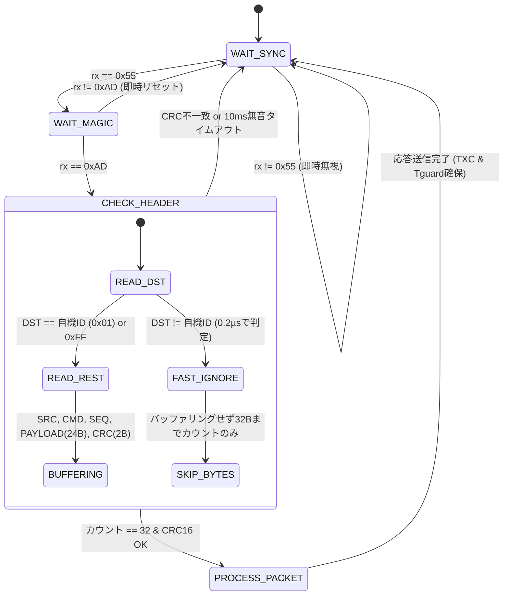
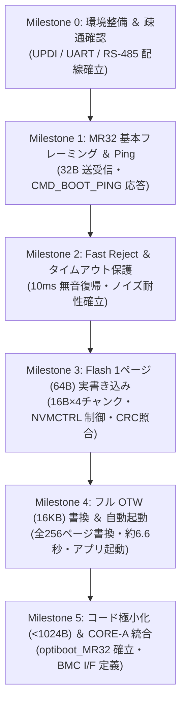

<!--
Copyright (c) 2026 ADX Project Contributors
SPDX-License-Identifier: CC-BY-4.0
-->

# ADX MR32 プロトコル研究開発計画書 (MR32 R&D Plan)
## 〜 ADX Core-D を活用した MR32 通信スタック ＆ ブートローダー先行実証計画 〜

**策定日**: 2026-10-02  
**対象機材**: [ADX Core-D (Microchip ATtiny1616-MNR, RS-485: SP485EEN)](file:///home/ubuntu/AgentWorkspace/ADX/github/ADX/hardware/archive/CORE-D/proposal.md)  
**上位仕様書**: [ADX 基幹フィールドネットワーク「MR32」仕様書](file:///home/ubuntu/AgentWorkspace/ADX/github/ADX/memo/ADX_FIELD_NETWORK_SPECIFICATION_PROPOSAL.md)  
**先行知見**: [BR32 段階的開発マイルストーン](file:///home/ubuntu/AgentWorkspace/ADX/github/ADX/firmware/bootloader/PLAN/BR32/milestones.md) / [RS-485 ブートローダー ナレッジベース](file:///home/ubuntu/AgentWorkspace/ADX/github/ADX/firmware/bootloader/RS485_BOOTLOADER_KNOWLEDGE_BASE.md)

---

## 1. エグゼクティブ・サマリー

### 1.1 背景とパラダイムシフト
次世代オープンソース・モジュラーハードウェア規格「ADX」において、基幹フィールドネットワークとして策定された **MR32（Magic-packet RS-485, 32-byte Fixed-Length Protocol）** は、先行規格（BR32）が抱えていた「市販USBシリアルドングルやスマートフォンOSにおけるLIN BREAK信号生成の不安定性」を解決すべく誕生しました。

```text
┌────────────────────────────────────────────────────────────────────────────────────────┐
│                        【 BR32 から MR32 へのパラダイムシフト 】                       │
│                                                                                        │
│  [先行規格 BR32]                                                                       │
│   ・LIN BREAK（>= 13bit LOW）によるハードウェア同期                                    │
│   ・課題: 市販の安価なUSBシリアル変換（CH340/CP2102）やOSドライバでのBREAK生成が不安定 │
│   ・課題: 専用ドングルや特殊ドライバが必要となり、スマホPWA直結の障壁に                │
│                                                                                        │
│                                           ▼                                            │
│  [新規格 MR32]                                                                         │
│   ・標準UART 115,200 bps (8N1) ＋ マジックパケット（0x55 0xAD）による完全同期         │
│   ・進化 1: 専用ドングル完全撤廃（300円の市販ドングル＋スマホWebSerialで即直結）       │
│   ・進化 2: 32B完全固定長 ＋ Fast Reject によるCPU負荷ゼロ・超速ゴミパケット破棄       │
│   ・進化 3: 16B × 4チャンク構成によるFlash 64Bページの極小コード転送（全Flash約6.6秒） │
└────────────────────────────────────────────────────────────────────────────────────────┘
```

### 1.2 本計画の目的と位置づけ
本研究開発計画は、ADXの旗艦量産機である **ADX CORE-A** の基板完成を待つことなく、手元にある実績機材 **ADX Core-D**（`hardware/archive/CORE-D`）をテストベンチとして活用し、構想段階にあるMR32の通信プロトコル、超高速破棄（Fast Reject）ステートマシン、半二重ターンアラウンド制御、およびFlashメモリ書き込み（OTW）の成立性を**先行して100%実機実証**することを目的とします。

---

## 2. 実機テストベンチ環境 (ADX Core-D の活用)

### 2.1 ADX Core-D がテストベンチとして最適な理由
`hardware/archive/CORE-D` は、ADX初期にブートローダーおよび通信テスト用として開発された検証専用基板です。以下の通り、MR32のプロトタイプ開発に必要なすべてのハードウェア要素が理想的に揃っています。

```mermaid
flowchart LR
    subgraph PC["ホスト PC (Windows 11 / Linux)"]
        HostPy["Python テスター / WebSerial"]
        UPDI_Tool["pymcuprog (UPDI)"]
        Debug_Mon["シリアルモニタ (Soft-UART)"]
    end

    subgraph USB_Dongle["市販 USB-RS485 ドングル"]
        CH340["CH340 / CP2102 (市販品)"]
    end

    subgraph CoreD["ADX Core-D 基板 (実験機材)"]
        subgraph CH342K_Block["WCH CH342K (デュアル UART)"]
            PortA["Port A: SerialUPDI"]
            PortB["Port B: デバッグUART"]
        end
        subgraph MCU_Block["Microchip ATtiny1616-MNR"]
            UPDI_Pin["PA0: UPDI"]
            SoftUART_Pin["PB4: Soft-UART TX"]
            USART0_Pins["PA1/PA2: USART0 Alt"]
            CTRL_Pins["PA4/PA7: DE / /RE"]
            LED_Pins["PB2(赤) / PB3(白)"]
        end
        subgraph Transceiver["MaxLinear SP485EEN"]
            RS485_IC["半二重 RS-485"]
            Terminal["3P 端子台 (A, B, GND)"]
        end
    end

    HostPy <-->|USB| CH340
    CH340 <-->|2線式 RS-485 (A/B)| Terminal
    Terminal <--> RS485_IC
    RS485_IC <--> USART0_Pins
    CTRL_Pins --> RS485_IC

    UPDI_Tool <-->|USB Type-C| PortA
    PortA <--> UPDI_Pin

    PortB <--> SoftUART_Pin
    PortB -->|USB Type-C| Debug_Mon
```

| 項目 | ADX Core-D 仕様 | MR32 開発におけるメリット |
| :--- | :--- | :--- |
| **メインMCU** | **Microchip ATtiny1616-MNR** (QFN-20)<br>Flash 16KB, SRAM 2KB, 20MHz | CORE-A のメインMCUと完全同一アーキテクチャ。Flashページ構造（64B/Page）やNVMCTRLレジスタが完全に共通。 |
| **RS-485回路** | **MaxLinear SP485EEN**（半二重）<br>3P端子台（A, B, GND）, TVS保護, 4.7kΩバイアス | 市販のUSB-RS485ドングルと直結可能。H2/H4ジャンパでDE/RE制御や終端抵抗を柔軟に設定可能。 |
| **Dual USB-UART** | **WCH CH342K** 搭載<br>・Port A: SerialUPDI 回路<br>・Port B: UART (PB4/PB5) | **【文鎮化ゼロの救命ボート】**：Port A から常にSerialUPDIで即時書き換え可能。<br>**【不可視性の排除】**：RS-485通信を邪魔せず、Port B から内部ステートや処理時間をリアルタイムでロギング可能。 |
| **インジケータ** | 赤色 LED (`PB2`), 白色 LED (`PB3`) | ブートローダー待受ハートビート、通信エラー、パケット受信トグル等を視覚的に即座に確認可能。 |
| **高精度クロック** | 12MHz アクティブ水晶発振器（`PA3`） | 内部OSCの校正評価、および外部オシレータによる超高精度通信の比較検証が可能。 |

> [!NOTE]
> **CORE-A (量産機) と CORE-D (実験機) の相違点と対処方針**:
> CORE-A に搭載されている「ATtiny412 BMC による電源・リセット制御」は、CORE-D には物理的に存在しません（1チップ構成）。  
> そのため、本サンドボックスでの研究開発では、ブートローダーの起動トリガーとして **「ホストからのソフトウェアコマンド (`CMD_BOOT_PING` / ソフトウェアリセット)」** または **「UPDIによる直接投入」** を使用し、通信プロトコルとFlash書き込みコアに集中して実証を進めます。BMC連携シーケンスはCORE-A試作時にスムーズに接続できるよう、インターフェースを抽象化して設計します。

### 2.2 Core-D ハードウェア確定ピンアサイン ＆ ジャンパ設定

```text
【ピンアサイン一覧】
  ・PA1 : USART0 TXD (Alternate Pinout) ── SP485EEN DI (送信データ)
  ・PA2 : USART0 RXD (Alternate Pinout) ── SP485EEN RO (受信データ)
  ・PA4 : RS-485 DE (Active HIGH)        ── SP485EEN DE (送信イネーブル)
  ・PA7 : RS-485 /RE (Active LOW)        ── SP485EEN /RE (受信イネーブル)
  ・PB2 : 赤色 LED (Active HIGH)         ── ブート待受ハートビート / 通信アクティビティ
  ・PB3 : 白色 LED (Active HIGH)         ── ユーザーアプリケーション稼働インジケータ
  ・PB4 : Soft-UART TXD (9,600 bps)      ── CH342K Port B (デバッグモニタ出力)
  ・PA0 : UPDI (SerialUPDI)              ── CH342K Port A (プログラム書込・救命ボート)
  ・PA3 : EXTCLK                         ── 12MHz 水晶発振器 (H3ジャンパ経由)

【推奨ジャンパ設定】
  ・H2 (DE/RE 制御)  : 2-3 ショート (DE と /RE を連動させ、PA4 単一ピンで半二重制御)
  ・H3 (クロック選択): デフォルトは 1-2 (内部オシレータ)。必要に応じて 2-3 (外部12MHz)
  ・H4 (終端抵抗)    : 短距離（机上）テストでは OPEN (無効)。1,000m試験時は SHORT (100Ω有効)
```

---

## 3. MR32 コア仕様と検証要件

### 3.1 32バイト完全固定長フレーム構造
通信パケットは、例外なく厳密に **32バイト固定長** で伝送されます。

```text
 0      1      2        3        4         5       6 ... 29 (24 Bytes)    30    31
┌──────┬──────┬────────┬────────┬─────────┬──────────┬─────────────────────┬─────┬─────┐
│ SYNC │MAGIC │ DST_ID │ SRC_ID │ PKT_CMD │ SEQ_NUM  │       PAYLOAD       │CRC16│CRC16│
│ 0x55 │ 0xAD │ (1B)   │ (1B)   │  (1B)   │   (1B)   │     (24 Bytes)      │(LSB)│(MSB)│
└──────┴──────┴────────┴────────┴─────────┴──────────┴─────────────────────┴─────┴─────┘
 ├── ヘッダー (6 Bytes) ─────────────────────────────┤ ├── データ本体 (24B) ──┤ ├─ CRC (2B) ┤
```

- **CRC-16-CCITT**: 多項式 `0x1021`, 初期値 `0xFFFF`。計算対象は Byte 2（`DST_ID`）〜 Byte 29（`PAYLOAD`末尾）の計 28 バイト。
- **ターンアラウンド ガード時間 ($T_{guard}$)**: 送信完了（TXCフラグ検出）後、最低 $150\,\mu\mathrm{s}$ のアイドル時間を確保して受信モードへ復帰。

### 3.2 超高速破棄（Fast Reject）ステートマシン
ノイズや他社パケット、他ノード宛てパケットをマイコンの最小サイクル数で門前払いし、CPU負荷をほぼゼロに抑えます。



---

## 4. 2トラック並行研究開発戦略 (Dual-Track Strategy)

開発を迅速かつ確実に進めるため、先行BR32開発で絶大な効果を発揮した **2トラック並行方式** を採用します。

```text
┌────────────────────────────────────────────────────────────────────────────────────────┐
│                        【 2 トラック並行研究開発アプローチ 】                          │
│                                                                                        │
│  Track A: Warm Up (WU) サンドボックス                                                  │
│   ・Flashへの書き込みを行わない安全な実験模型（文鎮化リスクゼロ）                      │
│   ・物理層、標準UARTマジックパケット同期、Fast Reject、半二重ジッターの挙動を直接観察  │
│   ・本番開発で行き詰まった時にいつでも戻れる「安全なホームグラウンド」                 │
│                                                                                        │
│  Track B: 本番マイルストーン (M0〜M5 Gate 方式)                                        │
│   ・論点を各段階1つに絞り、厳格なExit Criteria（合格基準）をクリアして進む本番トラック │
│   ・通信スタック ──> タイムアウト保護 ──> Flash 1ページ書込 ──> フルOTW ──> 極小化    │
└────────────────────────────────────────────────────────────────────────────────────────┘
```

---

## 5. Track A: Warm Up (WU) サンドボックス計画

WU は、Flash メモリに一切手を触れず、SRAM と UART レジスタだけで動作する安全な実験模型です。

### WU-1: 32B 固定長 Ping-Pong ＆ Fast Reject 実証ベンチ
- **目的**: 
  1. `0x55 0xAD` による同期と、固定32バイトパケットの双方向エコーバック動作を検証。
  2. ノイズ注入および他ノード宛てパケットに対する「超高速破棄（Fast Reject）」の挙動を実測。
- **マイコン側実装**:
  - `USART0` 受信割込または高速ポーリングで `0x55` $\to$ `0xAD` を検出。
  - 自機宛て（`DST_ID == 0x01` または `0xFF`）なら受信バッファへ蓄積、それ以外はカウンタのみ加算して破棄。
  - 受信完了時、CRC16を照合し、正常なら応答パケット（32B）を返信。
- **ホスト側検証シナリオ (Python)**:
  1. 正常な `CMD_BOOT_PING` (0x10) を送出し、デバイス情報（MCU型番、Flashサイズ等）の32B応答が返ることを確認。
  2. ランダムなゴミデータ（ノイズパケット）を大量送出し、マイコンが完全沈黙（1ビットも返信せず）かつハングアップしないことを確認。
  3. 宛先IDが異なるパケット（`DST_ID = 0x02`）を送出し、マイコンが完全沈黙することを確認。

### WU-2: 115,200 bps 半二重ターンアラウンド ＆ $T_{guard}$ ジッター観測ベンチ
- **目的**:
  1. MR32標準速度である 115,200 bps におけるRS-485半二重のDE/RE切り替えタイミングの最適化。
  2. 送信完了フラグ（`TXCIF`）を用いた確実なライン解放と、$T_{guard} \ge 150\,\mu\mathrm{s}$ のガード時間の精度確認。
- **マイコン側実装**:
  - 送信時: `DE=1, /RE=1` $\to$ 32バイト送信 $\to$ `USART0.STATUS & USART_TXCIF_bm` 待機 $\to$ ガード時間待機 $\to$ `DE=0, /RE=0`。
- **ホスト側検証シナリオ**:
  - 100ms周期で1,000サイクルの連続Ping-Pongを実行。
  - 応答遅延時間 $\Delta T$ の平均値、最小値、最大値、標準偏差（ジッター $\sigma$）を計測。
  - 目標基準: ジッター $\sigma < 0.5\,\mathrm{ms}$、通信成功率 100.0%（1,000/1,000）。

### WU-3: 16B × 4チャンク 仮想SRAM蓄積・パケット欠損耐性ベンチ
- **目的**:
  1. Flash書き込み前の「64バイト ページバッファ蓄積ロジック（16B × 4チャンク）」をSRAM上で完全シミュレーション。
  2. パケット順序逆転、欠損、重複発生時の自己修復動作を検証。
- **マイコン側実装**:
  - `CMD_BOOT_WRITE_CHUNK` (0x11) を受信。
  - ペイロードから `Page(2B)`, `Chunk(1B)`, `Data(16B)` を抽出し、SRAM上の `page_buffer[chunk_idx << 4]` にコピー。
  - ビットマスク（`chunk_mask |= (1 << chunk_idx)`）で4チャンク（`0x0F`）の受領を追跡。
  - 4チャンク揃ったらSRAM上でCRC16を計算し、ホストへ `STATUS_PAGE_COMPLETE` を返信。
- **ホスト側検証シナリオ**:
  - 正常シーケンス: チャンク 0 $\to$ 1 $\to$ 2 $\to$ 3 を送信。SRAM蓄積データが100%一致することを確認。
  - 意地悪シーケンス: チャンク順序をシャッフル（0 $\to$ 2 $\to$ 1 $\to$ 3）または同一チャンクを重複送信。破綻なくバッファが完成することを確認。

### WU-4: 市販安価ドングル ＆ WebSerial (PWA) 接続性検証ベンチ
- **目的**:
  - 専用ドングル不要の証明。市販の安価なUSB-RS485ドングル（CH340, CP2102, FTDI等）およびChromeブラウザ（WebSerial API）から、MR32パケットが問題なく送受信できることを実証。
- **ホスト側実装**:
  - Python版テストスクリプトに加え、ブラウザ単体で動く HTML + JavaScript (WebSerial) の超軽量テスターを作成。
  - 特別なドライバ設定やBREAK生成を行わず、標準の `writer.write(frame32)` だけで通信が成立することを実証。

---

## 6. Track B: 本番マイルストーン Gate (M0〜M5)

本番トラックでは、各段階の合格基準（Exit Criteria）を厳格にクリアしながら、最終的なブートローダー完成へと進みます。



### Milestone 0: テストベンチ構築 ＆ ハードウェア初期疎通
- **検証論点**: ADX Core-D の 2 つの COM ポート（SerialUPDI, Soft-UART）および市販ドングルの RS-485 ポートが同時に正常認識・動作すること。
- **作業内容**:
  1. ジャンパ（H2:連動, H3:内部OSC, H4:終端OFF）の設定確認。
  2. CH342K 経由での SerialUPDI 書き込み疎通テスト（Lチカスケッチの書き込み確認）。
  3. Soft-UART（PB4, 9600 bps）からのデバッグ文字列受信確認。
  4. 市販USB-RS485ドングル（端子台 A/B/GND）のループバックまたは簡易エコー確認。
- **合格基準 (Exit Criteria)**:
  - [ ] 3つのCOMポート（UPDI, Soft-UART, RS-485）がPC上で競合なく同時アクセス可能。
  - [ ] UPDI経由でのファームウェア書き換え成功率 100% (5回連続)。

### Milestone 1: MR32 基本フレーミング ＆ Ping 実装 (`CMD_BOOT_PING`)
- **検証論点**: 32バイト固定長フレーム（`0x55 0xAD` + Header + Payload + CRC16）のパケット生成および解釈がMCU上で正常に動作すること。
- **作業内容**:
  1. ATtiny1616 向けベアメタル C 実装（USART0 115,200 bps, 8N1）。
  2. CRC-16-CCITT 高速計算ルーチンの実装（テーブル参照またはビットシフト最適化）。
  3. `CMD_BOOT_PING` (0x10) に対する 32B 応答パケット生成（MCU型番 `0x1616`、Flashサイズ `16KB`、Pageサイズ `64B`）。
- **合格基準 (Exit Criteria)**:
  - [ ] PCからのPing送信に対し、正しいデバイス情報を含む32Bパケットが返信される。
  - [ ] 100回連続Pingテストでパケット損失ゼロ、CRCエラーゼロ。

### Milestone 2: Fast Reject ＆ 10ms 無音タイムアウト保護の実装
- **検証論点**: 不正パケットや途絶えたパケットに対し、マイコンがフリーズせず、最小CPU負荷で即座に初期状態へ復帰すること。
- **作業内容**:
  1. `0x55 0xAD` 以外の受信時、1クロックでステートマシンを初期化するFast Reject実装。
  2. 宛先ID不一致パケット（他ノード宛て）の読み飛ばし処理。
  3. タイマー（RTCまたはTCA/TCB）を用いた「10ms無音タイムアウト」実装（途中でバイトが途絶えた場合の強制リセット）。
- **合格基準 (Exit Criteria)**:
  - [ ] ランダムなゴミバイト（1,000バイト）を流し込んでも、マイコンが完全沈黙を維持し、直後の正常Pingに即答する。
  - [ ] 途中欠損パケット（例: 10バイトで送信中断）送信後、10ms経過で安全に初期ステートへ復帰する。

### Milestone 3: NVMCTRL Flash 1ページ (64B) 実書き込み ＆ CRC照合 (安全区画: Page 64)
- **検証論点**: `CMD_BOOT_WRITE_CHUNK` (0x11) による16B×4チャンクの受領と、ATtiny1616のNVMCTRLによるFlash物理書き込み・Bit-for-Bit完全照合の実証。
- **改定設計方針**: 基礎設計書 [`M_milestones/EXPERIMENTAL_CONDITIONS_BASE_DESIGN.md`](./M_milestones/EXPERIMENTAL_CONDITIONS_BASE_DESIGN.md) に準拠し、自爆防止境界を **Page 64 (4KB)** に設定。自機コード領域との物理衝突を完全排除する。
- **作業内容**:
  1. ページバッファ（64B）へのチャンク蓄積制御。
  2. ATtiny1616 NVMCTRL（Page Erase-Write ＆ コマンドNONEクリア）の安全制御実装。
  3. テスト対象ページを安全領域 **Page 64 (アドレス `0x1000`〜`0x103F`)** に指定。
  4. ブートローダー保護境界（Page 0..63）への不正書き込み遮断機能の実装。
  5. 物理Flashからの16B×4チャンク読み戻し（`CMD_BOOT_READ_CHUNK` 0x12）および Bit-for-Bit 照合。
  6. マイコン自律Flash CRC16計算（`CMD_BOOT_CRC_CHECK` 0x13）コマンドの実装。
- **合格基準 (Exit Criteria)**:
  - [ ] 保護領域（例: Page 0）への書き込み要求が即座に `STATUS_ERR_PARAM (0x03)` で拒絶される。
  - [ ] 任意のテストデータ（64B）が安全領域（Page 64）へ正常に書き込まれる（所要時間約 30ms 程度）。
  - [ ] 書き込み後、Flashから物理読み出したデータが送信データと Bit-for-Bit で100%一致する（Test 4 PASS）。
  - [ ] マイコン内部Flash CRC16照合が期待値と完全に一致する（Test 5 PASS）。

### Milestone 4: フル OTW (12KB / 192ページ) 書換 ＆ アプリケーション自動起動
- **検証論点**: 実験アプリケーション領域（Pages 64〜255 / 12KB）の連続書き込みが途絶えることなく完走し、新ファームウェアが自動起動すること。
- **改定設計方針**: 実験フェーズ用 12KB 領域（アドレス `0x1000`〜`0x3FFF`）を対象とし、所要時間と自動起動を実証。
- **作業内容**:
  1. ホスト側 Python フローの実装（192ページ連続書き込みループ、進捗バー、所要時間計測）。
  2. ブートローダーからユーザーアプリケーション領域（アドレス `0x1000` / Page 64）への安全なジャンプ（`EIND`/間接ジャンプ）。
  3. テスト用新ファームウェア（白LED `PB3` 高速点滅スケッチ）の生成と書き込み検証。
- **合格基準 (Exit Criteria)**:
  - [ ] 12KB（192ページ）の全ページ書き込みがエラーなしで完走する。
  - [ ] **書き込み所要時間が目標値（約 5.0 秒 〜 6.0 秒以内）を達成する**（192P × 約26ms）。
  - [ ] 書き込み完了後、白LED（PB3）が点滅を開始し、ユーザーアプリへの遷移が確認できる。

### Milestone 5: ブートローダー極小化 (< 1,024 Bytes) ＆ 本番領域拡張 (15KB)
- **検証論点**: ブートローダー本体のバイナリサイズが **1,024 バイト以下（Pages 0〜15）** に収まり、アプリケーション領域を Pages 16〜255 (15KB) へシームレスに拡張して CORE-A 量産機への展開準備が完了すること。
- **作業内容**:
  1. Cソースコードのリファクタリング、未使用ライブラリ関数の排除、最適化オプション（`-Os`, `-mrelax`, `-fno-split-wide-types`）のチューニング。
  2. 必要に応じたインラインアセンブラ化（CRC計算、Fast Rejectループ）。
  3. 保護境界マクロを `APP_START_PAGE = 16 (0x0400)` に引き下げ、アプリ領域を 12KB から 15KB へ拡大。
  4. 将来の BMC（ATtiny412）連携用コマンド（`CMD_BMC_ENTER_BOOT` 0x01, `CMD_BMC_BOOT_DONE` 0x02）のインターフェース整合性確認。
- **合格基準 (Exit Criteria)**:
  - [ ] `avr-size` による出力で、Flash消費量が **1,024 バイト以下**（厳守）。
  - [ ] 1,024バイト以下に圧縮した状態でも、M1〜M4の全機能が100%正常動作する。

---

## 7. ディレクトリ構成案 (`firmware/sandbox/`)

本サンドボックスは、以下のように段階的かつ再現性の高い構成で構築します。

```text
firmware/sandbox/
├── README.md                      # サンドボックス総合案内・クイックスタート
├── MR32_RD_PLAN.md                # 本研究開発計画書（マスタープラン）
│
├── tools/                         # ホスト側テストベンチ（PC / ブラウザ）
│   ├── mr32_bench.py              # Python版 MR32 テスター (Ping, Fuzzing, Flash転送)
│   ├── mr32_packet.py             # MR32 パケット生成・CRC16計算共通ライブラリ
│   └── web_flasher/               # ブラウザ版 WebSerial テスター (HTML + Vanilla JS)
│       └── index.html
│
├── WU/                            # Track A: Warm Up サンドボックス群 (実験模型)
│   ├── WU1_fast_reject/           # 32B Ping-Pong ＆ Fast Reject 観測模型
│   ├── WU2_turnaround/            # 115,200 bps 半二重ターンアラウンド ＆ ジッター観測
│   ├── WU3_sram_painter/          # 16B × 4チャンク 仮想SRAM蓄積模型
│   └── WU4_dongle_test/           # 市販安価ドングル接続性・耐久テスト
│
├── M_firmware/                    # Track B: 本番マイルストーン ファームウェア
│   ├── Makefile                   # avr-gcc ビルドスクリプト (最適化・サイズ計測)
│   ├── inc/
│   │   ├── mr32.h                 # MR32 プロトコル定義ヘッダー (コマンド、フレーム構造)
│   │   └── uart_debug.h           # Soft-UART デバッグ出力マクロ
│   └── src/
│       ├── main.c                 # MR32 ブートローダー実装
│       └── nvm_flash.c            # NVMCTRL Flash ページ書き込み制御
│
└── records/                       # 実機検証エビデンス・ログアーカイブ
    ├── M0_bringup.md              # M0 結線・3ポート疎通確認ログ
    ├── M1_ping_result.md          # M1 Ping応答ログ
    ├── M2_fast_reject_result.md   # M2 ノイズ破棄・タイムアウトログ
    ├── M3_single_page_result.md   # M3 Flash 1ページ書き込みログ
    └── M4_full_otw_result.md      # M4 16KBフル書き込み・所要時間実測ログ
```

---

## 8. スケジュールとリスク管理

### 8.1 推進フェーズ

| フェーズ | 主な対象 | 期間目安 | 主な成果物 |
| :---: | :--- | :---: | :--- |
| **Phase 1** | **基盤整備 ＆ WU 実験**<br>(M0, WU-1, WU-2) | 1〜2日 | ・3ポート環境疎通完了<br>・Python版 MR32 送受信ライブラリ<br>・115.2kbps Fast Reject 実機確認 |
| **Phase 2** | **SRAM蓄積 ＆ Flash制御**<br>(WU-3, M1, M2, M3) | 2〜3日 | ・16B×4チャンク蓄積ロジック<br>・10ms無音タイムアウト実装<br>・Flash 1ページ物理書き込み成功 |
| **Phase 3** | **フル OTW ＆ 極小化**<br>(M4, M5, WU-4) | 2〜3日 | ・16KB フル書き込み（約6.6秒）完走<br>・1,024バイト以下 極小ブートローダー完成<br>・WebSerial PWA 疎通実証 |

### 8.2 想定されるリスクと対策

| 想定リスク | 影響度 | 対策方針 |
| :--- | :---: | :--- |
| **市販ドングルのターンアラウンド遅延** | 中 | 市販USB-RS485ドングルの中には、TX完了からRXへの切り替えが遅いものがある。マイコン側の応答開始ガード時間 $T_{guard}$ を $150\,\mu\mathrm{s} \sim 500\,\mu\mathrm{s}$ の範囲でパラメータ調整可能にしておく。 |
| **内部オシレータの周波数偏差** | 低 | ATtiny1616の内蔵発振器は出荷時校正済み（常温 $\pm 1\%$ 以内）だが、温度変化や個体差でボーレート誤差が生じる懸念がある。Core-D搭載の外部12MHzオシレータ（H3ジャンパ）を比較基準として利用可能。 |
| **Flash書き込み中の電源遮断 / 暴走** | 極小 | Core-D は CH342K の Port A から常時 SerialUPDI 書き込みが可能。ブートローダーが壊れてもUPDI経由で1秒で復旧できるため、実質的に文鎮化リスクはゼロ。 |
| **コードサイズ 1,024B 超過** | 中 | 先行プロジェクト（BR32 M4-1）において、ベアメタル C 実装により 1,022 バイトでの Flash 書き込みブートローダー実績がある。その設計パターン（ライブラリ不使用、レジスタ直叩き、インライン最適化）をそのままMR32へ継承する。 |

---

## 9. まとめ

本研究開発計画により、構想段階にある **MR32（Magic-packet RS-485 32B Protocol）** は、実績ある **ADX Core-D** をテストベンチとして机上ですぐに具現化・実証を開始できます。

「文鎮化リスクゼロの Warm Up 実験」で物理層・パケット挙動を完全に手中に収め、「厳格な M0〜M5 Gate」によって 1,024 バイト極小ブートローダーと約6.6秒のフル OTW を達成することで、次世代旗艦機 **ADX CORE-A** の完成と同時に即座に本番運用できる盤石なソフトウェア資産を構築します。
