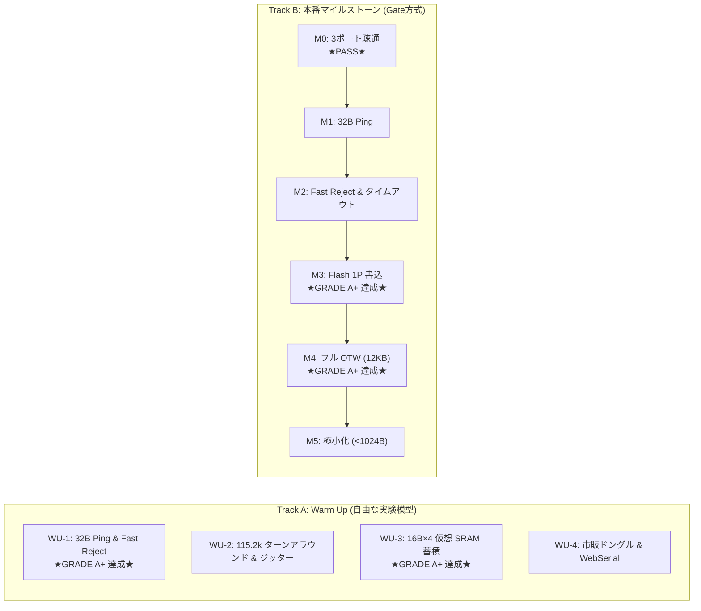

<!--
Copyright (c) 2026 ADX Project Contributors
SPDX-License-Identifier: CC-BY-4.0
-->

# MR32 プロトコル研究開発サンドボックス (MR32 R&D Sandbox)

本ディレクトリは、ADXの次世代基幹フィールドネットワーク規格 **「MR32」** の研究開発およびプロトタイプ検証用サンドボックスです。

現在、MR32は構想段階（仕様書策定済み）であり、旗艦量産機 **ADX CORE-A** の完成に先立ち、手元にある実績ハードウェア **ADX Core-D**（`hardware/archive/CORE-D`）をテストベンチとして活用して、通信スタックおよびブートローダー先行実証を進めます。

---

## 📚 ドキュメント構成

| ドキュメント | 役割・内容 |
| :--- | :--- |
| 📖 **[`MR32_RD_PLAN.md`](./MR32_RD_PLAN.md)** | **MR32 研究開発マスター計画書**<br>・Core-D テストベンチ設計<br>・2 トラック並行戦略（Warm Up 実験模型 ＆ M0〜M5 Gate）<br>・Fast Reject / 半二重ターンアラウンド / 16B×4 Flash 書込仕様<br>・合格基準（Exit Criteria）とスケジュール |
| 📄 **[`memo/ADX_FIELD_NETWORK_SPECIFICATION_PROPOSAL.md`](../../memo/ADX_FIELD_NETWORK_SPECIFICATION_PROPOSAL.md)** | **MR32 プロトコル仕様書（上位原案）**<br>・32B 固定長フレーム構造<br>・マジックパケット（`0x55 0xAD`）とコマンド体系<br>・スマホ PWA / 市販ドングル直結アーキテクチャ |
| 🛠️ **[`hardware/archive/CORE-D/proposal.md`](../../hardware/archive/CORE-D/proposal.md)** | **ADX Core-D ハードウェア仕様書**<br>・ATtiny1616-MNR / SP485EEN / CH342K デュアルポート |
| 📐 **[`M_milestones/EXPERIMENTAL_CONDITIONS_BASE_DESIGN.md`](./M_milestones/EXPERIMENTAL_CONDITIONS_BASE_DESIGN.md)** | **実験条件に関する基礎設計**<br>・先行実験用 Flash メモリ区画設計 (4KB/12KB 分割)<br>・自爆防止ガード境界 (Page 64) ＆ NVMCTRL 安全運用規程 |

---

## 🎯 コア・コンセプト：なぜ Core-D で MR32 を先行開発するのか？

```text
┌────────────────────────────────────────────────────────────────────────────────────────┐
│                        【 ADX Core-D を用いた MR32 先行実証 】                         │
│                                                                                        │
│  1. 【MCU アーキテクチャの完全一致】                                                  │
│     ・Core-D は CORE-A と同一の ATtiny1616 を搭載。                                    │
│     ・Flash 64B/Page、NVMCTRL レジスタ、メモリマップが 100% 共通。                     │
│                                                                                        │
│  2. 【SerialUPDI 救命ボートによる文鎮化ゼロ】                                          │
│     ・CH342K Port A (SerialUPDI) により、いつでも 1 秒でファームウェア再書き込み可能。 │
│     ・Flash 書き込み実験で暴走しても、物理的に文鎮化するリスクはゼロ。                 │
│                                                                                        │
│  3. 【Soft-UART によるリアルタイム不可視性排除】                                       │
│     ・CH342K Port B (Soft-UART PB4) により、RS-485 通信を邪魔せず内部状態をロギング。 │
│                                                                                        │
│  4. 【市販ドングル直結の早期実証】                                                     │
│     ・SP485EEN ＋ 端子台（A/B/GND）に市販の安価な USB-RS485 ドングル（CH340 等）を    │
│       直結し、PC / ブラウザからの 32B 送受信と約 6.6 秒 OTW を先行実証。               │
└────────────────────────────────────────────────────────────────────────────────────────┘
```

---

## 🚀 ハードウェア・クイックセットアップ (ADX Core-D)

```text
【結線手順】
 1. PC と ADX Core-D の Type-C ポートを USB ケーブルで接続
    → デバイスマネージャー上に CH342K の 2 つの COM ポート（Port A: UPDI, Port B: UART）を認識。
 2. PC に市販の USB-RS485 ドングルを接続し、Core-D の 3P 端子台（A, B, GND）とツイストペア線で結線。
 3. ジャンパ設定を確認：
    ・H2: 2-3 ショート (DE と /RE を連動)
    ・H3: 1-2 ショート (内部オシレータ使用)
    ・H4: OPEN (短距離テストでは 100Ω 終端無効)
```

---

## 🗺️ 開発ロードマップ概要

詳細な実施手順と合格基準は **[`MR32_RD_PLAN.md`](./MR32_RD_PLAN.md)** を参照してください。



---

## 📊 実機検証進捗ステータス

| フェーズ | テーマ | 判定 | 測定実績・エビデンス |
| :---: | :--- | :---: | :--- |
| **M0** | 3 ポート環境認識 (UPDI/Soft-UART/RS-485) | **PASS** | COM20 (UPDI), COM21 (Soft-UART), COM22 (CH340 RS-485) 認識確認 |
| **WU-1** | **32B Ping & Fast Reject 実機実証** | **GRADE A+** | **300/300 完走 (100.0%)、Mean RTT 6.31ms、Jitter σ=0.12ms、Fast Reject 5/5 完全合格** ([`レポート`](./records/WU1_fast_reject_report.md)) |
| **WU-2** | 115.2k ターンアラウンド & ジッター最適化 | 未着手 | $T_{guard}$ ガード時間の極限測定・調整 |
| **WU-3** | **16B×4 仮想 SRAM 蓄積 ＆ パケット耐性** | **GRADE A+** | **64/64B Bit-for-Bit 100% 一致、順序逆転・重複・欠損耐性 PASS、1P平均26.4ms、16KB換算6.76秒** ([`レポート`](./records/WU3_sram_painter_report.md)) |
| **WU-4** | 市販安価ドングル ＆ WebSerial (PWA) 直結 | 未着手 | ブラウザからの MR32 パケット送受信実証 |
| **M1** | MR32 基本フレーミング ＆ Ping 実装 | 未着手 | 本番ブートローダー用 32B 送受信コア |
| **M3** | **単一 Flash ページ (64B) 物理書込 ＆ CRC 照合** | **GRADE A+** | **Flash物理書込 (31.60ms)、自爆防止ガード PASS、Bit-for-Bit 100% 一致 (64/64B)、Flash CRC16 (0x6CA1) 完全一致** ([`レポート`](./records/M3_single_page_report.md)) |
| **M3-1** | **Flash 書込後ハードウェア挙動 ＆ 診断スイート** | **RESOLVED** | **自爆現象の根本原因解明（旧Page 20自爆事故）、エコー試験で物理層健全性100%証明、基礎設計（4KB/12KB分割）策定完了** ([`設計書`](./M_milestones/EXPERIMENTAL_CONDITIONS_BASE_DESIGN.md)) |
| **M4** | **12KB フル OTW 書換 ＆ アプリ自動起動** | **GRADE A+** | **12KB (192P) 5.96秒完走 (2.01 KB/s)、0x1000自動ジャンプ成功、LED交互点滅＆Soft-UART起動確認** ([`レポート`](./records/M4_full_otw_report.md)) |

