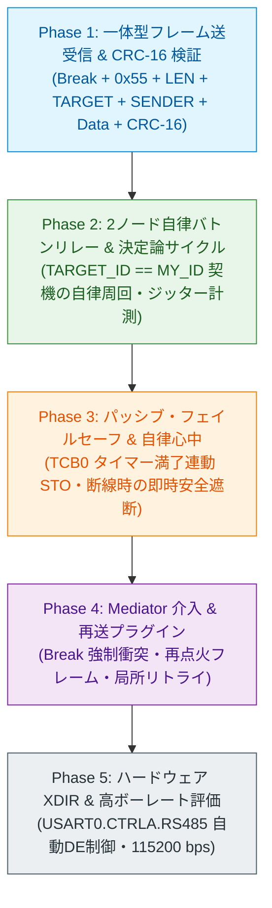

<!--
Copyright (c) 2026 ADX Project Contributors
SPDX-License-Identifier: CC-BY-4.0
-->

# DROP-Bus 段階的実機開発計画書 (DROP-Bus Phased Development Plan)

本ドキュメントは、**ADX Core-D**（MCU: Microchip ATtiny1616, RS-485: SP485EEN）における自律分散型フィールドネットワーク **DROP-Bus** の実機実装および検証を安全・確実・段階的に進行するための開発ロードマップです。

---

## 1. 開発の基本方針と段階的アプローチ (Philosophy & Phased Approach)

DROP-Bus は、「完全水晶レス（単一SKU）」、「厳格な決定論性（ジッター拘束）」、そして「受動的フェイルセーフ（沈黙＝安全）」という3大哲学を持ちます。

先行の **LN-485（LIN-based RS-485）** 開発において、ATtiny1616 の `LINAUTO` ハードウェア同期、レジスタ直接制御、半二重 DE/RE 切り替え、Double Buffer Mailbox などの低レイヤ技術がすでに実証（PASS）されています。

DROP-Bus の開発では、この実証済み資産を最大限に活用し、**低レイヤのフレーム単体送受信から、自律分散リレー、タイマー連動の安全心中、そして Mediator による物理調停へと段階的に検証範囲を拡張** します。

---

## 2. 各開発フェーズの詳細スコープ

---

### Phase 1: 一体型フレーム送受信 ＆ CRC-16 検証 (Single Frame Tx/Rx)

* **目的:**
  全ノードが送信する「一体型フレーム（物理同期ヘッダ ＋ 論理データ ＋ CRC-16）」の送受信スタックを構築し、単体パケットの完全性を実証する。
* **主要検証項目:**
  1. GPIO トグルによる Break（14 Tbit LOW）＋ Delimiter（2 Tbit HIGH）＋ `0x55` ＋ 論理パケットの一括送出。
  2. スレーブ `USART0.CTRLB`（`LINAUTO`）によるオートボーレート自動校正とパケット受信。
  3. 可変長 `LEN`（最大64バイト）の解析とバッファオーバーラン防御（`LEN > 64` 即時破棄）。
  4. CRC-16-CCITT（$x^{16} + x^{12} + x^5 + 1$）の計算・検証ルーチンの高速性・正確性評価。
* **完了基準:**
  1台の送信ノードから送出された固定長/可変長パケットを、受信ノードが CRC 一致で 100% 正常受信できること。

---

### Phase 2: 自律バトンリレー ＆ 決定論的サイクルタイム (Autonomous Baton Relay)

* **目的:**
  マスター（司令塔）が存在しない環境において、2台以上のノードが `TARGET_ID == MY_ID` を契機として自律的に発話権（バトン）をパスし続ける「決定論的ラウンドロビン・リレー」を確立する。
* **主要検証項目:**
  1. 受信完了 $\rightarrow$ 自機宛て判定（`TARGET_ID == MY_ID`） $\rightarrow$ ターンアラウンド $\rightarrow$ 次ノード宛てフレーム（`TARGET_ID = NEXT_ID`）送信シーケンス。
  2. 2ノード（Node 1 $\leftrightarrow$ Node 2）間のピンポン・リレー周回（10,000 周期以上の連続稼働）。
  3. 1周のサイクルタイム（$T_{\text{cycle}}$）の実測と、理論計算値との誤差・ジッター測定。
  4. Double Buffer Mailbox との結合（メイン処理がデータを更新してもリレー周期が一切乱れないことの確認）。
* **完了基準:**
  ノード間でバトンが途切れることなく安定して自律周回し、ジッターがマイコン内蔵RC発振器の微小変動範囲内に収束すること。

---

### Phase 3: パッシブ・フェイルセーフ ＆ 自律心中 (Passive Fail-Safe STO)

* **目的:**
  DROP-Bus の最重要コア哲学である「沈黙は安全（Silence is Safety）」を実証する。バトンドロップ（断線・ノード脱落・CRC破損）時に、複雑な再送を行わず、ハードウェアタイマーで全ノードが同期して即時安全停止（STO）することを確認する。
* **主要検証項目:**
  1. 16-bit タイマー `TCB0` を用いた通信途絶監視（タイムアウト設定: $T_{\text{timeout}}$）。
  2. 正常フレーム（CRC 一致）受信ごとの `TCB0` タイマーリセット処理。
  3. 自機宛て以外の正常パケット傍受時にもタイマーをリセットする「全傍受生存確認」ロジック。
  4. 意図的断線・電源遮断時における `TCB0` タイムアウト割り込み発動と、LED / 出力の即時ハードウェア遮断（STO）。
* **完了基準:**
  通信が途絶した瞬間、全残存ノードが $T_{\text{timeout}}$ 以内に例外なく出力を安全遮断し、沈黙を維持すること。

---

### Phase 4: Mediator 介入 ＆ 再送プラグイン (Mediator & Retry Plugin)

* **目的:**
  論理ロールとしての **Mediator（調停者）** を導入し、バスの強制停止（Break衝突）、リレー再点火（Re-Ignition）、および設定テーブルに基づく局所リトライ（再送プラグイン）を実証する。
* **主要検証項目:**
  1. **意図的衝突 (Forced Collision):**
     稼働中のリレーに対して Mediator が強制 Break パルスを注入し、全ノードを安全停止（STO）へ誘導できること。
  2. **再点火フレーム (Re-Ignition):**
     バスの静寂を検知した Mediator が再点火パケットを送出し、末端ノードのコードを変更することなくリレーを滑らかに再始動できること。
  3. **再送プラグイン (Retry Plugin):**
     `DropRetryPolicy_t` の設定テーブルに基づき、特定ノード宛てのエラー時のみ規定時間枠内で再点火を行い、最悪遅延時間（WCET）が拘束されることの実証。
* **完了基準:**
  ホットスワップ・再点火シーケンスが正常に機能し、末端ノードが単一SKUのまま調停・局所復旧が行えること。

---

### Phase 5: ハードウェア XDIR ＆ 高ボーレート評価 (Hardware XDIR & High Baudrate)

* **目的:**
  ATtiny1616 の `USART0.CTRLA.RS485`（XDIR）ピン自動制御を適用して送受信切り替えオーバーヘッドを極小化し、高速ボーレート（115.2 kbps 〜 500 kbps）での通信限界と安定性を評価する。
* **主要検証項目:**
  1. ハードウェア XDIR による `PA4` 自動 DE 制御（ソフトウェア GPIO 制御の完全撤廃）。
  2. ボーレートスイープ（9600, 19200, 38400, 57600, 115200 bps）での LINAUTO 追従性。
  3. 内蔵RC発振器 vs 外部12MHzオシレータ（PA3）の温度・電圧マージン比較。
* **完了基準:**
  115.2 kbps 以上の高速レートにおいて、ジッターのない自律リレーと安全停止が維持されること。

---

## 3. 実機テスト環境および機材構成

| 項目 | 仕様 / 機材 | 備考 |
| :--- | :--- | :--- |
| **対象ボード** | ADX Core-D (初版基板) $\times$ 2〜3台 | MCU: ATtiny1616 (20MHz/16MHz 内蔵RC) |
| **トランシーバー** | SP485EEN (SOIC-8) | 半二重 RS-485（DE: `PA4`, /RE: `PA7`） |
| **バス配線** | 2線式ツイストペア (A, B, GND) | 終端抵抗: 100 $\Omega$（ジャンパ設定） |
| **ホスト環境** | Windows 11 / Linux (Ubuntu) | Arduino IDE / CLI ツールチェーン |
| **デバッグ中継** | SoftwareSerial (PB4/PB5) $\rightarrow$ USB-UART | RS-485 バスと完全に分離したログモニタ |
| **観測機材** | ロジックアナライザ / オシロスコープ | 物理波形（Break幅、ターンアラウンド時間、ジッター）の直接計測 |

---

## 4. 開発体制と進捗管理方針

* 各フェーズの実装前に **詳細テスト仕様書（[`DROP_TEST_SPECIFICATION.md`](./DROP_TEST_SPECIFICATION.md)）** でテストケース（Action / Criteria）を確定。
* テストコードは [`Phase/SKETCH_DEVELOPMENT_GUIDELINE.md`](../Phase/SKETCH_DEVELOPMENT_GUIDELINE.md) に準拠し、同一スケッチで全ノードをビルドできる単一SKU構造を維持。
* 各フェーズの実機検証結果は `Phase/TC-Dx-xx/result.md` に客観的ログとともに記録し、全項目 PASS を確認してから次フェーズへ移行する。
