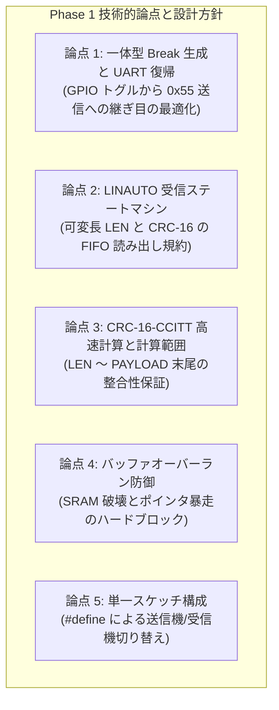

<!--
Copyright (c) 2026 ADX Project Contributors
SPDX-License-Identifier: CC-BY-4.0
-->

# DROP-Bus Phase 1 開発詳細計画書 (Phase 1 Detailed Development Plan)
(一体型フレーム送受信・LINAUTO同期・CRC-16検証・バッファ防御 実装計画)

本ドキュメントは、**ADX Core-D**（MCU: Microchip ATtiny1616, RS-485: SP485EEN）における **DROP-Bus Phase 1 (`TC-D1-01` 〜 `TC-D1-04`)** の実機開発・テストコード作成に先立ち、技術的論点・懸念事項の整理、受信ステートマシン設計、および段階的な検証手順をまとめた詳細開発計画書です。

---

## 1. Phase 1 の位置づけと達成目標

### 1.1 背景とミッション
DROP-Bus は、各ノードが発話するたびに**「物理同期ヘッダ（Break + Delimiter + 0x55）＋ 論理フレーム（LEN + TARGET_ID + SENDER_ID + PAYLOAD + CRC-16）」の一体型パケット**を自律的に送出します。

Phase 1 のミッションは、上位の自律バトンリレーやパッシブSTOを実装する前に、**「単体の一体型フレームが完全な整合性をもって送受信できること」**を実機で実証することです。

```text
【DROP-Bus 一体型フレーム構造】
|<--- 物理同期ヘッダ --->|<------------------------- 論理データフレーム ------------------------->|
+---------+------+-------+-----+-----------+-----------+-----------------------------------+---------+
|  BREAK  | DEL  | SYNC  | LEN | TARGET_ID | SENDER_ID |       PAYLOAD (0 .. N Byte)       | CRC-16  |
+---------+------+-------+-----+-----------+-----------+-----------------------------------+---------+
  >=13bit   1bit    1B     1B       1B          1B              可変長 (最大64 Byte)              2B
```

### 1.2 達成目標（テストケース定義）
| テストID | テストケース名 | 検証内容 | 完了基準 |
| :--- | :--- | :--- | :--- |
| **`TC-D1-01`** | 一体型フレーム生成 ＆ 通常UART受信 | Break + `0x55` + ヘッダ + ペイロード + CRC-16 の生成と送出 | 通常UART受信機で全バイト列が完全一致でダンプできること |
| **`TC-D1-02`** | スレーブ LINAUTO 同期 ＆ 可変長受信 | `USART0.CTRLB` LINAUTO による自動ボーレート校正とデータ受信 | 1B, 16B, 32B, 64B の各サイズでデータ欠落なく受信できること |
| **`TC-D1-03`** | CRC-16 誤り検出 ＆ 不正パケット破棄 | パケット破損時（1ビット反転）の CRC-16 不一致検知 | 破損パケットが即時破棄され、正常パケットのみ受理されること |
| **`TC-D1-04`** | LEN 不正値ガード（オーバーラン防御） | ノイズ等による `LEN > 64` 受信時の即時アボート動作 | SRAM 破壊を起こさず、直ちに受信停止して沈黙すること |

---

## 2. Phase 1 における技術的論点・懸念事項と対策方針



---

### 【論点 1】 一体型 Break 生成と UART 送信の継ぎ目（Turnaround & Delimiter）
* **課題・背景**:
  * 送信ノードは、GPIO トグルで Break（14 Tbit LOW）と Delimiter（2 Tbit HIGH）を生成した後、直ちに `USART0.CTRLB |= USART_TXEN_bm` で UART 送信を再有効化し、`0x55` を送出します。
  * この切り替え時に PA1 ピンにグリッチ（ヒゲ状のノイズパルス）が発生すると、受信側の LINAUTO カウンタが誤測定を起こし、`ISFIF`（同期エラー）が発生します。
* **対策方針**:
  * PA1 の出力状態を HIGH に維持したまま `TXEN` をイネーブルにし、送信バッファ（`TXDATAL`）への書き込み直前に $5 \sim 10\,\mu\text{s}$ の安定化マージンを置きます。
  ```cpp
  void sendDropBreak(uint32_t baud) {
      uint16_t tBit = BIT_TIME_US(baud);
      setTxMode(); // DE=1
      
      USART0.CTRLB &= ~USART_TXEN_bm; // TX ディスエーブル
      PORTA.DIRSET = PIN1_bm;
      PORTA.OUTCLR = PIN1_bm;         // Break: LOW (14 Tbit)
      delayMicroseconds(tBit * 14);
      
      PORTA.OUTSET = PIN1_bm;         // Delimiter: HIGH (2 Tbit)
      delayMicroseconds(tBit * 2);
      
      USART0.CTRLB |= USART_TXEN_bm;  // TX 再イネーブル
      delayMicroseconds(5);           // グリッチ防止マージン
      sendByte(0x55);                 // Sync Byte 送出
  }
  ```

---

### 【論点 2】 LINAUTO 受信ステートマシンと FIFO 読み出し規約
* **課題・背景**:
  * ATtiny1616 の `LINAUTO` では、`Break` ＋ `0x55` の受信が完了した瞬間にハードウェア `BDF`（Break Detect Flag）が立ちます。
  * 受信ステートマシンは、`0x55` 自体を読み飛ばすのか、あるいは `0x55` も FIFO から吸い出すのかを明確に定義する必要があります。
  * また、`RXDATAH` を先に読むルール（10大鉄則 第1条）と、`ISFIF` を `while(RXCIF)` の外で監視するルール（第3条）を徹底します。
* **対策方針**:
  * ステートマシンを以下の 5 つの状態に明確に分割します。

```text
+-----------------------+
| STATE_WAIT_BREAK_SYNC | <── WFB=1, ISFIF 常時監視
+-----------+-----------+
            │ Break + 0x55 自動同期完了 (BDF=1)
            ▼
+-----------------------+
|   STATE_RECEIVE_LEN   | <── LEN (1B) 取得 & バッファオーバーラン判定 (LEN > 64 で即時 abort)
+-----------+-----------+
            │ LEN <= 64
            ▼
+-----------------------+
| STATE_RECEIVE_HEADER  | <── TARGET_ID (1B), SENDER_ID (1B) 取得
+-----------+-----------+
            │
            ▼
+-----------------------+
| STATE_RECEIVE_PAYLOAD | <── PAYLOAD (LEN バイト) 連続受信
+-----------+-----------+
            │
            ▼
+-----------------------+
|   STATE_RECEIVE_CRC   | <── CRC-16 (2B: High, Low) 取得 & CRC 計算照合
+-----------+-----------+
            │
            ├── CRC OK : パケット受理 ＆ タイマーリセット
            └── CRC NG : パケット即時破棄 ＆ タイマー非リセット (パッシブ心中へ)
```

---

### 【論点 3】 CRC-16-CCITT 高速計算と対象範囲
* **課題・背景**:
  * 最大64バイトのペイロードを受信した後、CRC 計算に時間がかかると次のフレームの Break 検出に遅れが生じます。
* **対策方針**:
  * CRC-16-CCITT（多項式 `0x1021`、初期値 `0xFFFF`）を採用。
  * **CRC 計算対象範囲:** `LEN` ＋ `TARGET_ID` ＋ `SENDER_ID` ＋ `PAYLOAD (0..N)` の連続バイト列（合計 $3 + N$ バイト）。
  * 受信しながら逐次 CRC を更新する方式（インクリメンタル計算）を採用し、末尾バイト受信完了から数 $\mu\text{s}$ 以内に照合を完了させます。

---

### 【論点 4】 バッファオーバーラン防御（LEN 不正値ガード）
* **課題・背景**:
  * ノイズ等によって `LEN` が `0xFF` や `0x80` に化けた場合、受信ループが 64 バイトを超えて SRAM を上書きし、マイコンが暴走します。
* **対策方針**:
  * `LEN` を受信した直後に `if (len > MAX_PAYLOAD_SIZE)` を評価。
  * 上限を超えていた場合は直ちに `USART0.STATUS = USART_WFB_bm | USART_ISFIF_bm | USART_BDF_bm;` を実行して受信をアボートし、`STATE_WAIT_BREAK_SYNC` へ強制復帰させます。

---

## 3. スケッチ設計とコード構成案

単一スケッチ（`firmware/tests/ADX_Core-D/DROP/Phase/TC-D1/tc-d1_unified_frame_test.ino`）で送信機・受信機の全テストケースをビルドできる構成とします。

```cpp
// 役割選択
// #define ROLE_TX_TEST      // 送信テスト機 (1秒周期で一体型フレーム送出)
// #define ROLE_RX_DUMP     // 通常UART受信ダンプ機 (TC-D1-01 検証用)
#define ROLE_RX_LINAUTO     // LINAUTO受信 & CRC検証機 (TC-D1-02 〜 TC-D1-04 検証用)
```

---

## 4. 段階的検証手順 (Step-by-Step Execution Plan)

### Step 1: 送信波形および通常 UART ダンプ検証 (`TC-D1-01`)
1. Node 1 を `ROLE_TX_TEST`、Node 2 を `ROLE_RX_DUMP`（9600 bps 通常UART）として書き込み。
2. Node 2 の SoftwareSerial モニタを開き、Break 検出（`0x00`）に続き、`0x55`, `LEN=0x08`, `TARGET=0x02`, `SENDER=0x01`, データ8バイト, CRC-16 (2バイト) が正しく表示されることを確認。

### Step 2: スレーブ LINAUTO ハードウェア同期 ＆ 可変長受信 (`TC-D1-02`)
1. Node 2 を `ROLE_RX_LINAUTO` に書き換え。
2. ペイロード長 $N = 1, 16, 32, 64$ バイトの各パケットを送出し、Node 2 が CRC-16 MATCH (PASS) で全データを正しく取得できることを確認。

### Step 3: CRC 誤り検出 ＆ 不正パケット破棄 (`TC-D1-03`)
1. Node 1 の送信データに意図的に 1 ビット反転ノイズを混入させるモード（`TEST_CORRUPT_CRC`）を有効化。
2. Node 2 が `[CRC_ERROR]` を検知し、データ反映を行わず破棄することを確認。

### Step 4: バッファオーバーラン防御 (`TC-D1-04`)
1. Node 1 から `LEN = 0xFF` の不正フレームを送出。
2. Node 2 が `[LEN_OVERFLOW_GUARD]` を発動して即座にアボートし、SRAM 破壊を起こさないことを確認。
