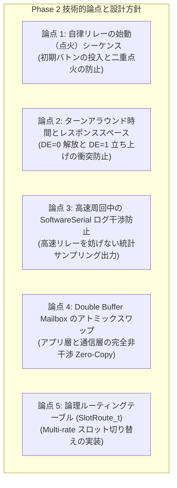
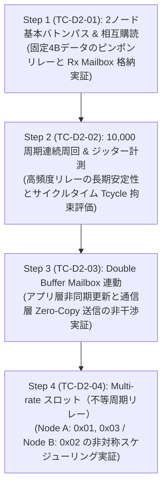

<!--
Copyright (c) 2026 ADX Project Contributors
SPDX-License-Identifier: CC-BY-4.0
-->

# DROP-Bus Phase 2 開発詳細計画書 (Phase 2 Detailed Development Plan)
(自律分散バトンリレー・Pub/Sub相互購読・ジッター計測・Double Buffer 連動 実装計画)

本ドキュメントは、**ADX Core-D**（MCU: Microchip ATtiny1616, RS-485: SP485EEN）における **DROP-Bus Phase 2 (`TC-D2-01` 〜 `TC-D2-04`)** の実機開発・テストコード作成に先立ち、技術的論点・懸念事項の整理、ノード内ステートマシン設計、および段階的な検証手順をまとめた詳細開発計画書です。

---

## 1. Phase 2 の位置づけと達成目標

### 1.1 背景とミッション
Phase 1 の完了により、単一ノードにおける「Break + `0x55` 物理同期」「LINAUTO 自動ボーレート校正」「可変長パース」「CRC-16-CCITT 検証」「バッファオーバーラン防御」の全スタックが実機で実証（ALL PASS）されました。

Phase 2 のミッションは、これら完成した通信スタックを統合し、中央マスターが存在しない環境において、**複数ノードが自律的に発話権（バトン）をパスし合いながら、共有バス上のトピックデータを相互に購読（Common Subscriber）する「自律分散型フィールドネットワーク」** を実機上で確立することです。

```text
============================== RS-485 共有バス ==============================
     ▲                              ▲                              ▲
     │ (1) Publish & Pass           │ (2) Publish & Pass           │ (3) Publish & Pass
     │   [Sender: 0x01]             │   [Sender: 0x02]             │   [Sender: 0x03]
     │   [Target: 0x02]             │   [Target: 0x03]             │   [Target: 0x01]
+----+-----------------------+ +----+-----------------------+ +----+-----------------------+
|    Node A (Publisher 0x01) | |    Node B (Publisher 0x02) | |    Node C (Publisher 0x03) |
|                            | |                            | |                            |
| 購読: 0x02, 0x03           | | 購読: 0x01                 | | 購読: 0x01, 0x02           |
| (Common Subscriber)        | | (Common Subscriber)        | | (Common Subscriber)        |
+----------------------------+ +----------------------------+ +----------------------------+
```

### 1.2 達成目標（テストケース定義）
| テストID | テストケース名 | 検証内容 | 完了基準 |
| :--- | :--- | :--- | :--- |
| **`TC-D2-01`** | 2ノード基本バトンパス ＆ 相互購読 | Node 1（`0x01`）と Node 2（`0x02`）間でのピンポンリレーと相互データ購読 | 2ノード間でバトンが自律的に受け渡され、相手のデータが欠落なく Rx Mailbox に格納されること |
| **`TC-D2-02`** | 連続周回安定性 ＆ ジッター計測 | 10,000 周期以上の連続自律周回とサイクルタイム $T_{\text{cycle}}$ のジッター計測 | エラー率 0.00% で 10,000 周期を完走し、ジッターが理論許容幅（$\pm 50\,\mu\text{s}$ 以内）に収まること |
| **`TC-D2-03`** | Double Buffer Mailbox 連動 | アプリ層非同期更新と通信層 Zero-Copy 送信の非干渉実証 | 制御データ更新と高速リレーが一切の競合（Torn Read）や遅延なく並行稼働すること |
| **`TC-D2-04`** | Multi-rate スロット（不等周期リレー） | 1ノード複数スロット所有による非対称スケジューリング実証 | Node A が 1 サイクル中に 2 回（`0x01` と `0x03`）発話し、Node B（`0x02`）と不等周期リレーが成立すること |

---

## 2. Phase 2 における技術的論点・懸念事項と対策方針



---

### 【論点 1】 自律リレーの始動（点火）シーケンス
* **課題・背景**:
  * DROP-Bus は平常時マスターが存在しないため、電源投入直後はバスが無音状態です。
  * どちらかのノードが最初のバトンをバスへ打ち込む（点火する）必要がありますが、双方が同時に点火すると衝突が発生します。
* **対策方針**:
  * **初期点火ノード（Igniter）の指定**:
    Node 1（Publisher `0x01`）のみが、起動後（3秒間のシリアルモニタ待機後）に最初の点火フレーム（Target: `0x02`, Sender: `0x01`）を送出します。
  * **点火後の自律遷移**:
    点火フレーム送出後、Node 1 は即座に受信モード（`setRxMode()` ＆ `WFB=1`）へ移行し、以降は純粋なバトン待ち受けステートマシンとして動作します。

---

### 【論点 2】 半二重 RS-485 のターンアラウンド時間とレスポンススペース
* **課題・背景**:
  * Node 1 がパケット送信を終えて `DE=0`（受信モード）に戻すタイミングと、Node 2 がパケットを受信して `DE=1`（送信モード）に立ち上げるタイミングが重なると、トランシーバー同士の衝突や波形歪みが発生します。
* **対策方針**:
  * **送信側**: `Serial.flush()` を確実に完了させてから `DE=0` を実行（10大鉄則 第7条）。
  * **受信側（次の送信者）**: 自身宛てのバトン（`TARGET_ID == my_slot_id`）を受信した後、**約 $100 \sim 200\,\mu\text{s}$（1〜2 Tbit 相当）のレスポンススペース（ウェイト）** を置いてから `setTxMode()`（`DE=1`）を実行して送信を開始します。

```text
[Node 1] ──[Data + CRC]──> [Serial.flush()] ──> setRxMode(DE=0)
                                                    │
                                                    ▼ <Response Gap: 約100〜200µs>
[Node 2] ─────────────────> [CRC MATCH] ──────────> setTxMode(DE=1) ──[Break + 0x55 + Data]──>
```

---

### 【論点 3】 高速周回中の SoftwareSerial（PCモニタ）ログ干渉防止
* **課題・背景**:
  * Phase 2 では、2ノード間のピンポンリレーが数ミリ秒（例: 1周 約 10〜20ms）の超高速で連続周回します。
  * もし 1 周期ごとに `pcSerial.print()` を呼ぶと、SoftwareSerial（9600 bps: 1文字約1ms）のビットバンギング処理で数十ミリ秒マイコンが拘束され、相手から返ってきたバトンを受信できずに通信が破綻します。
* **対策方針**:
  * **通信ループの純粋高速化**:
    `loop()` 内では受信 $\rightarrow$ CRC照合 $\rightarrow$ Mailbox更新 $\rightarrow$ バトン返信の処理のみを最優先で実行。
  * **統計サンプリングログ出力**:
    周回数カウンタ、サイクルタイム $T_{\text{cycle}}$、およびジッター（最大・最小時間）をメモリ上で計測。
    **1,000 周期ごと（または 1 秒に 1 回のレートリミット）** で統計サマリーを 1 行だけ出力する方式を採用します。

---

### 【論点 4】 Double Buffer Mailbox のアトミックスワップ機構
* **課題・背景**:
  * アプリケーション層（センサ取得やモータ制御）がデータを更新している最中に通信割り込みや送受信が走ると、データの一部のみが更新される「不整合読み出し（Torn Read）」が発生します。
* **対策方針**:
  * 送信用・受信用にそれぞれ **2面（Front / Back）のメールボックス** を配置。
  * ポインタ/インデックス（`activeTxIdx`, `activeRxIdx`）の 1 バイト反転（アトミックスワップ）により、Zero-Copy かつ完全非干渉な送受信を実現します。

```cpp
typedef struct {
    uint8_t buffer[2][MAX_PAYLOAD_SIZE]; // 面 0, 面 1
    volatile uint8_t activeIdx;          // 通信層が参照中の面 (0 or 1)
} DoubleBuffer_t;

// アプリ層がデータを更新して面を切り替える
void updateTxData(const uint8_t *newData, uint8_t len) {
    uint8_t writeIdx = mailbox.activeIdx ^ 1; // 非アクティブ面へ書き込み
    memcpy(mailbox.buffer[writeIdx], newData, len);
    mailbox.activeIdx = writeIdx;             // アトミックスワップ
}
```

---

### 【論点 5】 論理ルーティングテーブル（`SlotRoute_t`）による Multi-rate 制御
* **課題・背景**:
  * 単一ノードが複数スロット（例: Node A が `0x01` と `0x03`）を担当する場合、バトンを受け取るたびに送出するトピックと次の宛先を正しく切り替える必要があります。
* **対策方針**:
  * ノード内に `SlotRoute_t` 配列を保持し、受信した `TARGET_ID` に一致するルートエントリを検索して次フレームの `SENDER_ID`, `TARGET_ID`, `LEN` を決定します。

```cpp
typedef struct {
    uint8_t my_slot_id;      // 自身が担当する論理バトンID (SENDER_ID)
    uint8_t next_target_id;  // 次にバトンを渡す宛先バトンID (TARGET_ID)
    uint8_t payload_len;     // このスロットで送出するデータ長
} SlotRoute_t;
```

---

## 3. Phase 2 段階的実装・検証ステップ (Step-by-Step Plan)



---

### Step 1 (`TC-D2-01`): 2ノード基本バトンパス ＆ 相互購読
* **検証内容:**
  - Node 1（点火役: `0x01` $\rightarrow$ Target: `0x02`）と Node 2（`0x02` $\rightarrow$ Target: `0x01`）の間で、途切れずにバトンが周回することを確認。
  - 受信した相手のペイロードデータが、自機の `rxMailbox` に正確に格納・購読されることを確認。

### Step 2 (`TC-D2-02`): 連続周回安定性 ＆ ジッター計測
* **検証内容:**
  - 10,000 周期以上の連続周回を実施。
  - サイクルタイム $T_{\text{cycle}}$ の平均値、最小値、最大値、ジッター（$\Delta T$）を計測し、通信エラー率 0.00% を実証。

### Step 3 (`TC-D2-03`): Double Buffer Mailbox 連動
* **検証内容:**
  - アプリ層模擬ループ（ミリ秒タイマー）でセンサ値（カウンタ値）を非同期にインクリメント更新。
  - 通信スタックがその最新値を Zero-Copy で送信し、受信ノード側で欠落や不整合のない連続データ列として受信されることを確認。

### Step 4 (`TC-D2-04`): Multi-rate スロット（不等周期リレー）
* **検証内容:**
  - Node A に 2 つのスロット（`0x01`: 制御 4B, `0x03`: ログ 8B）、Node B に 1 つのスロット（`0x02`: センサ 4B）を割り当て。
  - `0x01 (A) -> 0x02 (B) -> 0x03 (A) -> 0x02 (B) -> ...` の非対称周回が正しく成立することを実証。
