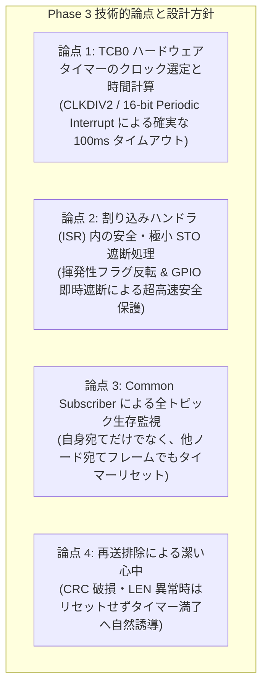
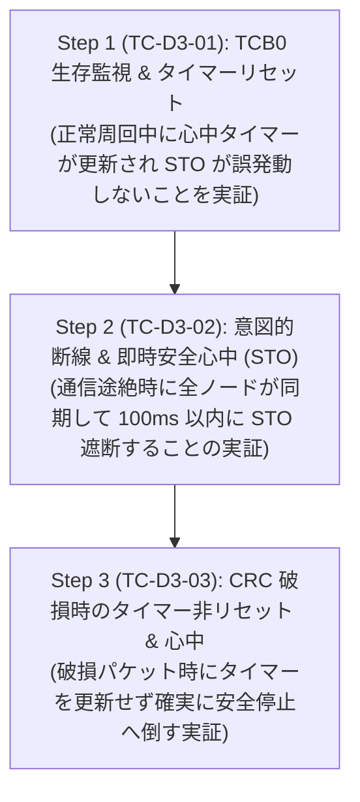

<!--
Copyright (c) 2026 ADX Project Contributors
SPDX-License-Identifier: CC-BY-4.0
-->

# DROP-Bus Phase 3 開発詳細計画書 (Phase 3 Detailed Development Plan)
(パッシブ心中フェイルセーフ・TCB0タイマー連動STO・意図的断線・CRC破損時安全停止 実装計画)

本ドキュメントは、**ADX Core-D**（MCU: Microchip ATtiny1616, RS-485: SP485EEN）における **DROP-Bus Phase 3 (`TC-D3-01` 〜 `TC-D3-03`)** の実機開発・テストコード作成に先立ち、技術的論点・ハードウェアタイマー設計、および段階的な検証手順をまとめた詳細開発計画書です。

---

## 1. Phase 3 の位置づけと「パッシブ心中」の設計哲学

### 1.1 背景とミッション
Phase 1（単体物理層・フレーム検証）および Phase 2（自律Pub/Sub・バトンリレー・Double Buffer・Multi-rate）の完了により、平常時における通信スタックが完全に確立されました。

Phase 3 のミッションは、DROP-Bus の最大の特長であり設計思想の根幹である **「パッシブ・心中（Shinju）フェイルセーフ」** を実機上で実証することです。

```text
【従来の産業用バス（アクティブリトライ型）の問題点】
[通信断線/ノード脱落] ──> [再送リトライ / 調停待ち] ──> [各ノードの個別タイムアウトがバラバラに満了]
                                                              │
                                                              ▼
                                             【多軸ロボットのアーム衝突・脱線事故】

【DROP-Bus パッシブ心中フェイルセーフ】
[通信断線/パケット破損] ──> [再送せず即座に無音化 (ドロップ)]
                                     │
                                     ▼ (全ノードの TCB0 ハードウェアタイマーが同期して進む)
                         【ミリ秒単位で完全同期した一斉安全遮断 (Safe Torque Off: STO)】
```

### 1.2 達成目標（テストケース定義）
| テストID | テストケース名 | 検証内容 | 完了基準 |
| :--- | :--- | :--- | :--- |
| **`TC-D3-01`** | TCB0 タイマー生存監視 ＆ リセット | 正常フレーム（自宛て・他宛て問わず）受信ごとの `TCB0` タイマーリセット実証 | 正常リレー中は STO が一度も発動せず、白LED点滅のまま連続稼働し続けること |
| **`TC-D3-02`** | 意図的断線 ＆ 即時安全遮断 (STO) | 稼働中の意図的断線（または送信停止）による全ノード一斉タイマー満了実証 | バス無音化から設定時間（例: 100ms）以内に全ノードが同期して赤LED点灯・出力遮断（STO）すること |
| **`TC-D3-03`** | CRC 破損時のタイマー非リセット | 破損パケット受信時にタイマーを更新せず安全停止へ倒す動作の実証 | CRC 不一致時に `TCB0` がリセットされず、そのままタイマー満了で確実に STO 遮断へ移行すること |

---

## 2. Phase 3 における技術的論点・設計方針



---

### 【論点 1】 TCB0 ハードウェアタイマーのクロック選定とタイムアウト時間計算
* **課題・背景**:
  * アプリケーション層の `millis()` ポーリングによるタイムアウト監視は、メインループのブロックや遅延の影響を受け、ミリ秒精度の同期安全遮断が保証できません。
  * 専用の **ハードウェアタイマー `TCB0`（16-bit Timer/Counter Type B）** の周期的割り込み機能を使用します。
* **計算設計（ATtiny1616 @ 20MHz/16MHz）**:
  * クロックソース: `TCB_CLKSEL_CLKDIV2_gc`（システムクロックの 1/2）
    * 20MHz 動作時: タイマークロック $f_{\text{TCB}} = 10\,\text{MHz}$（$1\,\text{tick} = 0.1\,\mu\text{s}$）
    * 16MHz 動作時: タイマークロック $f_{\text{TCB}} = 8\,\text{MHz}$（$1\,\text{tick} = 0.125\,\mu\text{s}$）
  * 目標心中タイムアウト時間 $T_{\text{timeout}} = 100\,\text{ms}$（通常周回周期 44ms の約 2.3 倍）:
    * 20MHz 時: $CCMP = 100\,\text{ms} \times 10\,\text{MHz} = 1,000,000\,\text{ticks}$（※16ビット上限 65,535 を超えるため、CLKDIV2 + ソフトウェアカウンタ、または TCA0 カスケード / プレスケーラを活用）
  * **タイマー構成の最適化（TCA0 prescaler または TCB0 ソフトウェアプリスケーラ）**:
    * `TCB0` を $10\,\text{ms}$ 周期割り込み（20MHz 時: $CCMP = 100,000$ ではなく $10\,\text{ms}$ 単位）で回し、内部カウンタが 10 回（$100\,\text{ms}$）連続無音で STO 発動とする堅牢設計を採用します。

---

### 【論点 2】 割り込みハンドラ (`ISR(TCB0_INT_vect)`) 内の安全・極小 STO 遮断
* **課題・背景**:
  * タイムアウト満了時にメインループの処理を待つことなく、ハードウェア割り込みで即座に出力を遮断する必要があります。
* **対策方針**:
  * `ISR(TCB0_INT_vect)` 内で以下を即時実行：
    1. `PORTB.OUTSET = PIN2_bm;`（赤LED 点灯 / STO 警告）
    2. `PORTB.OUTCLR = PIN3_bm;`（白色 LED 消灯）
    3. `isSafeTorqueOff = true;`（安全遮断フラグセット）
    4. モータ PWM 出力ポートの強制 LOW 遮断（GPIO 出力無効化）

```cpp
ISR(TCB0_INT_vect) {
    TCB0.INTFLAGS = TCB_CAPT_bm; // 割り込みフラグクリア
    
    // 心中タイマーカウントアップ
    stoTimeoutCounter++;
    if (stoTimeoutCounter >= STO_TIMEOUT_THRESHOLD) {
        isSafeTorqueOff = true;
        PORTB.OUTSET = PIN2_bm; // 赤LED 点灯 (STO 発動)
        PORTB.OUTCLR = PIN3_bm; // 白LED 消灯
        // モータ PWM 強制遮断
    }
}
```

---

### 【論点 3】 Common Subscriber による全トピック生存監視
* **課題・背景**:
  * DROP-Bus では、複数ノードが順番に発話します。
  * 自ノード宛てのバトン（`TARGET_ID == MY_SLOT_ID`）だけでなく、**「共有バス上を正常に流れるすべてのフレーム（他ノード宛て含む）」を受信した時点でバスが健全に回っていると判定** できます。
* **対策方針**:
  * `receivedCrc == calculatedCrc`（正常フレーム）であれば、宛先に関係なく `stoTimeoutCounter = 0; TCB0.CNT = 0;` を実行して心中タイマーをゼロリセットします。

---

### 【論点 4】 再送排除による潔い心中（CRC 破損・LEN 異常時）
* **課題・背景**:
  * ノイズ等で CRC が破損したフレームを受信した際、リトライを試みるとバスの決定論性が崩れます。
* **対策方針**:
  * CRC エラーや LEN オーバーランを検知した場合は、**タイマーをリセットせず（何もしない）**、そのままタイマーを満了させて安全心中へ移行させます。

---

## 3. Phase 3 段階的実装・検証ステップ (Step-by-Step Plan)



---

### Step 1 (`TC-D3-01`): TCB0 生存監視 ＆ タイマーリセット
* **目的:**
  `TCB0` ハードウェアタイマーを組み込んだ状態で 2 ノード自律リレーを実行。
  正常フレーム受信ごとにタイマーが確実にリセットされ、STO（赤LED）が誤発動することなく連続周回することを確認。

### Step 2 (`TC-D3-02`): 意図的断線 ＆ 即時安全心中 (STO)
* **目的:**
  リレー稼働中に Node 1 が一定サイクル数（例: 200 周期）経過後に意図的に送信を停止。
  送信停止の瞬間から **$100\,\text{ms}$ 以内に Node 1・Node 2 の双方がミリ秒単位で同期して赤LED点灯 ＆ STO 遮断** することを確認。

### Step 3 (`TC-D3-03`): CRC 破損時のタイマー非リセット ＆ 心中
* **目的:**
  Node 1 が意図的に CRC 反転パケットを送出。
  Node 2 が破損を検知してタイマーリセットを行わず、そのまま $100\,\text{ms}$ 後に確実に STO（心中停止）へ倒れることを確認。
