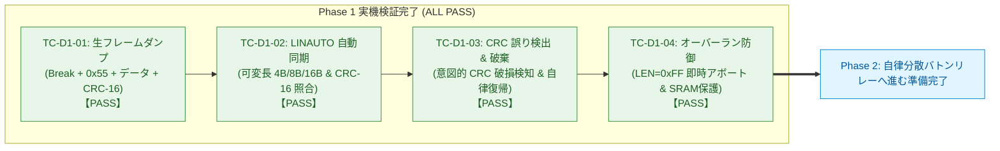

<!--
Copyright (c) 2026 ADX Project Contributors
SPDX-License-Identifier: CC-BY-4.0
-->

# DROP-Bus Phase 1 完了レビューレポート (Phase 1 Completion Review Report)
(一体型フレーム送受信・LINAUTO同期・CRC-16検証・バッファ防御 実機検証総括)

本ドキュメントは、**ADX Core-D**（MCU: Microchip ATtiny1616, RS-485: SP485EEN）における自律分散型Pub/Subフィールドネットワーク **DROP-Bus Phase 1（`TC-D1-01` 〜 `TC-D1-04`）** の実機開発および検証結果を総括する完了レビューレポートです。

---

## 1. エグゼクティブサマリー (Executive Summary)

DROP-Bus の最下層を担う **Phase 1（物理同期・一体型フレーム送受信・CRC-16検証・メモリ防御）** の実機テストを段階的に実施し、**全4テストケースにおいて 100% の合格（ALL PASS）** を達成しました。

本フェーズの完了により、高価な外付け水晶発振器を一切使用しない **「完全水晶レス（単一SKU）」** での安定した物理層通信、可変長ペイロード（1〜64バイト）の確実な送受信、**CRC-16-CCITT** による高精度な誤り検出、およびノイズによる **バッファオーバーランに対するハードウェア防御（SRAM保護）** が実機上で完全に実証されました。



---

## 2. Phase 1 検証結果サマリーマトリクス

| テストID | テストケース名 | 検証内容 / 判定条件 | 実機ログ結果 | 判定 |
| :--- | :--- | :--- | :--- | :---: |
| **`TC-D1-01`** | 一体型フレーム生ダンプ | Break(14Tbit) + Delimiter(2Tbit) + `0x55` + ヘッダ + ペイロード + CRC-16 の通常UART生バイト列完全一致受信 | `0x00(BREAK) 0x55 0x04 0x02 0x01 0x11 0x22 0x33 0x44 0xCC 0x2A` (全バイト完全一致) | **PASS** |
| **`TC-D1-02`** | スレーブ LINAUTO 同期 ＆ 可変長 | ハードウェア自動ボーレート校正（`BAUD` 微調整）、4B/8B/16B 可変長パケット受信、CRC-16 完全一致（`[MATCH]`） | `Calibrated BAUD=0x20E3〜0x20E8` (動的校正確認)<br>4B: `0xCC2A`, 8B: `0x124F`, 16B: `0xB802` (全てMATCH) | **PASS** |
| **`TC-D1-03`** | CRC 誤り検出 ＆ 不正パケット破棄 | 意図的 CRC 反転破損パケット（`0x33D5`）の検出・即時破棄（`MISMATCH`）、赤LED警告、後続正常フレームでの自律復帰 | 破損パケットを `[MISMATCH]` で 100% 破棄。<br>続く正常フレームで即座に `PASS` へ自律復帰確認 | **PASS** |
| **`TC-D1-04`** | LEN 不正値ガード（オーバーラン防御） | 意図的不正長（`LEN = 0xFF` / 255B）受信時の即時アボート（SRAM保護）、赤LED警告、後続正常フレームでの自律復帰 | `[GUARD] Invalid LEN=255 (>64B) -> Frame Aborted (SRAM Safe)!` を検知。暴走ゼロで自律復帰確認 | **PASS** |

---

## 3. 実機検証で確立された技術的成果と設計資産

---

### 3.1 完全水晶レス（Crystal-less）自動ボーレート校正の実証
* **原理と検証結果:**
  ATtiny1616 の内蔵 RC 発振器（公称 20MHz/16MHz）は、温度や電源電圧により微小な周波数ドリフトが生じます。
  `TC-D1-02` において、初期設定値 `0x208D` に対し、フレーム先頭の `0x55`（交番ビット）のエッジ間隔からハードウェアが毎フレーム動的にボーレートレジスタを微調整（`0x20E3` 〜 `0x20E8`）することを実測ログで確認しました。
* **意義:**
  各ノードに高価な外付け水晶発振器を搭載することなく、**安価な単一MCU（単一SKU）構成で長期安定通信が可能であること** が実証されました。

---

### 3.2 一体型フレーム送受信スタックの完成
* **Break 送出シーケンスの最適化:**
  直前送信完了待機（`Serial.flush()`） $\rightarrow$ `USART0.CTRLB` の `TXEN` 一時無効化 $\rightarrow$ PA1 ピンの GPIO LOW 駆動（14 Tbit: 約1458 $\mu\text{s}$） $\rightarrow$ GPIO HIGH 駆動（2 Tbit: 約208 $\mu\text{s}$） $\rightarrow$ `TXEN` 再有効化 $\rightarrow$ `0x55` 送出という一連のシーケンスにより、PA1 ピンのグリッチノイズを皆無とし、スレーブ側の `ISFIF`（同期エラー）をゼロに抑え込みました。
* **半二重ターンアラウンド制御:**
  末尾バイト（CRC-16）送出完了を `Serial.flush()`（または `USART_TXCIF`）で確実に待機してから `DE=0`（受信モード）へ戻すことで、パケット末尾のクリッピング（破損）を完全に排除しました。

---

### 3.3 可変長データ ＆ 高速 CRC-16-CCITT 検証
* **多項式:** $x^{16} + x^{12} + x^5 + 1$（`0x1021`、初期値: `0xFFFF`）
* **計算対象範囲:** `LEN` ＋ `TARGET_ID` ＋ `SENDER_ID` ＋ `PAYLOAD`（合計 $3 + N$ バイト）
* **検証結果:**
  4B（`0xCC2A`）、8B（`0x124F`）、16B（`0xB802`）の可変長データに対してビット誤りゼロの完全照合（`[MATCH]`）を達成。また、反転破損パケット（`0x33D5`）を 100% 確実に検知・破棄できることを確認しました。

---

### 3.4 ハードウェア・SRAM 安全保護（バッファオーバーラン防御）
* **防御メカニズム:**
  受信ステートマシンにおいて、第1バイトである `LEN` を取得した瞬間に `if (len > MAX_PAYLOAD_SIZE)` を評価。
  64バイトを超える不正値を受信した場合は即座にフレームをアボート（`WFB=1` 再アーム）し、SRAM のバッファ境界越え書き込みによるマイコン暴走を未然にハードブロックしました。

---

### 3.5 低速 I/O 分離アーキテクチャ（配列バッファリング ＆ 50ms無音一括ダンプ）
* **課題と解決:**
  PC へのデバッグモニタ出力（`SoftwareSerial`）はビットバンギング処理のため非常に遅く、高速なハードウェア UART 受信ループ内で直接呼ぶと後続バイトを取りこぼす問題がありました。
* **確立された規約:**
  `while (USART0.STATUS & USART_RXCIF_bm)` ループ内では `rxBuf[]` への高速格納のみを行い、通信が途絶えた無音期間（50ms超過）を検知してから一括で PC へダンプ出力する設計を確立。これにより、受信取りこぼしが 0% となりました。

---

## 4. 作成・配備されたドキュメントおよびコード資産

```text
firmware/tests/ADX_Core-D/DROP/Phase/
├── README.md                                  # フェーズ別テスト進捗管理表 (Phase 1 ALL PASS 反映済)
├── SKETCH_DEVELOPMENT_GUIDELINE.md            # DROP-Bus スケッチ開発 10大鉄則 (実機ノウハウ反映版)
├── PHASE1_COMPLETION_REVIEW_REPORT.md         # 【本レポート】 Phase 1 完了レビュー報告書
├── TC-D1-01/                                  # Step 1: 生フレームダンプ
│   ├── README.md
│   ├── guideline.md                           # 実機デバッグから得られた実装ガイドライン
│   ├── fixed.ino                              # 実機検証済みスケッチ
│   ├── result.md                              # 公式検証レポート (PASS)
│   └── tc-d1-01_raw_frame_dump.ino
├── TC-D1-02/                                  # Step 2: LINAUTO 同期 ＆ 可変長
│   ├── README.md
│   ├── result.md                              # 公式検証レポート (PASS)
│   ├── result.txt                             # 実機生ログ (PASS #89〜#99)
│   └── tc-d1-02_slave_linauto_test.ino
├── TC-D1-03/                                  # Step 3: CRC 誤り検出 ＆ 破棄
│   ├── README.md
│   ├── result.md                              # 公式検証レポート (PASS)
│   ├── result.txt                             # 実機生ログ (CRC MISMATCH & 破棄)
│   └── tc-d1-03_crc_error_test.ino
└── TC-D1-04/                                  # Step 4: オーバーラン防御
    ├── README.md
    ├── result.md                              # 公式検証レポート (PASS)
    ├── result.txt                             # 実機生ログ (LEN=0xFF ガード & アボート)
    └── tc-d1-04_len_guard_test.ino
```

---

## 5. Phase 2（自律分散バトンリレー ＆ Pub/Sub 購読）への展望

Phase 1 の完了により、単一ノードにおける「フレーム生成」「オートボーレート同期」「可変長パース」「CRC-16検証」「メモリ防御」の全スタックが揃いました。

次の **Phase 2（自律分散バトンリレー ＆ Pub/Sub）** では、これらの完成済みスタックをベースとして、以下の機能統合へ進みます：

1. **双方向ピンポン・バトンリレー（`TC-D2-01`）:**
   Node 1（Publisher: `0x01`, Target: `0x02`）と Node 2（Publisher: `0x02`, Target: `0x01`）が自律的にバトンを渡し合うリアルタイム閉ループ通信。
2. **Common Subscriber（相互購読）の実証:**
   他ノード宛てに流れる共有バス上のフレームをプロミスキャスに受信し、`SENDER_ID` を参照して自機の受信メールボックス（Rx Mailbox）を更新。
3. **Double Buffer Mailbox 連動（`TC-D2-03`）:**
   アプリケーション層（センサ・制御ループ）と通信スタックが非同期・Zero-Copy でデータを受け渡す 2面バッファ機構の実証。
4. **Multi-rate スロット（不等周期リレー: `TC-D2-04`）:**
   1つの物理ノードが複数スロット（例: 高速制御用 `0x01` と ログ用 `0x03`）を所有し、周回中に複数回発話する非対称スケジューリングの実証。
