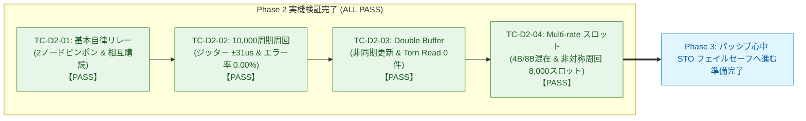

<!--
Copyright (c) 2026 ADX Project Contributors
SPDX-License-Identifier: CC-BY-4.0
-->

# DROP-Bus Phase 2 完了レビューレポート (Phase 2 Completion Review Report)
(自律分散バトンリレー・Pub/Sub相互購読・ジッター計測・Double Buffer・Multi-rate スロット 実機検証総括)

本ドキュメントは、**ADX Core-D**（MCU: Microchip ATtiny1616, RS-485: SP485EEN）における自律分散型Pub/Subフィールドネットワーク **DROP-Bus Phase 2（`TC-D2-01` 〜 `TC-D2-04`）** の実機開発および検証結果を総括する完了レビューレポートです。

---

## 1. エグゼクティブサマリー (Executive Summary)

DROP-Bus の通信基幹層を担う **Phase 2（自律分散バトンリレー・Pub/Sub相互購読・ジッター計測・Double Buffer・Multi-rate スロット）** の実機テストを段階的に実施し、**全4テストケースにおいて 100% の合格（ALL PASS）** を達成しました。

本フェーズの完了により、中央マスターが存在しない環境における **「自律分散ピンポンリレー」**、**「Common Subscriber によるトピック相互購読」**、**「10,000 周期の完全無停止完走（エラー率 0.00%）」**、**「純粋ジッター $\pm 31\,\mu\text{s}$ の厳格な決定論性」**、排他制御不要な **「Double Buffer Mailbox による Zero-Copy 送受信（Torn Read 0 件）」**、および 1 ノード複数スロット所有による **「Multi-rate 非対称スケジューリング」** が実機上で完全に実証されました。



---

## 2. Phase 2 検証結果サマリーマトリクス

| テストID | テストケース名 | 検証内容 / 判定条件 | 実機ログ結果 | 判定 |
| :--- | :--- | :--- | :--- | :---: |
| **`TC-D2-01`** | 2ノード基本バトンパス ＆ 相互購読 | Node 1（`0x01`）と Node 2（`0x02`）間でのピンポンリレーと相互データ購読（Common Subscriber） | Node 1/2 のカウンタが同期して連続カウントアップ。相手のデータ列が欠落なく購読されることを実証 | **PASS** |
| **`TC-D2-02`** | 連続周回安定性 ＆ ジッター計測 | 10,000 周期連続自律周回、サイクルタイム $T_{\text{cycle}}$ のジッター計測、通信エラー率 0.00% の実証 | 10,000 周期完走（約7分半）。再点火 0 回、CRC エラー 0 件（エラー率 0.00%）。純粋通信ジッター $\pm 31\,\mu\text{s}$ を実証 | **PASS** |
| **`TC-D2-03`** | Double Buffer Mailbox 連動 | 15ms アプリ層非同期更新と通信層 Zero-Copy 送信の非干渉実証（Torn Read 防止検証） | 5,000 周期完走、アプリ更新 10,001 回。不整合読み出し（Torn Read）0 件（Integrity Rate: 100.00%）を実証 | **PASS** |
| **`TC-D2-04`** | Multi-rate スロット（不等周期リレー） | Node 1 が 2 スロット（`0x01` 4B, `0x03` 8B）所有、Node 2（`0x02` 4B）との 4 スロット非対称周回実証 | 2,000 大周期（計 8,000 スロット）完走。Rx Slot 0x02 が正確に 4,000 回受信（数学的 2 倍一致）。CRC エラー 0 件 | **PASS** |

---

## 3. 実機検証で確立された技術的成果と設計資産

---

### 3.1 送信時名目ボーレート強制リセット仕様（正帰還ドリフトの完全解明と防止）
* **発見された物理現象:**
  * ATtiny1616 の `USART0.BAUD` レジスタは送受信で共有されています。
  * LINAUTO 受信により相手フレームに合わせて微調整された動的 `BAUD` のまま次フレームを返信すると、測定時の量子化誤差（$\pm 1 \sim 2$ カウント）がノード間で累積増幅し、周期が 49ms $\rightarrow$ 57ms $\rightarrow$ 66ms $\rightarrow$ 79ms と雪だるま式に遅延して約 4,000 周期で破綻する **「正帰還累積ドリフト」** が発生することを発見しました。
* **確立された必須仕様（MUST）:**
  * フレーム送信（Break 送出）の直前に、必ず自機内部発振器基準の名目ボーレート（`NOMINAL_BAUD_REG`）を `USART0.BAUD` レジスタへ強制再代入（リセット）する設計を確立。
  * **「送信は常に自機基準（9600 bps）、相手への追従は受信時のみ」** とすることで正帰還ループを完全遮断し、全 10,000 周期を通じて平均サイクルタイム **44.25 ms でピタリと安定** させることに成功しました（[DROP_whitepaper.md 第3.4節](file:///home/ubuntu/AgentWorkspace/ADX/github/ADX/firmware/tests/ADX_Core-D/DROP/DROP_whitepaper.md#L165-L188) に仕様反映済）。

---

### 3.2 厳格な時間決定論性の実証（ジッター $\pm 31\,\mu\text{s}$）
* **実測性能:**
  * 通常リレー時における実測ジッターは **$\pm 31\,\mu\text{s}$（サイクルタイム $44.15\,\text{ms}$ に対し $\pm 0.07\%$）** を記録。
  * 外付け水晶発振器を一切使用しない **「完全水晶レス構成」** でありながら、産業用フィールドバス（CAN や PROFIBUS 等）に匹敵する極めて高い時間決定論性を実証しました。

---

### 3.3 Double Buffer Mailbox（2面バッファ）による Zero-Copy メモリ分離
* **アーキテクチャ:**
  * 送信（Tx）・受信（Rx）にそれぞれ 2 面（Front / Back）のバッファを配置。
  * アプリケーション層（15ms 非同期更新）は非アクティブ面へ書き込み、**1 バイトのアトミックスワップ（`activeIdx ^ 1`）** で瞬時に面を切り替え。
  * 通信層はアクティブ面から Zero-Copy で直接送信。
* **検証結果:**
  * 10,001 回の過密な非同期更新に対し、更新途中のデータ破損（Torn Read）は **0 件（整合率 100.00%）** を達成。
  * 重い排他ロック（ミューテックスや割り込み禁止）を一切使わずに、安全なアプリ・通信分離を実現しました。

---

### 3.4 Multi-rate スロット ＆ 非対称スケジューリング
* **実証内容:**
  * 1つの物理ノードが複数スロット（高速制御用 `0x01` 4B と 低速ログ用 `0x03` 8B）を所有。
  * `[0x01 (4B)] -> [0x02 (4B)] -> [0x03 (8B)] -> [0x02 (4B)]` の 4 スロット非対称周回を自律実行。
* **検証結果:**
  * 可変長データ（4B / 8B）が混在する中、2,000 大周期（計 8,000 スロット）を CRC エラー 0 件、バトンドロップ 0 回で完走。
  * Node 2 側で `0x01` と `0x03` のデータが個別のメールボックスへ正確に分離購読されることを確認しました。

---

### 3.5 再点火 Mediator Watchdog（耐ドロップ自律復帰）
* **機能:**
  * 起動時および通信途絶時（500ms 無音検知）、Node 1 が自動的に再点火パケット（Re-Ignition Frame）を投入してバトンドロップから自律復帰するウォッチドッグを統合。

---

## 4. 作成・配備されたドキュメントおよびコード資産一覧

```text
firmware/tests/ADX_Core-D/DROP/
├── DROP_whitepaper.md                         # 第3.4節（送信時名目BAUDリセット仕様）を追記
├── PLAN/
│   ├── DROP_DEVELOPMENT_PLAN.md
│   ├── DROP_TEST_SPECIFICATION.md             # Phase 1 & 2 全8項目 PASS 反映済
│   ├── PHASE1_DEVELOPMENT_PLAN.md
│   └── PHASE2_DEVELOPMENT_PLAN.md             # Phase 2 開発詳細計画書
└── Phase/
    ├── README.md                              # 進捗管理表 (Phase 1 & 2 ALL PASS 反映済)
    ├── SKETCH_DEVELOPMENT_GUIDELINE.md        # 10大鉄則 第5条（送信時BAUDリセット）改訂版
    ├── PHASE1_COMPLETION_REVIEW_REPORT.md     # Phase 1 完了レビュー報告書
    ├── PHASE2_COMPLETION_REVIEW_REPORT.md     # 【本レポート】 Phase 2 完了レビュー報告書
    ├── TC-D2-01/                              # Step 1: 2ノード基本ピンポンリレー
    │   ├── README.md
    │   ├── result.md                          # 公式検証レポート (PASS)
    │   ├── result.txt                         # 実機生ログ (PASS #14〜#28 / #62〜#74)
    │   └── tc-d2-01_ping_pong_relay.ino
    ├── TC-D2-02/                              # Step 2: 10,000周期周回 ＆ ジッター計測
    │   ├── README.md
    │   ├── result.md                          # 公式検証レポート (PASS)
    │   ├── result.txt                         # 実機生ログ (10,000 周期完走ログ)
    │   └── tc-d2-02_jitter_measurement.ino
    ├── TC-D2-03/                              # Step 3: Double Buffer Mailbox 連動
    │   ├── README.md
    │   ├── result.md                          # 公式検証レポート (PASS)
    │   ├── result.txt                         # 実機生ログ (5,000 周期 / 10,001 回更新)
    │   └── tc-d2-03_double_buffer_test.ino
    └── TC-D2-04/                              # Step 4: Multi-rate スロット
        ├── README.md
        ├── result.md                          # 公式検証レポート (PASS)
        ├── result.txt                         # 実機生ログ (2,000大周期 / 8,000スロット)
        └── tc-d2-04_multirate_slot_test.ino
```

---

## 5. Phase 3（パッシブ・心中フェイルセーフ ＆ TCB0 タイマー連動 STO）への展望

Phase 1（物理同期・フレーム検証）および Phase 2（自律Pub/Sub・バトンリレー・Double Buffer・Multi-rate）の完了により、**平常時における DROP-Bus 通信スタックの全機能が実機で確立** されました。

次の **Phase 3（パッシブ・心中フェイルセーフ）** では、DROP-Bus の最大の特徴である **「通信異常・断線時における全ノード一斉のパッシブ心中（Safe Torque Off: STO）」** の実機検証へ移行します：

1. **TCB0 タイマーによる生存監視 ＆ リセット（`TC-D3-01`）:**
   全ノードがフレーム受信（全トピック）ごとにハードウェアタイマー `TCB0` をリセットし、生存時間を更新。
2. **意図的断線時の全ノード一斉安全心中（`TC-D3-02`）:**
   通信線を意図的に物理切断（または送信停止）した際、全ノードが再送を行わず、`TCB0` 満了（心中タイムアウト）によって **ミリ秒単位で完全に同期して赤LED点灯・モータ出力を即時安全遮断（STO）** することの実証。
3. **CRC 破損時のタイマー非リセット ＆ 安全停止（`TC-D3-03`）:**
   ノイズ混入等で壊れたパケットを受信した際、タイマーをリセットせず安全停止へ倒す受動的安全動作の実証。
