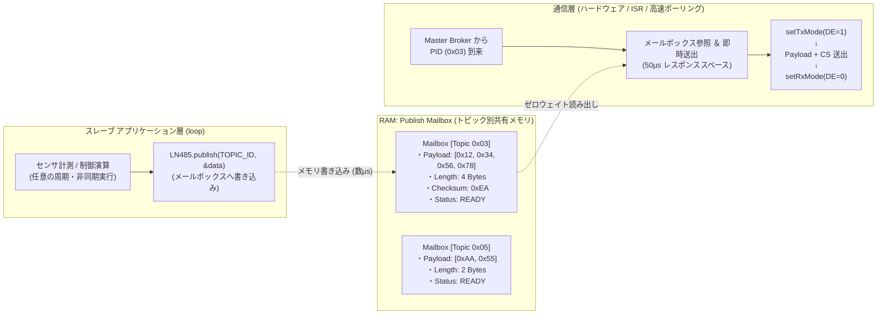
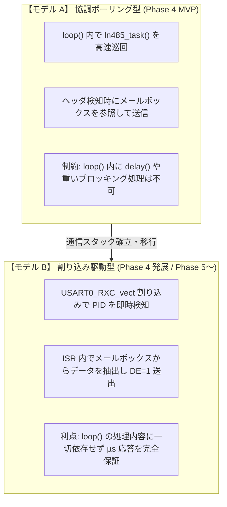

<!--
Copyright (c) 2026 ADX Project Contributors
SPDX-License-Identifier: CC-BY-4.0
-->

# LN-485 スレーブ非同期送信設計: Publish Mailbox Pattern
(パブリッシュ・メールボックス方式によるアプリケーションと通信の疎結合化)

本ドキュメントは、**LN-485 (LIN-based RS-485)** ネットワークにおけるスレーブノード（Unique Publisher）が、メイン処理（センサ計測、モータ制御、演算処理等）をブロックすることなく、Master Broker からのポーリングに対して即座にデータを送出するための基本設計思想 **「Publish Mailbox Pattern（パブリッシュ・メールボックス方式）」** を定義する。

---

## 1. 背景と課題

### 1.1 厳格なレスポンスタイム制約
LN-485 では、Master Broker がバス上にヘッダ（`Break` + `Sync(0x55)` + `PID`）を送出してから、担当スレーブが応答データ（Payload + Checksum）の送出を開始するまでの時間（**レスポンススペース**）は、**約 $50 \sim 100\,\mu\text{s}$（数 Tbit 程度）** に規定されている。

### 1.2 アプリケーション処理との競合
一方、スレーブマイコン（ATtiny1616）のメインループ（`loop()`）では、以下のような時間のかかる処理が実行されている。
* I2C / SPI / ADC センサのデータサンプリング（数 ms 〜 数十 ms）
* モータやアクチュエータの制御演算・軌道生成
* 通信ログの生成やステートマシン遷移

もしスレーブが「Master Broker からのヘッダ受信を `loop()` 内で同期的に待機（ブロッキング待機）」する設計をとった場合、**メイン処理が停止してリアルタイム制御が破綻**するか、逆に**メイン処理中にヘッダが到来してレスポンススペースに間に合わずタイムアウト**する。

---

## 2. 基本概念 (Core Concept)

Publish Mailbox Pattern は、**「アプリケーション層」** と **「通信層（バス応答）」** をメモリ上の **メールボックス（共有バッファ）を介して完全に分離（Decoupled / 疎結合化）** するアーキテクチャである。



### 郵便受けの比喩
1. **アプリ（手紙の差出人）**: センサ計測が完了したら、最新のデータをメールボックス（郵便受け）へ投函（Post）する。投函後は待たずに自身の制御処理に戻る。
2. **Master Broker（郵便配達員）**: スケジュールに従ってバス上を巡回し、該当トピック（PID）の集荷を要求する。
3. **通信層（自動応答ポスト）**: マスターの要求を検知した瞬間、メールボックス内の最新データを即座にバスへ放流する。

---

## 3. メールボックスのデータ構造（ダブルバッファ設計）

詳細は [**`double_buffer.md`**](./double_buffer.md) を参照。
Torn Read（データの食い違い破損）を原理的に排除し、長時間の割り込み禁止による通信ジッターを完全に防ぐため、メールボックスは **2面バッファ（フロント/バック）構成** を採用する。

### 3.1 データ構造 (`struct DoubleBufferMailbox`)

```cpp
// 1つのパブリッシュトピックを管理するダブルバッファ・メールボックス構造体
struct DoubleBufferMailbox {
    uint8_t  topicId;             // 対象のトピック ID (0x00〜0x3F)
    uint8_t  length;              // ペイロード長 (1〜8 バイト)
    uint8_t  payload[2][8];       // 2面バッファ: [0] と [1]
    uint8_t  checksum[2];         // 各面の事前計算済み Classic Checksum
    volatile uint8_t activeIdx;    // 現在通信層がアクセスしてよい面のインデックス (0 または 1)
};
```

### 3.2 アプリケーション層の書き込み（ロックフリー・ゼロジッター）
アプリケーションは裏バッファ（`nextIdx = activeIdx ^ 1`）に対して通常状態（割り込み許可）でデータを書き込み、完了時に `activeIdx` を瞬時に切り替える。

```cpp
void publishTopic(uint8_t id, const void* data, uint8_t len) {
    // 1. 次に書き込むべき「裏バッファ」のインデックスを計算 (0なら1, 1なら0)
    uint8_t nextIdx = mailbox[id].activeIdx ^ 1;

    // 2. 裏バッファへの書き込みとチェックサム計算 (※割り込み許可状態なので通信をブロックしない)
    memcpy(mailbox[id].payload[nextIdx], data, len);
    mailbox[id].checksum[nextIdx] = calculateClassicChecksum(data, len);
    mailbox[id].length = len;

    // 3. インデックスの切り替え (1クロックの瞬時切替)
    uint8_t sreg = SREG;
    cli();
    mailbox[id].activeIdx = nextIdx; // ここから通信層は新しいデータを読み出す
    SREG = sreg;
}
```

---

## 4. 通信層の実行モデル（段階的進化）

スレーブの通信層が「いつメールボックスをチェックしてバスに送信するか」について、ADX では開発フェーズに応じて **2つの実行モデル** を定義する。



| 実行モデル | トリガー方式 | メリット | 考慮すべき点 | 適用フェーズ |
| :--- | :--- | :--- | :--- | :---: |
| **モデル A: 協調ポーリング型**<br>(Cooperative Polling) | メインループ内で `while (STATUS & RXCIF)` を高頻度で呼ぶ | デバッグが極めて容易。<br>割り込み競合の心配がない。 | `loop()` 内に長時間のブロッキング処理を書けない。 | **Phase 4 (MVP検証)** |
| **モデル B: 割り込み駆動型**<br>(ISR-Driven Responder) | ハードウェア `USART0_RXC_vect` 割り込みで直接起動 | `loop()` の負荷や遅延に一切影響されず、厳格なレスポンススペースを常に遵守できる。 | ISR 内での処理時間（DE制御・送信完了待ち）の極小化が必要。 | **Phase 4 発展 / Phase 5〜** |

※ Phase 3 の教訓によりスレーブ側では Arduino 標準の `Serial.begin()` を排除しているため、ATtiny1616 の `USART0_RXC_vect` は ADX / LN-485 通信スタックが 100% 占有して自由に使用可能である。

---

## 5. アプリケーション向け API 設計方針

スレーブ開発者が直感的かつ安全に利用できる Arduino ライクな API を提供する。

### 5.1 送信側（Publisher ノード）
```cpp
void setup() {
    LN485.begin(9600);
    // パブリッシュするトピックを登録 (ID=0x03, 4バイト)
    LN485.registerPublisher(0x03, 4);
}

void loop() {
    // センサ計測 (任意のタイミング)
    uint32_t sensorVal = analogRead(A0) * 100;
    
    // メールボックスへパブリッシュ (即時リターン・非ブロッキング)
    LN485.publish(0x03, &sensorVal, sizeof(sensorVal));
    
    // その他の重い処理を行っても通信に影響しない
    delay(50); 
}
```

### 5.2 受信側（Subscriber ノード）
```cpp
void onSensorDataReceived(uint8_t topicId, const uint8_t* payload, uint8_t len) {
    // 受信時のコールバック処理
    digitalWrite(LED_PIN, payload[0] > 100 ? HIGH : LOW);
}

void setup() {
    LN485.begin(9600);
    // サブスクライブするトピックとコールバックを登録
    LN485.subscribe(0x03, onSensorDataReceived);
}
```

---

## 6. まとめ

* **Publish Mailbox Pattern** の導入により、スレーブの「アプリケーションロジック」と「LN-485 のリアルタイム通信」が完全に分離される。
* スレーブはいつでも好きな時にメールボックスを更新すればよく、Master Broker はいつでも好きな時に最新データを集荷できる。
* これにより、ADX Core-D / CARD 上で動く複雑な産業用制御スケッチと、堅牢なマルチドロップ通信の両立が実現する。
