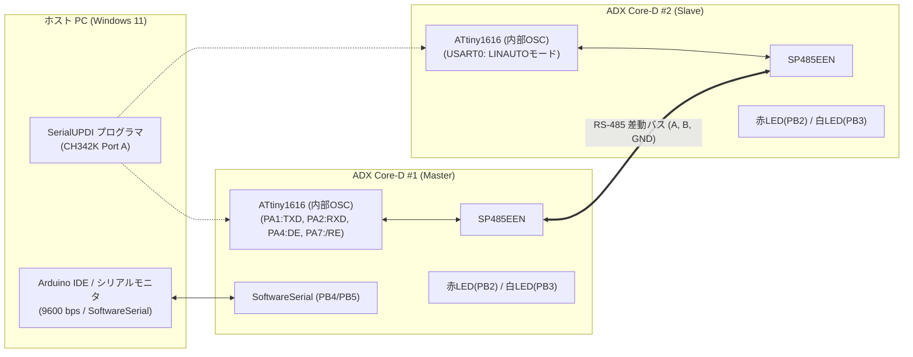

<!--
Copyright (c) 2026 ADX Project Contributors
SPDX-License-Identifier: CC-BY-4.0
-->

# ADX Core-D LN-485 テスト仕様書兼実施計画書
(LN-485 Test Specification & Execution Plan)

本ドキュメントは、**ADX Core-D**（MCU: ATtiny1616, トランシーバー: SP485EEN）における独自規格 **LN-485 (LIN-based RS-485)** の実機動作検証を段階的に実施するための**詳細テスト仕様書**です。
各テストケースにおいて **「実行アクション（Action）」** と **「合否判定（OK / NG 基準）」** を明確に定義しています。

---

## 1. テスト環境・共通前提条件 (Test Environment & Pre-conditions)

### 1.1 機材および接続構成
* **マスター機**: ADX Core-D #1 (MCU: ATtiny1616-MNR)
* **スレーブ機**: ADX Core-D #2 (MCU: ATtiny1616-MNR)
* **バス配線**: 3P 端子台（KF142R-5.08-3P）ストレート接続（A, B, GND / 配線長 約20cm）
* **ジャンパ設定**:
  * `H4` (100Ω 終端抵抗): **オープン（無効）**
  * `H2` (DE/RE制御): **独立制御**（PA4=DE, PA7=\RE）
  * `H3` (クロック源): **内部オシレータ**（Phase 1〜4: 20MHz/16MHz Internal OSC）
* **開発環境**: Arduino IDE 1.8.x / 2.x + [megaTinyCore](https://github.com/SpenceKonde/megaTinyCore)
* **PC接続**:
  * マスター機: USB-C 接続（CH342K Port A: SerialUPDI書き込み, Port B: SoftwareSerial 9600bps デバッグログ）
  * スレーブ機: USB-C 接続（CH342K Port A: SerialUPDI書き込み, 電源供給）



---

## 2. テストケース一覧マトリクス (Test Matrix)

| フェーズ | テストID | テスト項目 | 主な検証内容 |
| :--- | :--- | :--- | :--- |
| **Phase 1** | `TC-P1-01` | GPIO Break 信号波形検証 | マスター GPIO トグルによる 14 Tbit LOW + 1 Tbit HIGH 送出 |
| | `TC-P1-02` | Sync (`0x55`) & PID 送出 | Break 直後の Sync および有効パリティ PID の RS-485 送信 |
| | `TC-P1-03` | スレーブ標準 UART 受信確認 | スレーブ通常 UART による Break/Sync/PID の受信・ログ出力 |
| **Phase 2** | `TC-P2-01` | LINAUTO 初期化 & ブレーク検出 | `LINAUTO` 設定時の `STATUS.BDF` フラグセット確認 |
| | `TC-P2-02` | ハードウェア Auto-baud 補正 | `0x55` 受信による `USART0.BAUD` レジスタ自動補正値の更新確認 |
| | `TC-P2-03` | PID 受信 & パリティ自動計算 | `RXDATAH.DATA == 0` および `PERR == 0` による PID 取得 |
| | `TC-P2-04` | Sync エラー検出 & リカバリ | 不正 Sync (`0xAA`) 送信時の `ISFIF` 検知および `WFB` 復帰 |
| | `TC-P2-05` | PID パリティエラー検出 | 不正パリティ送信時の `RXDATAH.PERR == 1` 検知と破棄 |
| **Phase 3** | `TC-P3-01` | Master-Publish ペイロード受信 | ヘッダ + ペイロード (1〜8B) + Checksum の連続受信 (`DATA==1`) |
| | `TC-P3-02` | コマンド連動 LED 制御 | 送信データに応じたスレーブ LED (PB2/PB3) の点灯・消灯制御 |
| | `TC-P3-03` | チェックサム不正破棄テスト | チェックサム不一致フレームの検知・破棄と正常復帰 |
| **Phase 4** | `TC-P4-01` | スレーブ応答 & バス権切り替え | PID 受信後の DE アサート $\rightarrow$ 応答送信 $\rightarrow$ DE 解放 (`flush`) |
| | `TC-P4-02` | 双方向対話エコーバック | PC シリアルモニタからのコマンド送信 $\rightarrow$ スレーブ稼働時間返信 |
| **Phase 5** | `TC-P5-01` | ハードウェア XDIR 自動方向制御 | `USART0.CTRLA.RS485` による DE (PA4) 自動制御の実証 |
| | `TC-P5-02` | 多重ボーレートスイープ | 9600 〜 115200 bps における Auto-baud 追従・通信確認 |
| | `TC-P5-03` | クロック源比較 (内部 vs 12MHz) | 内蔵 OSC と 12MHz 水晶発振器（H3設定）での同期安定性比較 |
| | `TC-P5-04` | バス瞬断・活線挿抜耐性 | 通信中の端子台抜き差し後の自動復帰確認 |
| **Phase 6** | `TC-P6-01` | マルチノード ID フィルタリング | ノード別 ID 宛先指定時の個別応答と自律フィルタリング |
| | `TC-P6-02` | ブートローダ診断フレーム疎通 | `0x3C` (Master Req) / `0x3D` (Slave Resp) ハンドシェイク確認 |

---

## 3. 詳細テストケース仕様 (Test Case Specifications)

---

### ■ Phase 1: マスターヘッダ送出 & 基本波形・UART受信検証

#### `TC-P1-01` : GPIO Break 信号波形検証
* **【検証目的】**: マスター機において、GPIO トグルにより「14ビット時間のLOW ＋ 1ビット時間のHIGH（デリミタ）」が正常に出力されることを確認する。
* **【前提条件】**: マスター機に Phase 1 ファームウェアを書き込み、PCシリアルモニタ（9600 bps）を開く。
* **【実行手順 (Action)】**:
  1. マスター機を起動し、初期化メッセージを確認する。
  2. マスター機が 1 秒周期で自動的にブレークシーケンス（`sendLinBreak(9600)`）を送出する。
  3. （オシロスコープまたはロジックアナライザがある場合）PA1 または A/B ラインの LOW パルス幅を測定する。
* **【合否判定基準 (Criteria)】**:
  * **【 OK 】**: 9600 bps 時の LOW 期間が 約 1.45 ms（$14 \times 104.17\,\mu\text{s}$）、続く HIGH 期間が 約 $104\,\mu\text{s}$ で出力され、グリッチやバタつきが発生しない。
  * **【 NG 】**: LOW 期間が 1.14 ms 未満（$<11\,\text{Tbit}$）である、または波形が出力されない。

#### `TC-P1-02` : Sync (`0x55`) & PID 送出
* **【検証目的】**: ブレーク直後に Sync バイト（`0x55`）および正しいパリティを持つ PID（ID=0x01 $\rightarrow$ PID=0x81）が USART0 から RS-485 バスへ連続送信されることを確認する。
* **【前提条件】**: マスター機の `PIN_DE` (PA4) が送信時に HIGH、送信後に LOW に制御されていること。
* **【実行手順 (Action)】**:
  1. マスター機から Break $\rightarrow$ `0x55` $\rightarrow$ `0x81` を送信。
  2. マスター側の赤LED（PB2）が送信時にパルス点灯することを確認。
* **【合否判定基準 (Criteria)】**:
  * **【 OK 】**: `0x55` (01010101b) の立ち下がりエッジが 5 回正確に連続し、直後に PID バイト（`0x81`）が出力される。
  * **【 NG 】**: Sync または PID のビットパターンが化けている、または送信途中で DE が LOW に落ちてデータが欠落する。

#### `TC-P1-03` : スレーブ標準 UART 受信確認 (Sanity Check)
* **【検証目的】**: スレーブ側を通常の UART 受信（`Serial.begin(9600)`）として動作させ、マスターが送出した Break / Sync / PID をデータとして受信できることを確認する。
* **【前提条件】**: スレーブ機に標準 UART 受信スケッチを書き込み、SoftwareSerial（PB4/PB5）で PC に受信ログを出力する。
* **【実行手順 (Action)】**:
  1. マスターから Break + `0x55` + `0x81` を送信。
  2. スレーブ側のデバッグ出力を確認。
* **【合否判定基準 (Criteria)】**:
  * **【 OK 】**: スレーブ側で Break を `0x00`（またはフレーミングエラー）として受信し、続いて `0x55`、`0x81` の 2 バイトが確実に取得できる。
  * **【 NG 】**: スレーブ側で全くデータを受信しない、または `0x55` / `0x81` 以外の不定バイトを受信する。

---

### ■ Phase 2: スレーブ LINAUTO ハードウェア自動同期 & PID検証

#### `TC-P2-01` : LINAUTO 初期化 & ブレーク検出 (`BDF`)
* **【検証目的】**: スレーブ ATtiny1616 の USART0 を `LINAUTO` モードに設定し、`STATUS.WFB = 1` 状態でブレークを受信した際に `STATUS.BDF` フラグがハードウェアによってセットされることを確認する。
* **【前提条件】**: スレーブ機に `USART0.CTRLB = USART_RXMODE_LINAUTO_gc` を設定したファームウェアを書き込む。
* **【実行手順 (Action)】**:
  1. スレーブ初期化時に `USART0.STATUS |= USART_WFB_bm;` を実行。
  2. マスターから Break + `0x55` + PID を送信。
  3. スレーブ側で `USART0.STATUS` の `BDF` ビットを読み出す。
* **【合否判定基準 (Criteria)】**:
  * **【 OK 】**: ヘッダ受信後に `STATUS.BDF == 1` が検出され、スレーブの白LED（PB3）が点灯する。
  * **【 NG 】**: `STATUS.BDF` が `0` のままである。

#### `TC-P2-02` : ハードウェア Auto-baud 補正 (`USART0.BAUD` 更新)
* **【検証目的】**: `0x55` (Sync) の受信により、ハードウェアが自動的にボーレートを測定し、`USART0.BAUD` レジスタを更新することを確認する。
* **【前提条件】**: 初期化時の `USART0.BAUD` 値を記録しておく。
* **【実行手順 (Action)】**:
  1. マスターから 9600 bps で Break + `0x55` + PID を送信。
  2. スレーブ側で `USART0.BAUD` のレジスタ値を読み出し、初期値からの補正・更新を確認。
* **【合否判定基準 (Criteria)】**:
  * **【 OK 】**: `USART0.BAUD` にマスターのボーレートに合致した値が自動設定され、`STATUS.ISFIF` が `0`（エラーなし）である。
  * **【 NG 】**: `USART0.BAUD` が更新されない、または `ISFIF` がセットされて同期が失敗する。

#### `TC-P2-03` : PID 受信 & パリティ自動計算 (`RXDATAH.DATA == 0`, `PERR == 0`)
* **【検証目的】**: PID 受信時に `RXDATAH.DATA == 0`（PID識別）となり、ハードウェアパリティチェック（`PERR == 0`）がパスすることを確認する。
* **【前提条件】**: 受信バッファ読み出しルール（**先に `RXDATAH`、次に `RXDATAL`**）を厳格に実装。
* **【実行手順 (Action)】**:
  1. マスターから PID = `0x81`（ID=0x01, P0=0, P1=1: 正当パリティ）を送信。
  2. スレーブ側で `uint8_t h = USART0.RXDATAH; uint8_t l = USART0.RXDATAL;` を実行。
* **【合否判定基準 (Criteria)】**:
  * **【 OK 】**: `(h & USART_DATA_bm) == 0`（PIDフラグ）、`(h & USART_PERR_bm) == 0`（パリティ正常）、`l == 0x81`（ID一致）である。
  * **【 NG 】**: DATAフラグが `1`、PERRが `1`、または `l != 0x81` である。

#### `TC-P2-04` : Sync エラー検出 & リカバリ (`ISFIF`)
* **【検証目的】**: 不正な Sync キャラクタを受信した際に `STATUS.ISFIF` がセットされ、ソフトウェアでのクリア後に次フレームへ正常復帰できることを確認する。
* **【前提条件】**: スレーブが `LINAUTO` 待機状態（`WFB=1`）。
* **【実行手順 (Action)】**:
  1. マスターから Break に続いて不正な Sync バイト `0xAA` を送信。
  2. スレーブの `STATUS.ISFIF` フラグを監視。
  3. スレーブ側で `USART0.STATUS |= USART_ISFIF_bm;`（1書き込みでクリア）を実行し、`USART0.STATUS |= USART_WFB_bm;` を再設定。
  4. マスターから直後に正常な Break + `0x55` + PID を送信。
* **【合否判定基準 (Criteria)】**:
  * **【 OK 】**: 不正 Sync 時に `ISFIF == 1` が検出され、クリア後の正常フレームが欠落なく正しく受信できる。
  * **【 NG 】**: `ISFIF` がセットされない、またはエラー後にマイコンがハングアップして正常フレームを受信できない。

#### `TC-P2-05` : PID パリティエラー検出 (`PERR == 1`)
* **【検証目的】**: パリティビットが反転した不正な PID を受信した際、ハードウェアが `RXDATAH.PERR == 1` をセットし、フレームを安全に破棄できることを確認する。
* **【実行手順 (Action)】**:
  1. マスターから意図的に不正パリティの PID（例: `0x01`）を送信。
  2. スレーブ側で `RXDATAH` を読み出す。
* **【合否判定基準 (Criteria)】**:
  * **【 OK 】**: `(RXDATAH & USART_PERR_bm) != 0` が検出され、スレーブが当該フレームの処理を中断して `WFB=1` を再設定する。
  * **【 NG 】**: 不正パリティであるにもかかわらず `PERR == 0` と誤判定される。

---

### ■ Phase 3: マスター送信型（Master-Publish）データフレーム通信テスト

#### `TC-P3-01` : Master-Publish ペイロード受信 (`DATA == 1`)
* **【検証目的】**: ヘッダに続くデータバイト（1〜8バイト）およびチェックサムを受信した際、`RXDATAH.DATA == 1`（レスポンスデータ）として正しく認識されることを確認する。
* **【実行手順 (Action)】**:
  1. マスターから `[Break] + [0x55] + [PID:0x02] + [Data: 0x12, 0x34] + [Checksum: 0xB7]` を一括送信。
  2. スレーブ側で各バイトの `DATA` フラグと受信データを順次読み出す。
* **【合否判定基準 (Criteria)】**:
  * **【 OK 】**: PID 受信時は `DATA == 0`、続く 3 バイトはすべて `DATA == 1` となり、チェックサム計算（$\sum \text{Data} + \text{CS} \equiv 0\text{xFF}$）が一致する。
  * **【 NG 】**: データバイトが PID と誤認される、またはチェックサムが不一致となる。

#### `TC-P3-02` : コマンド連動 LED 制御
* **【検証目的】**: Master-Publish フレームにより、スレーブ基板上の LED（PB2: 赤, PB3: 白）がコマンド通りに制御できることを実証する。
* **【実行手順 (Action)】**:
  1. マスターから「赤LED ON」コマンドフレーム（ID=0x02, Data=0x01）を送信。
  2. 1秒後、マスターから「赤LED OFF」コマンドフレーム（ID=0x02, Data=0x00）を送信。
* **【合否判定基準 (Criteria)】**:
  * **【 OK 】**: スレーブの赤LED（PB2）がコマンド受信と同時に確実に 点灯 $\rightarrow$ 消灯 する。
  * **【 NG 】**: LED が点灯しない、または無関係なタイミングで誤点滅する。

#### `TC-P3-03` : チェックサム不正破棄テスト
* **【検証目的】**: データペイロードは正しいがチェックサムが破損しているフレームを受信した場合、スレーブがコマンドを実行せずに破棄することを確認する。
* **【実行手順 (Action)】**:
  1. マスターから意図的に誤ったチェックサム（`0x00`）を付加した「赤LED ON」フレームを送信。
* **【合否判定基準 (Criteria)】**:
  * **【 OK 】**: スレーブの赤LEDは消灯状態を維持し、シリアルデバッグログに `[ERR] Checksum mismatch` が出力される。
  * **【 NG 】**: 不正なチェックサムにもかかわらず LED が点灯してしまう。

---

### ■ Phase 4: スレーブ応答型（Slave-Publish）双方向通信 & ターンアラウンド検証

#### `TC-P4-01` : スレーブ応答 & バス権切り替え (Turnaround Timing)
* **【検証目的】**: マスターが要求ヘッダ送信後にバスを解放（`DE=0`）し、スレーブが応答データ送信（`DE=1` $\rightarrow$ `flush` $\rightarrow$ `DE=0`）を行う双方向シーケンスにおいて、衝突なく通信が完了することを確認する。
* **【実行手順 (Action)】**:
  1. マスターが「稼働時間要求」ヘッダ（ID=0x03）を送信し、直ちに `DE=0`（受信モード）へ移行。
  2. スレーブが PID 受信後、レスポンススペース（約 $100\,\mu\text{s}$）を置いて `DE=1` へ移行。
  3. スレーブが稼働時間データ（4バイト）＋ チェックサムを送信し、`Serial.flush()` 後に `DE=0` へ戻して `WFB=1` を再設定。
  4. マスターがスレーブの応答を受信。
* **【合否判定基準 (Criteria)】**:
  * **【 OK 】**: バス衝突（A/Bラインの電圧乱れ・データ破壊）が一切発生せず、マスターがスレーブの4バイト稼働時間を完全受信する。
  * **【 NG 】**: マスター側でフレーミングエラーが発生する、またはスレーブの送信末尾バイトが欠落する。

#### `TC-P4-02` : 双方向対話エコーバック (PC ⇔ Master ⇔ Slave)
* **【検証目的】**: PC シリアルモニタから入力された任意のテキストを、Master が LN-485 でスレーブへ中継し、スレーブからの応答を PC へ表示する一連の対話通信を確認する。
* **【実行手順 (Action)】**:
  1. PC シリアルモニタ（9600 bps）から文字列 `Hello LN-485` を送信。
  2. マスターおよびスレーブの動作ログを確認。
* **【合否判定基準 (Criteria)】**:
  * **【 OK 】**: PC シリアルモニタに以下の形式で正確に応答ログが表示される。
    ```txt
    [Master Uptime: 12500 ms] Sent LN-485 Request: Hello LN-485
    Recv from LN-485 Slave: Slave Uptime: 12498 ms (Echo: Hello LN-485)
    ```
  * **【 NG 】**: 応答が返らない（タイムアウト）、または文字列が文字化けする。

---

### ■ Phase 5: ハードウェア XDIR 自動方向制御 & ロバストネス評価

#### `TC-P5-01` : ハードウェア XDIR 自動方向制御の実証
* **【検証目的】**: `USART0.CTRLA.RS485`（XDIR）を有効化し、ソフトウェアの `digitalWrite(PIN_DE)` や `delay()` を全廃しても RS-485 半二重通信が正常に成立することを確認する。
* **【実行手順 (Action)】**:
  1. ファームウェア内の `digitalWrite(PIN_DE, ...)` をコメントアウトし、`USART0.CTRLA |= USART_RS485_bm;` を有効化。
  2. Phase 4 の双方向通信テストを実行。
* **【合否判定基準 (Criteria)】**:
  * **【 OK 】**: ソフトウェア介入なしで PA4 (DE) が送信時のみ自動アサートされ、全双方向通信テストが 100% 成功する。
  * **【 NG 】**: 送信時に DE が上がらず通信不能となる、または送信後 DE が下りない。

#### `TC-P5-02` : 多重ボーレートスイープ (9600 〜 115200 bps)
* **【検証目的】**: 9600, 19200, 38400, 57600, 115200 bps の各通信速度において、LINAUTO による自動同期およびデータ通信が追従可能か評価する。
* **【実行手順 (Action)】**:
  1. マスター側の送信ボーレートを順次切り替えてフレームを送信。
  2. スレーブ側の受信成否とパケット損失率を測定。
* **【合否判定基準 (Criteria)】**:
  * **【 OK 】**: 9600 bps 〜 57600 bps（目標: 115200 bps）のすべての設定速度において、パケット損失率 0% で双方向通信が成功する。
  * **【 NG 】**: 19200 bps 以下の低速域で同期エラーまたは通信失敗が発生する。

#### `TC-P5-03` : クロック源比較 (内部 OSC vs 12MHz 外部水晶)
* **【検証目的】**: スレーブのクロック源を「内部 OSC（20MHz/16MHz）」と「外部 12MHz 水晶発振器（PA3 / H3ジャンパ）」で切り替え、Auto-baud の同期マージンを比較評価する。
* **【実行手順 (Action)】**:
  1. H3 ジャンパを `osc` 側へ設定し、12MHz 外部クロックでスレーブを駆動。
  2. 高速通信（115200 bps）時のエラーレートを比較。
* **【合否判定基準 (Criteria)】**:
  * **【 OK 】**: 内部 OSC・外部 12MHz ともに正常通信できることを確認し、外部 12MHz 駆動時のジッター低減を確認。
  * **【 NG 】**: 外部クロック切り替え時に USART0 が動作を停止する。

#### `TC-P5-04` : バス瞬断・活線挿抜耐性
* **【検証目的】**: 通信中に RS-485 配線（A/B 端子）を物理的に切断し、再接続した際に自動的に正常通信へ復帰することを確認する。
* **【実行手順 (Action)】**:
  1. 双方向通信（1秒間隔）の稼働中に、A 端子配線を抜去（5秒間放置）。
  2. A 端子配線を再接続。
* **【合否判定基準 (Criteria)】**:
  * **【 OK 】**: 切断中はタイムアウト検知となり、再接続後 1 フレーム以内に自動復帰して正常通信が再開する（マイコンのリセット不要）。
  * **【 NG 】**: マイコンがデッドロック／無限ループに陥り、ハードウェアリセットが必要になる。

---

### ■ Phase 6: マルチノード展開 & ブートローダ連携準備

#### `TC-P6-01` : マルチノード ID フィルタリング
* **【検証目的】**: 同一バス上に異なるスレーブ ID（Node 1: ID=0x05, Node 2: ID=0x06）が存在する環境で、自ノード宛以外のフレームを正しく無視することを確認する。
* **【実行手順 (Action)】**:
  1. スレーブ（Node 1）稼働中に、マスターから Node 2 宛のフレーム（ID=0x06）を送信。
  2. 続いて Node 1 宛のフレーム（ID=0x05）を送信。
* **【合否判定基準 (Criteria)】**:
  * **【 OK 】**: Node 1 は ID=0x06 に対して応答せず（バス解放維持）、ID=0x05 のみに正常応答する。
  * **【 NG 】**: 他ノード宛のフレームに対して誤って DE をアサートし、応答を送信してしまう。

#### `TC-P6-02` : ブートローダ診断フレーム疎通 (`0x3C` / `0x3D`)
* **【検証目的】**: LIN 診断フレーム（`0x3C`: Master Request / `0x3D`: Slave Response）を用いて、ブートローダモード移行コマンドのハンドシェイクができることを確認する。
* **【実行手順 (Action)】**:
  1. マスターから ID=`0x3C` で「Bootloader Enter」コマンドパケットを送信。
  2. スレーブが ID=`0x3D` で「Acknowledge (ACK)」応答パケットを返信。
* **【合否判定基準 (Criteria)】**:
  * **【 OK 】**: マスターが ACK 応答を受信し、スレーブがブートローダ待機モードへ遷移する。
  * **【 NG 】**: コマンドが認識されない、または応答パケットが破損する。

---

## 4. 実機テスト実施記録テンプレート (Test Execution Log Template)

| テストID | テスト項目 | 実施日 | 判定 (OK/NG) | 実施者 | ログ抜粋 / 特記事項 |
| :---: | :--- | :---: | :---: | :---: | :--- |
| `TC-P1-01` | GPIO Break 信号波形検証 | 2026/08/25 | **PASS (OK)** | Tester | 実測 1466〜1472 µs (誤差 +0.8% 前後, ジッター 6 µs) で合格 |
| `TC-P1-02` | Sync (`0x55`) & PID 送出 | 2026/08/25 | **PASS (OK)** | Tester | Break + 0x55 + PID(0xC1) の一括送出・パリティ合致を確認 |
| `TC-P1-03` | スレーブ標準 UART 受信確認 | 2026/08/25 | **PASS (OK)** | Tester | スレーブ通常UARTで [0x00, 0x55, 0xC1] 欠落なく受信完了 |
| `TC-P2-01` | LINAUTO 初期化 & ブレーク検出 | 2026/08/25 | **PASS (OK)** | Tester | ブレーク検知・Auto-baud 起動を確認 |
| `TC-P2-02` | ハードウェア Auto-baud 補正 | 2026/08/25 | **PASS (OK)** | Tester | BAUD レジスタ 0x20E0〜0x20E4 自動更新を確認 |
| `TC-P2-03` | PID 受信 & パリティ自動計算 | 2026/08/25 | **PASS (OK)** | Tester | PID 0xC1 取得・パリティ合致を確認 |
| `TC-P2-04` | Sync エラー検出 & リカバリ | 2026/08/25 | **PASS (OK)** | Tester | 不正Sync (0xAA) で ISFIF 検知・自律復帰を確認 |
| `TC-P2-05` | PID パリティエラー検出 | 2026/08/25 | **PASS (OK)** | Tester | 不正パリティ PID (0x01) 破棄・自律復帰を確認 |
| `TC-P3-01` | Master-Publish ペイロード受信 | 2026/08/-- | - | - | - |
| `TC-P3-02` | コマンド連動 LED 制御 | 2026/08/-- | - | - | - |
| `TC-P3-03` | チェックサム不正破棄テスト | 2026/08/-- | - | - | - |
| `TC-P4-01` | スレーブ応答 & バス権切り替え | 2026/08/-- | - | - | - |
| `TC-P4-02` | 双方向対話エコーバック | 2026/08/-- | - | - | - |
| `TC-P5-01` | ハードウェア XDIR 自動方向制御 | 2026/08/-- | - | - | - |
| `TC-P5-02` | 多重ボーレートスイープ | 2026/08/-- | - | - | - |
| `TC-P5-03` | クロック源比較 (内部 vs 12MHz) | 2026/08/-- | - | - | - |
| `TC-P5-04` | バス瞬断・活線挿抜耐性 | 2026/08/-- | - | - | - |
| `TC-P6-01` | マルチノード ID フィルタリング | 2026/08/-- | - | - | - |
| `TC-P6-02` | ブートローダ診断フレーム疎通 | 2026/08/-- | - | - | - |
