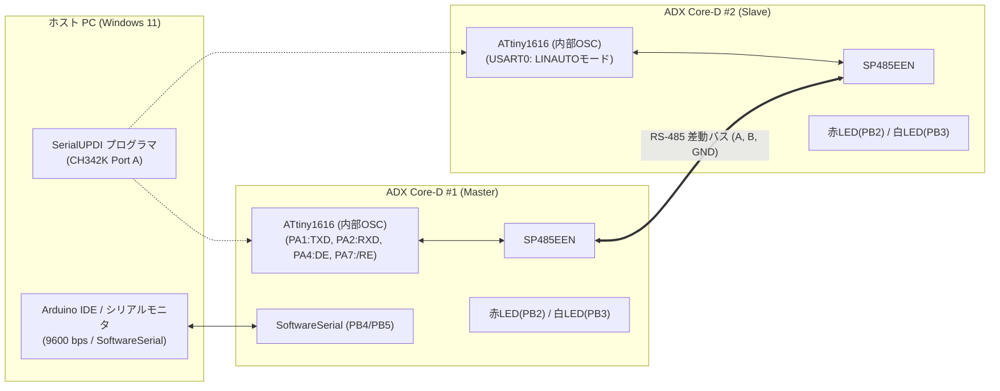

<!--
Copyright (c) 2026 ADX Project Contributors
SPDX-License-Identifier: CC-BY-4.0
-->

# ADX Core-D LN-485 テスト仕様書兼実施計画書
(LN-485 Test Specification & Execution Plan)

本ドキュメントは、**ADX Core-D**（MCU: ATtiny1616, トランシーバー: SP485EEN）における独自規格 **LN-485 (LIN-based RS-485)** の実機動作検証を段階的に実施するための**詳細テスト仕様書**です。
各テストケースにおいて **「実行アクション（Action）」** と **「合否判定（OK / NG 基準）」** を明確に定義しています。

---

## 1. テスト環境・共通前提条件 (Test Environment & Pre-conditions)

### 1.1 機材および接続構成
* **マスター機**: ADX Core-D #1 (MCU: ATtiny1616-MNR)
* **スレーブ機**: ADX Core-D #2 (MCU: ATtiny1616-MNR)
* **バス配線**: 3P 端子台（KF142R-5.08-3P）ストレート接続（A, B, GND / 配線長 約20cm）
* **ジャンパ設定**:
  * `H4` (100Ω 終端抵抗): **オープン（無効）**
  * `H2` (DE/RE制御): **独立制御**（PA4=DE, PA7=\RE）
  * `H3` (クロック源): **内部オシレータ**（Phase 1〜4: 20MHz/16MHz Internal OSC）
* **開発環境**: Arduino IDE 1.8.x / 2.x + [megaTinyCore](https://github.com/SpenceKonde/megaTinyCore)
* **PC接続**:
  * マスター機: USB-C 接続（CH342K Port A: SerialUPDI書き込み, Port B: SoftwareSerial 9600bps デバッグログ）
  * スレーブ機: USB-C 接続（CH342K Port A: SerialUPDI書き込み, 電源供給）



---

## 2. テストケース一覧マトリクス (Test Matrix)

| フェーズ | テストID | テスト項目 | 開発対象 (Master / Slave) ＆ 主な検証内容 | 状態 |
| :--- | :--- | :--- | :--- | :---: |
| **Phase 1** | `TC-P1-01` | GPIO Break 信号波形検証 | Master: GPIO トグルによる 14 Tbit LOW + 1 Tbit HIGH 送出 | **PASS** |
| | `TC-P1-02` | Sync (`0x55`) & PID 送出 | Master: Break 直後の Sync および有効パリティ PID の RS-485 送信 | **PASS** |
| | `TC-P1-03` | スレーブ標準 UART 受信確認 | Slave: 通常 UART による Break/Sync/PID の受信・ログ出力 | **PASS** |
| **Phase 2** | `TC-P2-01` | LINAUTO 初期化 & ブレーク検出 | Slave: `LINAUTO` 設定時の `STATUS.BDF` フラグセット確認 | **PASS** |
| | `TC-P2-02` | ハードウェア Auto-baud 補正 | Slave: `0x55` 受信による `USART0.BAUD` レジスタ自動補正値の更新確認 | **PASS** |
| | `TC-P2-03` | PID 受信 & パリティ自動計算 | Slave: `RXDATAH.DATA == 0` および `PERR == 0` による PID 取得 | **PASS** |
| | `TC-P2-04` | Sync エラー検出 & リカバリ | Slave: 不正 Sync (`0xAA`) 送信時の `ISFIF` 検知および `WFB` 復帰 | **PASS** |
| | `TC-P2-05` | PID パリティエラー検出 | Slave: 不正パリティ送信時の `RXDATAH.PERR == 1` 検知と破棄 | **PASS** |
| **Phase 3** | `TC-P3-01` | ミニマム・スケジューラ ＆ Master-Pub | Master: 定期巡回ポーリング ＆ Type A ペイロード送信 | **PASS** |
| | `TC-P3-02` | Slave Subscriber ペイロード受信 | Slave: `DATA==1` 受信、チェックサム検証、データバッファリング | **PASS** |
| | `TC-P3-03` | コマンド連動 LED 制御 ＆ 不正破棄 | Slave: 受信データに応じた LED 制御、不正チェックサムの検知・破棄 | **PASS** |
| **Phase 4** | `TC-P4-01` | Slave Publisher 応答 ＆ ターンアラウンド | Slave: 自担当 PID 受信後のレスポンススペース・DE 制御・データ送信 | 準備中 |
| | `TC-P4-02` | Master Broker プロミスキャス傍受 ＆ タイムアウト | Master: バス全傍受・PC パススルー・無応答タイムアウト（**★MVP完成**） | 準備中 |
| | `TC-P4-03` | 双方向対話エコーバック | 全体: PC ⇔ Master Broker ⇔ Slave 間の一連の対話ログ実証 | 準備中 |
| **Phase 5** | `TC-P5-01` | Type C スレーブ間ダイレクト通信 | Slave A (Pub) $\rightarrow$ Slave B (Sub) のマスター非介在直接制御実証 | 準備中 |
| | `TC-P5-02` | Master Broker 傍受 ＆ 分散制御監視 | Master: Type C 通信の交通整理（場作り）とバス全傍受ログ出力 | 準備中 |
| **Phase 6** | `TC-P6-01` | ハードウェア XDIR 自動方向制御 | Master & Slave: `USART0.CTRLA.RS485` による DE 自動制御の実証 | 準備中 |
| | `TC-P6-02` | 多重ボーレートスイープ | Master & Slave: 9600 〜 115200 bps における通信・Auto-baud 評価 | 準備中 |
| | `TC-P6-03` | クロック比較 ＆ 活線挿抜・バスクリア | Master & Slave: 12MHz クロック、活線挿抜耐性、強制バスクリア | 準備中 |


---

## 3. 詳細テストケース仕様 (Test Case Specifications)

---

### ■ Phase 1: マスターヘッダ送出 & 基本波形・UART受信検証

#### `TC-P1-01` : GPIO Break 信号波形検証
* **【検証目的】**: マスター機において、GPIO トグルにより「14ビット時間のLOW ＋ 1ビット時間のHIGH（デリミタ）」が正常に出力されることを確認する。
* **【前提条件】**: マスター機に Phase 1 ファームウェアを書き込み、PCシリアルモニタ（9600 bps）を開く。
* **【実行手順 (Action)】**:
  1. マスター機を起動し、初期化メッセージを確認する。
  2. マスター機が 1 秒周期で自動的にブレークシーケンス（`sendLinBreak(9600)`）を送出する。
  3. （オシロスコープまたはロジックアナライザがある場合）PA1 または A/B ラインの LOW パルス幅を測定する。
* **【合否判定基準 (Criteria)】**:
  * **【 OK 】**: 9600 bps 時の LOW 期間が 約 1.45 ms（$14 \times 104.17\,\mu\text{s}$）、続く HIGH 期間が 約 $104\,\mu\text{s}$ で出力され、グリッチやバタつきが発生しない。
  * **【 NG 】**: LOW 期間が 1.14 ms 未満（$<11\,\text{Tbit}$）である、または波形が出力されない。

#### `TC-P1-02` : Sync (`0x55`) & PID 送出
* **【検証目的】**: ブレーク直後に Sync バイト（`0x55`）および正しいパリティを持つ PID（ID=0x01 $\rightarrow$ PID=0x81）が USART0 から RS-485 バスへ連続送信されることを確認する。
* **【前提条件】**: マスター機の `PIN_DE` (PA4) が送信時に HIGH、送信後に LOW に制御されていること。
* **【実行手順 (Action)】**:
  1. マスター機から Break $\rightarrow$ `0x55` $\rightarrow$ `0x81` を送信。
  2. マスター側の赤LED（PB2）が送信時にパルス点灯することを確認。
* **【合否判定基準 (Criteria)】**:
  * **【 OK 】**: `0x55` (01010101b) の立ち下がりエッジが 5 回正確に連続し、直後に PID バイト（`0x81`）が出力される。
  * **【 NG 】**: Sync または PID のビットパターンが化けている、または送信途中で DE が LOW に落ちてデータが欠落する。

#### `TC-P1-03` : スレーブ標準 UART 受信確認 (Sanity Check)
* **【検証目的】**: スレーブ側を通常の UART 受信（`Serial.begin(9600)`）として動作させ、マスターが送出した Break / Sync / PID をデータとして受信できることを確認する。
* **【前提条件】**: スレーブ機に標準 UART 受信スケッチを書き込み、SoftwareSerial（PB4/PB5）で PC に受信ログを出力する。
* **【実行手順 (Action)】**:
  1. マスターから Break + `0x55` + `0x81` を送信。
  2. スレーブ側のデバッグ出力を確認。
* **【合否判定基準 (Criteria)】**:
  * **【 OK 】**: スレーブ側で Break を `0x00`（またはフレーミングエラー）として受信し、続いて `0x55`、`0x81` の 2 バイトが確実に取得できる。
  * **【 NG 】**: スレーブ側で全くデータを受信しない、または `0x55` / `0x81` 以外の不定バイトを受信する。

---

### ■ Phase 2: スレーブ LINAUTO ハードウェア自動同期 & PID検証

#### `TC-P2-01` : LINAUTO 初期化 & ブレーク検出 (`BDF`)
* **【検証目的】**: スレーブ ATtiny1616 の USART0 を `LINAUTO` モードに設定し、`STATUS.WFB = 1` 状態でブレークを受信した際に `STATUS.BDF` フラグがハードウェアによってセットされることを確認する。
* **【前提条件】**: スレーブ機に `USART0.CTRLB = USART_RXMODE_LINAUTO_gc` を設定したファームウェアを書き込む。
* **【実行手順 (Action)】**:
  1. スレーブ初期化時に `USART0.STATUS |= USART_WFB_bm;` を実行。
  2. マスターから Break + `0x55` + PID を送信。
  3. スレーブ側で `USART0.STATUS` の `BDF` ビットを読み出す。
* **【合否判定基準 (Criteria)】**:
  * **【 OK 】**: ヘッダ受信後に `STATUS.BDF == 1` が検出され、スレーブの白LED（PB3）が点灯する。
  * **【 NG 】**: `STATUS.BDF` が `0` のままである。

#### `TC-P2-02` : ハードウェア Auto-baud 補正 (`USART0.BAUD` 更新)
* **【検証目的】**: `0x55` (Sync) の受信により、ハードウェアが自動的にボーレートを測定し、`USART0.BAUD` レジスタを更新することを確認する。
* **【前提条件】**: 初期化時の `USART0.BAUD` 値を記録しておく。
* **【実行手順 (Action)】**:
  1. マスターから 9600 bps で Break + `0x55` + PID を送信。
  2. スレーブ側で `USART0.BAUD` のレジスタ値を読み出し、初期値からの補正・更新を確認。
* **【合否判定基準 (Criteria)】**:
  * **【 OK 】**: `USART0.BAUD` にマスターのボーレートに合致した値が自動設定され、`STATUS.ISFIF` が `0`（エラーなし）である。
  * **【 NG 】**: `USART0.BAUD` が更新されない、または `ISFIF` がセットされて同期が失敗する。

#### `TC-P2-03` : PID 受信 & パリティ自動計算 (`RXDATAH.DATA == 0`, `PERR == 0`)
* **【検証目的】**: PID 受信時に `RXDATAH.DATA == 0`（PID識別）となり、ハードウェアパリティチェック（`PERR == 0`）がパスすることを確認する。
* **【前提条件】**: 受信バッファ読み出しルール（**先に `RXDATAH`、次に `RXDATAL`**）を厳格に実装。
* **【実行手順 (Action)】**:
  1. マスターから PID = `0x81`（ID=0x01, P0=0, P1=1: 正当パリティ）を送信。
  2. スレーブ側で `uint8_t h = USART0.RXDATAH; uint8_t l = USART0.RXDATAL;` を実行。
* **【合否判定基準 (Criteria)】**:
  * **【 OK 】**: `(h & 0x01) == 0`（RXDATAH bit 0: PID識別）、`(h & USART_PERR_bm) == 0`（パリティ正常）、`l == 0x81`（ID一致）である。
  * **【 NG 】**: DATAフラグが `1`、PERRが `1`、または `l != 0x81` である。

#### `TC-P2-04` : Sync エラー検出 & リカバリ (`ISFIF`)
* **【検証目的】**: 不正な Sync キャラクタを受信した際に `STATUS.ISFIF` がセットされ、ソフトウェアでのクリア後に次フレームへ正常復帰できることを確認する。
* **【前提条件】**: スレーブが `LINAUTO` 待機状態（`WFB=1`）。
* **【実行手順 (Action)】**:
  1. マスターから Break に続いて不正な Sync バイト `0xAA` を送信。
  2. スレーブの `STATUS.ISFIF` フラグを監視。
  3. スレーブ側で `USART0.STATUS |= USART_ISFIF_bm;`（1書き込みでクリア）を実行し、`USART0.STATUS |= USART_WFB_bm;` を再設定。
  4. マスターから直後に正常な Break + `0x55` + PID を送信。
* **【合否判定基準 (Criteria)】**:
  * **【 OK 】**: 不正 Sync 時に `ISFIF == 1` が検出され、クリア後の正常フレームが欠落なく正しく受信できる。
  * **【 NG 】**: `ISFIF` がセットされない、またはエラー後にマイコンがハングアップして正常フレームを受信できない。

#### `TC-P2-05` : PID パリティエラー検出 (`PERR == 1`)
* **【検証目的】**: パリティビットが反転した不正な PID を受信した際、ハードウェアが `RXDATAH.PERR == 1` をセットし、フレームを安全に破棄できることを確認する。
* **【実行手順 (Action)】**:
  1. マスターから意図的に不正パリティの PID（例: `0x01`）を送信。
  2. スレーブ側で `RXDATAH` を読み出す。
* **【合否判定基準 (Criteria)】**:
  * **【 OK 】**: `(RXDATAH & USART_PERR_bm) != 0` が検出され、スレーブが当該フレームの処理を中断して `WFB=1` を再設定する。
  * **【 NG 】**: 不正パリティであるにもかかわらず `PERR == 0` と誤判定される。

---

### ■ Phase 3: Type A (Master Pub → Slave Sub) 実証 ＆ Slave Subscriber 実装

#### `TC-P3-01` : ミニマム・スケジューラ ＆ Master-Publish 送出
* **【検証目的】**: マスター機において、ミニマム・スケジューラ（固定 PID 配列の定期巡回送出）が動作し、Type A PID に対してヘッダ直後にマスター自身がペイロード（1〜8バイト）＋チェックサムを送出して `DE=0` へ解放することを確認する。
* **【開発対象】**: Master（スケジューラ基盤 ＆ Master-Pub 送信ルーチン）
* **【実行手順 (Action)】**:
  1. マスター機に Phase 3 Master ファームウェアを書き込み、20ms 周期で PID 配列（Type A: ID=0x02, etc.）を巡回送出させる。
  2. Type A PID の直後に、データ `[0x12, 0x34]` ＋ チェックサム `[0xB7]` を一括送信し、送信完了後に直ちに `DE=0` へ戻す。
  3. ロジックアナライザまたはオシロスコープで Break $\rightarrow$ Sync $\rightarrow$ PID $\rightarrow$ Data $\rightarrow$ Checksum の一連の波形を確認する。
* **【合否判定基準 (Criteria)】**:
  * **【 OK 】**: 定期周期（20ms）でヘッダとペイロードが連続して出力され、送信完了後に DE が即座に LOW へ落ちる。
  * **【 NG 】**: ペイロード送信前に DE が落ちる、または周期送出が停止する。

#### `TC-P3-02` : Slave Subscriber ペイロード受信 ＆ チェックサム検証
* **【検証目的】**: スレーブ機において、LINAUTO で PID 受信後、続くデータバイトおよびチェックサムが `RXDATAH.DATA == 1` として正しく認識・バッファリングされ、チェックサムが照合されることを確認する。
* **【開発対象】**: Slave（Subscriber 受信バッファリング ＆ チェックサム計算エンジン）
* **【実行手順 (Action)】**:
  1. スレーブ機に Phase 3 Slave ファームウェアを書き込み、マスターからの Type A フレームを受信させる。
  2. 各バイト受信時に `USART0.RXDATAH` と `RXDATAL` を読み出し、`DATA` フラグとデータ値をチェック。
* **【合否判定基準 (Criteria)】**:
  * **【 OK 】**: PID 受信時は `DATA == 0`、続くペイロードおよびチェックサムは `DATA == 1` となり、チェックサム計算（$\sum \text{Data} + \text{CS} \equiv 0\text{xFF}$）が完全一致する。受信完了後に `WFB=1` が再設定される。
  * **【 NG 】**: データバイトが PID と誤認される、またはチェックサム計算が不一致となる。

#### `TC-P3-03` : コマンド連動 LED 制御 ＆ 不正チェックサム破棄
* **【検証目的】**: Master-Publish フレームの受信データに応じてスレーブ上の LED（PB2: 赤, PB3: 白）が制御され、チェックサムが破損したフレームは確実に破棄・無視されることを確認する。
* **【開発対象】**: Slave（コマンドハンドラ ＆ エラー破棄フェイルセーフ）
* **【実行手順 (Action)】**:
  1. マスターから「赤LED ON」フレーム（ID=0x02, Data=0x01, 正常CS）を送信 $\rightarrow$ スレーブの挙動確認。
  2. マスターから「赤LED OFF」フレーム（ID=0x02, Data=0x00, 正常CS）を送信 $\rightarrow$ スレーブの挙動確認。
  3. マスターから意図的に不正チェックサム（`0x00`）を付加した「赤LED ON」フレームを送信 $\rightarrow$ スレーブの挙動確認。
* **【合否判定基準 (Criteria)】**:
  * **【 OK 】**: 正常フレームでは赤LEDが確実に 点灯 $\rightarrow$ 消灯 する。不正チェックサム時は赤LEDが消灯を維持し、デバッグログに `[ERR] CS mismatch` を出力して安全に `WFB=1` に復帰する。
  * **【 NG 】**: 不正チェックサムでも LED が点灯する、または正常フレームで LED が反応しない。

---

### ■ Phase 4: Type B (Slave Pub → Master Sub) 実証 ＆ Master Broker MVP 完成

#### `TC-P4-01` : Slave Publisher 応答 ＆ ターンアラウンド制御
* **【検証目的】**: スレーブが自担当の Type B PID を受信した際、レスポンススペース（約 50〜100µs）を置いて `DE=1` へ移行し、応答データ＋チェックサムを送信して `Serial.flush()` 後に `DE=0` へ戻す一連のパブリッシュ処理を確認する。
* **【開発対象】**: Slave（Publisher 送信エンジン ＆ ターンアラウンド DE 制御）
* **【実行手順 (Action)】**:
  1. マスターから Type B 要求ヘッダ（ID=0x03: 稼働時間要求）を送出後、マスターは `DE=0` で解放。
  2. スレーブが PID 受信後、適切なレスポンススペースを経て `DE=1` $\rightarrow$ 稼働時間（4バイト）＋ チェックサムを送信 $\rightarrow$ `flush()` $\rightarrow$ `DE=0` $\rightarrow$ `WFB=1`。
* **【合否判定基準 (Criteria)】**:
  * **【 OK 】**: A/B ライン上でマスター送信とスレーブ応答の間に衝突（ショート波形）が一切なく、スレーブの応答末尾バイトまで欠落なく送出される。
  * **【 NG 】**: バス衝突が発生する、またはスレーブの送信完了前に DE が遮断される。

#### `TC-P4-02` : Master Broker プロミスキャス傍受 ＆ タイムアウト管理 【★Master Broker MVP 完成】
* **【検証目的】**: マスターがヘッダ送出直後に `DE=0`（RX モード）へ移行してバス上のスレーブ応答を全傍受・PC パススルーすること、およびスレーブ無応答時に規定時間（例: 10ms）で安全にタイムアウトして次周期へ遷移することを確認する。
* **【開発対象】**: Master（プロミスキャス受信バッファ ＆ 非ブロッキング・タイムアウト管理 👉 **Master Broker MVP 完成**）
* **【実行手順 (Action)】**:
  1. スレーブ接続状態で Type B ヘッダを送出 $\rightarrow$ マスターがスレーブの 4 バイト稼働時間を傍受して PC シリアルへ出力することを確認。
  2. スレーブの電源を切断（またはバス切断）した状態で Type B ヘッダを送出 $\rightarrow$ マスターの挙動を確認。
* **【合否判定基準 (Criteria)】**:
  * **【 OK 】**: スレーブ接続時は応答が即座に PC モニタに表示される。スレーブ無応答時は約 10ms でタイムアウトし、マスターのメインループが停止することなく次の PID ポーリングを継続する。
  * **【 NG 】**: スレーブ無応答時にマスターが受信待ちで永久フリーズ（ブロッキング）する。

#### `TC-P4-03` : 双方向対話エコーバック (PC ⇔ Master Broker ⇔ Slave)
* **【検証目的】**: PC シリアルモニタからの入力文字列を Master Broker がバス上に中継し、スレーブからの応答を PC へ表示する一連の双方向通信ログを確認する。
* **【開発対象】**: システム全体（対話型プロトコル疎通）
* **【実行手順 (Action)】**:
  1. PC シリアルモニタ（9600 bps）から文字列 `Hello LN-485` を送信。
  2. マスターおよびスレーブのログを確認。
* **【合否判定基準 (Criteria)】**:
  * **【 OK 】**: PC シリアルモニタに以下の形式で正確に応答ログが表示される。
    ```txt
    [Master Broker] Broadcast Request: Hello LN-485
    [Master Broker Promiscuous Recv] Slave Uptime: 12498 ms (Echo: Hello LN-485)
    ```
  * **【 NG 】**: 応答が返らない（タイムアウト）、または文字列が文字化けする。

---

### ■ Phase 5: Type C (Slave A Pub → Slave B Sub) スレーブ間直接通信実証

#### `TC-P5-01` : Type C スレーブ間ダイレクト通信 (Slave A → Slave B)
* **【検証目的】**: Master Broker がバス上に Type C トピックヘッダを送出し、Slave A（Unique Publisher: センサ / スイッチ）がデータを送信、Slave B（Common Subscriber: LED / モータ）がマスターを介さずに直接受信して動作することを確認する。
* **【開発対象】**: Slave A（Publisher ノード）、Slave B（Subscriber ノード）
* **【構成】**: ADX Core-D 3台（Master Broker 1台 ＋ Slave A 1台 ＋ Slave B 1台）
* **【実行手順 (Action)】**:
  1. Master Broker が周期的に Type C 用 PID（ID=0x04: センサトリガー）を送出。
  2. Slave A がスイッチ押下または定期タイマーでトリガーデータ（`0x01`）をパブリッシュ。
  3. Slave B が ID=0x04 を検知してデータを受信し、自身の LED（PB3: 白）を点灯。
* **【合否判定基準 (Criteria)】**:
  * **【 OK 】**: マスターのソフトウェア処理を一切介さず、Slave A の送信データによって Slave B の LED が即座に連動制御される。
  * **【 NG 】**: Slave B がデータを受信できない、または誤動作する。

#### `TC-P5-02` : Master Broker 傍受 ＆ 分散制御監視
* **【検証目的】**: Slave A $\rightarrow$ Slave B の直接通信中、Master Broker がプロミスキャス受信によりバス上の全バイトを傍受し、分散ネットワーク全体のトラフィックとヘルス状態を PC シリアルへログ出力できることを確認する。
* **【開発対象】**: Master（プロミスキャス・バスモニター運用）
* **【実行手順 (Action)】**:
  1. TC-P5-01 実行中の Master Broker ログ出力を確認。
* **【合否判定基準 (Criteria)】**:
  * **【 OK 】**: Master Broker がバス上の通信を傍受し、`[Broker Monitor] Topic 0x04: Data=[0x01] CS=OK` のように正確なトラフィックログを出力する。
  * **【 NG 】**: 傍受データが化ける、またはマスター側でバスエラーが多発する。

---

### ■ Phase 6: ハードウェア XDIR 自動方向制御 ＆ ロバストネス・最適化

#### `TC-P6-01` : ハードウェア XDIR 自動方向制御の実証
* **【検証目的】**: Master および Slave において `USART0.CTRLA.RS485`（XDIR）を有効化し、ソフトウェアの `digitalWrite(PIN_DE)` や `delayMicroseconds()` を全廃しても RS-485 半二重通信が完全に成立することを確認する。
* **【開発対象】**: Master & Slave（XDIR レジスタ設定への移行）
* **【実行手順 (Action)】**:
  1. ファームウェア内の手動 DE 制御コードを全廃し、`USART0.CTRLA |= USART_RS485_bm;` を有効化。
  2. Phase 3 〜 Phase 5 の通信テストを実行。
* **【合否判定基準 (Criteria)】**:
  * **【 OK 】**: ソフトウェア介入なしで PA4 (DE) が送信時のみハードウェア自動アサートされ、全フェーズの通信テストが 100% 成功する。
  * **【 NG 】**: 送信時に DE が上がらず通信不能となる、または送信後 DE が下りない。

#### `TC-P6-02` : 多重ボーレートスイープ (9600 〜 115200 bps)
* **【検証目的】**: 9600, 19200, 38400, 57600, 115200 bps の各通信速度において、LINAUTO による自動同期および全通信パターン（Type A/B/C）が正常に成立するか評価する。
* **【開発対象】**: Master & Slave（高速クロック同期・Auto-baud 追従評価）
* **【実行手順 (Action)】**:
  1. マスター側の送信ボーレートを順次切り替えて通信フレームを送出。
  2. スレーブ側の Auto-baud 補正値（`USART0.BAUD`）とパケット損失率を測定。
* **【合否判定基準 (Criteria)】**:
  * **【 OK 】**: 9600 bps 〜 57600 bps（目標: 115200 bps）のすべての設定速度において、パケット損失率 0% で通信が成功する。
  * **【 NG 】**: 19200 bps 以下の低速域または 57600 bps 以上の高速域で同期エラーが発生する。

#### `TC-P6-03` : クロック源比較 ＆ 活線挿抜・強制バスクリア耐性
* **【検証目的】**: 外部 12MHz クロック駆動（H3ジャンパ）でのジッター低減効果、通信中のバス配線瞬断・活線挿抜後の自動復帰、およびマスターからの長期 Break による強制バスクリア動作を確認する。
* **【開発対象】**: Master & Slave（フェイルセーフ・リカバリ機能）
* **【実行手順 (Action)】**:
  1. スレーブを外部 12MHz 水晶駆動に切り替えて高速通信（115200 bps）の波形・安定性を比較。
  2. 通信中に A/B 配線を抜去（5秒間放置後、再接続）。
  3. 通信エラー連続時にマスターから長期 Break（20 Tbit 以上）を送出。
* **【合否判定基準 (Criteria)】**:
  * **【 OK 】**: 活線挿抜後に 1 フレーム以内で自動復帰し、長期 Break 検知時に全スレーブが安全に `WFB=1` に初期化復帰する（マイコンのリセット不要）。
  * **【 NG 】**: マイコンがデッドロックに陥り、ハードウェアリセットが必要になる。

---

## 4. 実機テスト実施記録テンプレート (Test Execution Log Template)

| テストID | テスト項目 | 実施日 | 判定 (OK/NG) | 実施者 | ログ抜粋 / 特記事項 |
| :---: | :--- | :---: | :---: | :---: | :--- |
| `TC-P1-01` | GPIO Break 信号波形検証 | 2026/08/25 | **PASS (OK)** | Tester | 実測 1466〜1472 µs (誤差 +0.8% 前後, ジッター 6 µs) で合格 |
| `TC-P1-02` | Sync (`0x55`) & PID 送出 | 2026/08/25 | **PASS (OK)** | Tester | Break + 0x55 + PID(0xC1) の一括送出・パリティ合致を確認 |
| `TC-P1-03` | スレーブ標準 UART 受信確認 | 2026/08/25 | **PASS (OK)** | Tester | スレーブ通常UARTで [0x00, 0x55, 0xC1] 欠落なく受信完了 |
| `TC-P2-01` | LINAUTO 初期化 & ブレーク検出 | 2026/08/25 | **PASS (OK)** | Tester | ブレーク検知・Auto-baud 起動を確認 |
| `TC-P2-02` | ハードウェア Auto-baud 補正 | 2026/08/25 | **PASS (OK)** | Tester | BAUD レジスタ 0x20E0〜0x20E4 自動更新を確認 |
| `TC-P2-03` | PID 受信 & パリティ自動計算 | 2026/08/25 | **PASS (OK)** | Tester | PID 0xC1 取得・パリティ合致を確認 |
| `TC-P2-04` | Sync エラー検出 & リカバリ | 2026/08/25 | **PASS (OK)** | Tester | 不正Sync (0xAA) で ISFIF 検知・自律復帰を確認 |
| `TC-P3-01` | ミニマム・スケジューラ ＆ Master-Pub | 2026/08/26 | **PASS (OK)** | Tester | Type A 巡回送出・DE制御・スレーブ全受信を確認 |
| `TC-P3-02` | Slave Subscriber ペイロード受信 | 2026/08/26 | **PASS (OK)** | Tester | 1B/4B データ受信・Classic Checksum 完全一致を確認 |
| `TC-P3-03` | コマンド連動 LED 制御 ＆ 不正破棄 | 2026/08/26 | **PASS (OK)** | Tester | LED 点灯/消灯制御および破損CS時の安全破棄・自律復帰を確認 |
| `TC-P4-01` | Slave Publisher 応答 ＆ ターンアラウンド | 2026/08/-- | - | - | - |
| `TC-P4-02` | Master Broker プロミスキャス傍受 ＆ タイムアウト | 2026/08/-- | - | - | ★Master Broker MVP 完成 |
| `TC-P4-03` | 双方向対話エコーバック | 2026/08/-- | - | - | - |
| `TC-P5-01` | Type C スレーブ間ダイレクト通信 | 2026/08/-- | - | - | - |
| `TC-P5-02` | Master Broker 傍受 ＆ 分散制御監視 | 2026/08/-- | - | - | - |
| `TC-P6-01` | ハードウェア XDIR 自動方向制御 | 2026/08/-- | - | - | - |
| `TC-P6-02` | 多重ボーレートスイープ | 2026/08/-- | - | - | - |
| `TC-P6-03` | クロック比較 ＆ 活線挿抜・バスクリア | 2026/08/-- | - | - | - |

