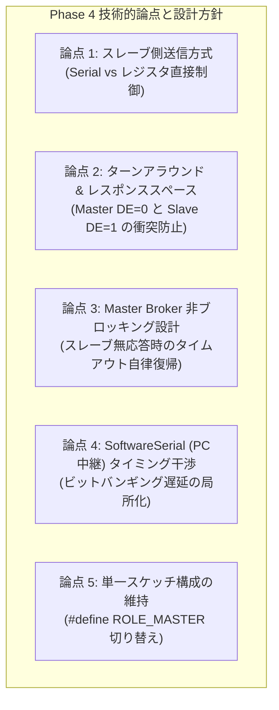
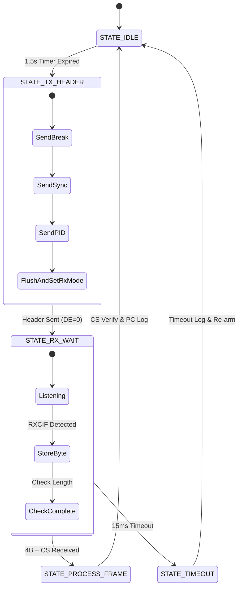
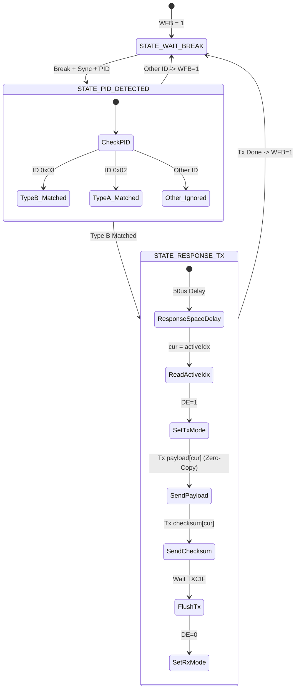
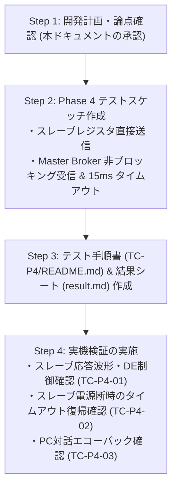

<!--
Copyright (c) 2026 ADX Project Contributors
SPDX-License-Identifier: CC-BY-4.0
-->

# LN-485 Phase 4 開発計画書 (Phase 4 Development Plan)
(Type B [Slave Pub → Master Sub] 実証 ＆ Master Broker MVP 完成計画)

本ドキュメントは、**ADX Core-D**（MCU: ATtiny1616, RS-485 トランシーバー: SP485EEN）における **LN-485 Phase 4 (`TC-P4`)** の開発に先立ち、技術的論点・懸念事項の整理、アーキテクチャ設計、および段階的な実装・検証ステップをまとめた開発計画書です。

---

## 1. Phase 4 の位置づけと達成目標

### 1.1 背景と位置づけ
* **Phase 1〜3 の成果**:
  * Phase 1: GPIO Break (14 Tbit) ＋ Sync (`0x55`) ＋ PID 送出の確立（PASS）
  * Phase 2: スレーブ `LINAUTO` ハードウェア自動同期 ＆ パリティ検証の確立（PASS）
  * Phase 3: Type A（Master Pub $\rightarrow$ Slave Sub）一方向データ通信 ＆ Slave Subscriber エンジンの確立（PASS）
* **Phase 4 のミッション**:
  * スレーブ側が **Publisher（送信側）** として動作し、マスターからの要求ヘッダに対して自律的に応答データを返信する **Type B 通信** を実証する。
  * マスター機を、単なる定期送出機から **「バスの全傍受（プロミスキャス）」「非ブロッキング・タイムアウト管理」「PCブリッジ」** を備えた **Master Broker MVP（最小動作実用版）** へと進化・完成させる。

```text
【Phase 4: Type B 通信シーケンス】
Master (DE=1) : [Break (14 Tbit)] ─> [Sync (0x55)] ─> [PID (例: ID=0x03)] ─> [flush()] ─> setRxMode() (DE=0 バス解放)
                                                                                  │
                                                                                  ▼ <レスポンススペース: 約50〜100µs>
Slave (DE=1)  : [LINAUTO PID検知] ───────────────────────────> setTxMode() (DE=1) ─> [Uptime (4B)] ─> [CS] ─> [flush()] ─> setRxMode() (DE=0)
                                                                                  │
Master (DE=0) : ─────────────────────────────────────────────> [プロミスキャス傍受 (4B + CS)] ─> [照合 ＆ PCモニタ出力]
```

---

## 2. Phase 4 における技術的論点・懸念事項と対策方針

Phase 4 では「スレーブからの送信」と「マスターでの受信待機・タイムアウト」が初めて登場するため、以下の **5 つの重要論点** を設計段階で解決しておく必要があります。



---

### 【論点 1】 スレーブ側の送信方式（`Serial` vs レジスタ直接制御）
* **課題・背景**:
  * Phase 3 の教訓（`fixed_report.md`）により、スレーブ機では `Serial.begin()` を呼ぶと megaTinyCore の RX 割り込み（ISR）が有効化され、ハードウェア `RXDATAL` のデータを吸い上げて `STATUS.RXCIF` を消去してしまう競合が判明しました。
  * スレーブが Publisher としてデータを送る際、再び `Serial.write()` を使うべきか、あるいはレジスタを直接叩くべきかが課題となります。
* **対策方針**:
  * **スレーブ側は完全なレジスタ直接制御（ポーリング送信）を採用** します。
  * 送信バッファ空き（`DREIF`）および送信完了（`TXCIF`）を直接監視することで、Arduino Core の割り込みに一切依存せず、決定論的かつ超高速に応答を送信します。
  ```cpp
  // スレーブ用 レジスタ直接送信関数
  void slaveTxByte(uint8_t data) {
    while (!(USART0.STATUS & USART_DREIF_bm)); // 送信バッファ空き待ち
    USART0.TXDATAL = data;
  }

  void slaveTxFlush() {
    while (!(USART0.STATUS & USART_TXCIF_bm)); // シフトレジスタ送出完了待ち
    USART0.STATUS |= USART_TXCIF_bm;          // TXCIF クリア
  }
  ```

---

### 【論点 2】 半二重 RS-485 のターンアラウンドとレスポンススペース
* **課題・背景**:
  * マスターが PID 送出後に `DE=0`（受信モード）へ落とすタイミングと、スレーブが PID 受信後に `DE=1`（送信モード）へ立ち上げるタイミングが重なると、トランシーバー（SP485EEN）同士がバス上で衝突（ショート波形・貫通電流）を起こします。
  * 逆にスレーブの応答開始が遅すぎると、マスター側がタイムアウトしてしまいます。
* **対策方針**:
  * **Master 側**: PID 送出後、`Serial.flush()`（または `TXCIF` 待機）を厳密に完了させてから直ちに `setRxMode()`（`DE=0`）を実行。
  * **Slave 側**: PID 受信後、約 **$50 \sim 100\,\mu\text{s}$（1 Tbit 程度）のレスポンススペース（ウェイト）** を置いてから `setTxMode()`（`DE=1`）を実行。
  * **Slave 送信完了**: データ ＋ チェックサム送出後、`slaveTxFlush()` を待ってから直ちに `setRxMode()`（`DE=0`）へ戻し、`WFB=1` を再アームする。

---

### 【論点 3】 Master Broker の非ブロッキング・タイムアウト管理
* **課題・背景**:
  * スレーブが未接続、電源断、またはノイズにより無応答の場合に、マスターが `while(!Serial.available())` 等のブロッキングループで待機すると、**マスターのメインループが永久停止し、ネットワーク全体がフリーズ** します。
* **対策方針**:
  * マスター側のメインループを **非ブロッキング・ステートマシン** で構成します。
  * ヘッダ送出後、タイムアウトタイマー（例: **10ms 〜 15ms**）を開始。
  * 規定バイト数（4バイト ＋ CS）を受信完了するか、または 15ms 経過した時点で強制的に受信フェーズを終了し、次のポーリング周期へ自律移行します。

---

### 【論点 4】 SoftwareSerial（PCデバッグ中継）の干渉防止
* **課題・背景**:
  * マスター機の PC 通信には SoftwareSerial（PB4/PB5: 9600 bps）を使用しています。
  * SoftwareSerial はソフトウェアによるビットバンギング処理のため、送受信中は割り込み禁止（または遅延）が発生し、RS-485 バス上の高速なハードウェア受信と競合するリスクがあります。
* **対策方針**:
  * RS-485 バス上のデータ受信期間（10〜15ms）中は PC への出力を保留し、**フレーム受信完了後（またはタイムアウト後）にまとめて `pcSerial.println()` で一括出力** します。

---

### 【論点 5】 チェックサム方式の統一
* **対策方針**:
  * Phase 3 と同様に、LN-485 標準の **Classic Checksum**（データバイトの総和に桁上がりを加算し反転: $\sum \text{Data} + \text{CS} \equiv 0\text{xFF}$）を使用します。

---

### 【論点 6】 スレーブ側 Double Buffer Publish Mailbox Pattern（ダブルバッファ完全非同期設計）
* **課題・背景**:
  * 実運用時、スレーブマイコンは `loop()` 内でセンサ計測やモータ制御などの重い処理を実行しています。マスターからポーリングされた瞬間にデータを即座に送出するため、アプリケーションと通信層を疎結合にする仕組みが必須となります。
  * 単一バッファに書き込む方式では、書き込み中・チェックサム計算中にマスターから読み出される衝突（Torn Read）を防ぐために長時間の割り込み禁止（`cli()`）が必要となり、UART 同期にジッターを与える懸念がありました。
* **対策方針（ダブルバッファ方式の採用）**:
  * [**`LN-485/double_buffer.md`**](../LN-485/double_buffer.md) および [**`LN-485/Publish_Mailbox_Pattern.md`**](../LN-485/Publish_Mailbox_Pattern.md) を策定。
  * 産業用 PLC の I/O リフレッシュと同様に、メールボックスを **フロントバッファ（通信層用）** と **バックバッファ（アプリ層用）** の 2 面構成（`payload[2][8]`）とします。
  * アプリは通常時（割り込み許可）に裏バッファへデータを書き込んでチェックサムを計算し、完了時に 1 クロック（`activeIdx = nextIdx`）でアトミックに切り替えます。
  * 通信層は `activeIdx` の表バッファを直接参照して **Zero-Copy（`memcpy` 不要）** で即時送出します。

```cpp
// ダブルバッファ・メールボックス構造体
struct DoubleBufferMailbox {
    uint8_t  topicId;
    uint8_t  length;
    uint8_t  payload[2][8];  // 2面バッファ ([0] と [1])
    uint8_t  checksum[2];    // 事前計算済み Classic Checksum
    volatile uint8_t activeIdx; // 通信層が読み出すアクティブインデックス (0 または 1)
};
```

---

## 3. Phase 4 検証対象テストケース一覧

[LN-485_TEST_SPECIFICATION.md](./LN-485_TEST_SPECIFICATION.md#phase-4-type-b-slave-pub--master-sub-実証--master-broker-mvp-完成) に基づく 3 つのテストケースを定義します。

| テストID | テスト項目名 | 担当・対象 | 検証内容と合否判定基準 |
| :--- | :--- | :---: | :--- |
| **`TC-P4-01`** | **Slave Publisher 応答 ＆ ターンアラウンド制御** | **Slave** | **【内容】** スレーブが Double Buffer Mailbox に格納された自担当の Type B データ（例: `ID=0x03` 稼働時間）を、レスポンススペースを置いて `DE=1` へ移行し、稼働時間（4バイト）＋ CS を送信して `DE=0` へ解放する一連のパブリッシュ処理を確認。<br>**【判定基準】** A/B バス上でマスター送信とスレーブ応答の間に衝突波形が一切なく、応答末尾バイトまで欠落なく送出されること。 |
| **`TC-P4-02`** | **Master Broker プロミスキャス傍受 ＆ タイムアウト管理**<br>【★Master Broker MVP 完成】 | **Master** | **【内容】** マスターが Type B ヘッダ送出直後に `DE=0`（RXモード）へ移行してスレーブ応答を全傍受・PC表示すること、およびスレーブ無応答（電源断/未接続）時に規定時間（15ms）で安全にタイムアウトして次周期へ遷移することを確認。<br>**【判定基準】** スレーブ接続時は応答が即座に表示され、無応答時は約15msで安全にタイムアウトしてメインループが停止しないこと。 |
| **`TC-P4-03`** | **双方向対話エコーバック**<br>(PC ⇔ Master Broker ⇔ Slave) | **全体** | **【内容】** PC シリアルモニタから送信されたコマンド/文字列を Master Broker がバス上に中継し、スレーブからの応答（稼働時間/エコー）を PC へ表示する一連の双方向対話を確認。<br>**【判定基準】** PC モニタ上にスレーブからの応答データが文字化け・欠落なく表示されること。 |

---

## 4. ファームウェア設計アーキテクチャ案

### 4.1 Master Broker 側ステートマシン



---

### 4.2 Slave Publisher 側アーキテクチャ（Double Buffer Mailbox 連携）

スレーブ側は、**「メインループでの裏バッファ更新」** と **「通信層での表バッファ即時送出」** が完全非同期に動作します。



---

## 5. 実装・検証のステップ計画



1. **Step 1**: 本開発計画書により、ターンアラウンド、レジスタ直接送信、非ブロッキング・タイムアウトの設計方針を確定。
2. **Step 2**: [`firmware/tests/ADX_Core-D/LIN_test/Phase/TC-P4/`](../Phase/) に Phase 4 テストスケッチを作成。
3. **Step 3**: `TC-P4/README.md` および `result.md` を作成し、実施手順・OK/NG 判定基準を整備。
4. **Step 4**: 2台の ADX Core-D 実機で通信検証を実施し、Master Broker MVP の完成を実証。
