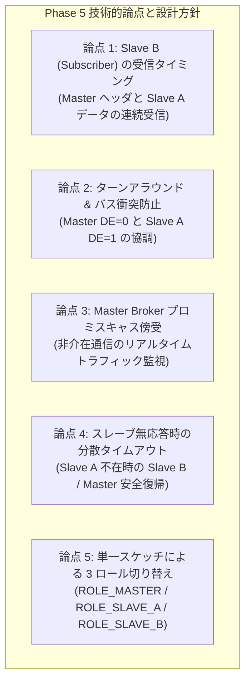
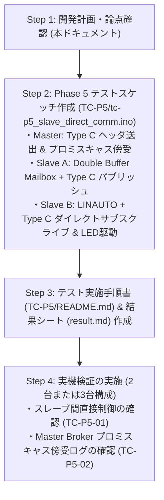

<!--
Copyright (c) 2026 ADX Project Contributors
SPDX-License-Identifier: CC-BY-4.0
-->

# LN-485 Phase 5 開発計画書 (Phase 5 Development Plan)
(Type C [Slave A Pub → Slave B Sub] スレーブ間直接通信実証 ＆ LN-485 UP/CS 完成計画)

本ドキュメントは、**ADX Core-D**（MCU: ATtiny1616, RS-485 トランシーバー: SP485EEN）における **LN-485 Phase 5 (`TC-P5`)** の開発に先立ち、技術的論点・懸念事項の整理、アーキテクチャ設計、および段階的な実装・検証ステップをまとめた開発計画書です。

---

## 1. Phase 5 の位置づけと達成目標

### 1.1 背景と位置づけ
* **Phase 1〜4 の成果**:
  * Phase 1: GPIO Break (14 Tbit) ＋ Sync (`0x55`) ＋ PID 送出の確立（PASS）
  * Phase 2: スレーブ `LINAUTO` ハードウェア自動同期 ＆ パリティ検証の確立（PASS）
  * Phase 3: Type A（Master Pub $\rightarrow$ Slave Sub）一方向制御の確立（PASS）
  * Phase 4: Type B（Slave Pub $\rightarrow$ Master Sub）双方向通信 ＆ Master Broker MVP の完成（PASS）
* **Phase 5 のミッション**:
  * **Type C (Slave A Pub $\rightarrow$ Slave B Sub) スレーブ間直接通信の実証**:
    * Master Broker はバス権調停（トピックヘッダ送出）のみを行い、データ本体は Slave A（Publisher: 内部タイマーで自律的に状態生成、外部スイッチ不要）が送出し、Slave B（Subscriber）がマスターの CPU や中継バッファを一切介さず直接受信してオンボードLED等を制御する。
  * **Master Broker によるバス全傍受（プロミスキャス監視）の実証**:
    * Master Broker は自身が送信元/宛先でない Type C 通信であっても、バス上を流れる全バイトを受信・照合し、分散ネットワーク全体のトラフィックとヘルス状態を PC シリアルへ出力する。
  * **LN-485 UP/CS (Unique Publisher / Common Subscriber) 完成**:
    * CAN や ROS に匹敵する Pub/Sub 型の完全分散マイコンネットワーク基盤を完成させる。

```text
【Phase 5: Type C 通信シーケンス】
Master Broker (DE=1) : [Break (14 Tbit)] ─> [Sync (0x55)] ─> [PID (ID=0x04)] ─> [flush()] ─> setRxMode() (DE=0 バス解放)
                                                                                  │
                                                                                  ▼ <レスポンススペース: 約50〜60µs>
Slave A (Pub) (DE=1) : [LINAUTO PID検知] ───────────────────────────> setTxMode() (DE=1) ─> [SW State (1B)] ─> [CS] ─> [flush()] ─> setRxMode() (DE=0)
                                                                                  │
Slave B (Sub) (DE=0) : [LINAUTO PID検知] ───────────────────────────> [データ直接受信 (1B + CS)] ─> [CS照合 ＆ 白LED直接制御]
                                                                                  │
Master Broker (DE=0) : ─────────────────────────────────────────────> [プロミスキャス傍受 (1B + CS)] ─> [照合 ＆ PCモニタ出力]
```

---

## 2. Phase 5 における技術的論点・懸念事項と対策方針



---

### 【論点 1】 Slave B (Subscriber) の受信ステートマシン設計
* **課題・背景**:
  * Type A 通信では Master が Break ＋ Sync ＋ PID ＋ Data ＋ CS を一括送信していたため、スレーブは連続したバイト列として受信できました。
  * Type C では、Master が Break ＋ Sync ＋ PID を送出した後、約 $50\,\mu\text{s}$ のレスポンススペースを挟んで **別のノード（Slave A）が Data ＋ CS を送出** します。
* **対策方針**:
  * Slave B は LINAUTO ハードウェアでヘッダ（Break ＋ Sync ＋ PID）を検知した後、内部状態を `STATE_RECV_TYPE_C_PAYLOAD` へ遷移させます。
  * ハードウェアの `USART0.RXDATAL` / `RXDATAH` を継続してポーリング監視し、レスポンススペース後に Slave A から到着するデータバイトとチェックサムバイトを確実に受信します。
  * チェックサム合致後、直ちに `digitalWrite(LED_W, state)` 等のアクションを実行し、`WFB=1`（`USART0.STATUS = USART_WFB_bm | USART_ISFIF_bm | USART_BDF_bm;`）を再アームして次フレームの待機に戻ります。

---

### 【論点 2】 ターンアラウンドとバス衝突防止
* **課題・背景**:
  * Master Broker が PID を送信して `DE=0`（受信モード）へ戻すタイミングと、Slave A が送信のために `DE=1`（送信モード）へ引き上げるタイミングが重なると、ドライバ同士が衝突します。
* **対策方針**:
  * Phase 4 で確立した **50〜60µs のレスポンススペース**（9600 bps で約 0.5 Tbit）を厳格に維持します。
  * Master Broker は `Serial.flush()` を完了してから直ちに `setRxMode()`（`DE=0`）を実行。
  * Slave A は PID 検知後、`delayMicroseconds(60)` を待機してから `setTxMode()`（`DE=1`）を実行し、Double Buffer Mailbox から Zero-Copy レジスタ直接送信（`slaveTxByte`, `slaveTxFlush`）を行います。

---

### 【論点 3】 Master Broker のプロミスキャス傍受（TC-P5-02）
* **課題・背景**:
  * 分散制御システムにおいて、マスターが制御に関与しない Type C 通信でも、ネットワーク監視（ヘルスチェック・ログ記録・上位SCADA/クラウド中継）のためにバスの全トラフィックをモニタリングできることが求められます。
* **対策方針**:
  * Master Broker は Type C スロット（Slot 2: `TOPIC_TYPE_C_TRIGGER`, ID=0x04）でヘッダを送出した直後、`DE=0`（受信モード）へ移行して **15ms の非ブロッキングタイマー** を開始します。
  * バス上を流れる Slave A のパブリッシュデータ（1バイト ＋ CS）をハードウェア受信し、CS を照合します。
  * 正常受信時は `[Broker Monitor] Topic 0x04 (Slave A -> Slave B): Data=[0x01] CS=OK`、タイムアウト時は `[Broker Monitor] Topic 0x04: Timeout (No Slave A Response)` と PC シリアルに出力します。

---

### 【論点 4】 スレーブ無応答時の分散タイムアウト復帰
* **課題・背景**:
  * Slave A が電源断や未接続の場合、Slave B がデータ待ちで永久停止したり、Master Broker がフリーズしてはなりません。
* **対策方針**:
  * **Master Broker**: 15ms の非ブロッキングタイマー満了で自律復帰し、次スロットへ進みます。
  * **Slave B (Subscriber)**: ペイロード受信待ち状態で一定時間（例: 20ms）データが来ない場合、または次のブレーク信号（`WFB` / `ISFIF`）を検知した時点で、安全にヘッダ待機状態（`WFB=1`）へリセット復帰します。

---

### 【論点 5】 単一スケッチによる 3 ロール統合設計
* **課題・背景**:
  * Master, Slave A, Slave B でスケッチが分かれると、トピック ID やデータ構造、チェックサムアルゴリズムの定義が乖離するリスクがあります。
* **対策方針**:
  * スケッチ冒頭のコンパイルスイッチにより、同一ソースコードから 3 つのノード用ファームウェアをビルド可能にします。
    ```cpp
    #define ROLE_MASTER    // Master Broker (Node #1)
    //#define ROLE_SLAVE_A // Slave A: Publisher (Node #2)
    //#define ROLE_SLAVE_B // Slave B: Subscriber (Node #3)
    ```

---

## 3. Phase 5 検証対象テストケース一覧

[LN-485_TEST_SPECIFICATION.md](./LN-485_TEST_SPECIFICATION.md#phase-5-type-c-slave-a-pub--slave-b-sub-スレーブ間直接通信実証) に基づく 2 つのテストケースを定義します。

| テストID | テスト項目名 | 担当・対象 | 検証内容と合否判定基準 |
| :--- | :--- | :---: | :--- |
| **`TC-P5-01`** | **Type C スレーブ間ダイレクト通信**<br>(Slave A → Slave B 直接制御) | **Slave A, Slave B** | **【内容】** Master Broker が ID=0x04（Type C トピック）ヘッダを送出した際、Slave A が Double Buffer Mailbox から状態データ（`0x01` / `0x00`）をパブリッシュし、Slave B がマスターの CPU/メモリを介さずに直接受信して自身の白 LED（PB3）を連動制御することを確認。<br>**【判定基準】** マスターのソフトウェア処理を介さず、Slave A の送信データに応じて Slave B の LED が即座かつ確実に点灯/消灯すること。 |
| **`TC-P5-02`** | **Master Broker プロミスキャス傍受 ＆ 分散トラフィック監視** | **Master Broker** | **【内容】** Slave A $\rightarrow$ Slave B の直接通信中、Master Broker がプロミスキャス受信によりバス上の全バイトを傍受し、PC シリアルモニタに正確な分散通信トラフィックログを出力することを確認。<br>**【判定基準】** `[Broker Monitor] Topic 0x04: Data=[0x01] CS=OK` のように正確なトラフィックログが出力され、マスター側でバスエラーやメインループ停止が発生しないこと。 |

---

## 4. 通信フレームとトピック定義

| トピック定数 | ID | 通信タイプ | 送信元 (Pub) | 受信先 (Sub) | ペイロード長 | 用途 / 内容 |
| :--- | :---: | :---: | :---: | :---: | :---: | :--- |
| `TOPIC_TYPE_A_LED` | `0x02` | **Type A** | Master Broker | Slave B | 1 Byte | Master から Slave B への LED 制御コマンド (`0x01`/`0x00`) |
| `TOPIC_TYPE_B_UPTIME` | `0x03` | **Type B** | Slave A | Master Broker | 4 Bytes | Slave A から Master Broker への稼働時間返信 (`millis()`) |
| `TOPIC_TYPE_C_TRIGGER` | `0x04` | **Type C** | **Slave A** | **Slave B** | **1 Byte** | **Slave A から Slave B へのダイレクトトリガー (`0x01`/`0x00`)** |
| `TOPIC_TYPE_B_UNCONN` | `0x05` | **Type B** | (未接続) | Master Broker | - | タイムアウト耐性検証スロット |

---

## 5. スケジューラ・タイムスロット構成 (Master Broker)

Master Broker は 1.5秒（または 1.0秒）周期で以下の 4 つのスロットを順番に巡回します。

```text
Slot 0: Type A (ID=0x02) ──> Master Pub -> Slave B Sub (Slave B 赤LEDトグル)
Slot 1: Type B (ID=0x03) ──> Master Broker が Slave A Uptime 要求 -> Slave A が応答 (Master 傍受表示)
Slot 2: Type C (ID=0x04) ──> Master Broker が場作りヘッダ送出 -> Slave A がパブリッシュ -> Slave B が直接受信 (Slave B 白LED連動) ＆ Master 傍受ログ出力
Slot 3: Timeout (ID=0x05) ──> 未接続ノードへの要求 -> 15ms タイムアウト自律復帰確認
```

---

## 6. 実装・検証のステップ計画


