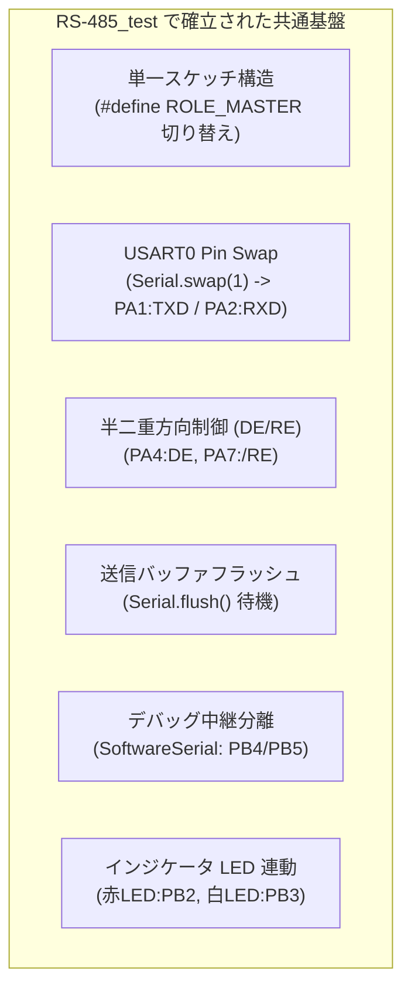

<!--
Copyright (c) 2026 ADX Project Contributors
SPDX-License-Identifier: CC-BY-4.0
-->

# ADX Core-D LN-485 スケッチ開発ガイドライン & 注意事項
(LN-485 Sketch Development Guidelines & Precautions)

本ドキュメントは、先行の [`RS-485_test/rs-485_no_xdir.ino`](../../RS-485_test/rs-485_no_xdir.ino) で確立された実装実績と知見をおさらいし、これから作成する **LN-485 (LIN-based RS-485)** 各フェーズ（Phase 1 〜 Phase 6）のテストスケッチを作成・実装する際の**必須ルール、レジスタ制約、および注意事項**をまとめたガイドラインです。

---

## 1. `RS-485_test` の実装実績とおさらい (Key Takeaways)

先行の [`RS-485_test`](../../RS-485_test/) では、2台の ADX Core-D 実機間で以下の基本アーキテクチャが検証され、正常動作（PASS）が確認されています。



### 1.1 単一スケッチによる Master / Slave 両対応
* `#define ROLE_MASTER` の有効化／コメントアウトのみで、同一ソースコードからマスター機用とスレーブ機用のバイナリをビルドできる構成を維持します。
* これにより、マスター／スレーブ間でデータ構造やプロトコル定数の定義が乖離するミスを防ぎます。

### 1.2 ピン配置リマップ (`Serial.swap(1)`)
* ATtiny1616 の USART0 デフォルトピン（PB2:TX, PB3:RX）は、ADX Core-D の LED（PB2:赤, PB3:白）と重複しています。
* そのため、**`setup()` の冒頭で必ず `Serial.swap(1)` を呼び出し、PA1（TXD）/ PA2（RXD）へリマップ** します。

### 1.3 送信バッファのフラッシュ (`Serial.flush()`)
* RS-485 トランシーバー（SP485EEN）の `DE`（送信イネーブル）を LOW（受信モード）に戻す前には、**必ず `Serial.flush()`（または `TXCIF` 完了待機）を実行** します。
* `flush()` を怠ると、シフトレジスタ内の末尾バイト（チェックサム等）がバス上に送出される前に `DE` が遮断され、パケット破損の原因となります。

### 1.4 デバッグログの独立性 (SoftwareSerial)
* マスター機の対話シリアルモニタには、MCU の `PB4` (TX) / `PB5` (RX) を用いた `SoftwareSerial`（9600 bps）を使用し、RS-485 バス（USART0: PA1/PA2）と完全に通信ラインを分離します。

---

## 2. LN-485 スケッチ作成における重要注意事項 (Critical Rules)

LIN プロトコルおよび ATtiny1616 ハードウェア LIN スレーブエンジン（`LINAUTO`）を扱う際は、通常の UART 通信にはない**厳格なハードウェア制約**が存在します。以下の 7 つの注意事項を必ず遵守してください。

---

### ⚠️ 注意事項 1: 受信レジスタの読み出し順序（厳格なハードウェアルール）
ATtiny1616 の USART 受信バッファは FIFO 構造となっており、高バイト（`RXDATAH`）に格納されるステータスフラグ（`PERR` パリティエラー、`FERR`、`BUFOVF`）は、低バイト（`RXDATAL`）と密接に連動しています。

> **【絶対遵守ルール】**
> **必ず先に `USART0.RXDATAH` を読み出してから、`USART0.RXDATAL` を読み出してください。**
> 
> ```c
> // 正しい読み出し手順
> uint8_t rxHigh = USART0.RXDATAH; // ① 先にステータス・エラーフラグを取得
> uint8_t rxLow  = USART0.RXDATAL; // ② 次にデータ本体を取得（FIFOポインタが進む）
> ```
> `RXDATAL` を先に読み出すと、FIFO のポインタが進んでしまい、直後に `RXDATAH` を読んでも次の無関係なデータのフラグが返ってきます。

---

### ⚠️ 注意事項 2: STATUS レジスタ操作での `|=` 禁止と一括直接代入
LINAUTO モードのスレーブは、`USART0.STATUS` の **`WFB` (Wait For Break) ビットに '1' を書き込むことで「ブレーク検出待機状態」** に入ります。

* AVR マイコンのステータスレジスタは「1 を書き込むとフラグがクリアされる（Write 1 to Clear）」仕様となっています。
* `USART0.STATUS |= USART_WFB_bm;`（論理和 `|=`）を使用すると、既に立っていた `ISFIF` や `BDF` などのフラグが意図せずクリアされたり、クリアしたくないタイミングでフラグが消える競合バグを引き起こします。
* **【絶対遵守ルール】** `|=` 演算子は使わず、**セットしたい制御ビット（`WFB`）とクリアしたいフラグビット（`ISFIF`, `BDF`）を 1 まとめで直接代入（`=`）** してください。
  ```c
  // 正しい復帰シーケンス (WFB をセットし、同時に BDF と ISFIF を完全クリア)
  USART0.STATUS = USART_WFB_bm | USART_ISFIF_bm | USART_BDF_bm;
  ```

---

### ⚠️ 注意事項 3: 同期エラー (`ISFIF`) のリカバリシーケンス
不正な Sync キャラクタ（`0x55` 以外）やノイズにより自動同期が失敗すると、`USART0.STATUS` の `ISFIF`（Inconsistent Sync Field Flag）がセットされます。

* `ISFIF` がセットされた場合、ハードウェアは `BAUD` レジスタの更新を破棄します。
* ソフトウェア側で **`USART0.STATUS = USART_WFB_bm | USART_ISFIF_bm | USART_BDF_bm;`** を実行してエラーフラグをクリアしつつ `WFB=1` を再設定することで、安全に待機状態へ復帰させてください。

---

### ⚠️ 注意事項 4: マスター側 Break 送出（GPIO トグル）の手順
マスター側でブレーク信号を出力する際は、以下のシーケンスを厳格に守ります。

```cpp
void sendLinBreak(uint32_t baud) {
  uint16_t tBit = 1000000UL / baud; // 1ビット時間 (µs)
  
  // 1. 直前の送信完了を確実に待機
  Serial.flush();
  
  // 2. USART TX を一時ディスエーブル (GPIO 出力へ開放)
  USART0.CTRLB &= ~USART_TXEN_bm;
  
  // 3. PA1 (TXD) を LOW に駆動 (Break: 14 Tbit)
  PORTA.DIRSET = PIN1_bm;
  PORTA.OUTCLR = PIN1_bm;
  delayMicroseconds(tBit * 14);
  
  // 4. PA1 を HIGH に駆動 (Break Delimiter: 1 Tbit)
  PORTA.OUTSET = PIN1_bm;
  delayMicroseconds(tBit * 1);
  
  // 5. USART TX を再イネーブル (以降の 0x55, PID 送信に備える)
  USART0.CTRLB |= USART_TXEN_bm;
}
```

---

### ⚠️ 注意事項 5: 半二重バスのターンアラウンドとレスポンススペース
マスターが PID を送信してからスレーブが応答を開始するまでの間（Slave-Publish 時）、およびスレーブが応答を終えてマスターが受信を完了するまでの間には、**RS-485 の方向切り替えマージン（レスポンススペース）** が必要です。

```text
[Master 送信 (DE=1)]
  Break ── Sync(0x55) ── PID ──> [flush()] ──> [setRxMode() (DE=0)]
                                                  │
                                                  ▼ <レスポンススペース: 約50〜100µs>
                                              [setTxMode() (DE=1)]
                                              [Slave 応答 (Data + CS)] ──> [flush()] ──> [setRxMode() (DE=0)]
```

* マスターは PID 送出後、`Serial.flush()` を完了してから直ちに `setRxMode()`（DE=0）を実行してバスを解放します。
* スレーブは PID 受信後、約 $50\sim 100\,\mu\text{s}$ のレスポンススペースを置いてから `setTxMode()`（DE=1）を実行し、応答データを送信します。

---

### ⚠️ 注意事項 6: スレーブ側初期化における `Serial.begin()` の排除 (割り込み競合の回避)
* スレーブ機において `Serial.begin()` を呼び出すと、megaTinyCore（Arduinoコア）内部で UART の RX 割り込みハンドラが自動登録されます。
* その結果、ポーリングループ（`while (USART0.STATUS & USART_RXCIF_bm)`）が実行される前に、**裏側の割り込みが `RXDATAL` からデータを吸い上げて `STATUS.RXCIF` を勝手にクリアしてしまう競合** が発生します。
* **【絶対遵守ルール】** スレーブ機では `Serial.begin()` は一切使用せず、**`PORTMUX` および `PORTA` レジスタを直接操作してピン初期化・レジスタ設定** を行います。
  ```cpp
  // スレーブ側の正しい初期化手順
  PORTMUX.CTRLB |= PORTMUX_USART0_ALTERNATE_gc; // PA1:TXD, PA2:RXD
  PORTA.DIRSET = PIN1_bm;                        // PA1 (TX) = OUTPUT
  PORTA.DIRCLR = PIN2_bm;                        // PA2 (RX) = INPUT

  USART0.CTRLB &= ~(USART_RXEN_bm | USART_TXEN_bm);
  USART0.CTRLC = USART_CMODE_ASYNCHRONOUS_gc | USART_PMODE_DISABLED_gc | USART_CHSIZE_8BIT_gc;
  USART0.CTRLB = USART_RXMODE_LINAUTO_gc | USART_RXEN_bm | USART_TXEN_bm;
  USART0.BAUD  = (uint16_t)(64 * (F_CPU / (16 * BAUDRATE)));
  USART0.STATUS = USART_WFB_bm | USART_ISFIF_bm | USART_BDF_bm;
  ```

---

### ⚠️ 注意事項 7: 8ビットモードにおける受信判定と高速 FIFO 読み出し
* ATtiny1616 の 8 ビット通信モード（`CHSIZE_8BIT_gc`）において、`USART0.RXDATAH` の最下位ビット（bit 0: `DATA8`）は通常のデータ受信時は常に `0` となります（9 ビットモード時のみ使用）。
* そのため、データ受信判定で `rxHigh & 0x01`（`USART_DATA_bm` 等）を判定条件にしてはならず、**ステートマシン（`STATE_WAIT_HEADER` $\rightarrow$ `STATE_RECEIVE_PAYLOAD`）の状態遷移に基づいてデータを格納** します。
* また、受信処理は `while (USART0.STATUS & USART_RXCIF_bm)` を用いて FIFO 内の連続バイトを漏れなく即座に読み出します。

---

## 3. スケッチの基本テンプレート (Code Template)

以下は、各 Phase で共通して使用する実証済みのスケッチ基本骨格です。

```cpp
// =============================================================================
// ADX Core-D LN-485 Test Firmware
// =============================================================================
#include <Arduino.h>
#include <SoftwareSerial.h>

// 役割設定：マスター機用ビルド時は有効化、スレーブ機用ビルド時はコメントアウト
#define ROLE_MASTER

// --- ピン定義 (ADX Core-D ハードウェア仕様準拠) ---
const int PIN_TXD = PIN_PA1; // USART0 TXD
const int PIN_RXD = PIN_PA2; // USART0 RXD
const int PIN_DE  = PIN_PA4; // RS-485 Driver Enable (HIGH=送信有効)
const int PIN_RE  = PIN_PA7; // RS-485 Receiver Enable (LOW=受信有効)
const int LED_R   = PIN_PB2; // 赤色 LED
const int LED_W   = PIN_PB3; // 白色 LED

// PCシリアルモニタ用 SoftwareSerial (RX: PB5, TX: PB4)
SoftwareSerial pcSerial(PIN_PB5, PIN_PB4);

// --- 通信パラメータ ---
const uint32_t BAUDRATE = 9600;
#define BIT_TIME_US(baud) (1000000UL / (baud))

// --- RS-485 半二重方向制御ヘルパー ---
void setTxMode() {
  digitalWrite(PIN_RE, HIGH); // 受信無効
  digitalWrite(PIN_DE, HIGH); // 送信有効
  delayMicroseconds(10);      // IC安定化待ち
}

void setRxMode() {
  digitalWrite(PIN_DE, LOW);  // 送信無効
  digitalWrite(PIN_RE, LOW);  // 受信有効
  delayMicroseconds(10);      // IC安定化待ち
}

// --- LIN PID 計算ヘルパー ---
uint8_t calculatePID(uint8_t id) {
  uint8_t p0 = ((id >> 0) ^ (id >> 1) ^ (id >> 2) ^ (id >> 4)) & 0x01;
  uint8_t p1 = !(((id >> 1) ^ (id >> 3) ^ (id >> 4) ^ (id >> 5)) & 0x01);
  return (id & 0x3F) | (p0 << 6) | (p1 << 7);
}

// --- LIN Classic Checksum 計算ヘルパー ---
uint8_t calculateClassicChecksum(const uint8_t *data, uint8_t len) {
  uint16_t sum = 0;
  for (uint8_t i = 0; i < len; i++) {
    sum += data[i];
    if (sum > 0xFF) sum -= 0xFF;
  }
  return (uint8_t)(~sum);
}

// --- GPIO トグルによる Break 送出 ---
void sendLinBreak(uint32_t baud) {
  uint16_t tBit = BIT_TIME_US(baud);
  
  Serial.flush();
  setTxMode();
  
  USART0.CTRLB &= ~USART_TXEN_bm;
  
  PORTA.DIRSET = PIN1_bm;
  PORTA.OUTCLR = PIN1_bm;         // Break: LOW (14 Tbit)
  delayMicroseconds(tBit * 14);
  
  PORTA.OUTSET = PIN1_bm;         // Delimiter: HIGH (1 Tbit)
  delayMicroseconds(tBit * 1);
  
  USART0.CTRLB |= USART_TXEN_bm; // TX 再有効化
}

// ==========================================
// 初期化ルーチン (setup)
// ==========================================
void setup() {
  pinMode(PIN_DE, OUTPUT);
  pinMode(PIN_RE, OUTPUT);
  pinMode(LED_R, OUTPUT);
  pinMode(LED_W, OUTPUT);
  
  setRxMode(); // 初期状態は受信モード
  pcSerial.begin(9600);

#ifdef ROLE_MASTER
  // 【マスター側】 Arduino Serial オブジェクトを利用
  pinMode(PIN_RXD, INPUT);
  Serial.swap(1);
  Serial.begin(BAUDRATE);

  pcSerial.println(F("=== ADX Core-D LN-485 Master Active ==="));
#else
  // 【スレーブ側】 割り込み競合を防ぐため Serial.begin() は使わずレジスタ直接設定
  PORTMUX.CTRLB |= PORTMUX_USART0_ALTERNATE_gc;
  PORTA.DIRSET = PIN1_bm; // PA1 (TX) = OUTPUT
  PORTA.DIRCLR = PIN2_bm; // PA2 (RX) = INPUT

  USART0.CTRLB &= ~(USART_RXEN_bm | USART_TXEN_bm);
  USART0.CTRLC = USART_CMODE_ASYNCHRONOUS_gc | USART_PMODE_DISABLED_gc | USART_CHSIZE_8BIT_gc;
  USART0.CTRLB = USART_RXMODE_LINAUTO_gc | USART_RXEN_bm | USART_TXEN_bm;
  USART0.BAUD  = (uint16_t)(64 * (F_CPU / (16 * BAUDRATE)));
  USART0.STATUS = USART_WFB_bm | USART_ISFIF_bm | USART_BDF_bm;

  pcSerial.println(F("=== ADX Core-D LN-485 Slave (LINAUTO) Active ==="));
#endif
}

// ==========================================
// メインループ (loop)
// ==========================================
void loop() {
#ifdef ROLE_MASTER
  // マスター側処理（スケジューラ / 送信ルーチン）
#else
  // スレーブ側処理（LINAUTO 受信ステートマシン / レジスタポーリング）
  while (USART0.STATUS & USART_RXCIF_bm) {
    uint8_t rxHigh = USART0.RXDATAH; // ① 先にステータス取得
    uint8_t rxLow  = USART0.RXDATAL; // ② 次にデータ取得
    
    // 受信エラー・ステートマシン処理...
  }
#endif
}
```
