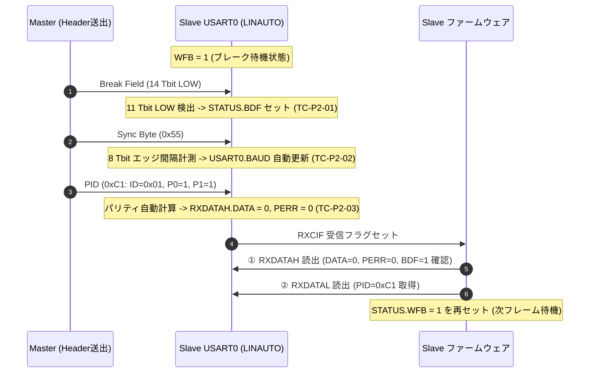

<!--
Copyright (c) 2026 ADX Project Contributors
SPDX-License-Identifier: CC-BY-4.0
-->

# ADX Core-D LN-485 テスト: TC-P2
(スレーブ LINAUTO ハードウェア自動同期 & PID パリティ・エラー検証)

本ディレクトリには、**ADX Core-D**（MCU: ATtiny1616, トランシーバー: SP485EEN）における、MCU 内蔵 **ハードウェア LIN スレーブエンジン (`LINAUTO` モード)** の実機動作検証テスト（Phase 2: `TC-P2-01` 〜 `TC-P2-05`）のスケッチ、実施手順、および結果記録シートをまとめています。

---

## 1. テスト概要 (Phase 2 全 5 項目)

Phase 2 では、スレーブマイコンの USART0 を `LINAUTO` モードで稼働させ、ハードウェアアクセラレータによる以下の 5 つの機能を包括的に検証します。

| テストID | 検証項目 | ハードウェア検証対象 |
| :--- | :--- | :--- |
| **`TC-P2-01`** | **ブレーク検出 (`BDF`)** | ブレーク受信時に `USART0.STATUS.BDF == 1` がセットされること |
| **`TC-P2-02`** | **自動ボーレート補正 (`BAUD`)** | `0x55` 受信により `USART0.BAUD` レジスタ値が自動更新されること |
| **`TC-P2-03`** | **PID 認識 & パリティ計算** | `RXDATAH.DATA == 0`（PID識別）かつ `PERR == 0`（パリティ正常）であること |
| **`TC-P2-04`** | **Sync エラー検出 & 復帰 (`ISFIF`)** | 不正 Sync (`0xAA`) 受信時に `STATUS.ISFIF == 1` を検知し、安全に復帰すること |
| **`TC-P2-05`** | **PID パリティエラー検出 (`PERR`)** | 不正パリティ PID 受信時に `RXDATAH.PERR == 1` を検知し、フレームを破棄すること |

* **テストスケッチ**: [`tc-p2_slave_linauto_test.ino`](./tc-p2_slave_linauto_test.ino)

---

## 2. ハードウェア LINAUTO の動作原理とレジスタ制御



### ⚠️ スケッチ内の重要ルール
1. **読み出し順序**: 必ず `uint8_t rxHigh = USART0.RXDATAH;` を先に読んでから、`uint8_t rxLow = USART0.RXDATAL;` を読み出します。
2. **待機フラグ再設定**: 処理完了後、必ず `USART0.STATUS |= USART_WFB_bm;` を実行します。

---

## 3. テスト実施手順 (Action)

### 【Step 1】 スレーブ機（LINAUTO 受信側）の書き込み
1. [`tc-p2_slave_linauto_test.ino`](./tc-p2_slave_linauto_test.ino) の 9 行目をコメントアウトします。
   ```cpp
   // #define ROLE_MASTER    // スレーブ（LINAUTO）機用
   ```
2. スレーブ用 ADX Core-D（#2）の SerialUPDI ポート（CH342K Port A）へ書き込みます。
3. 書き込み完了後、スレーブ機の SoftwareSerial ポート（CH342K Port B）をシリアルモニタ（**9600 bps**）で開きます。
4. 以下の待機画面が表示されます。
   ```txt
   ==================================================
   === ADX Core-D LN-485 Test: TC-P2              ===
   === [SLAVE] Hardware LINAUTO Engine Active     ===
   ==================================================
   [Config] Initial USART0.BAUD: 0x2082
   [Status] WFB=1. Listening for Break on RS-485 bus...
   ```

### 【Step 2】 マスター機（テストパターン送出側）の書き込み
1. [`tc-p2_slave_linauto_test.ino`](./tc-p2_slave_linauto_test.ino) の 9 行目を有効化します。
   ```cpp
   #define ROLE_MASTER       // マスター（送出）機用
   ```
2. マスター用 ADX Core-D（#1）の SerialUPDI ポート（CH342K Port A）へ書き込みます。
3. マスター機が 1.2 秒周期で以下のシーケンスパターンを自動送出します。
   * **Cycle 1..3**: 正常ヘッダ (`[Break] + [0x55] + [PID: 0xC1]`)
   * **Cycle 4**: 不正 Sync ヘッダ (`[Break] + [0xAA] + [PID: 0xC1]`) $\rightarrow$ **`ISFIF` テスト**
   * **Cycle 5**: 不正パリティ PID (`[Break] + [0x55] + [PID: 0x01]`) $\rightarrow$ **`PERR` テスト**
   * **Cycle 6..**: 正常ヘッダ（復帰確認）

### 【Step 3】 スレーブ側シリアルモニタでの自動検証結果確認
スレーブ側のシリアルモニタに、マスターからの各パターンに応じた判定ログが以下のように出力されることを確認します。

```txt
[Slave Event #1] PID Received: 0xC1 (ID: 0x01) | AutoBAUD: 0x2084 | BDF: 1 | DATA: 0 | PERR: 0 -> [ PASS / OK (TC-P2-01..03) ]
[Slave Event #2] PID Received: 0xC1 (ID: 0x01) | AutoBAUD: 0x2084 | BDF: 1 | DATA: 0 | PERR: 0 -> [ PASS / OK (TC-P2-01..03) ]
[Slave Event #3] PID Received: 0xC1 (ID: 0x01) | AutoBAUD: 0x2084 | BDF: 1 | DATA: 0 | PERR: 0 -> [ PASS / OK (TC-P2-01..03) ]
[Slave Event #4] STATUS.ISFIF (Inconsistent Sync) DETECTED! -> Cleared & WFB Rearmed -> [ PASS / OK (TC-P2-04) ]
[Slave Event #5] Corrupted PID: 0x01 | PERR: 1 (Parity Error Detected!) -> Discarded & WFB Rearmed -> [ PASS / OK (TC-P2-05) ]
[Slave Event #6] PID Received: 0xC1 (ID: 0x01) | AutoBAUD: 0x2084 | BDF: 1 | DATA: 0 | PERR: 0 -> [ PASS / OK (TC-P2-01..03) ]
```

---

## 4. 合否判定基準 (OK / NG Criteria)

| テスト項目 | 【 OK (合格) 基準 】 | 【 NG (不合格) 基準 】 |
| :--- | :--- | :--- |
| **`TC-P2-01` (BDF)** | 正常ヘッダ受信時に `STATUS.BDF == 1` が検出されること | BDF が `0` のままである |
| **`TC-P2-02` (AutoBAUD)** | `USART0.BAUD` がマスターのボーレートに合致した値に自動更新されること | `BAUD` が初期値のまま未更新 |
| **`TC-P2-03` (PID/DATA)** | `RXDATAH.DATA == 0` かつ `PERR == 0` で PID `0xC1` が取得できること | `DATA == 1` または `PERR == 1` と誤認 |
| **`TC-P2-04` (ISFIF)** | 不正 Sync `0xAA` 送信時に `STATUS.ISFIF == 1` を検知し、次フレームで正常復帰すること | ISFIF 未検知、またはハングアップ |
| **`TC-P2-05` (PERR)** | 不正パリティ PID `0x01` 送信時に `RXDATAH.PERR == 1` を検知し、フレームを破棄すること | 不正パリティを見逃して PERR=0 |

---

## 5. テスト結果の記録

実機テストを実施した後は、[**`result.md`**](./result.md) にシリアルログおよび合否判定を記録してください。
