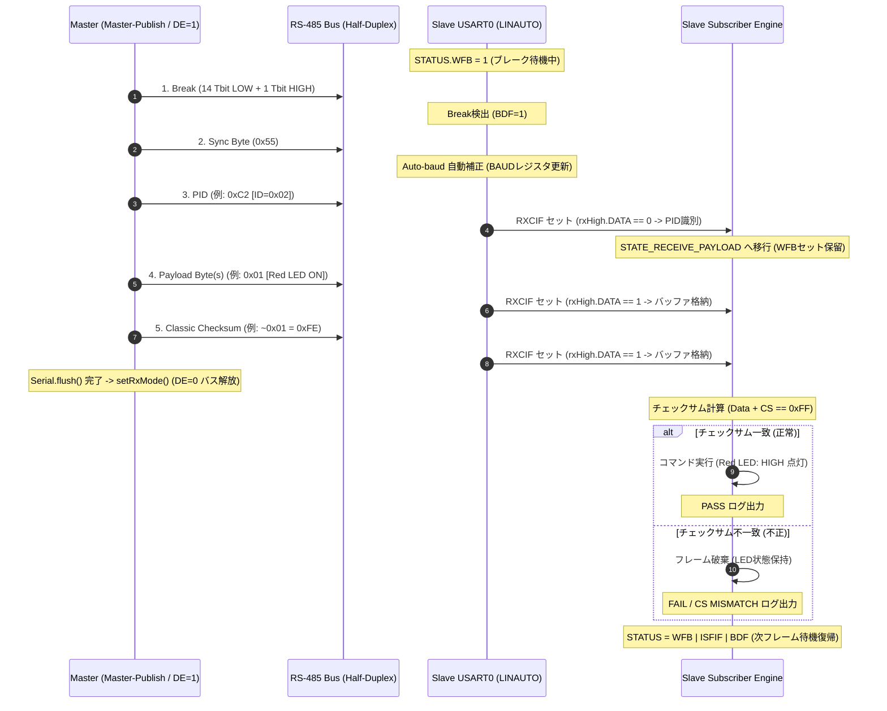

<!--
Copyright (c) 2026 ADX Project Contributors
SPDX-License-Identifier: CC-BY-4.0
-->

# ADX Core-D LN-485 テスト: TC-P3
(Type A [Master Pub → Slave Sub] 実証 ＆ Slave Subscriber 実装)

本ディレクトリには、**ADX Core-D**（MCU: ATtiny1616, トランシーバー: SP485EEN）における **Type A（Master-Publish → Slave-Subscribe）通信フレーム** の送受信、スレーブ側 Subscriber 受信エンジン、チェックサム照合、およびアクチュエータ（LED）制御検証テスト（Phase 3: `TC-P3-01` 〜 `TC-P3-03`）のスケッチ、実施手順、および結果記録シートをまとめています。

---

## 1. テスト概要 (Phase 3 全 3 項目)

Phase 3 では、マスターからスレーブへの一方向データ送信（Master-Publish）を行い、スレーブが LINAUTO モードでヘッダを受信した後に続くペイロードを確実に取得・検証・実行できることを包括的に実証します。

| テストID | 検証項目 | 担当 | ハードウェア・プロトコル検証対象 |
| :--- | :--- | :---: | :--- |
| **`TC-P3-01`** | **ミニマム・スケジューラ ＆ Master-Publish 送出** | **Master** | 1.5秒周期の定期巡回スケジューラで、Type A フレーム（Break + Sync + PID + Payload + CS）を連続送出し、送信完了直後に `DE=0`（受信モード）へ解放すること |
| **`TC-P3-02`** | **Slave Subscriber ペイロード受信 ＆ チェックサム検証** | **Slave** | LINAUTO で PID（`DATA==0`）検知後、後続のデータおよびチェックサム（`DATA==1`）をバッファリングし、Classic Checksum（$\sum \text{Data} + \text{CS} \equiv 0\text{xFF}$）が完全一致すること |
| **`TC-P3-03`** | **コマンド連動 LED 制御 ＆ 不正チェックサム破棄** | **Slave** | 受信データに応じて赤 LED (PB2) / 白 LED (PB3) が確実に点灯/消灯制御され、不正チェックサム時はフレームを破棄して LED を保持し、安全に `WFB=1` に復帰すること |

* **テストスケッチ**: [`tc-p3_master_pub_slave_sub.ino`](./tc-p3_master_pub_slave_sub.ino)

---

## 2. Type A (Master-Publish) 通信シーケンスと動作原理



---

## 3. 実装上の重要ルール (Phase 2 教訓の継承)

1. **受信レジスタ読み出し順序**:
   * スレーブ側では必ず先に `USART0.RXDATAH` を読み出してステータスと `DATA` ビット（bit 0）を取得し、その後に `USART0.RXDATAL` を読み出します。
2. **ペイロード受信中の `WFB` 非アーム**:
   * PID 受信直後は `WFB` をセットせず、後続のペイロードおよびチェックサムを `DATA == 1` として受信します。
   * 全バイト受信完了時、またはタイムアウト（100ms）発生時に、一括代入（`USART0.STATUS = USART_WFB_bm | USART_ISFIF_bm | USART_BDF_bm;`）で `WFB=1` へ復帰します。
3. **Master の確実な送信完了待機**:
   * チェックサム送信後、必ず `Serial.flush()` の完了を待ってから `setRxMode()`（`DE=0`）を実行し、末尾ビットの欠落を防止します。

---

## 4. テスト実施手順 (Action)

### 【Step 1】 スレーブ機（Subscriber 受信側）の準備
1. [`tc-p3_master_pub_slave_sub.ino`](./tc-p3_master_pub_slave_sub.ino) の 12 行目をコメントアウトします。
   ```cpp
   // #define ROLE_MASTER    // スレーブ（Subscriber）機用
   ```
2. スレーブ用 ADX Core-D（#2）の SerialUPDI ポート（CH342K Port A）へ書き込みます。
3. スレーブ機の SoftwareSerial ポート（CH342K Port B）をシリアルモニタ（**9600 bps**）で開きます。
4. 以下の待機画面が表示されます。
   ```txt
   ==================================================
   === ADX Core-D LN-485 Test: TC-P3              ===
   === [SLAVE] Subscriber Engine Active (Type A)  ===
   ==================================================
   [Config] Initial USART0.BAUD: 0x2082
   [Supported Topics / Commands]
     - ID: 0x02 (Red LED Control: 0x01=ON, 0x00=OFF)
     - ID: 0x03 (White LED Control: 0x01=ON, 0x00=OFF)
     - ID: 0x04 (Multi-byte Telemetry: 4 Bytes)
   [Status] WFB=1. Listening for Type A frames on RS-485 bus...
   ```

### 【Step 2】 マスター機（スケジューラ送出側）の準備
1. [`tc-p3_master_pub_slave_sub.ino`](./tc-p3_master_pub_slave_sub.ino) の 12 行目を有効化します。
   ```cpp
   #define ROLE_MASTER       // マスター（Master-Pub）機用
   ```
2. マスター用 ADX Core-D（#1）の SerialUPDI ポート（CH342K Port A）へ書き込みます。
3. マスター機の SoftwareSerial ポート（CH342K Port B）をシリアルモニタ（**9600 bps**）で開きます。
4. マスター機が 1.5 秒周期で以下のテストパターンを自動送出します。
   * **Cycle 1**: `ID=0x02, Data=[0x01]` (赤 LED 点灯)
   * **Cycle 2**: `ID=0x02, Data=[0x00]` (赤 LED 消灯)
   * **Cycle 3**: `ID=0x03, Data=[0x01]` (白 LED 点灯)
   * **Cycle 4**: `ID=0x03, Data=[0x00]` (白 LED 消灯)
   * **Cycle 5**: `ID=0x02, Data=[0x01] + 破損Checksum` $\rightarrow$ **`TC-P3-03` チェックサム破棄テスト**
   * **Cycle 6**: `ID=0x04, Data=[0x12, 0x34, 0x56, 0x78]` (4バイトデータ送信テスト)

---

## 5. 合否判定基準 (Pass/Fail Criteria)

### スレーブ側シリアルモニタ判定ログ例
スレーブ側シリアルモニタに、マスターからの各サイクルに対応して以下のログが出力され、LED が連動することを確認します。

```txt
[Slave Frame #1] PID: 0xC2 (ID: 0x02) | Payload: [0x01] | CS: 0xFE -> [ PASS / OK ]
  └─> [Action] Red LED turned ON
[Slave Frame #2] PID: 0xC2 (ID: 0x02) | Payload: [0x00] | CS: 0xFF -> [ PASS / OK ]
  └─> [Action] Red LED turned OFF
[Slave Frame #3] PID: 0x03 (ID: 0x03) | Payload: [0x01] | CS: 0xFE -> [ PASS / OK ]
  └─> [Action] White LED turned ON
[Slave Frame #4] PID: 0x03 (ID: 0x03) | Payload: [0x00] | CS: 0xFF -> [ PASS / OK ]
  └─> [Action] White LED turned OFF
[Slave Frame #5] PID: 0xC2 (ID: 0x02) | Payload: [0x01] | CS: 0x01 -> [ FAIL / CS MISMATCH ] (Discarded)
  └─> [Safety] Frame discarded, no LED change.
[Slave Frame #6] PID: 0x44 (ID: 0x04) | Payload: [0x12, 0x34, 0x56, 0x78] | CS: 0xE7 -> [ PASS / OK ]
```

### 合否判定表
| テスト項目 | 【 OK 】合格条件 | 【 NG 】不合格条件 |
| :--- | :--- | :--- |
| **`TC-P3-01`** | マスターが 1.5 秒周期で Type A フレームを連続送出し、送信完了後に DE が即座に LOW へ落ちる。 | 送信途中で DE が切断される、または周期送信が停止する。 |
| **`TC-P3-02`** | スレーブがヘッダおよびペイロード＋チェックサムを受信し、`[ PASS / OK ]` と判定して `WFB=1` に復帰する。 | ペイロードが PID と誤認される、またはチェックサム計算が不一致となる。 |
| **`TC-P3-03`** | 正常フレームで赤/白 LED が指定通り 点灯 $\rightarrow$ 消灯 する。破損 CS フレームで LED が誤反応せず安全に破棄される。 | 破損 CS フレームで LED が点灯してしまう、または正常フレームで LED が反応しない。 |
