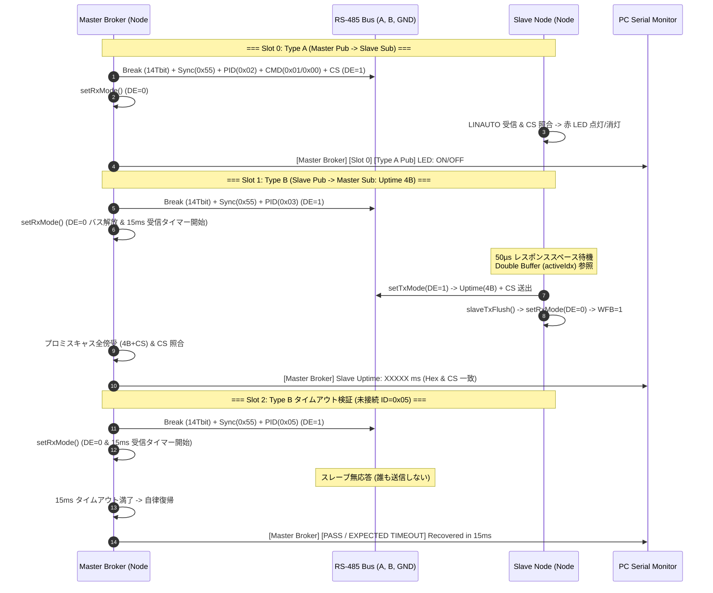

<!--
Copyright (c) 2026 ADX Project Contributors
SPDX-License-Identifier: CC-BY-4.0
-->

# ADX Core-D LN-485 Phase 4 テスト実施手順書 (`TC-P4`)
(Type B [Slave Pub → Master Sub] 実証 ＆ Master Broker MVP 完成検証)

本ドキュメントは、**ADX Core-D**（MCU: ATtiny1616, RS-485 トランシーバー: SP485EEN）における **LN-485 Phase 4 (`TC-P4`)** の実機テスト手順、通信シーケンス、および合否判定基準（OK/NG Criteria）を定めた実施仕様書です。

---

## 1. テスト概要と目的

Phase 4 では、スレーブ側が **Publisher（送信側）** として動作し、マスターからの要求ヘッダに対して自律的に応答データを返信する **Type B 通信** の実証、および **Master Broker MVP（最小動作実用版）** の完成を検証します。

### 検証対象テストケース
1. **`TC-P4-01` (Slave Publisher 応答 ＆ ターンアラウンド制御)**:
   * スレーブが **Double Buffer Mailbox**（2面バッファ）に格納された稼働時間データ（4バイト）を、レスポンススペース（$50\sim 60\,\mu\text{s}$）を置いて `DE=1` で送出し、`slaveTxFlush()` 後に `DE=0` へ解放することを確認。
2. **`TC-P4-02` (Master Broker プロミスキャス傍受 ＆ タイムアウト管理 【★MVP完成】)**:
   * マスターがヘッダ送出直後に `DE=0`（RXモード）へ移行してスレーブ応答を全傍受・PC出力すること。
   * スレーブ無応答（未接続ノード ID=0x05、またはスレーブ電源断）時に、マスターが **15ms で安全にタイムアウト** してメインループを継続すること。
3. **`TC-P4-03` (双方向対話・統合巡回エコーバック)**:
   * 1.5秒周期で Slot 0（Type A: LED制御） $\rightarrow$ Slot 1（Type B: Uptime要求） $\rightarrow$ Slot 2（Type B: タイムアウト検証）を巡回し、バス上で破綻なく双方向通信が維持されることを確認。

---

## 2. 通信シーケンス図



---

## 3. 実機テスト環境とハードウェア接続

1. **実機 2 台の ADX Core-D 構成**:
   * **Node #1 (Master Broker)**: `ROLE_MASTER` 有効化ビルド
   * **Node #2 (Slave Node)**: `ROLE_MASTER` コメントアウトビルド
2. **RS-485 結線**:
   * 3P 端子台（A, B, GND）ストレート結線（配線長 約 20cm）
3. **PC モニタ接続**:
   * Master 機の `PB4` (TX) / `PB5` (RX) を USB-UART 変換器経由で PC へ接続（9600 bps）。
   * （任意）Slave 機の `PB4` (TX) も別の USB-UART 変換器に接続してスレーブログを同時監視。

---

## 4. テスト実施手順 (Step-by-Step)

### Step 1: スレーブ機 (Node #2) の準備
1. [`tc-p4_master_broker_slave_pub.ino`](./tc-p4_master_broker_slave_pub.ino) の 21 行目 `#define ROLE_MASTER` を**コメントアウト**する。
   ```cpp
   //#define ROLE_MASTER
   ```
2. Arduino IDE から SerialUPDI 経由で Node #2 へ書き込む。
3. 書き込み完了後、スレーブのシリアルモニタを開く（9600 bps）。
   * `[Ready] LINAUTO + Double Buffer Mailbox active` の起動ログを確認。

### Step 2: マスター機 (Node #1) の準備
1. [`tc-p4_master_broker_slave_pub.ino`](./tc-p4_master_broker_slave_pub.ino) の 21 行目 `#define ROLE_MASTER` を**有効化**する。
   ```cpp
   #define ROLE_MASTER
   ```
2. Arduino IDE から SerialUPDI 経由で Node #1 へ書き込む。
3. マスターのシリアルモニタを開く（9600 bps）。

### Step 3: 定常通信の確認 (`TC-P4-01`, `TC-P4-03`)
1. マスター機が 1.5 秒周期で Slot 0 $\rightarrow$ Slot 1 $\rightarrow$ Slot 2 を巡回開始することを確認。
2. **Slot 0**: スレーブの赤色 LED（PB2）が 1.5秒ごとに 点灯 $\rightarrow$ 消灯 を繰り返すことを確認。
3. **Slot 1**: マスターのシリアルモニタに、スレーブから返信された稼働時間（`Slave Uptime: XXXXX ms`）がリアルタイムに表示され、白色 LED（PB3）が一瞬点灯することを確認。
4. **Slot 2**: 未接続ノード ID=0x05 に対し、`[PASS / EXPECTED TIMEOUT] Master Broker recovered safely in 15ms` が表示され、マスターのメインループが停止しないことを確認。

### Step 4: スレーブ電源断テスト (`TC-P4-02`)
1. スレーブ機（Node #2）の電源（USB）を一時的に抜く。
2. マスター側のログを確認：
   * Slot 1（ID=0x03）において、マスターが停止（フリーズ）することなく、`[TIMEOUT / NO RESPONSE (15ms)]` を出力して次のスロットへ安全に遷移し続けることを確認。
3. スレーブ機の電源を再投入し、即座に通信が自動再開（Uptime が再び受信表示）されることを確認。

---

## 5. 期待されるシリアルモニタ出力

### マスター側 (Node #1 / PCモニタ: 9600 bps)
```txt
==================================================
=== ADX Core-D LN-485 Master Broker MVP (TC-P4)===
==================================================
[Ready] Scheduler started (Cycle: 1.5s)
--------------------------------------------------
[Master Broker] [Slot 0] [Type A Pub] PID=0xC2 (ID=0x02) CMD=0x01 (LED: ON)
[Master Broker] [Slot 1] [Type B Poll] PID=0x03 (ID=0x03: Slave Uptime Request) -> Promiscuous RX
  --> [RECV PROMISCUOUS OK] Slave Uptime: 3042 ms (Hex: [E2 0B 00 00 ] CS: 0x12)
[Master Broker] [Slot 2] [Type B Poll - Unconnected Node] PID=0x05 (ID=0x05: Timeout Test)
  --> [PASS / EXPECTED TIMEOUT] Master Broker recovered safely in 15ms.

[Master Broker] [Slot 0] [Type A Pub] PID=0xC2 (ID=0x02) CMD=0x00 (LED: OFF)
[Master Broker] [Slot 1] [Type B Poll] PID=0x03 (ID=0x03: Slave Uptime Request) -> Promiscuous RX
  --> [RECV PROMISCUOUS OK] Slave Uptime: 4545 ms (Hex: [C1 11 00 00 ] CS: 0x2D)
[Master Broker] [Slot 2] [Type B Poll - Unconnected Node] PID=0x05 (ID=0x05: Timeout Test)
  --> [PASS / EXPECTED TIMEOUT] Master Broker recovered safely in 15ms.
```

### スレーブ側 (Node #2 / PCモニタ: 9600 bps)
```txt
==================================================
=== ADX Core-D LN-485 Slave Node (TC-P4)       ===
==================================================
[Ready] LINAUTO + Double Buffer Mailbox active
--------------------------------------------------
[Slave Sub Recv OK] Type A (ID=0x02) LED: ON
[Slave Pub Sent] Type B (ID=0x03) Uptime: 3040 ms, CS: 0x12
[Slave Sub Recv OK] Type A (ID=0x02) LED: OFF
[Slave Pub Sent] Type B (ID=0x03) Uptime: 4540 ms, CS: 0x2D
```

---

## 6. 合否判定基準 (OK / NG Criteria)

| テストID | 検証項目 | 合格 (PASS / OK) | 不合格 (FAIL / NG) |
| :---: | :--- | :--- | :--- |
| **`TC-P4-01`** | **Slave Publisher 応答 ＆ ターンアラウンド** | スレーブが自担当 PID（ID=0x03）を受信後、$50\sim 60\,\mu\text{s}$ で `DE=1` となり、Double Buffer Mailbox から 4バイト稼働時間 ＋ CS を欠落なく送信し、送信完了後に `DE=0` へ正常復帰する。 | バス上で衝突（ショート）が発生する、または送信完了前に DE が遮断され末尾バイトが破損する。 |
| **`TC-P4-02`** | **Master Broker タイムアウト ＆ 自律復帰** | スレーブ電源断または未接続 PID（ID=0x05）要求時、マスターが約 15ms でタイムアウトを検知し、メインループが一切フリーズすることなく次周期へ継続遷移する。 | スレーブ無応答時にマスターが永久待機（ブロッキング）して停止する。 |
| **`TC-P4-03`** | **双方向対話・統合巡回エコーバック** | Slot 0（Type A LED制御）と Slot 1（Type B Uptime収集）が 1.5秒周期で連続的に破綻なく循環動作する。 | 通信が途中で途絶する、またはチェックサムエラーが多発する。 |
