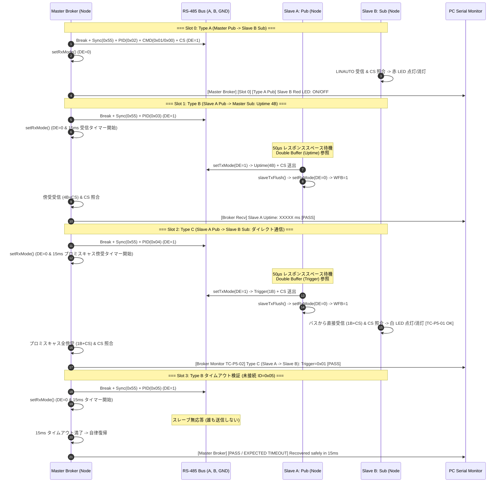

<!--
Copyright (c) 2026 ADX Project Contributors
SPDX-License-Identifier: CC-BY-4.0
-->

# ADX Core-D LN-485 Phase 5 テスト実施手順書 (`TC-P5`)
(Type C [Slave A Pub → Slave B Sub] スレーブ間直接通信実証 ＆ LN-485 UP/CS 完成検証)

本ドキュメントは、**ADX Core-D**（MCU: ATtiny1616, RS-485 トランシーバー: SP485EEN）における **LN-485 Phase 5 (`TC-P5`)** の実機テスト手順、通信シーケンス、および合否判定基準（OK/NG Criteria）を定めた実施仕様書です。

---

## 1. テスト概要と目的

Phase 5 では、Master Broker が場作り（ヘッダ送出）のみを行い、データ本体は **Slave A（Publisher）から Slave B（Subscriber）へマスター非介在で直接送受信される Type C 通信** の実証、および **Master Broker によるプロミスキャス傍受モニタリング** を検証します。

### 検証対象テストケース
1. **`TC-P5-01` (Type C スレーブ間ダイレクト通信)**:
   * Master Broker が ID=0x04（Type C）ヘッダを送出した際、Slave A が Double Buffer Mailbox から内部タイマーで自律生成された状態データ（`0x01` / `0x00` トグル、外部スイッチ不要）をパブリッシュ。
   * Slave B がマスターの CPU/メモリを介さずにバスから直接データを受信し、白 LED（PB3）を即座に連動制御することを確認。
2. **`TC-P5-02` (Master Broker プロミスキャス傍受 ＆ 分散トラフィック監視)**:
   * Slave A $\rightarrow$ Slave B の直接通信中、Master Broker が `DE=0`（受信モード）でバス上の全バイトを傍受・CS 照合。
   * PC シリアルモニタに `[Broker Monitor TC-P5-02] Type C (Slave A -> Slave B): Trigger=0x01 CS=0xXX [PASS]` と正確に出力されることを確認。

---

## 2. 通信シーケンス図



---

## 3. 実機テスト環境とハードウェア接続

### 3.1 3台構成（フル分散ネットワーク結線）
3台の ADX Core-D をデイジーチェーン接続します（短距離配線のため終端抵抗は全ボードOFFで実施）。

```text
  [ Node #1: Master ] ────────── [ Node #3: Slave B ] ────────── [ Node #2: Slave A ]
     (Master Broker)               (Subscriber)                   (Publisher)
   ★ 終端抵抗: OFF (無効)          ★ 終端抵抗: OFF (無効)         ★ 終端抵抗: OFF (無効)
           │                              │                              │
     SoftwareSerial                 SoftwareSerial                 SoftwareSerial
      (USB-UART #1)                  (USB-UART #3)                  (USB-UART #2)
           │                              │                              │
           └──────────────────────────────┴──────────────────────────────┘
                                          │
                                 PC シリアルモニタ 3画面同時監視
```

1. **ノード構成と役割**:
   * **Node #1 (Master Broker)**: `ROLE_MASTER` 有効化ビルド / **終端抵抗 OFF**
   * **Node #2 (Slave A: Unique Publisher)**: `ROLE_SLAVE_A` 有効化ビルド / **終端抵抗 OFF**
   * **Node #3 (Slave B: Common Subscriber)**: `ROLE_SLAVE_B` 有効化ビルド / **終端抵抗 OFF**
2. **RS-485 デイジーチェーン結線**:
   * 3 台の ADX Core-D の 3P 端子台（A, B, GND）を直線状に接続（Master $\leftrightarrow$ Slave B $\leftrightarrow$ Slave A）。
3. **PC 3系統シリアルモニタ接続**:
   * **Master (Node #1)**: `PB4` (TX) / `PB5` (RX) $\rightarrow$ USB-UART #1 (9600 bps)
   * **Slave A (Node #2)**: `PB4` (TX) / `PB5` (RX) $\rightarrow$ USB-UART #2 (9600 bps)
   * **Slave B (Node #3)**: `PB4` (TX) / `PB5` (RX) $\rightarrow$ USB-UART #3 (9600 bps)

---

## 4. テスト実施手順 (Step-by-Step)

### Step 1: Slave B (Node #3: Subscriber) の書き込み
1. [`tc-p5_slave_direct_comm.ino`](./tc-p5_slave_direct_comm.ino) の冒頭設定を変更:
   ```cpp
   //#define ROLE_MASTER
   //#define ROLE_SLAVE_A
   #define ROLE_SLAVE_B
   ```
2. Arduino IDE から SerialUPDI 経由で Node #3 へ書き込む。
3. シリアルモニタ（9600 bps）で `[Ready] LINAUTO Subscriber Active` を確認。

### Step 2: Slave A (Node #2: Publisher) の書き込み
1. [`tc-p5_slave_direct_comm.ino`](./tc-p5_slave_direct_comm.ino) の冒頭設定を変更:
   ```cpp
   //#define ROLE_MASTER
   #define ROLE_SLAVE_A
   //#define ROLE_SLAVE_B
   ```
2. Arduino IDE から SerialUPDI 経由で Node #2 へ書き込む。
3. シリアルモニタ（9600 bps）で `[Ready] LINAUTO + Double Buffer Mailbox Active` を確認。

### Step 3: Master Broker (Node #1) の書き込み
1. [`tc-p5_slave_direct_comm.ino`](./tc-p5_slave_direct_comm.ino) の冒頭設定を変更:
   ```cpp
   #define ROLE_MASTER
   //#define ROLE_SLAVE_A
   //#define ROLE_SLAVE_B
   ```
2. Arduino IDE から SerialUPDI 経由で Node #1 へ書き込む。
3. シリアルモニタ（9600 bps）を開く。

---

## 5. 合否判定手順 (Verification & Pass/Fail Criteria)

### 1. `TC-P5-01` (Type C スレーブ間ダイレクト通信) の判定
* **観察ポイント**:
  * Master Broker が Slot 2（ID=0x04）を実行した瞬間、**Slave A の白 LED（送信中）が一瞬点灯** すると同時に、**Slave B の白 LED（PB3）が 点灯 $\longleftrightarrow$ 消灯 とトグル連動** することを確認。
  * Slave B のシリアルログに `[Slave B Sub Recv OK TC-P5-01] Type C (ID=0x04) Slave A Direct -> White LED: ON/OFF` が出力されることを確認。
* **合否基準**:
  * **【 PASS 】**: Master Broker の中継処理なしで、Slave A のパブリッシュデータに応じて Slave B の白 LED が即座かつ確実に連動する。
  * **【 FAIL 】**: Slave B がデータを受信できない、または LED が連動しない。

### 2. `TC-P5-02` (Master Broker プロミスキャス傍受 ＆ 分散トラフィック監視) の判定
* **観察ポイント**:
  * Master Broker のシリアルモニタを確認。
  * Slot 2 実行時に、Slave A $\rightarrow$ Slave B の通信が傍受され、以下のようなログが出力されることを確認。
    ```text
    [Master Broker] [Slot 2] [Type C Header] PID=0x84 (ID=0x04) -> Broadcasting Header for Slave A -> Slave B...
      --> [Broker Monitor TC-P5-02] Type C (Slave A -> Slave B): Trigger=0x01 (Slave B White LED: ON) CS=0xFE [PASS - Direct Comm Intercepted]
    ```
* **合否基準**:
  * **【 PASS 】**: Master Broker がバス上の Type C パケットを 100% 傍受し、チェックサム照合とともに正確なトラフィックログを出力する。
  * **【 FAIL 】**: 傍受データが文字化けする、タイムアウトする、またはマスター側でバスエラーが発生する。
