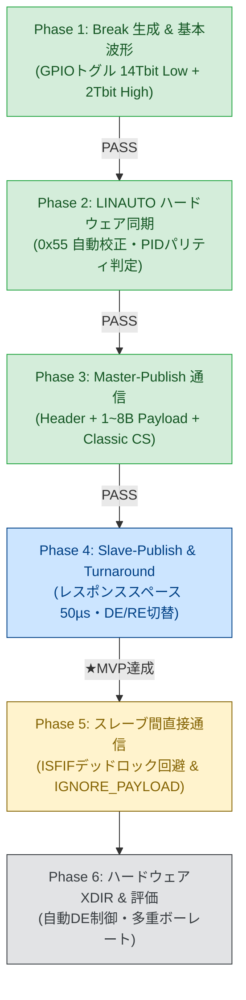

<!--
Copyright (c) 2026 ADX Project Contributors
SPDX-License-Identifier: CC-BY-4.0
-->

# LN-485（LIN-based RS-485）開発履歴・関連資料・技術資産総まとめ

本ドキュメントは、**ADX Core-D**（MCU: Microchip ATtiny1616, RS-485: SP485EEN）上で実施された **LN-485 (LIN-based RS-485)** 通信プロトコルの開発経緯、実機テスト履歴（Phase 1 〜 Phase 5）、確立されたハードウェア制御ノウハウ、および関連ドキュメント群のインデックスを網羅した総合資料です。

---

## 1. 関連ドキュメント体系（インデックス）

`firmware/tests/ADX_Core-D/LIN_test/` 配下の全ドキュメントの構成と役割です。

```text
LIN_test/
├── README.md                                 # 本書: 開発履歴・関連資料・技術資産総まとめ
├── Attiny1616_reference.md                   # ATtiny1616 USART/LINAUTO レジスタ仕様覚書
├── reference.md                              # LIN 2.x プロトコル規格・パリティ計算基礎資料
├── LN-485/                                   # 上位アーキテクチャ・設計パターン
│   ├── protocol_overview.md                  # LN-485 基本概要（Pub/Sub on RS-485）
│   ├── Master_broker.md                      # Master Broker（交通整理役）の役割定義
│   ├── Publish_Mailbox_Pattern.md            # Publish Mailbox 方式（アプリと通信の疎結合化）
│   └── double_buffer.md                      # Double Buffer（2面バッファ・Zero-Copy送信）
├── PLAN/                                     # 開発・テスト計画書
│   ├── README.md                             # 計画書ディレクトリ案内
│   ├── LN-485_TEST_SPECIFICATION.md          # 全19テストケース詳細仕様書兼実施記録
│   ├── PHASE4_DEVELOPMENT_PLAN.md            # Phase 4（Slave-Pub / ターンアラウンド）開発計画
│   └── PHASE5_DEVELOPMENT_PLAN.md            # Phase 5（スレーブ間ダイレクト通信）開発計画
├── REPORT/                                   # 技術調査・ロードマップ
│   ├── README.md                             # 調査レポートディレクトリ案内
│   ├── LN-485_TECHNICAL_INVESTIGATION_REPORT.md # 物理層・LINAUTO適合性技術調査書
│   └── LN-485_STEP_BY_STEP_TEST_PLAN.md      # 段階的テストロードマップ（Phase 1〜6）
└── Phase/                                    # フェーズ別テストスケッチ・実機検証ログ
    ├── README.md                             # Phase 実装一覧・環境案内
    ├── SKETCH_DEVELOPMENT_GUIDELINE.md       # スケッチ開発規約＆10大注意事項（必読）
    ├── TC-P1-01/                             # Phase 1: Break 送出・基本波形検証 [PASS]
    ├── TC-P1-02/                             # Phase 1: Break + 0x55 + PID 受信検証 [PASS]
    ├── TC-P2/                                # Phase 2: LINAUTO ハードウェア同期検証 [PASS]
    ├── TC-P3/                                # Phase 3: Master-Pub / Slave-Sub 通信 [PASS]
    ├── TC-P4/                                # Phase 4: Slave-Pub / Master Broker [PASS: MVP]
    └── TC-P5/                                # Phase 5: スレーブ間ダイレクト通信（知見蓄積）
```

---

## 2. 開発フェーズと実機検証履歴 (Test Milestones)

2台の ADX Core-D 実機（RS-485 半二重・SP485EEN）を用いて段階的な検証を実施し、**Phase 4（双方向対話 MVP）までの完全動作（PASS）** を実証しました。



### 各フェーズの検証サマリー

| フェーズ | テストID | 検証内容 | 実機判定 | 獲得した技術成果 |
| :--- | :--- | :--- | :---: | :--- |
| **Phase 1** | `TC-P1-01`<br>`TC-P1-02` | Break 生成・基本 UART 受信 | **PASS** | ・GPIO 出力切り替えによる Break（14 Tbit LOW）＋ Delimiter（2 Tbit HIGH）波形生成。<br>・通常 UART スレーブによる Break / `0x55` / PID の正常受信。 |
| **Phase 2** | `TC-P2-01`<br>〜 `05` | スレーブ LINAUTO ハードウェア同期 | **PASS** | ・`USART0.CTRLB` の `LINAUTO` による `0x55` 自動ボーレート補正の実証。<br>・`RXDATAH.DATA` および `PERR`（パリティエラー）による PID 自動検証。<br>・不正 Sync（`0xAA`）時の `ISFIF` 検知と安全リカバリ。 |
| **Phase 3** | `TC-P3-01`<br>〜 `03` | Master-Pub / Slave-Sub 通信 | **PASS** | ・マスターの定周期ポーリングと Type A ペイロード送信。<br>・スレーブ側での Classic Checksum 検証と LED コマンド制御。<br>・破損チェックサムパケットの即時破棄。 |
| **Phase 4** | `TC-P4-01`<br>〜 `03` | Slave-Pub 応答 ＆ 双方向対話 | **PASS**<br>**(★MVP)** | ・スレーブ担当 PID 受信後のレスポンススペース（$50\sim 100\,\mu\text{s}$）確保。<br>・`setTxMode()` / `setRxMode()` および `slaveTxFlush()` による DE/RE 切り替え。<br>・PC ⇔ Master Broker ⇔ Slave 間の一連の双方向エコーバック成立。 |
| **Phase 5** | `TC-P5-01`<br>`TC-P5-02` | スレーブ間ダイレクト通信 | **知見蓄積** | ・他ノード宛てペイロード受信時の `STATE_IGNORE_PAYLOAD` 遷移の必要性を解明。<br>・`ISFIF` 監視位置を `while(RXCIF)` の外側へ配置するデッドロック防止策を確立。 |

---

## 3. 確立されたハードウェア制御ノウハウ（10大注意事項）

LN-485 の実機検証を通して解明された、ATtiny1616 および RS-485 制御の**重要鉄則**です（詳細は [`SKETCH_DEVELOPMENT_GUIDELINE.md`](./Phase/SKETCH_DEVELOPMENT_GUIDELINE.md) を参照）。

```text
========================================================================================
                     ATtiny1616 & RS-485 制御 10大ルール
========================================================================================
 1. 受信レジスタ読み出し順序
    - 必ず先に RXDATAH を読み、次に RXDATAL を読む（逆順は FIFO ポインタが破壊）
 2. STATUS レジスタ操作の |= 禁止
    - USART0.STATUS = USART_WFB_bm | USART_ISFIF_bm | USART_BDF_bm; （直接代入で一括クリア）
 3. 同期エラー (ISFIF) の直接復帰
    - エラー検知時は WFB=1 を再アームし、同時に ISFIF/BDF をクリア
 4. マスター Break 送出手順
    - TXディスエーブル -> PA1 LOW (14 Tbit) -> PA1 HIGH (2 Tbit) -> TX再イネーブル
 5. 半二重ターンアラウンド & レスポンススペース
    - 送信完了時は slaveTxFlush() (TXCIF待機) を実行してから DE=0 に戻す
    - スレーブ応答開始前には 50~100µs のレスポンススペースを確保
 6. スレーブ側 Serial.begin() の完全排除
    - Arduino コアの RX 割り込みによる RXCIF 横取りを防ぐため、PORTMUX/レジスタ直接制御へ統一
 7. 8ビットモード FIFO 高速読み出し
    - rxHigh & 0x01 は 8bit モード時常に 0 のため、ステートマシンでバイト数を管理
 8. Double Buffer Mailbox によるアプリと通信の疎結合化
    - loop() 側のデータ生成と通信側の Zero-Copy 送信を 2面バッファで完全分離
 9. ISFIF デッドロック防止
    - ISFIF 監視・復帰は必ず while (STATUS & RXCIF) の【外側（手前）】で常時実行
 10. 他ノード宛てメッセージ受信時のペイロード通過待機 (STATE_IGNORE_PAYLOAD)
    - 他ノード宛てパケット通過中に WFB=1 をセットすると ISFIF 自爆するため、タイムアウト待機後に再アーム
========================================================================================
```

---

## 4. 確立されたソフトウェア・アーキテクチャ資産

### 4.1 Publish Mailbox Pattern（パブリッシュ・メールボックス方式）
* **課題:** スレーブのメイン処理（`loop()` でのセンサ読み取りやモータ制御）が重い場合、ポーリング要求に対して $50\,\mu\text{s}$ のレスポンススペース内に応答できない。
* **解決策:** メモリ上にトピック別のメールボックス（`Mailbox`）を配置。アプリ層は最新データを投函するだけで即座に制御へ戻り、通信層はポーリング検知時にメールボックスのデータをゼロウェイトで送出。

### 4.2 Double Buffer Pattern（2面バッファ・Zero-Copy送信）
* **課題:** アプリ層の書き込み中に通信層が送信を開始するとデータが破損（Torn Read）する。
* **解決策:** `activeIdx`（表: 通信層参照）と `nextIdx = activeIdx ^ 1`（裏: アプリ層書込）の2面バッファを用意。アプリ層は裏面へ書き込みとチェックサム計算を完了した後、ポインタをアトミックに切り替える。

---

## 5. 次期プロトコル（DROP-Bus）への継承と進化

LN-485 で確立された知見・ドライバコードは、自律分散型プロトコル **DROP-Bus** へ以下のように引き継がれ、発展します。

```text
[LN-485 の確立資産]                           [DROP-Bus への進化]
・PORTMUX / USART0 LINAUTO レジスタ設定 ───> そのまま継承（完全水晶レス動作）
・14 Tbit Break + 0x55 ヘッダ送出 ─────────> 全ノードが一体型フレームとして送出
・DE/RE 半二重方向制御 & slaveTxFlush ─────> そのまま継承（高速ターンアラウンド）
・Double Buffer Mailbox ────────────────────> そのまま継承（アプリとバトンリレーの分離）
・Master による集中ポーリング ────────────> 自律分散バトンリレー (TARGET_ID == MY_ID)
・マスタースキップ・再送 ──────────────────> パッシブ・フェイルセーフ (TCB0 タイマー心中)
・1〜8B ペイロード + Classic CS ───────────> 最大64B 可変長 + CRC-16-CCITT
```
