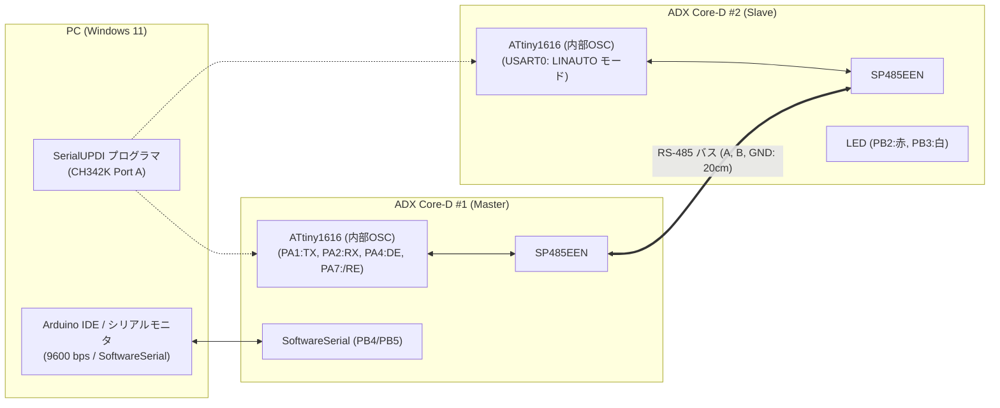
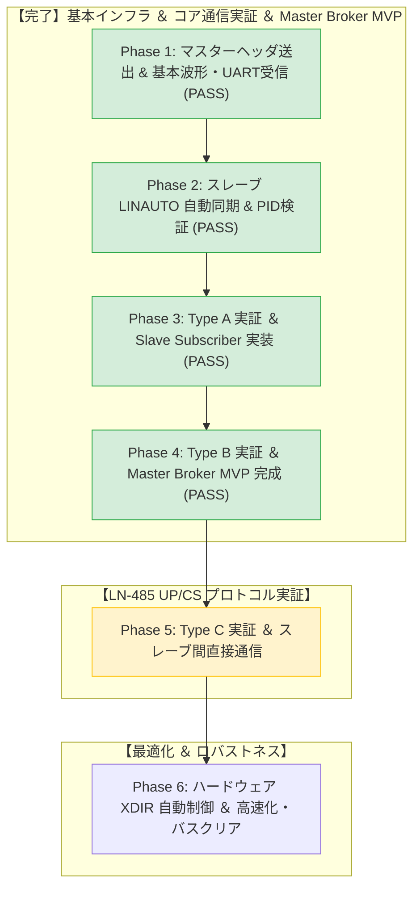

<!--
Copyright (c) 2026 ADX Project Contributors
SPDX-License-Identifier: CC-BY-4.0
-->

# ADX Core-D LN-485 段階的テスト計画書 (Step-by-Step Test Plan)

本ドキュメントは、**ADX Core-D**（MCU: ATtiny1616, RS-485 トランシーバー: SP485EEN）における独自通信規格 **LN-485 (LIN-based RS-485)** の実機検証を、確実かつ安全に進めるための段階的テスト計画書（ロードマップ）です。

各テストケースごとの詳細な実行手順（Action）および合否判定基準（OK / NG Criteria）については、[**詳細テスト仕様書 (`../PLAN/LN-485_TEST_SPECIFICATION.md`)**](../PLAN/LN-485_TEST_SPECIFICATION.md) を参照してください。

---

## 1. テスト計画の基本方針

### 1.1 なぜ段階的（Phased）アプローチが必須なのか？

LN-485 は、**「マイコンの低レベルレジスタ制御（LINスレーブエンジン）」** と **「半二重RS-485トランシーバーの物理層制御（DE/RE切替）」** が密接に連動する複合システムです。

もし最初から完全な双方向プロトコルを一括実装した場合、通信失敗時に以下のいずれが原因であるかの切り分けが極めて困難になります。
* マスターのブレーク信号波形不正（幅不足 / レベル異常）
* スレーブのボーレート自動測定（Sync 0x55）の計算失敗
* レジスタ読み出し順序の違反（`RXDATAH` より先に `RXDATAL` を読んだことによるフラグ喪失）
* RS-485 トランシーバーの切り替えタイミング衝突（Turnaround Time 不足）
* 送信バッファフラッシュ（`Serial.flush()`）の待機抜けによる末尾データの欠落

そのため、本計画では **「1つの検証要素を確定させてから次の段階に進む」 6段階のフェーズ** を定義します。

### 1.2 コア方針の確定事項
1. **マスター Break 送出方式**:
   * **「GPIO トグル法」を標準方式として採用** します。ボーレートレジスタを書き換えずに、14 Tbit LOW ＋ 1 Tbit HIGH（デリミタ）をマイクロ秒単位で正確に出力します。
2. **テスト基準クロック源**:
   * 机上配線長 20cm での初期〜プロトコル確立（Phase 1 〜 Phase 4）は、**内蔵オシレータ（20MHz/16MHz Internal OSC）を標準** とします。LIN の核心である「Auto-baud による内蔵オシレータ誤差の自己補正性能」をストレートに検証します。
   * 12MHz 外部水晶発振器（TFOM12M4RHKCNT2T）は、Phase 5（高速・耐性評価）においてジッター・同期マージンの比較評価として活用します。

---

## 2. 実機テスト環境・接続構成

先行の [`RS-485_test`](../../RS-485_test/) と同一のハードウェア構成を使用します。



* **接続:** 3P端子台（A, B, GND）ストレート結線（配線長 約20cm）
* **ジャンパ設定:**
  * `H4`（終端抵抗 100Ω）: オープン（無効）
  * `H2`（DE/RE制御）: 独立制御（PA4=DE, PA7=\RE）
  * `H3`（クロック）: 内部OSC（Phase 5 で 12MHz 外部水晶を比較検証）

---

## 3. 6段階テストロードマップ概要



| フェーズ | 対象範囲 | 開発対象 (Master / Slave) ＆ 主要テストケース | 合否判定の要点 |
| :--- | :--- | :--- | :--- |
| **Phase 1** | 基本ヘッダ送出 ＆ 物理層 | Master: GPIO Break (14 Tbit) + Sync/PID<br>Slave: 標準 UART 受信 (`TC-P1-01` 〜 `03`) | 14 Tbit LOW 波形および Sync/PID の UART 受信（**PASS**） |
| **Phase 2** | スレーブ LINAUTO ハードウェア同期 | Slave: LINAUTO モード、Auto-baud、PID パリティ (`TC-P2-01` 〜 `05`) | `STATUS.BDF`、`BAUD` 自動更新、`RXDATAH.DATA==0`、パリティ検知（**PASS**） |
| **Phase 3** | Type A 実証 ＆ Slave Subscriber 実装 | Master: ミニマム・スケジューラ ＋ Type A ペイロード送信<br>Slave: Subscriber 受信バッファ ＆ CS照合 (`TC-P3-01` 〜 `03`) | ペイロード ＋ Classic Checksum 一致とスレーブ LED 制御・破損CS破棄（**PASS**） |
| **Phase 4** | Type B 実証 ＆ Master Broker MVP 完成 | Master: プロミスキャス傍受 ＆ タイムアウト（**★MVP完成**）<br>Slave: Double Buffer ＋ Publisher 応答 ＆ DE 制御 (`TC-P4-01` 〜 `03`) | バス権切り替え（DE制御）と PC ⇔ Master Broker ⇔ Slave エコーバック（**PASS / ★MVP完成**） |
| **Phase 5** | Type C 実証 (スレーブ間直接通信) | Master: Broker 場作り巡回 ＆ バス全傍受ログ<br>Slave A: Publisher / Slave B: Subscriber (`TC-P5-01` 〜 `02`) | マスター非介在での Slave A $\rightarrow$ Slave B ダイレクト制御 |
| **Phase 6** | ハードウェア XDIR ＆ 最適化 | Master & Slave: `CTRLA.RS485` 自動制御、多重ボーレート、バスクリア (`TC-P6-01` 〜 `03`) | ソフトウェア遅延なしの XDIR 自動制御、高速 115.2 kbps 安定通信 |


---

## 4. テストファームウェアの設計アーキテクチャ

先行の `RS-485_test` と同様、1つの `.ino` ファイル内で `#define ROLE_MASTER` の有無によりマスター機とスレーブ機を切り替える構成とします。

```cpp
// =============================================================================
// ADX Core-D LN-485 Test Firmware
// =============================================================================
#include <Arduino.h>
#include <SoftwareSerial.h>

// 役割設定：マスター機ビルド時は有効化、スレーブ機ビルド時はコメントアウト
#define ROLE_MASTER

// ピン定義
const int PIN_TXD = PIN_PA1;
const int PIN_RXD = PIN_PA2;
const int PIN_DE  = PIN_PA4;
const int PIN_RE  = PIN_PA7;
const int LED_R   = PIN_PB2;
const int LED_W   = PIN_PB3;

#ifdef ROLE_MASTER
SoftwareSerial pcSerial(PIN_PB5, PIN_PB4); // PCデバッグ用 (RX:PB5, TX:PB4)
#endif

// 1ビット時間 (µs)
#define BIT_TIME_US(baud)  (1000000UL / (baud))

// --- LIN ヘッダ生成・パリティ計算ヘルパー ---
uint8_t calculatePID(uint8_t id) {
  uint8_t p0 = ((id >> 0) ^ (id >> 1) ^ (id >> 2) ^ (id >> 4)) & 0x01;
  uint8_t p1 = !(((id >> 1) ^ (id >> 3) ^ (id >> 4) ^ (id >> 5)) & 0x01);
  return (id & 0x3F) | (p0 << 6) | (p1 << 7);
}

// --- GPIO トグルによる Break 送出 ---
void sendLinBreak(uint32_t baud) {
  uint16_t tBit = BIT_TIME_US(baud);
  
  Serial.flush();
  USART0.CTRLB &= ~USART_TXEN_bm; // TX 一時無効化
  
  PORTA.DIRSET = PIN1_bm;
  PORTA.OUTCLR = PIN1_bm;          // Break: LOW (14 Tbit)
  delayMicroseconds(tBit * 14);
  
  PORTA.OUTSET = PIN1_bm;          // Delimiter: HIGH (1 Tbit)
  delayMicroseconds(tBit * 1);
  
  USART0.CTRLB |= USART_TXEN_bm;  // TX 再有効化
}

// --- 初期化 ---
void setup() {
  pinMode(PIN_DE, OUTPUT);
  pinMode(PIN_RE, OUTPUT);
  pinMode(LED_R, OUTPUT);
  pinMode(LED_W, OUTPUT);
  
  setRxMode(); // 初期状態は受信モード
  pcSerial.begin(9600);

#ifdef ROLE_MASTER
  // 【マスター側】 Arduino Serial オブジェクトを利用
  pinMode(PIN_RXD, INPUT);
  Serial.swap(1);
  Serial.begin(9600);

  pcSerial.println(F("=== ADX Core-D LN-485 Master Active ==="));
#else
  // 【スレーブ側】 割り込み競合を防ぐため Serial.begin() は使わずレジスタ直接設定
  PORTMUX.CTRLB |= PORTMUX_USART0_ALTERNATE_gc;
  PORTA.DIRSET = PIN1_bm; // PA1 (TX) = OUTPUT
  PORTA.DIRCLR = PIN2_bm; // PA2 (RX) = INPUT

  USART0.CTRLB &= ~(USART_RXEN_bm | USART_TXEN_bm);
  USART0.CTRLC = USART_CMODE_ASYNCHRONOUS_gc | USART_PMODE_DISABLED_gc | USART_CHSIZE_8BIT_gc;
  USART0.CTRLB = USART_RXMODE_LINAUTO_gc | USART_RXEN_bm | USART_TXEN_bm;
  USART0.BAUD  = (uint16_t)(64 * (F_CPU / (16 * 9600)));
  USART0.STATUS = USART_WFB_bm | USART_ISFIF_bm | USART_BDF_bm;

  pcSerial.println(F("=== ADX Core-D LN-485 Slave (LINAUTO) Active ==="));
#endif
}

void loop() {
  #ifdef ROLE_MASTER
    // マスター側処理 (Phase 1〜6 に応じたシーケンス)
  #else
    // スレーブ側処理 (LINAUTO 受信ステートマシン / レジスタポーリング)
    while (USART0.STATUS & USART_RXCIF_bm) {
      uint8_t rxHigh = USART0.RXDATAH; // ① 先にステータス取得
      uint8_t rxLow  = USART0.RXDATAL; // ② 次にデータ取得
      
      // 受信エラー・ステートマシン処理...
    }
  #endif
}
```

---

## 5. 推進チェックリスト

| フェーズ | 対象仕様書リンク | 開発対象 (Master / Slave) | 状態 | 判定 |
| :---: | :--- | :--- | :---: | :---: |
| **Phase 1** | [`TC-P1-01` 〜 `TC-P1-03`](../PLAN/LN-485_TEST_SPECIFICATION.md#phase-1-マスターヘッダ送出--基本波形uart受信検証) | Master: GPIO Break + Sync/PID<br>Slave: 標準 UART 受信 | 完了 | **PASS** |
| **Phase 2** | [`TC-P2-01` 〜 `TC-P2-05`](../PLAN/LN-485_TEST_SPECIFICATION.md#phase-2-スレーブ-linauto-ハードウェア自動同期--pid検証) | Slave: LINAUTO モード、Auto-baud、PID パリティ | 完了 | **PASS** |
| **Phase 3** | [`TC-P3-01` 〜 `TC-P3-03`](../PLAN/LN-485_TEST_SPECIFICATION.md#phase-3-type-a-master-pub--slave-sub-実証--slave-subscriber-実装) | Master: ミニマム・スケジューラ ＋ Type A 送信<br>Slave: Subscriber 受信バッファ ＆ CS照合 | 完了 | **PASS** |
| **Phase 4** | [`TC-P4-01` 〜 `TC-P4-03`](../PLAN/LN-485_TEST_SPECIFICATION.md#phase-4-type-b-slave-pub--master-sub-実証--master-broker-mvp-完成) | Master: プロミスキャス傍受 ＆ タイムアウト（**★MVP完成**）<br>Slave: Double Buffer ＋ Publisher 応答 ＆ DE 制御 | 完了 | **PASS** |
| **Phase 5** | [`TC-P5-01` 〜 `TC-P5-02`](../PLAN/LN-485_TEST_SPECIFICATION.md#phase-5-type-c-slave-a-pub--slave-b-sub-スレーブ間直接通信実証) | Master: Broker 場作り巡回 ＆ バス全傍受ログ<br>Slave A: Publisher / Slave B: Subscriber | 準備中 | - |
| **Phase 6** | [`TC-P6-01` 〜 `TC-P6-03`](../PLAN/LN-485_TEST_SPECIFICATION.md#phase-6-ハードウェア-xdir-自動方向制御--ロバストネス最適化) | Master & Slave: `CTRLA.RS485` 自動制御、多重ボーレート、バスクリア | 準備中 | - |

