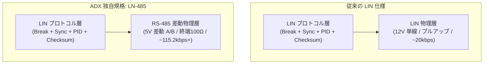
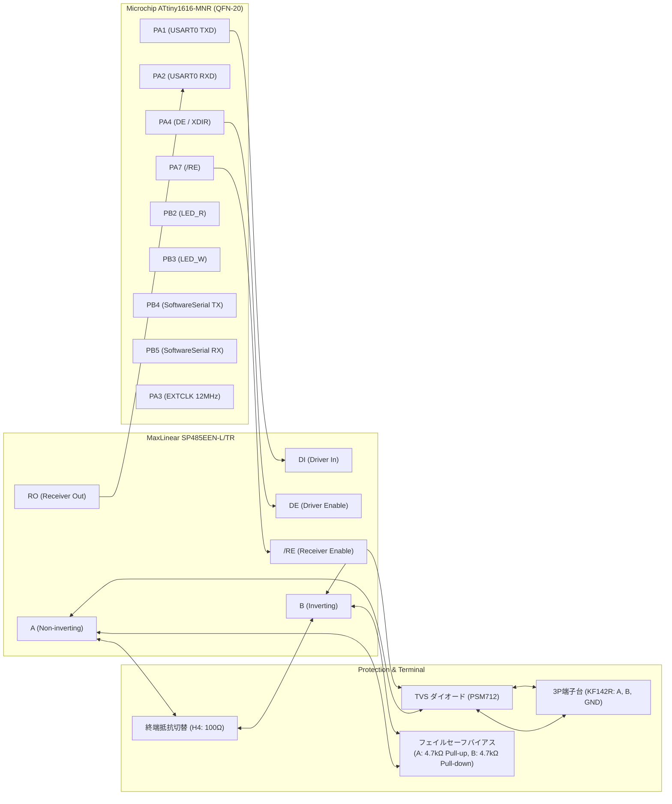
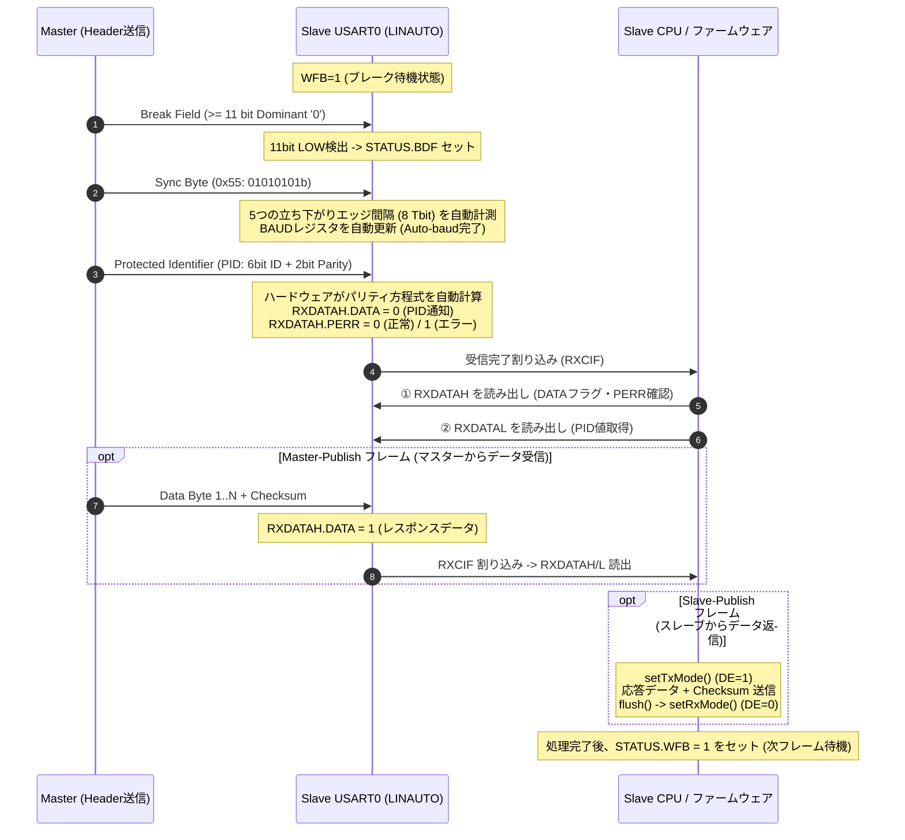

<!--
Copyright (c) 2026 ADX Project Contributors
SPDX-License-Identifier: CC-BY-4.0
-->

# ADX Core-D LN-485 (LIN-based RS-485) 技術調査レポート
(LN-485 Technical Investigation & Architecture Deep-Dive Report)

本ドキュメントは、ADX（Advanced Devices eXtended）プロジェクトにおける独自通信規格 **LN-485 (LIN-based RS-485)** の実現に向け、**ADX Core-D**（MCU: ATtiny1616, トランシーバー: SP485EEN）のハードウェア特性、ATtiny1616内蔵のLINスレーブエンジン、およびRS-485半二重差動伝送との整合性・課題を網羅的に調査・解析した技術レポートです。

---

## 1. LN-485 のコンセプトと設計背景

### 1.1 なぜ LIN over RS-485 (LN-485) なのか？

車載通信規格 **LIN (Local Interconnect Network)** は、極めて軽量かつ堅牢なマスター・スレーブ型シリアル通信プロトコルです。一方、標準的なLINは **12V 単線（オープンコレクタ＋プルアップ）物理層** で動作するため、長距離伝送や耐ノイズ性、高速伝送には限界があります。

ADXプロジェクトでは、LINの論理層（自動ボーレート同期、PIDパリティ保護、ヘッダ/レスポンス構造、決定論的衝突回避）の優れたアーキテクチャをそのまま活かし、物理層を産業用標準の **RS-485 差動伝送（5V 半二重）** に置き換えた **LN-485** を開発・標準化します。



### 1.2 規格比較とメリット

| 項目 | 標準 LIN 規格 (LIN 2.x) | 一般的な RS-485 (Modbus等) | **ADX 独自規格: LN-485** |
| :--- | :--- | :--- | :--- |
| **物理層** | 12V 単線（オープンコレクタ） | 5V 差動 2線（A/B 半二重） | **5V 差動 2線（SP485EEN 半二重）** |
| **ノイズ耐性** | 中（同相ノイズに脆弱） | **極めて高い（差動伝送）** | **極めて高い（差動伝送 + TVS保護）** |
| **最大通信速度** | 最大 19.2 kbps / 20 kbps | 最大 10 Mbps (IC依存) | **9600 bps 〜 115.2 kbps+ (柔軟)** |
| **ボーレート同期** | **ハードウェア Auto-baud (0x55)** | 固定ボーレート（要設定一致） | **ハードウェア Auto-baud (0x55 同期)** |
| **バス衝突回避** | 完全マスター主導（衝突なし） | プロトコル/アプリ依存 | **完全マスター主導（衝突なし）** |
| **スレーブ識別** | **PID（6-bit ID + 2-bit Parity）**| アドレスバイト（通常パリティ無）| **PID（自動パリティ計算・保護）** |
| **ブートローダ適性**| 高（クロック誤差を自己補正） | 中（内蔵RCの周波数ズレで化ける）| **最高（内蔵RCでも安全にUPDI/書込）** |

---

## 2. ADX Core-D のハードウェア構成と信号整合性

### 2.1 ハードウェア接続ブロック図

ADX Core-D における MCU（ATtiny1616-MNR）、RS-485 トランシーバー（SP485EEN-L/TR）、および周辺ピンの結線関係は以下の通りです。



### 2.2 フェイルセーフバイアスとバスアイドル電位の整合性

LINプロトコルにおいて、バスが休止している状態（アイドル）は **Recessive（Highレベル / マーク状態）** でなければなりません。

ADX Core-D の回路設計では：
* **Aライン**: $V_{DD}$ (5V) へ 4.7 kΩ でプルアップ
* **Bライン**: GND (0V) へ 4.7 kΩ でプルダウン

全ノードのドライバが無効（$DE = 0$）のとき、差動電圧は $V_A - V_B > +200\text{mV}$ となり、SP485EEN のレシーバ出力（RO / PA2）は確実に **HIGH（Recessive）** に固定されます。
これにより、**「全ノード受信待ち時に誤ってブレーク（LOW）が検出されることのない安全なアイドル電位」** が物理層レベルで完全に保証されています。

---

## 3. ATtiny1616 ハードウェア LIN スレーブエンジン詳細解析

ATtiny1616 の内蔵モジュール **USART0** は、LIN 規格（Break, Sync, PID, Response）に対応した専用のハードウェア LIN スレーブアクセラレータ（**LINAUTO モード**）を備えています。



### 3.1 ブレーク検出 (Break Detection)
* **条件:** 11ビット時間（11 Tbit）以上の連続した LOW レベルを検出すると、ハードウェアは有効なブレークと判定します。
* **フラグ:** ブレークと続くSyncキャラクタの受信に成功すると、`USART0.STATUS` の `BDF`（Break Detected Flag）がセットされます。

### 3.2 自動ボーレート補正 (Auto-baud Mechanism)
* **動作原理:** ブレーク直後に送られる **`0x55` (Syncキャラクタ)** の立ち下がりエッジから 8 ビット時間（8 Tbit）を内部高周波カウンタで計測します。
* **BAUD レジスタ更新:** 計測されたカウンタ値が自動的に 64 で除算（上位10ビットがクロック分周比、下位6ビットが分数ボーレート）され、`USART0.BAUD` レジスタへ直接上書きされます。
  * これにより、スレーブマイコンの内蔵オシレータに温度変化等による周波数誤差があっても、**マスタのクロック周波数に完全追従**します。
* **同期エラー検出 (`ISFIF`):** 受信バイトが `0x55` でない場合や、計測結果がボーレート許容限界を超過した場合は、`STATUS.ISFIF`（Inconsistent Sync Field Interrupt Flag）がセットされ、`BAUD` の更新は破棄されます。

### 3.3 PID とレスポンススペースの自動分離 (`DATA` フラグ)
LINAUTO モードでは、`USART0.RXDATAH` レジスタの最下位ビット `DATA`（Bit 0）がデータの種別を表します。
* **`DATA == 0`**: 現在受信バッファに入っているデータは **PID（保護識別子）** であることを示します。
* **`DATA == 1`**: 現在のデータは **レスポンススペース（データペイロードまたはチェックサム）** であることを示します。

### 3.4 自動パリティ計算 (`PERR`)
PID 受信時（`DATA == 0` のとき）、ハードウェアは以下の LIN 標準パリティ方程式を自動計算し、受信パリティビットと比較します。
$$P_0 = ID_0 \oplus ID_1 \oplus ID_2 \oplus ID_4$$
$$P_1 = \text{NOT}(ID_1 \oplus ID_3 \oplus ID_4 \oplus ID_5)$$
* パリティが不一致の場合、`USART0.RXDATAH` の `PERR`（Parity Error）フラグがセットされます。ソフトウェアはこれをチェックするだけで不正なフレームを瞬時に破棄できます。

### 3.5 【最重要】レジスタ読み出し順序のハードウェア制約
ATtiny1616 の USART 受信バッファは FIFO 構造となっており、高バイト（`RXDATAH`）のエラーフラグ（`PERR`, `FERR`, `BUFOVF`）および `DATA` ビットは、低バイト（`RXDATAL`）と連動しています。
> **⚠️ 厳格なルール:**
> **必ず先に `USART0.RXDATAH` を読み出してから、`USART0.RXDATAL` を読み出さなければなりません。**
> `RXDATAL` を先に読み出すと、FIFOのポインタが進んでしまい、対応するステータス・エラーフラグが消去されます。

---

## 4. RS-485 半二重化に伴う技術的課題と解決策

### 4.1 マスター側 LIN Break 送出方式の比較・確定

マスター側で「13ビット時間以上の連続LOW」を生成する方式として、以下の2種類を比較検討しました。

| 項目 | **【推奨・標準採用】GPIOトグル法** | ボーレート一時半減法 |
| :--- | :--- | :--- |
| **動作原理** | USART TXを一時無効化 $\rightarrow$ PA1 を GPIO LOW（14 Tbit）$\rightarrow$ HIGH（1 Tbit）$\rightarrow$ TX再有効化 | ボーレートを一時的に半分（例: 4800bps）に変更し `0x00` 送信 $\rightarrow$ 完了後 9600bps に復帰 |
| **時間制御精度** | **極めて高い（マイクロ秒単位で 13〜18 Tbit を任意制御可能）** | 中（ボーレート比率依存: 18 Tbit 固定） |
| **レジスタ安定性** | **安全（ボーレート設定レジスタの書き換えなし）** | 頻繁な `USART0.BAUD` 書き換えに伴う同期ズレのリスクあり |
| **コード明瞭性** | **極めてシンプル・直感的** | ボーレート再計算・フラッシュ処理が冗長 |
| **採用判定** | **LN-485 標準方式として採用** | 予備・参考方式 |

#### GPIOトグル法の実装コード
```cpp
// 1ビット時間 (µs)
#define BIT_TIME_US(baud)  (1000000UL / (baud))

void sendLinBreak(uint32_t baud) {
  uint16_t tBit = BIT_TIME_US(baud);
  
  // 1. 直前の送信完了を待機し、一時的にUSART TXを無効化
  Serial.flush();
  USART0.CTRLB &= ~USART_TXEN_bm; // TX無効化
  
  // 2. PA1 (TXD) を GPIO 出力として LOW (Break: 14 Tbit)
  PORTA.DIRSET = PIN1_bm;
  PORTA.OUTCLR = PIN1_bm;
  delayMicroseconds(tBit * 14);
  
  // 3. PA1 を HIGH (Break Delimiter: 1 Tbit)
  PORTA.OUTSET = PIN1_bm;
  delayMicroseconds(tBit * 1);
  
  // 4. USART TX を再有効化 (以降の 0x55, PID 送信に備える)
  USART0.CTRLB |= USART_TXEN_bm;
}
```

### 4.2 その他の半二重課題と解決策一覧

| 課題 | 内容 | 解決策 |
| :--- | :--- | :--- |
| **半二重バスの方向切り替え (Turnaround)** | 送信から受信への切り替えが早すぎるとデータ末尾が欠落し、遅すぎるとスレーブ応答と衝突する。 | 送信完了フラグ（`TXCIF` / `Serial.flush()`）の完全待機後に `DE=0` を実行。レスポンススペース（数ビット分）を確保。 |
| **スレーブ応答時の DE 制御** | スレーブが応答を返す際、PIDを受信してからDEをHIGHにし、送信後にLOWに戻して `WFB=1` を再設定する必要がある。 | スレーブ受信ループ内で、自ノード宛PID判定後に `setTxMode()` $\rightarrow$ 応答送信 $\rightarrow$ `flush()` $\rightarrow$ `setRxMode()` $\rightarrow$ `STATUS.WFB = 1` のシーケンスを確立。 |
| **ソフトウェア DE 制御のオーバーヘッド** | `digitalWrite()` や遅延関数による切り替えオーバーヘッドが高速通信時のボトルネックになる。 | **ATtiny1616 のハードウェア `XDIR` 機能**（`USART0.CTRLA.RS485`）を有効化し、ハードウェア自動方向制御へ移行（Phase 5）。 |

---

## 5. クロック源の選定と評価方針

ADX Core-D には、以下の2つのクロック源が存在します。

1. **内蔵高周波発振器 (OSC20M / 16MHz)**: 工場出荷時キャリブレーション済み（誤差約 ±2%）。
2. **外部高精度アクティブ水晶発振器 (12MHz TFOM12M4RHKCNT2T)**: 誤差 ±50 ppm 以下の超高精度クロック。

### 運用方針
* **Phase 1 〜 Phase 4（基本通信・プロトコル確立）**:
  * **内蔵クロック（20MHz / 16MHz Internal OSC）を標準** としてテストを実施します。
  * 配線長 20cm の机上テスト環境において、LIN の最大特長である「Auto-baud による内蔵オシレータ誤差の自己補正性能」をストレートに実証します。また、将来の小型 CARD や量産スレーブ基板（外部オシレータ省略基板）への設計適合性を担保します。
* **Phase 5（ロバストネス・高速化評価）**:
  * 115.2 kbps 等の超高速通信時やノイズ環境下において、内蔵クロックと外部12MHz水晶発振器の「周波数ジッターや同期マージンの比較評価」を実施します。
