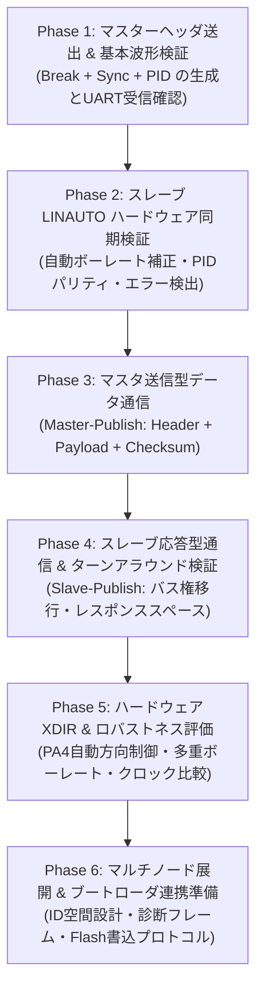

<!--
Copyright (c) 2026 ADX Project Contributors
SPDX-License-Identifier: CC-BY-4.0
-->

# ADX Core-D LN-485（LIN-based RS-485）テスト計画・技術調査レポート

本ディレクトリ（`firmware/tests/ADX_Core-D/LIN_test/REPORT/`）には、**ADX Core-D**（MCU: ATtiny1616, RS-485 トランシーバー: SP485EEN）における、LINプロトコルを応用した差動シリアル通信（独自規格 **LN-485**）の技術調査結果および段階的実機テスト計画をまとめています。

---

## 1. 背景と目的

ADXプロジェクトでは、マルチドロップ型の産業用Arduinoエコシステムを実現するため、ノード間通信および将来のファームウェア書き込み（ブートローダ）用バスとして **LN-485 (LIN-based RS-485)** を採用しています。

先行して実施された [`RS-485_test`](../../RS-485_test/) において、2台の ADX Core-D 間での基本的な RS-485 半二重通信（GPIO手動方向制御）の疎通確認（PASS）が完了しました。

次のステップとして、ATtiny1616 のハードウェア LIN スレーブ機能（**LINAUTO**, **自動ボーレート補正**, **PID自動パリティチェック**）を RS-485 差動トランシーバー経由で稼働させるための技術仕様を精査し、ハードウェア起因のトラブルを未然に防ぎながら安全かつ確実にテストを進めるための **6段階のテスト計画（Phase 1 〜 Phase 6）** を策定しました。

---

## 2. 関連ドキュメント構成

| **`REPORT/`** | [**`LN-485_TECHNICAL_INVESTIGATION_REPORT.md`**](./LN-485_TECHNICAL_INVESTIGATION_REPORT.md) | **LN-485 技術調査レポート** ・LIN論理層とRS-485差動物理層の対比と適合性 ・ATtiny1616 ハードウェアLINスレーブエンジン解析 ・GPIOトグルによるBreak送出仕様と内部クロック基準方針 ・半二重方向制御（DE/RE）とハードウェアXDIR自動制御 |
| **`REPORT/`** | [**`LN-485_STEP_BY_STEP_TEST_PLAN.md`**](./LN-485_STEP_BY_STEP_TEST_PLAN.md) | **段階的テスト計画書（ロードマップ）** ・なぜ段階的アプローチが必要なのか ・Phase 1 〜 Phase 6 の全体概要と設計アーキテクチャ ・単一スケッチ（Master/Slave両対応）によるテストコード設計案 |
| **`PLAN/`** | [**`LN-485_TEST_SPECIFICATION.md`**](../PLAN/LN-485_TEST_SPECIFICATION.md) | **詳細テスト仕様書兼実施計画書** ・全19テストケース（`TC-P1-01` 〜 `TC-P6-02`）の定義 ・各ケースの **【Action（実行手順）】** と **【OK/NG 判定基準】** ・実機テスト実施記録（Phase 1〜3 PASS反映済み） |
| **`Phase/`** | [**`Phase別テストファームウェア・結果`**](../Phase/) | **フェーズ別テストスケッチ・実施手順・実機検証結果** ・[`SKETCH_DEVELOPMENT_GUIDELINE.md`](../Phase/SKETCH_DEVELOPMENT_GUIDELINE.md)（開発規約） ・[`TC-P1-01/`](../Phase/TC-P1-01/), [`TC-P1-02/`](../Phase/TC-P1-02/)（Phase 1: PASS） ・[`TC-P2/`](../Phase/TC-P2/)（Phase 2: PASS） ・[`TC-P3/`](../Phase/TC-P3/)（Phase 3: PASS） |

---

## 3. 段階的テスト計画（ロードマップ要約）

ハードウェアレジスタ制御、自動同期、トランシーバー方向切り替えが複雑に絡み合うため、以下の6つのフェーズに分割してテストを進行します。

1. **Phase 1: マスターヘッダ生成 & 基本波形・UART受信検証**
   - マスター側での Break 信号生成（GPIOトグル法: 14 Tbit LOW + 1 Tbit HIGH）の確立
   - スレーブ（通常UART）による Break / Sync (`0x55`) / PID の受信確認
2. **Phase 2: スレーブ LINAUTO ハードウェア同期 & PIDパリティ検証**
   - スレーブ USART0 `LINAUTO` モードの初期化と `WFB`（Wait For Break）制御
   - `STATUS.BDF`、`USART0.BAUD` 自動補正値、`RXDATAH.DATA`、`PERR` の挙動検証
3. **Phase 3: マスター送信型（Master-Publish）データフレーム通信テスト**
   - ヘッダ + ペイロード（1〜8バイト） + チェックサム（Classic/Enhanced）の送受信
   - スレーブ側での LED 制御等によるデータ整合性の実機確認
4. **Phase 4: スレーブ応答型（Slave-Publish）双方向通信 & ターンアラウンド検証**
   - マスターからの要求ヘッダ送出後、スレーブが応答データを返信する双方向シーケンス
   - DE/RE 方向切り替えタイミング（Turnaround Time）およびレスポンススペースの最適化
5. **Phase 5: ハードウェア自動方向制御（XDIR）& ロバストネス評価**
   - ATtiny1616 の `USART0.CTRLA.RS485`（XDIR）による完全自動 DE 制御の実証
   - 複数ボーレート（9600 〜 115200 bps）、クロック源（内蔵 vs 12MHz外部発振器）での耐性テスト
6. **Phase 6: マルチノード展開 & ブートローダ連携準備**
   - 複数ノード（ADX Core-D / CARD）接続時のアドレス設計
   - LN-485 経由での UPDI / Flash 書込プロトコル（ブートローダ）実装に向けた仕様確定
