<!--
Copyright (c) 2026 ADX Project Contributors
SPDX-License-Identifier: CC-BY-4.0
-->

# PAL Network 開発計画書 (PAL Development Plan)

本ドキュメントは、**PAL (Polling Access Link) Network** のプロトコルスタック設計、ファームウェア実装、および実機検証フェーズ（PAL-P1 〜 PAL-P5）の全体開発計画を定義するものです。

先行の **LN-485 (Phase 1 〜 Phase 5)** で確立されたハードウェア層・物理層の実機検証成果（Proof of Concept）を引き継ぎ、[`PAL_whitepaper.md`](../PAL_whitepaper.md) に基づく分散制御向け Pub/Sub ネットワークプロトコルを体系的に構築します。

---

## 1. 開発の背景と目的

### 1.1 LN-485 から PAL への進化
* **LN-485 (第1期 PoC)**:
  * LIN のハードウェア同期（LINAUTO）と半二重 RS-485 トランシーバー（SP485EEN）を組み合わせ、低コスト MCU（ATtiny1616）上でスレーブ間直接通信（旧 Type C）が可能であることを物理・レジスタレベルで実証完了（全フェーズ PASS）。
* **PAL Network (第2期 本格開発)**:
  * LIN の制約（PID 6bit、固定フレーム長、Master-Slave 固有の概念）から脱却し、**「Topic」「UPT (Unique Publisher per Topic)」「CS (Common Subscriber)」「Bounded Slot スケジューリング」** を第一級オブジェクトとした統一 Pub/Sub ネットワークとして正式に規格化・実装します。

---

## 2. 参照すべき過去のドキュメント・資産一覧

本開発を進めるにあたり、必ず参照すべき既存の仕様書・知見ドキュメント・実機テスト結果は以下の通りです。

```mermaid
flowchart TD
    subgraph "仕様・設計原則"
        WP["【最重要】PAL Whitepaper<br/>(../PAL_whitepaper.md)"]
    end

    subgraph "ハードウェア知見・レジスタ制約"
        GUIDE["【必須遵守】LN-485 スケッチ開発ガイドライン<br/>(../../LIN_test/Phase/SKETCH_DEVELOPMENT_GUIDELINE.md)"]
        REF_MCU["ATtiny1616 レファレンス<br/>(../../LIN_test/Attiny1616_reference.md)"]
        REF_LIN["LIN / UART レファレンス<br/>(../../LIN_test/reference.md)"]
        RS485["RS-485 物理層実績<br/>(../../RS-485_test/README.md)"]
    end

    subgraph "実機検証コード・実績データ (PoC)"
        POC_LIST["LN-485 Phase 1〜5 実績一覧<br/>(../../LIN_test/Phase/README.md)"]
        P1["TC-P1: GPIO Break / 物理層波形<br/>(../../LIN_test/Phase/TC-P1-01/)"]
        P2["TC-P2: LINAUTO 自動同期 / PID<br/>(../../LIN_test/Phase/TC-P2/)"]
        P3["TC-P3: Master Pub → Slave Sub<br/>(../../LIN_test/Phase/TC-P3/)"]
        P4["TC-P4: Double Buffer / 50µs 応答<br/>(../../LIN_test/Phase/TC-P4/)"]
        P5["TC-P5: スレーブ間直接通信 (UP/CS)<br/>(../../LIN_test/Phase/TC-P5/)"]
    end

    WP --> PAL_DEV["PAL Network 実装・開発"]
    GUIDE --> PAL_DEV
    REF_MCU --> PAL_DEV
    P5 --> PAL_DEV
```



### 2.1 参照ドキュメント詳細リンク

1. **基本仕様書**:
   * [**`PAL_whitepaper.md`**](../PAL_whitepaper.md): PAL Network の基本骨子、Topic/UPT/CS 定義、スケジューリングモデル、決定論の原則。
2. **ハードウェア開発ガイドライン・必須注意事項**:
   * [**`SKETCH_DEVELOPMENT_GUIDELINE.md`**](../../LIN_test/Phase/SKETCH_DEVELOPMENT_GUIDELINE.md):
     * **`RXDATAH` $\rightarrow$ `RXDATAL` の厳格な読み出し順序**（注意事項 1）
     * **`STATUS` レジスタでの `|=` 禁止と `WFB` / `ISFIF` 一括直接代入**（注意事項 2, 3）
     * **50µs レスポンススペース・DE 送信フラッシュ待機（`TXCIF`）**（注意事項 5, 8）
     * **`Double Buffer Mailbox` によるゼロコピー送信**（注意事項 9）
3. **マイコン・ハードウェアレファレンス**:
   * [**`Attiny1616_reference.md`**](../../LIN_test/Attiny1616_reference.md): ATtiny1616 の `USART0`, `PORTMUX`, `CTRLA.RS485` (XDIR) 等のレジスタ仕様。
   * [**`reference.md`**](../../LIN_test/reference.md): LINAUTO 動作タイミング、ブレーク検出、パリティ計算式。
   * [**`RS-485_test/README.md`**](../../RS-485_test/README.md): SP485EEN トランシーバ制御ピン（PA4:DE, PA7:/RE）、バイアス・終端抵抗実績。
4. **先行 PoC 実機テスト実績（動く基準器）**:
   * [**`LIN_test/Phase/README.md`**](../../LIN_test/Phase/README.md): TC-P1 〜 TC-P5 の全結果概要。
   * [**`TC-P5/tc-p5_slave_direct_comm.ino`**](../../LIN_test/Phase/TC-P5/tc-p5_slave_direct_comm.ino): スレーブ間直接通信（Type C）の実機 PASS コード。

---

## 3. PAL 開発におけるアーキテクチャ方針

### 3.1 レジスタ直接制御への完全統一 (`pal_hal`)
* 先行 PoC では Master 側に Arduino 標準 `Serial`（`HardwareSerial`）を利用していましたが、**PAL では Master / Slave 全ノードで `PORTMUX` ＆ `USART0` レジスタ直接制御に完全統一**します。
* これにより、不要なリングバッファや裏側割り込み（ISR）を排除し、Flash/RAM を極小化するとともに、完全決定論的（Deterministic）な低レイヤドライバを実現します。

### 3.2 階層化アーキテクチャ
```text
+-------------------------------------------------------------+
|                     Application Layer                       |
|  (User Logic: e.g., Motor Controller, Sensor Publisher, UI) |
+-------------------------------------------------------------+
                              |
+-------------------------------------------------------------+
|                     PAL Protocol Layer                      |
|  - Topic Registry (UPT Table, CS Callback Table)             |
|  - Frame Formatter / Parser (Poll Frame, Publication Packet) |
|  - Master Polling Scheduler (Bounded Slot Manager)          |
+-------------------------------------------------------------+
                              |
+-------------------------------------------------------------+
|                     PAL HAL (Driver) Layer                  |
|  - ATtiny1616 USART0 / LINAUTO / XDIR Control               |
|  - Half-Duplex DE/RE Timing (50µs Guard Time, TXCIF Flush)  |
|  - Safe Register Sequence (RXDATAH->RXDATAL, STATUS Reset)  |
+-------------------------------------------------------------+
```

---

## 4. PAL Network 開発フェーズ (Phase Roadmap)

開発は以下の 5 つのフェーズに分けて段階的に進めます。

```text
+-------------------------------------------------------------+
| Phase 1 (PAL-P1): PAL Core Protocol & Topic 抽象化スタック  |
|   - Topic/UPT/CS API、基本フレーム送受信、コールバック実証  |
+-------------------------------------------------------------+
                              |
+-------------------------------------------------------------+
| Phase 2 (PAL-P2): Topic-oriented スケジューラ & Bounded Slot |
|   - Polling List 巡回、タイムアウト監視、Tcycle 決定論実証  |
+-------------------------------------------------------------+
                              |
+-------------------------------------------------------------+
| Phase 3 (PAL-P3): Multi-Topic Node & 分散協調制御実証       |
|   - 1 Node 複数 Topic Pub/Sub、複数ノード協調ループ実証      |
+-------------------------------------------------------------+
                              |
+-------------------------------------------------------------+
| Phase 4 (PAL-P4): XDIR ハードウェア DE & 通信高速化         |
|   - USART0 CTRLA.RS485 自動制御、115.2kbps+ スイープ        |
+-------------------------------------------------------------+
                              |
+-------------------------------------------------------------+
| Phase 5 (PAL-P5): Dynamic Services & Fault Isolation        |
|   - Node Join、UPT Registration、Unauthorized Publisher 検知|
+-------------------------------------------------------------+
```

---

### 各フェーズの詳細定義

| フェーズ | テストID | 検証対象・主要機能 | 合格判定基準 (PASS Criteria) |
| :--- | :---: | :--- | :--- |
| **Phase 1**<br>(PAL Core) | `PAL-P1-01`<br>〜`03` | **【PAL 基本プロトコル ＆ Topic 抽象化 API】**<br>・HAL（レジスタ直接制御）共通ドライバ構築<br>・`Topic` / `UPT` / `CS` の登録 API 実装<br>・Master Poll $\rightarrow$ UPT 送信 $\rightarrow$ CS コールバック駆動 | ・Master の Poll に対し、登録 UPT が正しく Publication を送出すること<br>・CS 登録ノードがパケットを受信し、コールバック関数（LED等）が発火すること |
| **Phase 2**<br>(Scheduler) | `PAL-P2-01`<br>〜`03` | **【Topic-oriented スケジューラ ＆ Bounded Slot】**<br>・Master の Polling List 巡回スケジューラ<br>・スロットごとのタイムアウト監視 ＆ 次スロット遷移<br>・決定論的サイクル $T_{cycle} = \sum T_{slot}$ のジッタ計測 | ・Publisher 無応答時にもスロットタイムアウトでスケジュールが破綻せず継続すること<br>・ロジックアナライザで計測した $T_{cycle}$ のジッタが許容範囲内であること |
| **Phase 3**<br>(Multi-Topic) | `PAL-P3-01`<br>〜`02` | **【Multi-Topic per Node ＆ 分散協調制御】**<br>・1 ノードが複数 Topic を Publish / Subscribe<br>・Node A（MotorSpeed/Current Pub, TargetPos Sub）と Node B の双方向・分散協調制御 | ・同一 Node が別スロットで異なる Topic を正しく送り分けられること<br>・複数ノード間で相互依存するトピックが安定して送受信されること |
| **Phase 4**<br>(Optimization) | `PAL-P4-01`<br>〜`03` | **【XDIR ハードウェア DE 自動制御 ＆ 高速化】**<br>・`USART0.CTRLA.RS485` による自動送信イネーブル<br>・ボーレート高速化（9600 〜 115200 bps+）<br>・バス衝突・ノイズ時の自動リカバリ | ・ソフトウェア DE 制御コードを全廃しても完全な半二重送受信が維持されること<br>・115200 bps でパケットエラーなく安定通信できること |
| **Phase 5**<br>(Services) | `PAL-P5-01`<br>〜`03` | **【Dynamic Join ＆ 障害切り分け (Fault Domain)】**<br>・Join スロットによる新規ノード動的参加<br>・Master による UPT Registration と Polling List 更新<br>・未登録 Publisher (Unauthorized Publisher) の検知 | ・新規ノード接続時に Join 要求が受理され、Polling List に追加されること<br>・未登録ノードの不正送信を検知し、論理障害としてログ出力・隔離できること |

---

## 5. テスト環境および機材構成

* **MCU ノード**: ADX Core-D（MCU: ATtiny1616 @ 20MHz, Transceiver: SP485EEN）× 2〜3 台
* **バス構成**: 共有 RS-485 バス（2線式半二重、差動ターミネーション 120Ω ＋ フェイルセーフバイアス）
* **デバッグ環境**:
  * デバッグ出力: `SoftwareSerial`（PB4:TX / PB5:RX @ 9600 bps）$\rightarrow$ PC シリアルモニタ
  * 計測機器: ロジックアナライザ（Saleae等）による PA1(TX), PA2(RX), PA4(DE), PB2/PB3(LED) の波形・タイミング解析
