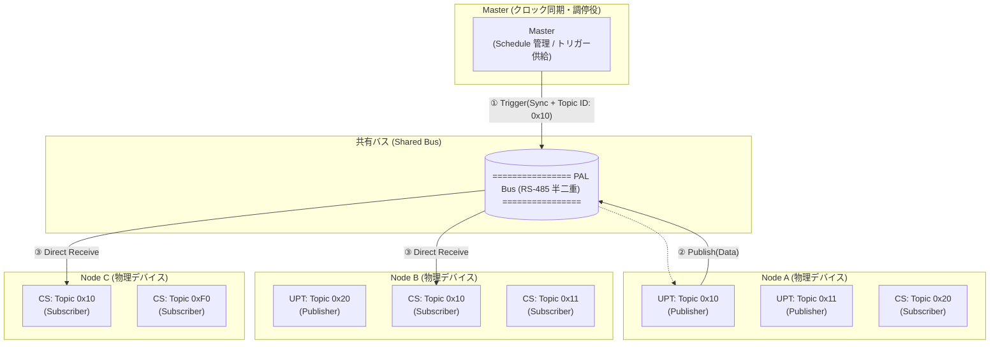
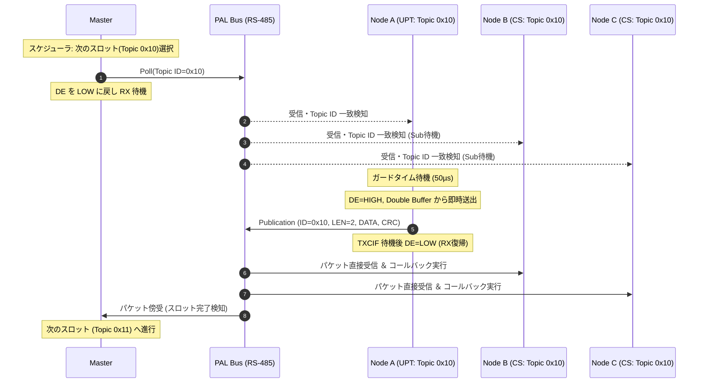

<!--
Copyright (c) 2026 ADX Project Contributors
SPDX-License-Identifier: CC-BY-4.0
-->

# PAL Network プロトコル仕様書 (PAL Network Specification)
**Version:** 1.0 (Draft)  
**Status:** Architecture Baseline  
**Base Document:** [`../PAL_whitepaper.md`](../PAL_whitepaper.md)

---

## 1. 概要 (Overview)

**PAL (Polling Access Link) Network** は、安価な低コスト MCU（ATtiny1616 等）と共有半二重 RS-485 バスを対象とした、**ポーリング制御型 Publish/Subscribe（Polling-controlled Pub/Sub）分散制御ネットワーク**である。

### 1.1 基本思想
* **Masterによる同期信号と発信トリガーの供給**:  
  Masterはデータの収集や中継を行わず、水晶発振器等の高精度なクロックを基準とした「同期信号（Sync）」と「発信トリガー（Topic ID）」を共有バス全体に常時供給する役割に特化する。これにより、ネットワーク全体の時間的秩序（メトロノーム）を形成する。
* **全ノード傍受型の即時 Publish / Subscribe**:  
  Masterがバスに放流したトリガーを、物理的に接続されたすべてのNodeが同時に傍受する。Nodeはこの同期信号を用いて自身の通信クロックを即座に補正し（LIN Auto等）、トリガー指定されたTopicを持つ「唯一のPublisher（UPT）」のみがバスを駆動してデータを直接放流（Publish）する。同時に、該当データに興味のある全てのSubscriber（CS）はバスから直接データを読み取る（Subscribe）。
* **低コストMCUによる決定論（Determinism）の獲得**:  
  Masterがクロック基準と発信タイミングの全権を握ることで、安価な内部RC発振器しか持たない低コストMCUであっても、通信衝突（Collision）を起こすことなく、数学的に予測可能なサイクル時間（有界時間）でのリアルタイム通信を実現する。

---

## 2. システム構成要素と用語定義 (Entities & Terminology)



| エンティティ | 略称 | 定義と役割 |
| --- | --- | --- |
| **Master** | - | ネットワークのクロックマスターであり、通信スロットの調停者。高精度クロックに基づく同期信号（Sync）と発信トリガー（Topic ID）をバスへ常時供給する。原則として一般的なアプリケーションデータの中継（ブローカー機能）は行わないが、緊急停止（Emergency Stop）などシステム全体に関わるクリティカルな制御コマンドの発行主体となる場合がある。 |
| **Node** | - | 共有バスに接続される自律的な物理通信デバイス。Masterから受動的に制御されるSlaveではなく、バス上のトリガーを傍受し、自身のTopic（UPT/CS）に基づき自律的にPub/Subを実行する分散制御の主体である。1つの Node 内に複数の UPT および CS を実装できる。 |
| **Topic(Topic ID)** | - | ネットワーク上で一意に割り当てられる1バイト（`0x00`〜`0xFF`）の通信識別子。PAL Networkにおけるデータストリームの最小単位であり、文字列等による名前解決は持たない。データ型、最大ペイロード長（1〜8 bytes）、通信周期等はすべてこの ID に紐づいて設計される。 |
| **Unique Publisherper Topic** | **UPT** | 特定の Topic ID に対し、ネットワーク全体で**唯一送信権を持つ論理モジュール**（パブリッシャ）。「1 Topic ID = 1 UPT」を絶対原則とし、同じIDを持つUPTが複数存在することは許容されない。この制約により、バス上での送信衝突（Collision）を構造的に根絶する。 |
| **Common Subscriber** | **CS** | 特定の Topic ID に紐づくデータを、共有バスから自律的に読み取る**論理モジュール**（サブスクライバ）。Masterのトリガーに呼応して UPT がバスへ放流したデータを、物理的に傍受（スニッフィング）して取得する。1つの Topic ID に対し 0 〜 複数の CS が並列に存在できる。 |
| **Shared Bus** | - | 全デバイスが並列に接続された 2 線式半二重 RS-485 物理バス。 |


---
## 3. 基本原則 (Core Principles)

### 3.1 Unique Publisher per Topic (UPT 原則)
* **原則**: 1つの Topic ID（`0x00`〜`0xFF`）に対して同時に送信可能な Publisher（UPT）は、ネットワーク上で厳格に 1 つに限定される。
* **効果**: 
  * 共有バス上での送信衝突（Collision）を構造的に根絶。
  * 未登録ノードの不正送信（Unauthorized Publisher）が発生した際、影響ドメインを特定の Topic ID に局所化（Fault Isolation）する。

### 3.2 One Trigger = One Bounded Publication (有界スロット原則)
* **原則**: 1回の発信トリガー（Pollフレーム）によって誘発される Publication パケットのデータ長、およびバス占有時間は必ず上限値（Bounded）を持つ。
* **理由**: Node 単位で一括送信させる方式では、処理量やデータ数でスロット長が変動し、通信周期にジッタ（揺らぎ）が発生する。Topic ID ごとにスロットを分割し、ペイロード長を固定・有界（最大8バイト）にすることで、数学的に予測可能なサイクルを構築する。

### 3.3 決定論的システム制御 (Deterministic System Command)
* **原則**: Masterからのシステム割り込み（緊急停止、一斉同期、状態遷移コマンド等）は、非同期な割り込みとしてではなく、スケジュールされた有界なスロット時間内で処理される。
* **実装方針**: Pollフレーム内のヘッダ拡張（Command IDの付与）を活用することで、Master自身が主導するコマンド発行であっても、既存のサイクル時間（$T_{cycle}$）の計算モデルを破壊せずに決定論的かつ即時的な一斉同報を実現する。

### 3.4 決定論的サイクル時間 ($T_{cycle}$)
ネットワーク全体の更新周期 $T_{cycle}$ は、全ポーリング対象スロット時間の総和として定義される。

$$T_{cycle} = \sum_{i=1}^{N} T_{slot, i}$$

ここで各スロット時間 $T_{slot}$ は次式で表される：

$$T_{slot} = T_{poll} + T_{guard} + T_{pub} + T_{margin}$$

* $T_{poll}$: Master が 発信トリガー（Pollフレーム）を送信する時間（コマンド拡張分を含む）
* $T_{guard}$: トランシーバー方向切替およびノード応答待機時間（規定: 50µs）
* $T_{pub}$: 該当 UPT が Publication パケットを送信する時間（Topic ID ごとに有界）
* $T_{margin}$: スロット間インターバルおよびタイムアウト監視マージン

---

## 4. フレームフォーマット仕様 (Frame Format)

PAL Network では、Master が送信する **Poll フレーム** と、UPT が送信する **Publication パケット** の 2 つの基本 PDU（Protocol Data Unit）を定義する。

### 4.1 物理層 (Physical Layer)
* **伝送媒体**: 2 線式半二重 RS-485（差動 A/B、120Ω 終端）[cite: 1]
* **変調方式**: 非同期シリアル UART（8 データビット, パリティなし, 1 ストップビット / 8-N-1）[cite: 1]
* **標準ボーレート**: 9600 bps（初期 PoC / 長距離） / 115200 bps（標準） / 高速モード対応[cite: 1]

---

### 4.2 Poll フレーム (Master $\rightarrow$ Shared Bus)
Master が Topic ID に基づく送信トリガーと、システム全体へのコマンドを同時に付与するための軽量制御フレーム。

```text
+--------------+--------------+--------------+--------------+--------------+
| Break / Sync | Command/Type | Topic ID     | Sequence No. | CRC-8 / Chk  |
| (13bit+0x55) | (1 byte)     | (1 byte)     | (1 byte)     | (1 byte)     |
+--------------+--------------+--------------+--------------+--------------+

```

| フィールド | サイズ | 内容・機能 |
| --- | --- | --- |
| **Break / Sync** | 可変 | ATtiny1616 の `LINAUTO` ハードウェア同期を活用するための 13bit LOW Break ＋ `0x55` Sync（通常 UART モード時は Start Delimiter `0x7E` 等に置換可能）。

 |
| **Command / Type** | 1 byte | スロットの種別およびシステムコマンド（例: `0x00`: Normal Poll, `0x01`: Join Poll, `0xFE`: Sync / State Change, `0xFF`: Emergency Stop）。Masterは通常のTopic通信サイクルを維持したまま、このフィールドで一斉同報コマンドを発行できる。 |
| **Topic ID** | 1 byte | 発信トリガーの対象となる Topic 識別子（`0x00` 〜 `0xFF`）。

 |
| **Sequence No.** | 1 byte | スケジュールサイクル番号（0〜255）。パケットロス・ジッタ監視用。全 Node はこの値をキャッシュし、直後の Publication パケットの妥当性検証に用いる。

 |
| **CRC-8 / Checksum** | 1 byte | ヘッダ保護用チェックサム（Enhanced Checksum または CRC-8-CCITT）。

 |

---

### 4.3 Publication パケット (UPT $\rightarrow$ Shared Bus)

Poll を受信した特定の UPT が、ガードタイム（$T_{guard}$）経過後にバス上へ直接送出するデータパケット。全 Node が傍受・受信する。

```text
+--------------+--------------+-----------------------+--------------+
| Topic ID     | Length (LEN) | Payload Data          | CRC-8 / Chk  |
| (1 byte)     | (1 byte)     | (1 〜 8 bytes)         | (1 byte)     |
+--------------+--------------+-----------------------+--------------+

```

| フィールド | サイズ | 内容・機能 |
| --- | --- | --- |
| **Topic ID** | 1 byte | 送信データが属する Topic 識別子（直前の Poll フレームと一致する必要がある）。受信側 CS はこの ID でフィルタリングを行う。

 |
| **Length (LEN)** | 1 byte | 有効ペイロード長（$1 \le LEN \le 8$ bytes ※標準 Bounded サイズ）。

 |
| **Payload Data** | 1〜8 bytes | センサ値、アクチュエータ指令、状態フラグなどの生データ。

 |
| **CRC-8 / Checksum** | 1 byte | Topic ID ＋ LEN ＋ Payload 全体を対象とする誤り検出符号。

 |

* **補足**: Publication パケット自体には Sequence No. を含めず、ペイロード効率を最大化する。Subscriber（CS）は、Master から傍受した直前の Poll フレームの Sequence No. を用いてデータストリームの連続性を担保する。


---

## 5. 通信シーケンスとタイミング (Sequence & Timing)

### 5.1 通常通信サイクル (Normal Communication Cycle)



### 5.2 タイムアウト・リカバリシーケンス (Publisher 無応答時)
万が一、対象の UPT（Node）が電源断や断線等で応答しなかった場合、Master のスロットタイムアウトタイマー（$T_{timeout} \approx 2 \times T_{slot}$）が作動し、自動的に次のスロットへ遷移してネットワーク全体のデッドロックを防止する。

---

## 6. PAL ソフトウェア・ドライバ層設計 (`pal_hal`)

ATtiny1616 のハードウェア特性を最大限に活かし、かつ安全に動作させるため、以下の実装ルールを厳格にカプセル化する。

### 6.1 ATtiny1616 必須実装制約
1. **`RXDATAH` $\rightarrow$ `RXDATAL` 読み出し順序の厳守**:
   FIFO ポインタとエラーフラグを正しく取得するため、必ずステータス高バイトを先に読み出す。
2. **`STATUS` レジスタの一括代入 (`=` 代入)**:
   `|=` 演算子による意図しないフラグクリアを禁止し、`USART0.STATUS = USART_WFB_bm | USART_ISFIF_bm | USART_BDF_bm;` 等で確実にリセットする。
3. **Double Buffer Mailbox によるゼロコピー送信**:
   Publisher 処理において、割り込み・メインループ間でデータの競合を防ぎつつ 50µs 以内に即時送出可能なメールボックス構造を採用する。
4. **レジスタ直接制御による決定論性の確保**:
   Arduino 標準 `HardwareSerial` を全廃し、全ノードで `PORTMUX` ＆ `USART0` レジスタ直接制御へ統一する。

---

## 7. 動的機能とフォルトアイソレーション (Advanced Services)

### 7.1 Dynamic Node Join / UPT Registration
* Master の Polling Schedule 内に、定期的に「Join 専用スロット（`Topic ID = 0xF0` 等）」を設ける。
* 新規参加ノードは Join スロットの通信機会を利用して Master へ加入要求を送信し、Master が Polling List へ登録することで動的な参加を実現する。

### 7.2 Unauthorized Publisher の検知と局所化
* 登録されていない Node が勝手に既存 Topic を Publish した場合、Master および Subscriber はフレームの矛盾（シーケンス不一致、異常衝突）から特定 Topic の論理障害として切り離し（Logical Fault Domain）、他の無関係な Topic の通信を継続させる。
