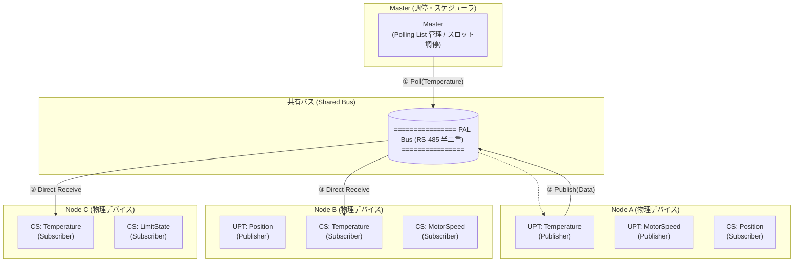
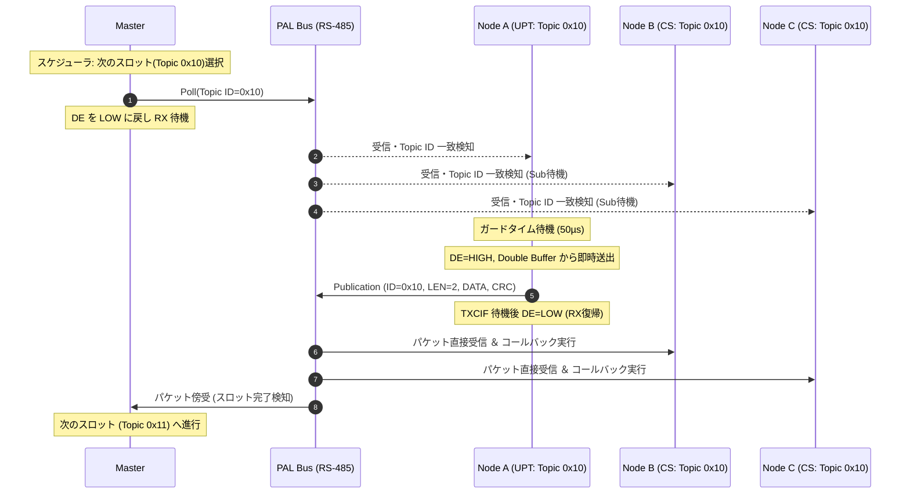

<!--
Copyright (c) 2026 ADX Project Contributors
SPDX-License-Identifier: CC-BY-4.0
-->

# PAL Network プロトコル仕様書 (PAL Network Specification)
**Version:** 1.0 (Draft)  
**Status:** Architecture Baseline  
**Base Document:** [`../PAL_whitepaper.md`](../PAL_whitepaper.md)

---

## 1. 概要 (Overview)

**PAL (Polling Access Link) Network** は、安価な低コスト MCU（ATtiny1616 等）と共有半二重 RS-485 バスを対象とした、**ポーリング制御型 Publish/Subscribe（Polling-controlled Pub/Sub）分散制御ネットワーク**である。

### 1.1 基本思想
* **Polling $\rightarrow$ Publish $\rightarrow$ Subscribe**:  
  Master が Polling（発言権トークン）を発行し、指定された Topic の Publisher が共有バスへデータを直接放流（Publish）し、興味のある全ての Subscriber が同時にこれを受信（Subscribe）する。
* **Master は中継しない**:  
  Master の役割は「通信機会（スロット）の調停とスケジューリング」に特化する。データは共有バスを介してスレーブ間で直接 1-to-Many 配信されるため、Master の CPU 負荷とバス帯域消費が最小化される。
* **低コスト MCU による決定論（Determinism）の獲得**:  
  CAN のような高精度クロックや複雑なバス調停コントローラを各ノードに要求せず、Network 側（Master の Polling Schedule）が通信の秩序と有界時間（Bounded Time）を保証する。

---

## 2. システム構成要素と用語定義 (Entities & Terminology)



| エンティティ | 略称 | 定義と役割 |
| :--- | :---: | :--- |
| **Node** | - | 物理的な通信デバイス。1つの Node は複数の UPT（Publisher）および複数の CS（Subscriber）を実装できる。 |
| **Topic** | - | 論理的な通信単位（例: `MotorSpeed`, `Position`, `Temperature`）。データ型、最大ペイロード長、周期等の属性を持つ。 |
| **Unique Publisher per Topic** | **UPT** | 各 Topic に対しネットワーク上で**唯一存在する送信 Endpoint**（1 Topic = 1 UPT 原則）。 |
| **Common Subscriber** | **CS** | 特定の Topic を購読・受信する Endpoint。1つの Topic に対し 0 〜 複数の CS が存在可能。 |
| **Master** | - | Polling Schedule に従い、Topic 単位で通信スロット（発言権）を割り当てる調停ノード。 |
| **Shared Bus** | - | 全ノードが接続された 2 線式半二重 RS-485 物理バス。 |

---

## 3. 基本原則 (Core Principles)

### 3.1 Unique Publisher per Topic (UPT 原則)
* **原則**: 1 つの Topic に対して同時に送信可能な Publisher はネットワーク上で厳格に 1 つに限定される。
* **効果**: 
  * 共有バス上での送信衝突（Collision）を構造的に根絶。
  * 未登録ノードの不正送信（Unauthorized Publisher）が発生した際、影響ドメインを特定 Topic に局所化（Fault Isolation）。

### 3.2 One Polling Slot = One Bounded Publication (有界スロット原則)
* **原則**: 1 回の Polling で送信される Publication のデータ長・バス占有時間は必ず上限値（Bounded）を持つ。
* **理由**: Node 単位でポーリングして内部データを一括送信させる方式だと、ノードの処理量やトピック数でスロット長が変動し、通信周期のジッタ（揺らぎ）が発生する。Topic ごとにスロットを分割することで、数学的に予測可能なサイクルを構築する。

### 3.3 決定論的サイクル時間 ($T_{cycle}$)
ネットワーク全体の更新周期 $T_{cycle}$ は、全ポーリング対象スロット時間の総和として定義される。

$$T_{cycle} = \sum_{i=1}^{N} T_{slot, i}$$

ここで各スロット時間 $T_{slot}$ は次式で表される：

$$T_{slot} = T_{poll} + T_{guard} + T_{pub} + T_{margin}$$

* $T_{poll}$: Master が Poll フレームを送信する時間
* $T_{guard}$: トランシーバー方向切替およびノード応答待機時間（規定: 50µs）
* $T_{pub}$: Publisher が Publication パケットを送信する時間（有界長）
* $T_{margin}$: スロット間インターバルおよびタイムアウト監視マージン

---

## 4. フレームフォーマット仕様 (Frame Format)

PAL Network では、Master が送信する **Poll フレーム** と、UPT が送信する **Publication パケット** の 2 つの基本 PDU（Protocol Data Unit）を定義する。

### 4.1 物理層 (Physical Layer)
* **伝送媒体**: 2 線式半二重 RS-485（差動 A/B、120Ω 終端）
* **変調方式**: 非同期シリアル UART（8 データビット, パリティなし, 1 ストップビット / 8-N-1）
* **標準ボーレート**: 9600 bps（初期 PoC / 長距離） / 115200 bps（標準） / 高速モード対応

---

### 4.2 Poll フレーム (Master $\rightarrow$ Shared Bus)
Master が特定の Topic の UPT に対して送信権を付与するための軽量制御フレーム。

```text
+--------------+--------------+--------------+--------------+--------------+
| Break / Sync | Frame Type   | Topic ID     | Sequence No. | CRC-8 / Chk  |
| (13bit+0x55) | (1 byte)     | (1 byte)     | (1 byte)     | (1 byte)     |
+--------------+--------------+--------------+--------------+--------------+
```

| フィールド | サイズ | 内容・機能 |
| :--- | :---: | :--- |
| **Break / Sync** | 可変 | ATtiny1616 の `LINAUTO` ハードウェア同期を活用する場合の 13bit LOW Break ＋ `0x55` Sync（通常 UART モード時は Start Delimiter `0x7E` 等に置換可能）。 |
| **Frame Type** | 1 byte | フレーム種別（`0x01`: Periodic Poll, `0x02`: Discovery/Join Poll, `0x03`: Diagnostic Poll）。 |
| **Topic ID** | 1 byte | 送信権を付与する対象の Topic 識別子（`0x00` 〜 `0xEF`: 通常トピック、`0xF0`〜`0xFF`: システム予約）。 |
| **Sequence No.** | 1 byte | スケジュールサイクル番号（0〜255）。パケットロス・ジッタ監視用。 |
| **CRC-8 / Checksum** | 1 byte | ヘッダ保護用チェックサム（Enhanced Checksum または CRC-8-CCITT）。 |

---

### 4.3 Publication パケット (UPT $\rightarrow$ Shared Bus)
Poll を受信した UPT がバス上へ直接送出するデータパケット。全 CS が傍受・受信する。

```text
+--------------+--------------+-----------------------+--------------+
| Topic ID     | Length (LEN) | Payload Data          | CRC-8 / Chk  |
| (1 byte)     | (1 byte)     | (1 〜 8 bytes)         | (1 byte)     |
+--------------+--------------+-----------------------+--------------+
```

| フィールド | サイズ | 内容・機能 |
| :--- | :---: | :--- |
| **Topic ID** | 1 byte | 送信データが属する Topic 識別子（受信側 CS はこの ID でフィルタリング）。 |
| **Length (LEN)** | 1 byte | 有効ペイロード長（$1 \le LEN \le 8$ bytes ※標準 Bounded サイズ）。 |
| **Payload Data** | 1〜8 bytes | センサ値、アクチュエータ指令、状態フラグなどの生データ。 |
| **CRC-8 / Checksum** | 1 byte | Topic ID ＋ LEN ＋ Payload 全体を対象とする誤り検出符号。 |

---

## 5. 通信シーケンスとタイミング (Sequence & Timing)

### 5.1 通常通信サイクル (Normal Communication Cycle)



### 5.2 タイムアウト・リカバリシーケンス (Publisher 無応答時)
万が一、対象の UPT（Node）が電源断や断線等で応答しなかった場合、Master のスロットタイムアウトタイマー（$T_{timeout} \approx 2 \times T_{slot}$）が作動し、自動的に次のスロットへ遷移してネットワーク全体のデッドロックを防止する。

---

## 6. PAL ソフトウェア・ドライバ層設計 (`pal_hal`)

ATtiny1616 のハードウェア特性を最大限に活かし、かつ安全に動作させるため、以下の実装ルールを厳格にカプセル化する。

### 6.1 ATtiny1616 必須実装制約
1. **`RXDATAH` $\rightarrow$ `RXDATAL` 読み出し順序の厳守**:
   FIFO ポインタとエラーフラグを正しく取得するため、必ずステータス高バイトを先に読み出す。
2. **`STATUS` レジスタの一括代入 (`=` 代入)**:
   `|=` 演算子による意図しないフラグクリアを禁止し、`USART0.STATUS = USART_WFB_bm | USART_ISFIF_bm | USART_BDF_bm;` 等で確実にリセットする。
3. **Double Buffer Mailbox によるゼロコピー送信**:
   Publisher 処理において、割り込み・メインループ間でデータの競合を防ぎつつ 50µs 以内に即時送出可能なメールボックス構造を採用する。
4. **レジスタ直接制御による決定論性の確保**:
   Arduino 標準 `HardwareSerial` を全廃し、全ノードで `PORTMUX` ＆ `USART0` レジスタ直接制御へ統一する。

---

## 7. 動的機能とフォルトアイソレーション (Advanced Services)

### 7.1 Dynamic Node Join / UPT Registration
* Master の Polling Schedule 内に、定期的に「Join 専用スロット（`Topic ID = 0xF0` 等）」を設ける。
* 新規参加ノードは Join スロットの通信機会を利用して Master へ加入要求を送信し、Master が Polling List へ登録することで動的な参加を実現する。

### 7.2 Unauthorized Publisher の検知と局所化
* 登録されていない Node が勝手に既存 Topic を Publish した場合、Master および Subscriber はフレームの矛盾（シーケンス不一致、異常衝突）から特定 Topic の論理障害として切り離し（Logical Fault Domain）、他の無関係な Topic の通信を継続させる。
